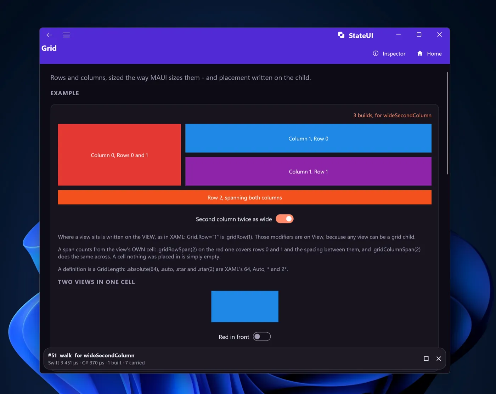
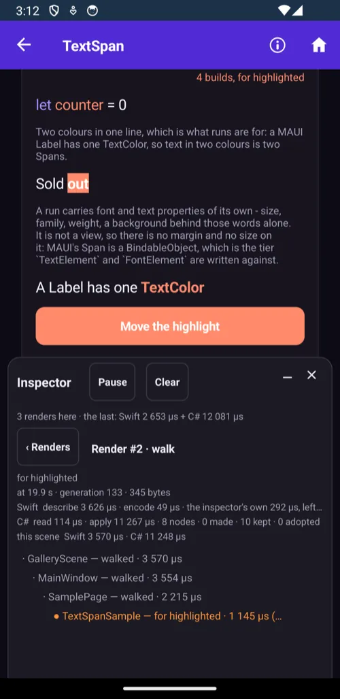
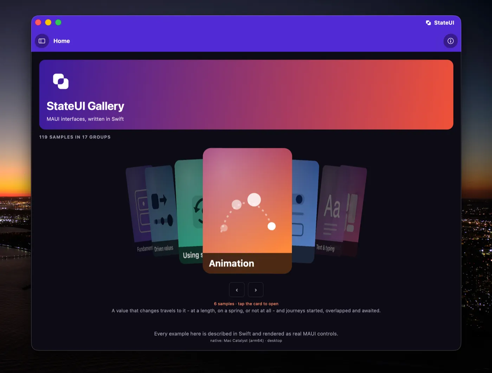
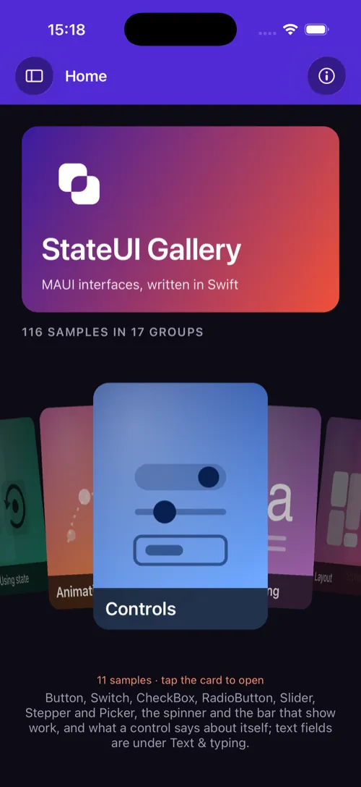

# StateUI

[](https://github.com/idexus/StateUI/actions/workflows/tests.yml?query=branch%3Amain)
[](https://github.com/idexus/StateUI/actions/workflows/build-apple.yml?query=branch%3Amain)
[](https://github.com/idexus/StateUI/actions/workflows/build-android.yml?query=branch%3Amain)
[](https://github.com/idexus/StateUI/actions/workflows/build-windows.yml?query=branch%3Amain)

Write .NET MAUI user interfaces in Swift.

<p>
  
  
</p>
<p>
  
  
</p>

*The gallery - one Swift tree, rendered as real MAUI controls on Windows (with
a second window built from the same tree), Android, macOS and an iPhone.*

## An example

A complete application - a window, two tabs, and the state that moves them:

```swift
enum Tab: Hashable, CaseIterable {
    case counter
    case list
}

struct GalleryApp: Application {
    func createWindow() -> Window { MainWindow() }
}

struct MainWindow: Window {
    @State private var tab: Tab = .counter

    var title: String? { "StateUI" }

    var content: Page {
        TabbedPage(Tab.allCases) { which in
            switch which {
            case .counter: CounterPage(tab: $tab)
            case .list:    ListPage()
            }
        }
        .selection($tab)
    }
}

struct CounterPage: ContentPage {
    @Binding var tab: Tab

    @State private var counter = 0

    var title: String? { "Counter" }

    var content: Element {
        VStack {
            Label("Count: \(counter)")
                .fontSize(20)
                .horizontalTextAlignment(.center)

            Button("Increment")
                .cornerRadius(8)
                .onClicked { counter += 1 }

            Button("Go to the list")
                .onClicked { tab = .list }
        }
        .spacing(20)
        .padding(24)
    }
}
```

That renders as **real MAUI controls** - a real `TabbedPage` with real native
tabs, holding a `VerticalStackLayout` with a `Label` and two `Button`s - on iOS,
Android, macOS and Windows. Which tab is showing is a value of the application's
own type: moving is an assignment, and a reader tapping a tab writes the same
binding back.

## Where this is, and what that means for you

**Version 0.1. The API is still moving, and using this in a project is at your
own risk.** Names, signatures and whole shapes change between versions while the
design is still being found - the `0.` in front says exactly that under SemVer.

Nothing here is unfinished for want of care: the suites are green on both
desktop hosts and all four platform builds are green in CI, and every rule in
this file came out of a measurement. What you do
not get yet is a promise that next month's version compiles against this month's
code. Read it, build with it, tell the project what broke - but do not
put it under something you cannot afford to revisit.

## Starting an application

```bash
dotnet new install StateUI.Template
dotnet new stateui -n MyApp
cd MyApp
dotnet build -f net10.0-maccatalyst -r maccatalyst-arm64
```

That is a whole application: one page with a counter, the artwork for every
platform, and a `.scripts/` folder that compiles the Swift side as part of an
ordinary `dotnet build` - the same build this repository uses, not a cut-down
copy of it. In VS Code, **F5** launches whatever the device picker says.

The Swift half of StateUI arrives as a SwiftPM dependency, named in
`MyApp/Package.swift` beside the project file; the C# half is a
`PackageReference` in the `.csproj`. Both are visible and both are meant to be edited - to work against a
checkout on disk instead, point the manifest at it with `.package(path:)` and
set `<StateUIPackagePath>` in the project, which the generated files carry a
comment about.

### What has to be installed first

| | |
|---|---|
| **.NET 10 SDK** | <https://dotnet.microsoft.com/download> |
| **.NET MAUI workload** | `dotnet workload install maui` |
| **Swift 6.3 or newer** | macOS: Xcode ships it. Windows: <https://www.swift.org/install/windows/>, plus Visual Studio Build Tools - Swift links through the MSVC linker |
| **Xcode** | for iOS and Mac Catalyst |
| **Android SDK, and a Swift SDK for Android** | for Android: [swift.org's guide](https://www.swift.org/documentation/articles/swift-sdk-for-android-getting-started.html). The toolchain must be the SDK's own BUILD - swift.org's, installed beside Xcode's, because a binary module is only readable by the compiler that wrote it. The build checks, uses a matching installed toolchain by itself, and names the one to install when none matches |

In VS Code, two extensions: **.NET MAUI** (Microsoft), which gives the device
picker and F5, and **Swift** (swiftlang), which gives completion and LLDB.

### The first build, and why it is sometimes slow

The only third-party dependency this project has is **swift-syntax**, and it is
there for `@StateClass`: giving a class's stored properties accessors is
something no library can do from the outside, so that one feature is a Swift
MACRO - and a macro is an executable the COMPILER runs while it compiles your
code. Nothing of it is linked into the app or reaches a device; it is a
build-time tool, like a code generator.

What that costs depends on whether SwiftPM finds a **prebuilt** swift-syntax for
your toolchain and platform:

| | first build |
|---|---|
| a prebuilt matches | **under a minute** - measured 49s for a fresh `dotnet new stateui` app on macOS |
| none matches | **ten minutes or more**, compiling swift-syntax from source - measured on Windows |

SwiftPM keys the prebuilt on the toolchain's own build and the platform
(`swiftlang-6.3.3.1.3-macosx26.5`), downloads it once into a shared cache, and
unpacks it into `.build/prebuilts/`. When there is no match it falls back to
building from source, and **nothing in the output says which is happening** -
so a long first build is not a hang.

Either way it is paid **once per `.build` directory**, always in release,
whatever configuration you are building. An app made by `dotnet new stateui` has
one; a clone of this repository has four (the library package, the tests, and
each app under `apps/`), each paid the first time something needs it.

Everything after that is incremental per file - one changed file in the library
is **10.5s** on Mac Catalyst, and a build with nothing changed is **5.4s**. See
[Incremental builds](#incremental-builds) for the whole table.

The one thing that makes you pay it again is deleting `.build`, which the VS
Code task **"Clean app (everything)"** deliberately does - it is the only clean
that makes an edited `Info.plist` take effect.

## The API is MAUI's

There is nothing to learn twice. Every property is the MAUI property, camelCased,
set by a modifier of the same name:

| MAUI (C#) | StateUI |
|---|---|
| `label.FontSize = 20` | `.fontSize(20)` |
| `label.HorizontalTextAlignment = TextAlignment.Center` | `.horizontalTextAlignment(.center)` |
| `view.HorizontalOptions = LayoutOptions.Center` | `.horizontalOptions(.center)` |
| `button.CornerRadius = 8` | `.cornerRadius(8)` |
| `stack.Padding = new Thickness(20, 12)` | `.padding(20, 12)` |
| `entry.TextChanged += …` | `.onTextChanged { … }` |

Three rules cover the whole surface:

- **Only the defining value goes in the initializer.** `Label("Total")`,
  `Button("Save")`, `Entry($name)` - the text is what the control is for.
  Everything else is a modifier, so nothing has to be guessed from argument
  order or invented as a Swift-flavoured name.
- **A modifier exists exactly where MAUI declares the property.** `.spacing()`
  on a stack, `.placeholder()` on an Entry, `.opacity()` on everything, because
  the protocols mirror MAUI's own hierarchy - VisualElement, View, Layout,
  StackBase, and the interfaces MAUI shares between controls.
- **Two abbreviations, and no others.** `VStack` and `HStack` stand in for
  `VerticalStackLayout` and `HorizontalStackLayout`, which are long enough to
  crowd out the code they contain. Both full names work too.

  The one shortening beyond those is a word MAUI itself says twice:
  `AbsoluteLayout.LayoutBounds` is `.absoluteLayoutBounds` rather than
  `.absoluteLayoutLayoutBounds`. Nothing is dropped but the repeat - see
  [AbsoluteLayout and FlexLayout](#absolutelayout-and-flexlayout).

So the reference for writing StateUI is the [.NET MAUI
documentation](https://learn.microsoft.com/dotnet/maui/user-interface/controls/):
the property list of a MAUI control is the modifier list of the Swift one. The
declarative shape - views nested in a builder, rebuilt on state change - is the
only thing borrowed from elsewhere.

Every modifier, initializer and enum case carries a doc comment naming the MAUI
property behind it, so the mapping is in the editor as well as in that table:

```swift
/// How opaque the view is, from 0 to 1. MAUI: VisualElement.Opacity.
public func opacity(_ value: Double) -> Modified
```

That is a rule with a test behind it - `testEveryPublicApiIsDocumented` fails
naming the line, and on the C# side the compiler does, so an undocumented public
member does not build.

## State

```swift
struct CounterPage: ContentPage {
    @State private var counter = 0

    var content: Element {
        VStack {
            Label("Count: \(counter)")
            Button("Increment").onClicked { counter += 1 }
            ResetRow(counter: $counter)
        }
    }
}

struct ResetRow: ContentView {
    @Binding var counter: Int

    var content: Element {
        Button("Reset").onClicked { counter = 0 }
    }
}
```

Reading is plain reading and writing is plain writing, from any thread; a write
marks the tree dirty, which is what brings the next render. A handler writes it,
and so does a `Task.detached` that has worked something out or an `async let`
child - the value sits behind a lock, so a write from the cooperative pool is
whole, and a write that lands while a render is running is kept for the next
one. The one move that is NOT allowed is hopping onto `@MainActor` or
`DispatchQueue.main` to "reach the UI thread": nothing drains those in a MAUI
app on Android or Windows, so a handler that awaits `MainActor.run { … }` hangs
at that line. A handler already runs on the library's own `@MainThread`; there
is nowhere to move to. When two tasks change the SAME state at once, use
`update` - `count += 1` is a read then a write, and `_count.update { $0 + 1 }`
holds the lock across both.

**`@State` is declared where the value is used, and survives the view being
rebuilt.** A view is a value, rebuilt on every render - and the renderer carries
its state across the rebuild for as long as the element keeps its identity and
its view type, the same rule that keeps a control between renders. The fresh
view's boxes find their predecessors BY PATH - the stored property's name at
every level, plus the type of any view stored along the way - so a view that
keeps another view in a property can gain or lose one without moving anybody
else's state, and a path nobody answered last render starts at its initial
value. A child that
needs the value borrows it with `@Binding` - `$counter` lends it - and writes
through the binding reach the owner. Leaving the tree is what ends a view's
state; state that should live as long as the app goes on the `Application`,
which is built once and kept.

Swift allows no property wrapper on a file-scope variable at all ("property
wrappers are not yet supported in top-level code"), so state belonging to no
type is written the long way, and works the same:

```swift
private let counter = State(0)
counter.update { $0 + 1 }
```

### State that outlives the process

`@State` under a **key** is kept: the value the reader left behind is there
again on the next launch, and nothing about reading or writing it changes.

```swift
extension PersistentKey {
    static let lastGroup = PersistentKey("com.example.lastGroup", of: Int.self)
    static let appearance = PersistentKey("com.example.appearance", of: Appearance.self)
}

struct GroupPage: ContentPage {
    @State(.lastGroup) private var group = 0
}
```

The value written beside the state - `= 0` - is what it holds when the store has
nothing under that name, so the default stays where it can be seen. There is
nothing to await on either side: the whole store is read into memory at startup,
before the first view is built, and a write reaches it by itself. A key written
several times before the next drain is saved once, holding the last value - so a
handler that writes the same key five times touches the store once. That is a
collapse per drain and not a delay: an event drains, so an `Entry` bound to kept
state does reach the store once a letter. A view that wants the store touched
when the typing stops keeps the text in ordinary state and writes the kept one
from `.onEvent(.completed)`.

The value and the note that it needs saving are settled under ONE hold of the
state's lock, so whichever write lands last is also the one the store hears
last. Two thread-safe halves would not be enough: two tasks writing the same
kept state at once could settle the value in one order and reach the store in
the other, and the next launch would read the older of the two.

**The application lists its keys**, and that is what makes the read possible at
all: a settings store is read one key at a time and offers no list of what it
holds, so naming them is the only way the host can have the values before
anything asks for one.

```swift
// On the Application:
var persistentKeys: [PersistentKey] { [.lastGroup, .appearance] }
```

A key holds what a platform's settings store holds - a whole number, a number,
true or false, or text - and an enum over one of those is one line:

```swift
enum Appearance: String, PersistentValue { case light, dark, system }
```

The kind comes from the Swift type named at the key, so `of: Int.self` and
`var group = 0` are the same word twice, and a mismatch between them stops the
app the first time that view is built, naming the key. Anything larger than those four belongs in a
model the application saves itself.

**One key is one piece of state, everywhere in the application.** Two views
declaring the same key share the storage rather than a copy of the value, so a
write in either rebuilds the readers in both. A NAME is that storage, so listing
one twice is one key - and listing it twice with two different KINDS is the one
way to be wrong about it: the first declaration is what the store is read and
written as, and the application is told which key disagreed with itself.

Where it is kept is MAUI's `Preferences` - `NSUserDefaults`,
`SharedPreferences`, `ApplicationDataContainer` - so these sit beside whatever
else the app keeps in the platform's own settings. An application that wants its
own store names one the host registered:

```swift
var persistentStorage: PersistentStorage { PersistentStorage("MyApp.Json") }
```

```csharp
// C#, in MauiProgram.CreateMauiApp:
StateUIStores.Add("MyApp.Json", new JsonPreferences(path));
```

A store is an `IPreferences`, MAUI's own interface - the one
`Preferences.Default` implements - so a store written against MAUI works here
unchanged.

### State in a class

`@State` answers one question - a view is a value, rebuilt every render, so where
does its value live - and it answers it by owning the value. A **class** is the
case that answer does not cover: the box holds a reference, so `model.name = "…"`
never writes through the box, nothing asks for a render, and the interface goes
on showing the old name with nothing anywhere reporting a problem.

`@StateClass` is what makes the write visible:

```swift
@StateClass
final class Basket {
    var items: [String] = []
    var note = ""

    @Untracked var lastSaved = ""

    var isEmpty: Bool { items.isEmpty }
}

struct BasketPage: ContentPage {
    @State private var basket = Basket()

    var content: Element {
        VStack {
            Label("\(basket.items.count) item(s)")
            Button("Add").onClicked { basket.items.append("Something") }
        }
    }
}
```

Every stored `var` on the class gets the two lines an author would otherwise
write by hand: the value moves into a private stored property beside it, and
writing it asks for another render - exactly what a write to a `@State` asks
for.

**Both halves are needed, and they say different things.** `@StateClass` makes
the writes visible; `@State` on the property keeps the *instance* across renders,
since the view is rebuilt every time and `Basket()` runs again with it. A
`var basket = Basket()` written without the wrapper compiles, gets a new basket
on every render and says nothing - which is exactly why the class attribute is
not called `@State` too. State that should live as long as the application goes
on the `Application`, or in a `let` at file scope, where nothing is rebuilt and
`@StateClass` is the whole story.

**`@Untracked` is the opt-out** - a cache, a scratch value, anything the
interface does not draw. The property stays a plain stored property and writing
it asks for nothing.

A `let`, a computed property and a `static` are left alone: none of them can be
written on the instance, and a computed one follows whatever it is computed
from. A property the macro cannot give accessors to - one with a `didSet`, a
`lazy` one, two names in one `var` - is an **error** rather than a silence,
because a property that quietly stops updating the interface is the one bug this
could otherwise introduce.

There is no tracking of which property was read where, and there is nothing to
gain from it: the author's closure runs in full on every render and only the
difference is sent, so "something changed" is the whole of what the renderer
needs to hear.

**One property of the model is a binding, `$basket.note`** - which is what an
input takes, so a two-way field over a model needs no handler either:

```swift
@State private var basket = Basket()
…
Entry($basket.note)
```

**A model is lent the way anything else is**, with `@Binding` - there is no
second wrapper for the class case, because there is no second case:

```swift
struct NoteRow: ContentView {
    @Binding var basket: Basket

    var content: Element {
        Entry($basket.note)
    }
}

NoteRow(basket: $basket)
```

It reaches through a model inside a model too - `$app.basket.note`.

**`$` says: I lend you this, do with it what you want.** A borrower may write
the whole value or one property of it, and a model lent this way may be edited
or *replaced*. That is the point rather than an oversight: what a parent hands
over is a capability, and the way to hand over less is to hand over less. Give
the child the value and it can only read; give it the object and it can edit
what the object holds; give it `$` and it can do everything the owner can.

`@StateClass` is a **macro**, which is the one thing in this repository built
against somebody else's code - swift-syntax, which is what a Swift macro is
written against. It is a build-time tool and nothing of it is linked into an
application: the plugin is an executable the compiler runs on the machine doing
the building. The cost is real and worth knowing about: a cold build compiles
swift-syntax first, which takes minutes, once per `.build` directory. See
`src/StateUI/Macros/`.

### Environment

A model a whole branch shares does not have to be passed by hand through every
initializer on the way down. `.environment(object)` provides it to a subtree,
and `@Environment` on any view below resolves the nearest object of that TYPE -
the annotation is the key, so there is no argument to pass and nothing to
spell:

```swift
struct MainView: ContentView {
    @State private var session = Session()  // a @StateClass, usually

    var content: Element {
        ChildView()
            .environment(session)           // provides, and reads nothing
    }
}

struct ChildView: ContentView {
    @Environment var session: Session       // the nearest Session above

    var content: Element {
        Label(session.name)                 // a read - so writes rebuild THIS view
    }
}
```

One way each: `.environment()` is the only way to provide, `@Environment` the
only way to consume, and a nearer `.environment()` of the same type overrides
for its own branch.

The rebuild rules are the ordinary ones, and they land exactly where wanted:
the provider passes a reference and reads no property, so a write IN the
object rebuilds the readers and never the provider; replacing the object -
writing the `@State` that holds it - rebuilds the branch, which then resolves
the new one. `$session.name` lends one property of the provided object to an
input, exactly as it does off a `@State` model. Reading an `@Environment`
nobody provided stops the program with a message naming the type - unless the
type is one of the STANDARD providers below, which are always there. Nothing
about any of this crosses the boundary - the C# side never hears of it.

### The standard environment

What the HOST knows is provided to every tree without anyone writing
`.environment()`: seven objects, resolved like any other and kept current by
the platform's own change events, so exactly the views that read a changed one
are rebuilt.

```swift
struct SaveButton: ContentView {
    @Environment var connectivity: Connectivity

    var content: Element {
        Button("Save").isEnabled(connectivity.networkAccess == .internet)
    }
}
```

| Provider | What it answers | Changes |
| --- | --- | --- |
| `Battery` | `chargeLevel`, `state`, `powerSource`, `energySaverStatus` | on the platform's battery events |
| `Connectivity` | `networkAccess`, `connectionProfiles` | the moment the network moves |
| `DeviceDisplay` | `width`, `height`, `density`, `orientation`, `rotation`, `refreshRate` | on rotation |
| `LocaleInfo` | `language`, `region`, `name`, `timeZone` (IANA), `uses24HourClock`, `firstDayOfWeek`, `isMetric` | at startup, and again as a window resumes |
| `DeviceInfo` | `idiom`, `platform`, `model`, `manufacturer`, `name`, `versionString`, `deviceType` | pushed at startup |
| `AppInfo` | `name`, `packageName`, `versionString`, `buildString`, `requestedTheme` | the theme, live |
| `WindowInfo` | `phase` - `.activated / .deactivated / .stopped` | with the window's lifecycle events |

Every value arrives BEFORE the first render, so the first tree already knows
its idiom and its locale - which pages exist is decided while the tree is
built. The APPLICATION itself can declare a slot too (`@Environment var
device: DeviceInfo` on the `Application` is how the gallery decides whether
its window wears a title bar), and a test - or an app that wants to lie to
one branch - provides a fake with the ordinary modifier, which is nearer and
wins: `.environment(fakeBattery)`.

`LocaleInfo` is the one provider no platform raises an event for, which is why
it is re-read when a window RESUMES: the reader had the whole time in the
background to cross a time zone or turn the clock over, and .NET holds the local
zone in a static from its first read. A LANGUAGE change is a restart on both
mobile platforms - Android recreates the activity, iOS terminates the app - so
what coming back really buys is the zone and the clock format.

`LocaleInfo` is also the standing answer to two measured holes: Swift's own
`Locale.current` is a fallback `en_001` on Android, and a Windows app's
Foundation links no zones at all - the host knows, and this is where it says.
Formatting still crosses the boundary invariant; the locale is for LOGIC.
Three platform notes, each measured: a Mac Catalyst battery reports its LEVEL
divided by 100 twice (a full MacBook answers `0.0099` - read `state` there),
a desktop on Ethernet may never fire a connectivity change, and headless
everything answers its defaults, `.unknown` included.

### Two-way inputs

An input given a binding shows the value and writes every change back:

```swift
Entry($name)
    .placeholder("Type your name")

Switch($soundOn)

Slider($volume)
    .minimum(0)
    .maximum(100)

CheckBox($agreed)

RadioButton("Medium")
    .isChecked($medium)
    .groupName("size")

Stepper($servings)
    .minimum(1)
    .maximum(12)

SearchBar($query)

TimePicker($alarm)
```

No handler anywhere - storing what was typed is what a binding does. A handler
is for what a binding cannot say, and it runs *beside* one rather than instead
of it:

```swift
Entry($name)
    .onTextChanged { text in print("now \(text)") }   // the binding still writes
```

Given a plain value instead of a binding, an input shows it and reports changes
only through its handler.

A binding does not have to come from a `@State` at all. `Binding(get:set:)` is
the escape hatch for anything else - a value behind a function, one that has to
be checked on the way in:

```swift
Entry(Binding(get: { settings.name }, set: { settings.name = $0.trimmed }))
```

Whether the write asks for another render is then the setter's business: writing
a `@State` or a tracked property does, and writing anything else does not.

### What the control knows and this side does not

Some things are decided by MAUI, not by the tree: the size a layout settled on,
the focus the platform moved, how far a page has been scrolled. A binding on one
of those is kept in step with what the control reports:

```swift
Entry($name)
    .isFocused($editing)          // read-only in MAUI: this side is told

ScrollView { … }
    .scrollY($offset)

Label("…")
    .width($measured)
```

**A report can be given a STEP**: `.scrollY($offset, every: 44)` reports once
each time the offset crosses a multiple of 44 and nothing in between, so a list
of 44-point rows hears one report per row rather than one per frame. Left out,
every change is a report - and a view that watches it redraws all the way down
a drag.

**A throw can be SHORTENED**: `.momentum(0.5)` keeps half of what the platform
would carry a released scroll, so the same flick means half the distance. It
scales the platform's own prediction rather than replacing it, which keeps the
feel native - a hard throw still goes further than a gentle one - and it is what
a strip of cards wants: measured on an Android phone, a hard flick that carried
six cards carries two at a half, and an ordinary swipe carries one. A long list
usually wants the platform's own, which is the default of 1.

**And a scroller can be made to rest on a GRID**: `.snapInterval(160)` says the
offsets it may stop on are the multiples of 160. The moment a finger lifts, the
platform is asked where its own deceleration would end, that point is rounded to
the nearest multiple, and the platform is sent THERE instead - so a throw lands
as far along as its speed deserves, the braking is the platform's own, and it is
ONE movement. It is a property rather than a handler for exactly that reason:
the answer has to be given inside the platform's own decision, which nothing
crossing this boundary could be in time for. `CarouselView` is this over a card
and its gap.

**Which point of that grid it is nearest is the other half**: `.snapItem($tile)`
writes the number as it changes, and it changes at the HALFWAY mark - the same
rounding that chose where to land. So it names the point the scroller is going
to stop at while the movement is still under way, it cannot disagree with where
the movement ends, and a tile's worth of scrolling is one message and one
render.

**And the scroller says when it has STOPPED**: `.onScrollStopped { … }` runs
once a movement has ended - a drag let go of, a throw that ran out, a wheel, a
`scrollTo` - and after the correction where one was needed, so where it says the
scroller is, it is. Nothing waits for the answer, which is what makes it worth
having: it is the one moment when work that would be seen as a hitch costs
nothing. `CarouselView` builds the cards the next swipe will need here rather
than while a finger is moving.

These go through `BindableObject.PropertyChanged` rather than an event, which is
what makes the mechanism general: any bindable property can report itself, even
one MAUI never gave an event to - `FlyoutPage.IsPresented` and
`Entry.CursorPosition` among them - and no reflection is involved, because the
name comes from the `BindableProperty` and the value from a typed getter.

**Nothing is watched until it is asked for.** `PropertyChanged` fires on Width
and Height at every measure, so a subscription per control would be real work for
an answer nobody wanted. The host subscribes when the tree carries a handler for
that property and not before.

Where MAUI *does* have an event - `TextChanged`, `Toggled`, `ValueChanged`,
`Clicked` - the controls use it. An event hands over the new value already typed
and only fires for what it says it does, which is both cheaper and more precise
than filtering a property name.

### The caret, and what the platform guesses

A field the reader is typing in moves its own caret, so writing one is for
putting it somewhere the reader did not:

```swift
Entry($code)
    .isSpellCheckEnabled(false)
    .isTextPredictionEnabled(false)
    .cursorPosition(0)
    .selectionLength(code.count)
```

`cursorPosition` counts characters from the start and `selectionLength` counts
them from the caret, so the pair above selects the lot - which is what a field
filled in for the reader to replace wants. MAUI CLAMPS both to the text the
field is holding, so they are written after it and a position past the end
lands at the end.

The other two turn off what the platform adds: the underline under what it
thinks is misspelt, and the next word it offers as the reader types. Worth
turning off together for anything that is not prose - a code, a serial number,
a part reference - where both only get in the way.

All four are `InputView`'s, so they are the same modifiers on an `Entry`, an
`Editor` and a `SearchBar`.

### The keyboard

A keyboard comes up when a field takes the focus, and the reader needs a way to
send it back. There are three, and MAUI wrote two of them.

**A tap beside the field** is a property of the page:

```swift
struct FormPage: ContentPage {
    var hideSoftInputOnTapped: Bool? { true }
}
```

That is MAUI's own `ContentPage.HideSoftInputOnTapped`, which is why this library
lays no touch-catching view over the content: MAUI recognizes the tap *alongside*
whatever else is listening, so scrolling, buttons and gestures on the same page
all go on working. A view placed over them to catch touches could not promise
that.

**A button that knows the field** holds the control in state:

```swift
@State private var email = ControlState<Entry>()

Entry($address).assign(email)

Button("Done").onClicked { try await email.unfocus() }
Button("Edit").onClicked { try await email.focus() }
```

Those are `VisualElement.Focus` and `VisualElement.Unfocus`, and `focus()`
answers whether the view took the focus - a disabled one says no, exactly as in
MAUI.

**A button that does not know** asks instead:

```swift
Button("Done").onClicked { try await SoftInput.hide() }
```

`SoftInput.hide()` names no view, because which control the reader touched last
is not something this side knows. The host asks the page that is showing which of
its views has the focus - a search box on the navigation bar included, a title
view being an ordinary view in the page's own tree. It answers whether anything
was focused; false means the keyboard was already down, which is an answer rather
than a failure. The name is this library's own, MAUI having no method for the
question, and the word is MAUI's - the "soft input" of `HideSoftInputOnTapped`.

## Styles

A MAUI `Style` is a bag of property values applied to every control of a type,
and this library already writes property values one way - as modifiers. So a
style is written with the same modifiers, against the control it is for, and
they live in a sheet the application declares:

```swift
struct GalleryApp: Application {
    var styles: StyleSheet? {
        StyleSheet {
            Style<Button>()
                .textColor(.white)
                .backgroundColor(AppColors.primary)
                .cornerRadius(8)
                .padding(14, 10)

            Style<Label>("Headline")
                .fontSize(32)
                .fontAttributes(.bold)
        }
    }
}
```

The style itself takes the modifiers, and it conforms to the PROPERTY half of
its target's tiers and to nothing else - so after the dot an author is offered
exactly what a style can carry, and only that. `Style<Label>().onColor(.red)`
does not compile, because a Label has no `OnColor`; `Style<Button>().onClicked
{ }` does not compile either, because an event is not a property and a style
cannot hold one - the compiler is the check, not the renderer. The target type
is never written twice - it comes from the target's own blank initializer.

**A style with no key applies to every control of its type**, which is what makes
it implicit; one with a key is asked for by name:

```swift
Label("Welcome").style("Headline")
```

**Nothing about a style crosses the boundary.** The differ resolves it - the
style's values first, the control's own written over them, one property at a
time - so what the host receives is a control carrying everything it needs.
There is no `ResourceDictionary` on the far side, no `Style` object, no
`StaticResource` and nothing there that has to know what a style is. That is
what keeps the renderer small enough to be written again for another platform,
and it is why the rules below are stated here rather than inherited from MAUI:

- A KEYED style REPLACES the implicit one for the type. It is asked for, so it
  says everything it needs; a key nothing was filed under falls through to the
  implicit one, which is what an unresolved `Style` does in MAUI too.
- A value written on the CONTROL beats both, per property - MAUI's own
  precedence, and this library's everywhere else.
- `.basedOn("Body")` starts from another style, and the chain is FLATTENED when
  the sheet is built - so it costs a control nothing, a style may name one
  written below it, and a chain that circles back stops where it began. There is
  no `applyToDerivedTypes`: every style target here is a concrete control, and a
  type hierarchy is the one thing the wire does not carry.

The sheet is read on every render, like everything else that describes the
interface, and it is a VALUE - two sheets saying the same thing are the same
sheet, so an application is free to build one on demand and answer a platform or
an idiom from it.

One consequence worth stating: an implicit style reaches only the controls this
library describes. In a `StateUIWindow` there are no others; in a
`StateUIHost`, the C# controls around the embedded tree keep whatever the app
project's own resources give them.

### Light and dark

A colour can be written twice, once per theme - MAUI's
`{AppThemeBinding Light=…, Dark=…}`:

```swift
static let text = Color(light: AppColors.gray900, dark: AppColors.white)
```

It is a `Color`, so it goes anywhere a `Color` goes: in a style, on a control, on
a page, in an arrangement - and everywhere it goes, **the half in force is chosen as the
value is written**, against `AppInfo.requestedTheme`. One colour crosses the
boundary, and the host knows nothing about themes at all.

What makes that follow the system is the invalidation this library already has:
reading the theme is a state read like any other, recorded against whichever view
is being built. So a theme change dirties exactly the views that used a themed
colour and rebuilds them - a style being read at the root, an application whose
styles are themed rebuilds its window, which is the ordinary path.

The cost is one render, where MAUI's own `AppThemeBinding` flips on the far
side; what it buys is that nothing there binds, resolves or rebuilds anything -
a `VisualState`'s setters hold one colour like every other value, and there is
no "build the states again" pass to get wrong.

**A picture can be drawn twice as well.** MAUI's only tint is the build-time one
on the asset - `<MauiImage TintColor="…" />` produces one recoloured file, which
cannot follow anything - so artwork that reads on a white page and disappears on
a dark one is two files:

```swift
Image(light: "nav_home.png", dark: "nav_home_dark.png")

struct ListPage: ContentPage {
    var iconImageSource: ImageSource? {
        ImageSource(light: "tab_list.png", dark: "tab_list_dark.png")
    }
}
```

`ImageSource` is the type a picture is named by, and it is
`ExpressibleByStringLiteral` - so anywhere one is wanted, a bare file name will
do: `Image("tab_list.png")`, or `var iconImageSource: ImageSource? {
"tab_list.png" }`. It picks its half exactly as a colour does, so one file name
crosses and the picture follows the system theme.

### States

What a control looks like while it is disabled, focused or hovered is MAUI's
`VisualStateManager`. It can be said in a style, for every control of a type:

```swift
Style<Button>()
    .backgroundColor(AppColors.primary)
    .visualState(.disabled) { $0
        .textColor(AppColors.gray950)
        .backgroundColor(AppColors.gray200)
    }
```

or on one control, where only that one is meant:

```swift
Button("Save")
    .visualState(.pressed) { $0.backgroundColor(AppColors.secondary) }
```

Inside the closure, `$0` is the same property surface a style has - minus
`visualState` itself, so a state cannot hold a state.

A state written on the control is written OVER the state of the same name in its
style, one setter at a time - so a control may change what one of its states
looks like and leave the rest of its style's states exactly as they were. MAUI
cannot do that, a group of states being one property and a control's list
therefore replacing its style's whole; this side can, because the style is
resolved here. It is also what lets a control HEAR a state without losing the
paint its style gave it - see below.

State names
are MAUI's, spelled exactly as MAUI matches them - `.disabled` is `"Disabled"`,
not camelCased like an enum member, because the state manager compares strings.

**The states offered after the dot are the ones that control actually enters.**
Every view has `.normal`, `.disabled`, `.focused`, `.unfocused`, `.pointerOver`
and `.selected`; a Button and an ImageButton add `.pressed`, a Switch `.on` and
`.off`, a CheckBox `.isChecked`, a RadioButton `.checked` and `.unchecked`. So
`Style<Button>().visualState(.on)` does not compile, because nothing would ever
move a Button into On and a style that silently does nothing is the failure this
library refuses everywhere else. Which control drives which is measured against
MAUI itself, in `MauiStatesTests`; `VisualState("…")` is the escape hatch for one
this library does not name yet.

**A group is left by entering another state**, so a group with no way back is a
trap: a control that enters Disabled once and declares no resting state stays
drawn that way for the rest of its life, with nothing reporting it. A group that
wrote none is therefore given its target's resting state - an empty one, first,
so there is somewhere to return to. Write it yourself when it should say
something.

**The resting state is the target's, not always `Normal`.** A RadioButton rests
in `.unchecked`, and that is MAUI's doing: `RadioButton.ChangeVisualState` enters
Checked or Unchecked FIRST and the ordinary Normal AFTER, so a Normal declared
beside the pair ends every transition and neither state is ever seen. It is the
only control this way round - a Switch and a CheckBox call the base first, so
their own states win over a Normal beside them. A control an application
registers itself can say where it rests, with `restingVisualState`.

### Hearing a state, which is how one becomes a transition

A setter changes instantly and MAUI offers nothing else. A handler can take as
long as it likes:

```swift
@State private var press = 1.0

Button("Save")
    .scale($press)
    .visualState(.pressed) { $0.backgroundColor(AppColors.secondary) }
    .onVisualStateChanged { state in
        try await $press.animateTo(state == .pressed ? 0.94 : 1, length: 90)
    }
```

The colour is a setter and is instant; the size is an ordinary flight on the
state the `.scale` was armed with. The state arrives typed, so
`state == .pressed` compiles and a state that control never enters does not.

**A control reports the states it DECLARES, and nothing else.** A
VisualStateGroup announces what it entered in no other way - MAUI gives
`CurrentState` no event - so the announcement is a setter the renderer adds to
every declared state, and a state nobody wrote down is nowhere to put one. States
named in the call are declared for you, without changing how they look:
`.onVisualStateChanged(.pointerOver, .normal) { … }`. A control whose states come
from a style declares none of its own, so name them here as well - which costs
nothing, an empty state being merged into its style's rather than replacing it.

Nothing is subscribed unless the tree carries the handler - the rule every
watched property follows. And the report waits one dispatcher turn: entering
Disabled usually happens because the renderer assigned `IsEnabled`, inside a
render, where a report would be both suppressed and dangerous.

### What the renderer needs that a control does not

The renderer assigns `label.TextColor` directly; a `Setter` has to name the
property as a `BindableProperty` object. So `SwiftStyles` carries a table from
property name to `BindableProperty`, per target type, written out by hand -
`{Name}Property` lookup is reflection, which is what MAUI's own
`BindablePropertyConverter` does and what does not survive trimming.

The table mirrors the `Reconcile…` methods one for one, and a test insists on it:
every property a control's fixture sets must resolve there, or styling it would
silently do nothing. Adding a property to a control means adding it in both
places, beside the same name.

The gallery's own styles are `dotnet new maui`'s `Styles.xaml`, transcribed -
see `apps/Gallery/Swift/Styles/`.

## The application, its window and its pages

The same types MAUI has, doing the same things: an `Application` makes a
`Window`, a `Window` shows a page, and that page is either a screenful of
content or an ARRANGEMENT of other pages - a stack, a set of tabs, a menu
beside a detail.

```swift
enum Tab: Hashable, CaseIterable { case counter, list }

struct GalleryApp: Application {
    func createWindow() -> Window { MainWindow() }
}

struct MainWindow: Window {
    @State private var tab: Tab = .counter

    var title: String? { "StateUI" }

    var content: Page {
        TabbedPage(Tab.allCases) { which in
            switch which {
            case .counter: CounterPage(tab: $tab)
            case .list:    ListPage()
            }
        }
        .selection($tab)
    }
}

struct CounterPage: ContentPage {
    @Binding var tab: Tab

    var title: String? { "Counter" }

    var content: Element {
        ScrollView { … }
    }
}
```

Beside the C# it replaces:

```csharp
public class App : Application
{
    protected override Window CreateWindow(IActivationState? state)
        => new Window(new AppTabs()) { Title = "StateUI" };
}
```

On the C# side that is the whole application:

```csharp
protected override Window CreateWindow(IActivationState? state)
    => new StateUIWindow();
```

**An application, a window and a page are all DECLARED** - three types, each
answering properties, none of them constructed and configured. `createWindow()`
is called again on every render, like everything else that describes the
interface, so the window and its pages see state changes with nothing to
invalidate by hand; a window may hold `@State` of its own, exactly as a page
does, which is why the arrangement above lives on `MainWindow` rather than on
the application.

An application with SEVERAL windows says so with `windows` beside it - see
[More than one window](#more-than-one-window) - and everything below is the
same either way: a window shows a page, whichever window it is.

**There are three arrangements and they are ordinary pages**, described in
[A stack Swift owns](#a-stack-swift-owns), [Tabs Swift owns](#tabs-swift-owns)
and [A flyout Swift owns](#a-flyout-swift-owns) below. They nest like any other
node - a flyout over tabs over a stack is three pages inside one another - and
what each of them holds is STATE this side owns: an array, a selection, a bool.
There is no router, no route string and nothing to await: a move is an
assignment, and the next render is what moves the screen.

### How big the window opens

MAUI's window properties, as properties - the same set, the same names:

```swift
struct MainWindow: Window {
    var title: String? { "My Application" }
    var width: Double? { 1200 }
    var height: Double? { 800 }
    var minimumWidth: Double? { 600 }
    var minimumHeight: Double? { 400 }
    var x: Double? { 100 }
    var y: Double? { 100 }

    var content: Page { AppTabs() }
}
```

beside the C# it replaces:

```csharp
new Window(new AppTabs())
{
    Title = "My Application",
    Width = 1200, Height = 800,
    MinimumWidth = 600, MinimumHeight = 400,
    X = 100, Y = 100,
}
```

`maximumWidth` and `maximumHeight` are there too. A window that cannot be
resized is a maximum equal to the minimum:

```swift
var minimumWidth: Double? { 1100 }
var maximumWidth: Double? { 1100 }
var minimumHeight: Double? { 800 }
var maximumHeight: Double? { 800 }
```

Measured against MAUI 10 - the row worth reading is the Mac:

| | width, height | x, y | minimum, maximum |
|---|---|---|---|
| Windows | yes | yes | yes |
| Mac Catalyst | yes, through the host | **no** | yes |
| iOS, Android | no | no | no |

**MAUI does not implement `Window.Width` on Mac Catalyst.** Assigning it changes
nothing - in plain C# as much as here, from `CreateWindow` and from `Activated`
alike. What Catalyst does honour is the size restriction behind `MaximumWidth`,
so the host opens the window at the requested size through that and gives the
restriction back on the next turn of the run loop: the window opens where it was
told and the user can still resize it. `SwiftWindowSize` holds that, and the
measurements behind it - letting go a moment earlier sends the window straight
back where it came from.

`x` and `y` have no such route and stay Windows properties; macOS places its
own windows.

One more Catalyst fact, also measured: a Catalyst window is UIKit content drawn
at 77%, so a width of 1100 measures 847 macOS points - the same scale MAUI's own
`MaximumWidth` already works in. The number is in MAUI's units, not the
screen's.

### The window's lifetime

The application's cross-platform lifecycle, heard on the window - MAUI's own
`Window` events, as event modifiers beside the size:

```swift
struct MainWindow: Window {
    var onCreated: EventHandler? { { note("created") } }         // Application.OnStart
    var onActivated: EventHandler? { { note("activated") } }     // to the front
    var onDeactivated: EventHandler? { { note("deactivated") } } // leaving the front
    var onStopped: EventHandler? { { save() } }                  // gone - OnSleep
    var onResumed: EventHandler? { { refresh() } }               // back - OnResume
    var onDestroying: EventHandler? { { note("goodbye") } }      // the last word

    var content: Page { HomePage() }
}
```

On the window rather than on the `Application` protocol because that is where
MAUI raises them as EVENTS: `Application.OnStart`, `OnSleep` and `OnResume`
are the same three moments - created, stopped, resumed - declared as protected
virtuals on the app's own App subclass, which nothing outside it can hear. Each
window reports its own; what the APPLICATION is doing - one phase per process -
is `WindowInfo` in the standard environment.

`stopped` is the place to save - nothing promises the process comes back - and
the handlers may await, like every event's. When the
activated/deactivated pair fires is the platform's, measured: Android says
deactivated then stopped on every trip through the home screen and resumed
then activated on the way back, while Mac Catalyst raises the same four around
HIDING and SHOWING the app - a mere switch of focus to another app says
nothing there. The gallery's **Window lifecycle** sample (Fundamentals) shows
the log live.

**A page you WRITE is declared; an arrangement you fill is built.** Page
properties are declared rather than chained - `title`, `padding`,
`backgroundColor` - because that is how a MAUI page is written: a type you
declare and configure, not a value you modify. An arrangement is the other
thing: a container filled once, like a window, so it is a value -
`NavigationPage($path) { … } destination:` - and the bindings it holds are what
an application steers it with. There is no `Navigator.current` anywhere, a
singleton being a second owner of the truth.

**A page whose top is a picture says `useSafeArea`.** A page insets its content
below the bars - the status bar, the notch, on Mac Catalyst the window's title
bar - and a banner that starts under that inset leaves a strip of the page's own
colour above it:

```swift
struct MenuPage: ContentPage {
    var useSafeArea: Bool? { false }   // the header runs to the top edge
}
```

That is MAUI's `Page.UseSafeArea` platform-specific, so iOS and Mac Catalyst
alone; Android and Windows ignore it. It is not the same question
`.safeAreaEdges()` answers on a LAYOUT: a layout can only give away the room the
PAGE handed it, so a layout asking for `.none` still begins below the title bar
while the page keeps the inset. The page is where that decision lives.

### Icons

An icon is a file in the app's `Resources/Images`, asked for by the name MAUI
gives it:

```xml
<MauiImage Include="Resources/Images/*.svg" BaseSize="24,24" />
```

```swift
struct ListPage: ContentPage {
    var title: String? { "List" }
    var iconImageSource: ImageSource? { "tab_list.png" }   // a tab's picture
}
```

`tab_list.svg` in, `tab_list.png` out: the build rasterizes each vector into the
densities the platform wants, and the PNG name is what the code asks for -
exactly as it would in XAML. The sample ships four hand-written SVGs to copy
from.

### A search box on the bar

MAUI hangs a view off a PAGE to put it in the navigation bar in place of the
title, so a page asks for one rather than placing it:

```swift
struct SearchPage: ContentPage {
    @State private var query = ""

    var navigationPageTitleView: Element? {
        SearchBar($query)
            .placeholder("Search the list")
    }

    var content: Element {
        VStack {
            ForEach(matches, id: \.self) { item in
                Button(item).onClicked { path.append(.item(item)) }
            }
        }
    }
}
```

It is an ordinary `SearchBar` in an ordinary slot: the same control the Basic
input group shows, reading the same `@State` the content reads, rendered by the
same renderer. The suggestions are rows the page draws, so they look like the
application rather than like the platform.

**A title view REPLACES the title**, which is MAUI's model and the reason to
write one only where the bar is doing a job.

### What a page asks of the stack it is on

```swift
struct DetailPage: ContentPage {
    var navigationPageHasNavigationBar: Bool? { true }
    var navigationPageHasBackButton: Bool? { false }
    var navigationPageBackButtonTitle: String? { "Back" }
    var navigationPageTitleIconImageSource: ImageSource? { "mark.png" }
}
```

MAUI's per-page requests are attached properties written on the page -
`NavigationPage.HasNavigationBar`, `NavigationPage.HasBackButton` and the rest.
They keep the declaring type in their name here, the way `Grid.Row` is
`.gridRow` on a view.

**What the BAR looks like is not among them.** Its colours belong to the
arrangement drawing it - `barBackgroundColor`, `barBackground` and
`barTextColor` on the `NavigationPage` or the `TabbedPage` - which is MAUI's own
model (`IBarElement`) and the reason a bar looks the same whichever page is on
top. A page that wants a different back ARROW says
`navigationPageIconColor` on itself.

They are properties of the page rather than modifiers for the same reason
`title` and `padding` are: a MAUI page is a type you declare and configure, not
a value you chain onto.

### What a page hears about its own life

```swift
struct ItemPage: ContentPage {
    @State private var items: [Item] = []

    var onAppearing: EventHandler? { { items = try await load() } }
    var onNavigatingFrom: EventHandler? { { clock.stop() } }
}
```

Five, declared as properties beside `title` and `padding` for the same reason
those are - a page is a type you declare, not a value you chain onto.

**Two of them answer the page being ON SCREEN**, whatever put it there.
`onAppearing` runs on every arrival, not only the first, which is what makes it
the place to refresh something that may have changed while the page was
covered; `onDisappearing` is its mirror. Neither fires for the page a message
is describing for the very FIRST time: the platform raises that one while the
message is still being applied, and a report from inside an apply is dropped.

**Three of them answer a MOVE and nothing else.** `onNavigatedTo` when one
arrives here, `onNavigatingFrom` while this page is still showing and something
is about to leave it, `onNavigatedFrom` once the destination is up. The
difference matters because a page appears again for reasons that were never
navigation - the application waking, a tab bar rebuilding - so "the reader came
here" and "this page is on screen" are two different questions.

Every one of them is optional and costs nothing unwritten: a handler that is
nil is not sent, so the page's node carries no id for it.

A page has two more things a view has not: `isBusy`, which puts the platform's
own indicator wherever that platform puts one - and nowhere at all on some, so
a page wanting a spinner in a place of its own puts an `ActivityIndicator` in
its content - and `backgroundImageSource`, a backdrop under the whole page. The
backdrop takes no aspect and no placement, which is the difference between it
and an `Image` in the content.

### A stack Swift owns

The first arrangement, and the one that decides who owns the answer to *where is
this application*:

```swift
enum Route: Hashable {                     // the app's OWN type. No strings,
    case group(String)                     // no route syntax, and parameters
    case sample(String)                    // are associated values.
}

struct MainWindow: Window {
    @State private var path: [Route] = []

    var content: Page {
        NavigationPage($path) {
            HomePage(path: $path)          // the root: always there, since a
        } destination: { route in          // native stack is never empty
            switch route {                 // exhaustive - the COMPILER proves
            case .group(let id):  GroupPage(id: id)    // every route has a
            case .sample(let id): SamplePage(id: id)   // page
            }
        }
        .barBackgroundColor(Palette.brand)
        .barTextColor(Palette.onBrand)
    }
}
```

Push is `path.append(.sample(id))`, pop is `path.removeLast()`, home is
`path = []`. There is no navigate call and no registry: **the stack IS the
state**, so the array can be read, tested, and serialized - a deep link is a
plain function `URL -> [Route]`, written and tested in Swift with no host line.

The way BACK is the platform's and stays the platform's. A back arrow, an iOS
swipe, Android's system gesture - each is drawn and animated natively, and when
one COMPLETES the host reports how deep the stack ended up and the bound path is
truncated to match. A swipe let go halfway commits nothing and says nothing.
Nothing has to be handled: the state and the screen cannot disagree, because the
report writes the state.

What a PAGE asks of the stack it sits on is an attached property, spelled with
the class that declares it, exactly as `NavigationPage.HasNavigationBar` is:

```swift
struct ReceiptPage: ContentPage {
    var title: String? { "Receipt" }
    var navigationPageHasBackButton: Bool? { false }
    var navigationPageTitleView: Element? { Logo() }

    var content: Element { … }
}
```

The bar's own colours are the STACK's - one bar, however many pages - which is
why `barBackgroundColor` is written on the `NavigationPage` and
`navigationPageHasBackButton` on the page.

### Tabs Swift owns

The second, and the same shape of answer: the tabs are an array of the author's
own type, and which one is showing is a binding of that type.

```swift
enum Tab: Hashable, CaseIterable { case home, browse, settings }

@State private var tab: Tab = .home

TabbedPage(Tab.allCases) { which in
    switch which {
    case .home:
        NavigationPage($homePath) {         // each tab keeps a stack of its
            HomePage(path: $homePath)       // own, so leaving a tab and coming
        } destination: { … }                // back finds it where it was
        .title("Home")                      // the tab's caption
        .iconImageSource("house.png")       // and its picture

    case .browse:   BrowsePage()            // a page an author WRITES says
    case .settings: SettingsPage(tab: $tab) // `var title` instead
    }
}
.selection($tab)                            // which one is showing
.selectedTabColor(.white)
.unselectedTabColor(Palette.dim)
```

Moving between tabs from code is `tab = .settings`, from anywhere that can reach
the binding. A tab the READER chooses arrives the other way: the host reports
which page became current and the binding is written, so the state says what the
screen says with no line in the application. Measured on three platforms - a
click on Mac Catalyst, a tap on iOS, and a SWIPE between tabs on Android, which
is a way of changing tab that only exists there.

Removing the tab that is showing is legal, and needs no rule: the platform picks
another, reports it, and the binding follows it there.

### A flyout Swift owns

The third: **the pane is an ordinary page, and a row in it is an ordinary view
with a tap on it.**

```swift
@State private var menu = false

FlyoutPage($menu) {
    MenuPage(section: $section, menu: $menu)   // the pane - it needs a title
} detail: {
    NavigationPage($path) { … } destination: { … }
}
```

```swift
struct MenuPage: ContentPage {
    @Binding var section: Section
    @Binding var menu: Bool

    var title: String? { "Sections" }          // MAUI refuses a pane without one

    var content: Element {
        VStack {
            ForEach(Section.allCases, id: \.self) { which in
                Button("\(which)").onClicked {
                    section = which            // choose
                    menu = false               // and close
                }
            }
        }
    }
}
```

No item type, no template, no header and footer slots, no selection rule -
choosing and closing are two ordinary writes, in the order the author wants
them. A pane that should stay open simply does not write the second.

The reader's own ways in and out - the edge swipe, the tap on the dimmed detail
page, the platform's own button - each write `isPresented`, so the state says
what the screen says. And where the layout keeps both halves showing
(`.flyoutLayoutBehavior(.split)` on a wide screen), MAUI keeps the flyout open
whatever anybody asks: that answer comes back through the same binding, which
is how an application learns there is nothing to open.

**All three arrangements are done and measured on Mac Catalyst, the iOS
simulator and an Android device**, and the gallery in `apps/` is written with
them: a flyout whose pane is a page of ordinary rows, a navigation stack per
section over an array of the app's own `Route`, and one section that is a
`TabbedPage` instead.

### Presenting over everything

A modal page is on no stack and in no tab: it covers the WINDOW, bars included.
So it hangs off the window rather than off a page - **a second array beside the
navigation path**, with the same protocol.

```swift
enum Sheet: Hashable { case settings }

struct MainWindow: Window {
    @State private var sheets: [Sheet] = []

    var modalStack: ModalStack? {
        ModalStack($sheets) { sheet in
            switch sheet {
            case .settings: SettingsPage(sheets: $sheets)
            }
        }
    }

    var content: Page { HomePage(sheets: $sheets) }
}
```

Presenting is `sheets.append(.settings)`, closing is `sheets.removeLast()`, and
an empty array is a window with nothing over it. It is a stack because the
platforms make it one - a sheet may present a sheet - and one deep is the
ordinary case.

The page presented carries its own way out, because there is no bar left to put
one on. And the reader has ways of their own: an iOS sheet is dragged down,
Android's system back dismisses the top one. The host reports how many
SURVIVED, the array is truncated to it, and the next render finds the platform
already right - the pop protocol a navigation stack has, one level up.

**How it is drawn is the presented page's own property**, and it is UIKit's
list:

```swift
struct SettingsPage: ContentPage {
    var modalPresentationStyle: UIModalPresentationStyle? { .pageSheet }
}
```

MAUI's `Page.ModalPresentationStyle` platform-specific, which is **iOS and Mac
Catalyst only** - measured: `.pageSheet` draws a real card with the page dimmed
around it on Catalyst, and Android and Windows present every modal page over
the whole window whatever is written. A page the library CONSTRUCTS says the
same thing by modifier, which is the usual shape of a sheet on iOS:

```swift
NavigationPage($sheetPath) { SettingsPage() } destination: { … }
    .modalPresentationStyle(.pageSheet)      // a card with a bar of its own
```

**Or draw the sheet yourself, and it looks the same on all four platforms.**
Present it `.overFullScreen` - which leaves the page underneath in place - paint
it transparent, and put ordinary views in it:

```swift
struct CardSheetPage: ContentPage {
    var modalPresentationStyle: UIModalPresentationStyle? { .overFullScreen }
    var backgroundColor: Color? { .transparent }

    @State private var lift = 420.0                   // off the bottom

    var content: Element {
        Grid {
            VStack { … }
                .verticalOptions(.end)
                .translationY($lift)
                .onLoaded { _ = try? await $lift.animateTo(0, length: 260) }
        }
    }
}
```

`.onLoaded` is what starts it - MAUI's `VisualElement.Loaded`, raised as a view
attaches. The handler that PRESENTED the page ran before any of these views
existed, so the entrance belongs to the views rather than to whoever asked for
them. Closing runs the animation first and shortens the array after: taking the
page away first would leave nothing to slide. The gallery's
`Samples/Navigation/CardSheetPage.swift` is the whole of it.

### More than one window

An application's windows are a LIST - MAUI's own `Application.Windows`. One
window is what an application says by leaving it alone; a desktop application
that can open several writes them, as ordinary Swift over ordinary state.

```swift
struct GalleryApp: Application {
    @State private var inspectors: [Int] = []

    func createWindow() -> Window {                  // MAUI: Application.CreateWindow
        MainWindow(inspectors: $inspectors)
    }

    var windows: [Window] {                          // MAUI: Application.Windows
        [createWindow()] + inspectors.map {
            InspectorWindow(number: $0, inspectors: $inspectors)
        }
    }
}

struct InspectorWindow: Window {                     // a KIND of window
    let number: Int
    let inspectors: Binding<[Int]>

    var id: AnyHashable? { number }                  // WHICH window this is
    var title: String? { "Inspector \(number)" }
    var width: Double? { 460 }
    var height: Double? { 620 }

    var onDestroying: EventHandler? {
        { inspectors.wrappedValue.removeAll { $0 == number } }
    }

    var content: Page { InspectorPage(number: number, inspectors: inspectors) }
}
```

The list is a list of TYPES, and they need not be alike: a `DocumentWindow` and
an `InspectorWindow` are two declarations, and which of them the list holds is
ordinary Swift. That is how an application starts with a chooser and then opens
a workspace - the launcher stops being described and the workspace starts, in
one render.

Opening a window is `inspectors.append(…)` and closing one is `remove`: the
host opens and closes the platform's windows to match, and there is no act to
call and nothing to await - the protocol a navigation path and a modal stack
follow, one level further out. Every window is built in the SAME render from
the same state, so a change in one is a change in all of them, with nothing
subscribed to anything.

**Three things are the author's here, and the library cannot do any of them.**
`id` says which window a window is - the identity `ForEach` gives a row; without
it a window is identified by its place in the list, and closing
the middle one of three moves the last one's page into it. And `onDestroying`
is what puts a window the READER closed back into the state that opened it: the
list is the application's, so the fold-back is too. Write it as a removal by
value and it is right from both ends - this side closing the window reports the
same event a moment later, and by then there is nothing left to remove.

The third is `onCreatingWindow`, for the window the reader asks the PLATFORM
for - *File ▸ New Window* on a Mac, the window controls on an iPad. The request
reaches the tree there, and the answer is the same `append` a button would make,
so there is no separate path through the library for a window the system asked
about. An application that leaves it unwritten has that window closed again,
which is the honest answer to "I do not describe you".

```swift
var onCreatingWindow: EventHandler? {           // MAUI: Application.CreateWindow
    { documents.append((documents.max() ?? 0) + 1) }
}
```

**Windows never asks**, so an application only for Windows can leave that one
alone: MAUI's WinUI backend calls `CreateWindow` once, from `OnLaunched`, and a
launch reaching a process already running returns without making anything - the
taskbar's second window is a second PROCESS, with a tree of its own.

A window the platform took away is not opened again while the tree goes on
describing it. That is what makes an application that never writes
`onDestroying` merely wrong rather than mad: the window stays shut until the
list says otherwise.

**Where a second window exists**: iPad, Mac Catalyst and Windows. A phone has
one window and always will - describing more there is not an error, the extra
windows simply never open. On iOS and Mac Catalyst the app must also declare
scenes, and all of this was measured on an iPad simulator and a Mac, in this
order, because each of it fails silently:

```xml
<!-- Platforms/iOS/Info.plist and Platforms/MacCatalyst/Info.plist -->
<key>UIApplicationSceneManifest</key>
<dict>
    <key>UIApplicationSupportsMultipleScenes</key>
    <true/>
    <key>UISceneConfigurations</key>
    <dict>
        <key>UIWindowSceneSessionRoleApplication</key>
        <array>
            <dict>
                <key>UISceneConfigurationName</key>
                <string>__MAUI_DEFAULT_SCENE_CONFIGURATION__</string>
                <key>UISceneDelegateClassName</key>
                <string>SceneDelegate</string>
            </dict>
        </array>
    </dict>
</dict>
```

```csharp
// Platforms/iOS/SceneDelegate.cs, and the same for MacCatalyst
[Register(nameof(SceneDelegate))]
public class SceneDelegate : MauiUISceneDelegate { }
```

The moment `UIApplicationSceneManifest` exists at all, MAUI hands the whole
launch to the scene - `MauiUIApplicationDelegate.FinishedLaunching` creates no
window - and its scene delegate builds one only for a configuration named
`__MAUI_DEFAULT_SCENE_CONFIGURATION__`. The delegate class has to be one the
APP declares, because a name in a plist is invisible to the linker and MAUI's
own type is trimmed out of the app. Miss any of the three and the FIRST window
opens blank.

On an iPad there is one more: `UISupportedInterfaceOrientations~ipad` must list
all four orientations, upside down included. Without it iPadOS refuses the
scene outright - *"the delegate of workspace FBSceneManager declined to create
a scene"* in the device log, and nothing at all on screen.

The gallery's `Samples/Navigation/MultiWindowSample.swift` opens them and
`InspectorPage.swift` is what they show: a live readout of where the gallery
is, in a window of its own.

**One live session to a process, and windows are how it shows several things at
once.** The Swift side is a single renderer over a single tree - one generation,
one handler registry, one queue of acts, one dictionary of names - so exactly
one thing on the C# side may render it. A `StateUIWindow` is not that thing: any
number of them share the one session, which is what makes a second window cost a
node in the tree rather than a second render loop. What cannot be doubled is the
SESSION, so a second `StateUIHost` shows a sentence saying so where its tree
would have been, rather than reading name numbers nobody announced to it. Three
things are that second session and all three are `StateUIHost`, whose
constructor is what makes one: two hosts at once, a host beside a
`StateUIWindow`, and a host built AGAIN after an earlier one went away - the
Swift side keeps its tree and its names for the life of the process, so a fresh
reader is as lost the third time as the second. An interface split across places
is one application describing several windows; an embedded tree is one host,
kept and put back where it is needed.

## Gestures

MAUI declares `GestureRecognizers` on `View`, so anything can carry one - which
is what a list row IS in MAUI: not a button, but a view with a
`TapGestureRecognizer` on it.

```swift
Border {
    HStack { … }
}
.onTapped { path.append(.details(id)) }
```

All seven of MAUI's recognizers are here:

| | |
|---|---|
| `.onTapped { }` | `.onTapped(numberOfTapsRequired: 2)` for a double tap |
| `.onSwiped(direction:threshold:) { direction in }` | which way it went |
| `.onPanUpdated(touchCount:) { update in }` | status, and how far from where it began |
| `.onPinchUpdated { update in }` | a relative scale, and where the pinch is centred |
| `.onPointerEntered/Exited/Moved/Pressed/Released` | mouse, trackpad or pen |
| `.draggable(text:)`, `.onDropCompleted { }` | what a drag carries |
| `.onDrop { text in }`, `.onDragOver/DragLeave` | what a view accepts |

A recognizer's own properties ride with the handler rather than becoming
modifiers of their own - `.onSwiped(direction: .left)` says what it listens for
in the same breath as what it does, and there is no half-configured recognizer to
leave lying about.

One recognizer per KIND per view, added when the tree first carries a handler for
it and kept from then on. The five pointer events share one
`PointerGestureRecognizer`, as they do in MAUI. The handler id is read off the
view when the gesture arrives, never captured while wiring, so a re-render can
change what a gesture does without anything being rebuilt - and a view that
STOPS handling a gesture leaves the recognizer in place but inert: the message
carries the emptied event set, so the id the recognizer would have raised is no
longer on the view and nothing runs. Only a swipe is reconciled away, because it
is one recognizer per direction and narrowing the directions has to take the
others off.

**What a gesture reports arrives typed.** MAUI hands each one an EventArgs
with two or three values on it, and the payload carries one typed value per
property, in the order MAUI declares them - a number as its own bits, a
status or a direction as MAUI's own number for the same case, a point as one
pair:

```
swiped          the direction, as MAUI's bit for it (Left 2, Right 1, Up 4, Down 8)
panUpdated      status, totalX, totalY
pinchUpdated    status, scale, then the origin as one pair
pointerMoved    the position as one pair
```

`Types/Gestures.swift` is the one place those shapes are read, and the
renderer's `ApplyGestures` the one place they are written. A payload that
cannot be read leaves the handler alone rather than inventing a value - which
is right for an author and useless for anyone asking why nothing happens, so
there is `.onEvent`:

```swift
BoxView()
    .onPinchUpdated { update in … }
    .onEvent(.pinchUpdated) { payload in
        log.append(payload.value(1)?.number ?? 0)   // the scale
    }
```

The other half of the `setValue` escape hatch: exactly what the host sent,
unread - one typed value per property, `payload.value(0)?.number` and its kin
the way in - beside the typed handler rather than instead of it. A gesture
that has stopped reporting and a payload this side cannot read look identical
from the outside, and this is what tells them apart. Every typed event
modifier composes the same way, so two handlers for one gesture both run.

**Drag and drop carries a string**, decided before the drag starts:
`draggable(text: item)`. MAUI wants the data package filled the moment the drag
begins and this side could not be asked in time, so it is said up front. Reading
what was dropped is asynchronous - it may be coming from another application - so
the `await` happens on the C# side and the Swift handler runs when there is
something to tell it, exactly as every act does.

**The four statuses are not a promise.** `GestureStatus` has Started, Running,
Completed and Canceled, and which of them arrive is the platform's business.
Measured on Mac Catalyst, a trackpad magnification sends:

```
running,1.020477294921875,0.5045694127206481,0.45732733175914986
completed,1,0,0
```

Each step of the gesture is its own short cycle, `.started` never comes at all,
and the closing report carries neutral values - MAUI builds it that way. So a
handler that captures something on `.started` and applies it later works on a
phone and does nothing on a laptop.

Write the arithmetic so it needs no such thing. MAUI's own pinch sample does
`scale += (e.Scale - 1) * startScale` with `startScale` captured on `.started`;
multiplying is the same formula with the start taken as the scale right now,
which is always available:

```swift
.onPinchUpdated { update in
    if update.status == .running {
        scale = max(0.5, min(3, scale * update.scale))
    }
}
```

A render during a gesture is not the problem, incidentally - pan writes state and
renders on every single report and goes on reporting.

**A pan's totals are measured from where the pan began**, which is what makes
moving a view a matter of assigning them to its translation:

```swift
.onPanUpdated { update in
    if update.status == .running {
        live = Point(x: from.x + update.totalX, y: from.y + update.totalY)
    }
}
```

On Android that is true only while the view holds still, and the reason is a
difference of one word. iOS asks UIKit for `TranslationInView`, which is a
VECTOR: moving the view cannot change it, because a vector has no origin to
move. Android subtracts two POINTS, `e2.RawX - e1.RawX`, where `e1` is the touch
that began the gesture - and each was measured in the receiving view's own frame
at the moment it was delivered. Translate the view and the second point's frame
has moved, so the report comes back short by exactly the translation. The
handler feeds its own answer into the next report and the view sits between two
positions, which is what it looks like on screen.

Measured on a device and an emulator: with the translation pinned at zero the
totals climb evenly to the finger's real displacement, and with it live they
alternate between two series - each of which, plus the view's translation at
that moment, comes back to the same even climb. `PanFrame` puts it back, on
Android and for the running reports only: started, completed and canceled arrive
without totals on every platform, so there is nothing there to correct.

To see it for yourself, drag continuously - a finger, or `adb shell input
swipe`. Isolated events injected a tenth of a second apart with `adb shell input
motionevent` do not reproduce it.

Most of a gesture the tests cannot cover: MAUI raises one from the platform
handler, and there is no way to send a tap to a control that has none. They
check that each recognizer is there, that it is there once, that its properties
arrive, and that a view nobody wants to touch carries nothing. A pan is the
exception - `IPanGestureController` is public, so a test can raise one and check
what came out the other side, correction included.

## How it works

Swift cannot create MAUI objects. The P/Invoke boundary only carries types
representable in C, while `Label` and `Button` are managed objects living in the
.NET heap. So the work is split:

```
   Swift                        │  C boundary  │            C#
   ─────────────────────────────┼──────────────┼──────────────────────────
   describes the UI as a tree   │              │  materializes MAUI controls
   holds state                  │  bytes  →    │  builds the visual tree
   owns event handlers          │   ← event id │  forwards events back
```

Swift **describes**, C# **materializes**. That split is what makes a
declarative Swift API possible over a UI framework that knows nothing about
Swift.

A render cycle:

1. C# calls `stateui_render_wire(generation)`, quoting what it currently holds.
2. Swift builds the whole tree, compares it with the one C# is showing, and
   returns **only the difference**, in the binary wire format - numbers as
   their own bits, strings as length-prefixed UTF-8, and every NAME - a node
   type, a property key, an event - as a number from the session's dictionary:
   the first message to use a name announces the pair in its head, and both
   sides speak the number from then on. There is no static table, so an
   application's own names ride numbers exactly as the library's do.
   `stateui_wire_version` is checked at startup, so mismatched halves fail
   with a sentence rather than misread bytes.
3. C# applies it: controls it does not have are created, the rest are updated
   where the message says so and left alone where it does not.
4. A control fires; C# calls `stateui_dispatch_wire(id, payload, length)` -
   the payload one typed value per property of the MAUI EventArgs, or nothing
   at all for an event with nothing to say.
5. Swift runs the closure that id refers to. If it changed state, the tree is
   marked dirty.
6. C# asks `stateui_needs_render()` and renders again if needed.
7. C# takes whatever the handler asked for with `stateui_take_commands_wire()`
   and performs it.

## Asking the host to do something

The tree says what the interface **is**. Some things are not a shape but an act -
navigate, show an alert, copy to the clipboard - and Swift can no more perform
those than it can create a `Label`: they are MAUI methods on MAUI objects.

So the same split applies. Swift describes the act and waits for it:

```swift
try await Dialogs.displayAlert("Saved", message: "the draft is safe")
```

which puts one act in a queue - `displayAlertAsync`, three string arguments, and
the completion id of the continuation waiting for it:

```
displayAlertAsync completion=-1
  string "Saved"
  string "the draft is safe"
  string "OK"
```

that the host drains after the handler suspends and performs against the real
page. The name is the MAUI method, as everywhere else here - on the wire it
travels as its number from the session's dictionary, announced by the first
batch that uses it, in the binary format `Core/Wire.swift` writes and the host
reads in place off the native buffer. `stateUICall` is the same call for
anything the library does not wrap - an `Act` token names it, a literal
spelling works too - and `stateUISend` is the fire-and-forget form.

**A batch is a batch and not a transaction.** The host takes the queue in order
and starts each act in that order, but an act that waits - a dialog waiting for
the reader, a scroll animating to a row - does not hold up the one behind it, so
the answers arrive in whatever order the MAUI methods finish. What puts one act
after another is `await`: a handler that awaits the first queues the second only
once the answer is in, which is what reading these top to bottom already
suggests.

An application can register its OWN C# functions and call them the same way:
`StateUIActs.Add("Gallery.BatteryLevel", …)` in `MauiProgram.CreateMauiApp`,
an `extension Act` declaring the same name as a token, and any handler may
`try await stateUICall(.batteryLevel)` - typed arguments in, typed values
back, a thrown `StateUIError` when it fails. The gallery's **Calling C#**
sample is the demonstration, its last button included: a name nothing
registered throws too, never a silence.

And the host can speak FIRST: `StateUIEvents.Raise("Gallery.BatteryChanged",
…)` pushes a named event with no control behind it - a connectivity callback,
a battery broadcast, wired once at startup and safe from any thread - and the
Swift side hears it by the same name with `HostEvents.on(.batteryChanged)
{ payload in … }`, the handler running on the library's executor like any
control's, the subscription cancelled when the listener leaves. A raise
nobody subscribed to is an ordinary answer, which is what lets the wiring be
unconditional. The gallery's **Hearing from C#** sample is the demonstration.

An application's own CONTROL registers the same way:
`StateUIControls.Add("Gallery.TrafficLight", create: …, apply: …)` - the
factory runs once per element and is where the control's events are wired
through the `raise` it receives, the applier runs on every message that
touches it and reads only what arrived. It reads by NAME, since the names are
the application's own: `node.GetString("caption")` and its eight companions
answer the shapes the wire carries - text, a number, a member of a closed
vocabulary - and `node.GetColor("tint")`, `.GetThickness`, `.GetRect`,
`.GetImageSource`, `.GetBrush`, `.GetDate`, `.GetTime` and `.GetInt` answer the
MAUI types those shapes stand for. Every one of them is null when the property
did not arrive, which is what lets an applier ask for everything it understands
and assign only what came. The renderer keeps a registered
control between renders, applies the shared tier - margins, opacity,
gestures, lifecycle - around the registration's own applier, and consults the
registry before drawing the unknown-control marker. On the Swift side the
control is a `View` wrapping a node of the registered type, its property
written with `setValue`, its event heard with `onEvent` - the two primitives
every built-in modifier is made of. A property backed by a
`BindableProperty` can be DECLARED in the registration instead of applied by
hand - and a declared property is WALKABLE, so the app writes a one-line
armed modifier over it and `$stars.animateTo(5, …)` moves it exactly as
`$fade.animateTo(…)` moves a Label's opacity. The binding pattern is the library's own written by hand: an init
that sets the value and registers the write-back through `onEvent`, so
`RatingBar($stars)` reads like `Entry($text)`. A registration can hold
Swift-described CONTENT - `content:` names the control's one slot, and the
renderer reconciles the node's child into it, a Border's shape - and a
registered type can be a STYLE's target: the registration knows the C# class,
so `Style<RatingBar>("FourStars")` resolves like `Style<Label>` once the app
conforms its struct to `StyleTarget`. The gallery's **C# interop** group is
the whole road - acts, host events, control, container, binding, style and
animation, both halves shown in each.

The completion id is the token. It is negative - event handler ids are positive
and belong to elements, so the two can never be confused on a boundary that
carries nothing but a number - and it is what the host quotes back, which is how
the continuation waiting for the act is found again. The reply is typed values:
what the method returned - a bool for `focus()`, four numbers for the clock,
none for a method that returns nothing - or a failure carrying the reason,
which the awaiting handler throws. Nothing is rendered or parsed between the
two: `Wire.decodeReply` reads the same value encoding every channel shares,
and an answer that can be NOTHING - a dismissed action sheet - is told from an
empty one by its COUNT, no values against one empty string.

A number that is not finite crosses as its own bits - a double is a double on
a binary wire, nothing is formatted and nothing substituted - and the host's
accessor answers "not a number" for it, so the act that carried it is refused
rather than performed with a zero nobody asked for: the damage stays with the
value that earned it, and everything else still arrives. `fixtures/commands/`
holds one batch per shape - the `.bin` written by the Swift tests with the
real typed calls and read by the C# tests with the exact reader the session
uses, a `.txt` rendering beside it for the reviewer - so the two sides of this
channel are checked against each other rather than each against itself.

```
Swift            try await Dialogs.displayAlert(…)       ─┐  suspends here
C#               await page.DisplayAlert(…)               │
C#               dispatch_wire(completion id, reply)      │
Swift            resume - on the thread MAUI draws on    ─┘
```

`displayAlert`, not MAUI's `DisplayAlertAsync` - the rule every async act
follows: `await` already says the call is asynchronous and a Swift API that says
it twice reads wrong. Properties and synchronous methods keep MAUI's name
exactly.

### Dialogs

Asking the reader is an act too - MAUI's own shape, `await DisplayAlertAsync` -
so the handler suspends while the dialog is up and resumes with the answer,
which keeps ask, wait and branch in one place:

```swift
Button("Delete")
    .onClicked {
        let ok = try await Dialogs.displayAlert(
            "Delete draft?", message: "This cannot be undone",
            accept: "Delete", cancel: "Keep")
        if ok { drafts.remove(draft) }
    }
```

All three of MAUI's are here, parameters in MAUI's order. The one-button form
tells and has nothing to answer; the action sheet answers with the pressed
**caption**, `cancel` and `destruction` included, so a `switch` over the same
strings is the whole handling; the prompt answers what was typed, or `nil`
when it was cancelled - an accepted prompt with nothing typed is `""`, which
is an answer:

```swift
try await Dialogs.displayAlert("Saved", message: "The draft is safe")

let choice = try await Dialogs.displayActionSheet(
    "Share via", cancel: "Cancel", destruction: "Delete",
    buttons: ["Mail", "Message"])

let name = try await Dialogs.displayPrompt(
    "Rename", message: "A new name for the draft",
    placeholder: "Name", initialValue: draft.name,
    maxLength: 40, keyboard: .text)
```

`Dialogs` is this library's own name, the `SoftInput` reasoning: a MAUI page
calls `DisplayAlertAsync` on itself, while a handler here holds a description -
so the host shows the dialog on the page the reader is looking at, the modal
top included, which only the host can know.

### Where a handler resumes

This is the part that had to be measured rather than assumed, and the part whose
failure would be silent.

`continuation.resume()` does **not** continue a handler where it stands. It
schedules the rest of it, and Swift's scheduler hands that to a thread from its
cooperative pool - so the state writes after an `await` would land beside a C#
render that assumes it is alone. Nothing would crash reliably.

So the executor is this library's own. Every handler runs on `@MainThread`, a
global actor whose executor does not run anything itself: it queues, and the host
empties the queue by calling `stateui_run_jobs` from the thread MAUI draws on.
Swift's own `@MainActor` would not do - it is libdispatch's main queue, and
nothing drains that in a MAUI app on Android or Windows, where the main thread is
turning the Looper or the WinUI message pump instead.

The host **asks**; Swift never calls out. That direction was measured rather than
chosen: a job handed out through a C# function pointer enters managed code from
a cooperative-pool thread .NET has never seen, a resume arriving on one. Mono
attaches such a thread on the way in, and with a debugger attached that attach
deadlocks the UI thread - the app freezes on the first `await` in a handler,
Android stops delivering touches, and there is no exception to see. Without a
debugger the identical build is fine.

Two things follow, both deliberate:

- **A handler that never awaits still finishes inside the call that raised it.**
  The host is already on its own thread when the job arrives, so it runs it there
  and then.
- **A handler that does await costs one turn of the UI thread per suspension.**
  Measured, and unavoidable: the job a resume produces does not exist yet when
  `resume()` returns, so it cannot be caught in the call that reported the result.

Which leaves the host with a question it cannot answer from `stateui_run_jobs`
alone: nothing ran, but is anything coming? `stateui_resumes_pending` answers
it - how many handlers have been told their act is over and have not run a line
since, raised as the continuation is resumed and lowered by the handler itself on
the far side of its `await`. So the host waits on a condition rather than
counting turns and hoping.

The thread itself is checked too, and this is the one check with nothing to show
for it when it passes. Everything on the Swift side assumes it is entered from
the thread MAUI draws on; if that stopped being true the result would not be a
crash but an occasional lost state write. So each crossing asks MAUI's own
`IDispatcher.IsDispatchRequired` and says so once if the answer is wrong.

A handler may throw, so that `try await` reads without a `do` around it. What
escapes is reported to the host rather than lost.

Every async function in the library is declared `nonisolated(nonsending)`, which
means "run on the caller's executor". Without it a nonisolated async function
runs on the cooperative pool whoever calls it - which is exactly the trap above,
one level down. An act written without it does not crash: what shows is a
command queue that fills up a moment late, and
`testEveryAsyncFunctionRunsOnItsCallersExecutor` names any function that
forgets.

That marker is a spelling, though, so it only ever covers the library's own
functions. **An `async func` you write in your own module needs the same thing**,
and no annotation here can give it to you - measured with two modules: a handler
is safe either way, because its type comes from the library, while a helper of
your own awaited from a handler resumes off the thread MAUI draws on, silently.
So every place Swift is compiled here turns on
`NonisolatedNonsendingByDefault` (SE-0461, and the default in Swift 7): the
`swiftSettings` of all three packages, and the swiftc lines in
`.scripts/build-apple.sh` and `.scripts/build-windows.ps1`. If you copy the sample app
as a starting point, keep that setting in its `Package.swift`.

## Dates, times and Foundation

The library imports no Foundation, and an application may import all of it. That
split rests on a measurement rather than a habit: what Foundation costs is not a
crash but an UNEVENNESS, and the four platforms were measured to find out how
much:

| Question | iOS / Mac Catalyst | Android | Windows |
|---|---|---|---|
| `Date`, calendar arithmetic, ISO8601, `JSONEncoder` | yes | yes | yes |
| `TimeZone(identifier:)` | yes | yes | **nil** |
| `TimeZone.current` | yes | GMT until `TZ` is set | **GMT** |
| `Locale.current` | `en_PL` | `en_001` | `en_001` |

Android detects no zone because its tz database is packed in a format Foundation
does not read and there is no `/etc/localtime`; naming one works, out of the ICU
that swift-foundation carries itself, so `setenv("TZ", zone, 1)` before the first
`TimeZone` use fixes every row at once. Windows fails one step earlier: only
`FoundationEssentials.dll` is ever linked - the app's import table names it and
not `Foundation.dll`, so the vendored `_FoundationICU.dll` sits beside the
executable and is never opened - and there is therefore no zone database for `TZ`
to name. An explicit `import FoundationInternationalization` does not change it;
the fix would be at the link level and was not attempted.

The gallery's **Foundation probe** sample asks all of these live, so it answers
for whatever platform it is opened on rather than for the day this was written.

### What stays on this side, and why

None of them is a patch waiting for Foundation to catch up:

| What | Verdict | Why |
|---|---|---|
| `CalendarDate`, `ClockTime` | stay | Not patches but the wire's contract - and semantically better than a `Date`: an alarm is not a moment in UTC, which is why MAUI holds a `TimeSpan`. |
| `ClockTime.now()` | stays | On Windows Foundation cannot give the local time at all (its calendar answers in GMT - measured: 14:32 against the host's 16:32). The act is the only correct answer on two platforms of four. |
| `TimeZoneInfo.local()` | stays | On Android it is what unlocks Foundation's own zones; on Windows it is the only answer about a zone there is. |
| `TimeZoneInfo.getUtcOffset()` | stays | Same reason, for the arithmetic: minutes from the host's own database, so `+05:30` and a summer-time day are ordinary rather than special. |
| `Core/Wire.swift` | stays | `JSONEncoder` works on all four platforms, so an encoder could have written the messages - but the bytes are the contract both halves are checked against, and an encoder would buy no feature while pulling Foundation into the library. |
| Invariant numbers on the wire | stays | `Locale` is a fallback on half the platforms; the wire's own contract would require this regardless. |
| Timers as `Task.sleep` + the waker | stays, no argument | `Timer` and `RunLoop` hang off a loop nobody turns on Android or Windows. That trap has nothing to do with ICU and did not move. |

So the rule to write down is short: **the library speaks in three-integer dates
and asks the host for a clock; an application may use Foundation for everything
except zones, locales and timers.**

### Ticker, the timer this library owns

Foundation's `Timer` is the one type on that list with nothing behind it -
`RunLoop`, which nobody turns on Android or Windows. What every platform does
have is Swift's own concurrency, so a timer here is a loop that sleeps, and
`Ticker` is that loop with the three things worth not writing twice:

```swift
@State private var ticker = Ticker(every: .seconds(1), limit: 30)

Label("\((ticker.limit ?? 0) - ticker.ticks)")

Button(ticker.isRunning ? "Stop" : "Start")
    .onClicked { ticker.isRunning ? ticker.stop() : ticker.start() }
```

A tick writes what the interface reads and asks for the next render, so nothing
is subscribed and nothing needs unsubscribing. Each run takes a token, so
`start()` called while a previous loop is mid-sleep retires that loop instead of
counting alongside it. And it sleeps to a **deadline** rather than for a length,
which is the part that shows: measured on an iPhone XS, a loop written by hand
reaches its fifth tick at 5.147s while `Ticker` reaches it at 5.003s, because
the ~20ms a resume costs is spent each lap instead of accumulating.

A tick is not the only thing that asks for a render: writing `interval`,
`isRepeating` or `limit` does too, so a view showing what the ticker is set to
follows the setting as closely as it follows the count.

What no interval can beat is the platform's own sleep floor: `Task.sleep` cannot
be paced finer than about 12ms on Windows, against about 2ms on an M-series Mac.
An interval below that is not honoured anywhere, and a countdown asking for one
counts slow rather than counting wrong. **A millisecond is the floor `Ticker`
keeps for itself**: zero is not a very fast ticker and a negative one - arrived
at by arithmetic, usually - is not a ticker at all, the deadline never reaching
ahead of the clock, so the loop would tick as fast as the thread MAUI draws on
could carry it and take the interface with it. Anything shorter is a millisecond
instead, which is under every platform's own resolution, so nothing anybody
could have measured is clamped away.

A tick can also DO something, and that is where the second half comes in:

```swift
// A poll that cannot overlap itself, however long the work takes.
poll.onTick = {
    let answer = await Task.detached { await check() }.value
    status = answer
    poll.start()                    // the next round, measured from here
}
```

`isRepeating: false` makes it a delay rather than a metronome: one tick, and
whatever the tick decides next. A repeating timer would fire again while the
last round's work was still running and two checks would overlap; this one
cannot, because the gap is measured from where the work **ended**.

Two things make that work, and both are decisions rather than details. The last
tick of a run clears `isRunning` **before** running its closure - `start()` on a
ticker that is still running is a no-op, so a round asked for from inside the
tick would otherwise be lost in silence. And the state lives behind a lock: the
work often ends on another task, so `start`, `stop` and `reset` are safe to call
from any thread. That is also why `Ticker` is not itself a `@StateClass` - the
macro gives a property an ordinary stored value, which is right for a model
written on the one thread MAUI draws on, and wrong for something whose whole
purpose is to be restarted from wherever the work finished. `onTick` is isolated
to `@MainThread` all the same, so inside it, reading and writing `@State` is as
ordinary as it is in any handler.

**Why not MAUI's `IDispatcherTimer`, since the host has one?** It would tick a
few milliseconds tighter - a `Tick` on the UI thread reaches a handler without a
pool resume at all. What it would cost is a new kind of subscription across the
boundary: every event here belongs to an ELEMENT of the tree and is found by a
handler id the differ issued, and a timer is not an element. The alternatives
are a timer that hangs off a view as if it were a property of it, or a second
registry beside the handlers - for an accuracy nothing in a user interface has
asked for. The gallery shows both routes so the difference is visible rather
than argued: **Ticker** and **Task.sleep** count the same 30 seconds down, and
**Host time** and **Analog clock** show the other answer, which is to ask the
host what time it is rather than to count at all.

## Animation

**An animation is a piece of state moving.** A property written from a
`Binding` is ARMED with the state behind it, and flying that state is what
animates the control:

```swift
@State private var fade = 1.0

Border { Label("Animate me") }
    .opacity($fade)

Button("Blink").onClicked {
    try await $fade.animateTo(0.1, length: 400, easing: .cubicOut)
    try await $fade.animateTo(1, length: 400, easing: .cubicOut)
}
```

`fade = 0.1` snaps. `$fade.animateTo(0.1, …)` walks there. The same modifier
does both, because arming is nothing more than writing the property from a
binding rather than from a value.

**The state is given the target AT ONCE.** Reading `fade` on the line after
the call answers 0.1, not what is on the screen - which is deliberate, and
the whole reason this shape is worth having. The tree always describes where
the value is GOING, so a render in the middle of a walk re-reads the target,
finds it unchanged, and says nothing at all: the animation is never
interrupted by an unrelated rebuild, and nothing has to put the tree back
afterwards. What glides is the control, which is the host's business and per
control by nature - two windows on two displays hold two different mid-walk
values, and no binding could honestly report both.

`await` says the walk is over, so one follows another with no callback. It
answers `true` when it ran to the end and `false` when it did not - another
flight took its place, or the walk was stopped.

**Stopping is `$fade.stop()`**, and it writes back where the control had got
to, so the tree and the control agree again:

```swift
Button("Stop").onClicked { try await $fade.stop() }
```

**Assigning a property that is being walked ends the walk.** The author wrote
the value rather than flying it, and an animation left ticking would write
over what they wrote. The corollary is worth remembering: never assign the
state and then fly it to the value you just assigned - the flight would have
nothing left to do.

**What can be armed** is what the host can walk between: a number, a colour
and a thickness. The modifiers are the ordinary ones, taking a binding
instead of a value - `opacity`, `backgroundColor`, `widthRequest`,
`heightRequest`, the two minimums and the two maximums, `rotation`,
`rotationX`, `rotationY`, `scale`, `scaleX`, `scaleY`,
`translationX`, `translationY`, `anchorX`, `anchorY`, `margin`, `padding`,
`spacing`, `strokeThickness`, `strokeDashOffset`, `strokeMiterLimit`,
`fontSize`, `textColor`, `characterSpacing`, `placeholderColor`, and a
Button's `borderColor` and `borderWidth`. A property becomes walkable at the
moment it becomes styleable, because a flight resolves its target through the
table a `Style` reads - which is also how an application's own registered
control joins in: declare the property, write a one-line armed modifier over
it, and `$stars.animateTo(5, …)` moves it exactly as it moves a Label's
opacity.

An easing is MAUI's, camelCased like every other enum: `.linear`, `.sinIn`,
`.cubicOut`, `.bounceOut`, `.springOut` and the rest.

**A turn is arithmetic and a diagonal is two states.** There is no relative
form - `angle += 360` then a flight to `angle` says the same thing in the
author's own arithmetic - and `translationX`/`translationY` are two
properties, so a diagonal is two flights started together with `async let`,
landing together.

**On the wire** a flight is a transition FIELD beside the property it is
about: the target rides as the ordinary value it always was, and the field
says how long, on what curve, which completion the handler is waiting on, and
how often it is to be reported. One flight is one channel however many
controls it moves - a state armed on three views is one answer, when the last
of them lands.

### Watching a walk

The flying state stands at its target from the first millisecond, so a reading
that must SWEEP comes from somewhere else: a second piece of state, which the
host writes as the walk goes.

```swift
@State private var width = 60.0    // where it is going
@State private var shown = 60.0    // where it has got to

Border { … }.widthRequest($width)

Label("going to \(Int(width)) — showing \(Int(shown))")

try await $width.animateTo(300, length: 1600, easing: .cubicOut,
                           reporting: $shown, every: 100)
```

`every:` is in milliseconds **of the walk** rather than of the wall clock, and
it is stated rather than assumed because every reading is a crossing and a
render: sixty a second for a number nobody can read that fast measured at
about 60ms of the UI thread per second, and ten a second is what a number on
screen needs. A walk nobody watches crosses the boundary exactly twice - once
to say where it is going, once to say it arrived.

Never report into the state that is flying: an assignment to an armed property
is what ENDS a walk. That is what `$width.stop()` uses, and it answers with
what the control had reached, so the tree and the screen agree again.

A REGISTERED control needs none of this to be watchable - it already reports
what it is showing, through the event it raises on every value a frame writes
(`.onRatingChanged` in the gallery's interop samples), which is the same
answer arriving on the control's own cadence rather than a stated one.


## Acts, and the control an act is about

A few things are not a property and never will be: putting the keyboard on a
field, scrolling to an offset, a WebView's history, a map's region. MAUI
declares each of them a METHOD, and so does this - `try await field.focus()`.
That is the whole rule, and it is not this library's taste: **a settable
BindableProperty is a property here, a method is a method here.** MAUI made
that split per member, and copying it is what keeps "the API is MAUI's" true
of the SHAPE of the surface and not only of the names.

What such a call can be made *on* is the question. This side has a
description that is rebuilt on every render and thrown away; what survives is
the element's **identity**, and a `ControlState` is that identity held in
state:

```swift
@State private var field = ControlState<Entry>()

Entry($address).assign(field)

Button("Edit").onClicked { try await field.focus() }
```

So everything an author holds is `@State`: either a **value**, which the
modifier that shows it also animates through its `$` binding, or a
**control**, whose address `.assign` puts into state. On a value you write; on
a control you call.

There is no name anywhere, because none is needed: the differ already gives
every element an identity - allocated once, never reused, stable for as long
as the element stays in the tree - and `.assign()` is how a view hands it
over. The differ fills the state as it walks, the act sends it, and the host
resolves it against the controls it tracks anyway. Two instances of one
composed view each aim at their own.

It is **typed by the control it names**, so it offers exactly what that
control can do: `focus()`/`unfocus()` everywhere, `scrollTo` on a
`ControlState<ScrollView>`, `goBack` on a `ControlState<WebView>`,
`moveToRegion` on a `ControlState<Map>`. The type is a promise for the
compiler; the host still verifies at run time, because a view can leave the
tree after the act was written. An act on a state that never reached
`.assign()` throws before anything is sent, and one assigned to two views at
once reports the conflict.

What it deliberately is **not** is an identity: a view carrying only an
assignment is still matched by where it was written, so a collection's rows
keep wanting `.id()` - and the two compose, `.id("row-7").assign(row)` being a
named row an act can also reach.

## Identity

The author's closure runs in full on every render - that is what makes state
updates work without invalidating anything by hand. What is *sent* is another
matter: Swift keeps the tree C# is showing and sends the difference.

Every element has an identity, and it keeps it for as long as it stays in the
tree. Same identity, same control - which is what keeps focus, caret position,
scroll offset and running animations across a render: they live in the control,
not in the tree.

Identities come from the renderer unless the author supplies one - and a
loop's rows are identified by their ITEMS, which is what `ForEach` is for:

```swift
VStack {
    ForEach(items.get(), id: \.id) { item in
        HStack {
            Label(item.title)
            Button("Remove").onClicked { remove(item) }
        }
    }
}
```

The plain form - `ForEach(names) { Label($0) }` - takes any collection of
`Hashable` items and uses the item itself; `id:` names the identifying part
when the items are not `Hashable` whole, or repeat. A row may still write
`.id()` of its own, and the author's wins. Known by position instead, a row
inserted at the top would make every row below it into the row that used to be
above - correct on screen, but every control rewritten, and the text, caret
and focus in them left one row off. Identified, the surviving rows are *moved*
and only the new one is built.

A plain `for` deliberately does not compile in a builder: a turn has no
identity but its number, which IS the position - the assumption `ForEach`
exists to retire.

An identity is DESCRIBED into text, whatever `Hashable` it was given, so that
one value means one thing wherever identity is written - a row, a window's `id`,
a navigation path's element, a modal's. The trap is a type that describes itself
with less than it holds: a `description` written by hand that prints one field
of a compound key gives two different values ONE identity, and those rows are
then told apart by where they stand rather than by what they are. A synthesized
description carries every field and is safe; one written by hand has to stay as
distinct as the value.

### `if` and `ForEach` inside a builder

A view written under a condition is known by WHERE IT WAS WRITTEN, not by the
index it happens to land on - which statement of the closure, which branch of
the `if`. The builder records that path and the differ matches on it, so all
of this is safe to write:

```swift
VStack {
    if signedIn {
        Label("Welcome")
    }

    Entry($search)             // ← the same control either way

    if editing {
        Entry($name)
    } else {
        Entry($nickname)       // ← a DIFFERENT control from the one above
    }

    ForEach(0..<5) { turn in
        if turn == chosen {
            return Label("turn \(turn)")
        } else {
            return Button("turn \(turn)").onClicked { chosen = turn }
        }
    }
}
```

Three things follow, and none of them holds where position is all there is:

- **A conditional does not move what comes after it.** The Entry is child 0 in
  one state and child 1 in the other, and it is the same control both times -
  so what has been typed in it, the caret and the focus survive the toggle.
- **Two branches are two elements**, even when both build an Entry with the
  same properties. Switching replaces the control rather than editing it, which
  is what the two branches say.
- **A `ForEach` row keeps its identity whatever it builds.** Moving the choice
  above sends two changes, not five - each a replacement in its own place.

None of this crosses the boundary: the path is how Swift decides which element a
view continues, and the message carries the element's identity as it always did.

### What is in a message

Typing one character into an `Entry` in the sample app sends this, and nothing
else - the bytes as a fixture's sidecar renders them, each element's identity
after its type:

```
generation 12
Application 1
  Window 2
    ContentPage 3
      ScrollView 4
        VerticalStackLayout 5
          Label 12
            text: string "Hello, Pawel!"
```

The rule the whole format reads by: **a field that is not here did not change.**
The application, the window and everything between them are carrying the path
down to the one Label that did, and each child on the way is found by its
identity - never by its position.

| | |
|---|---|
| `id` | who the element is. A **number** when the renderer assigned it, a **string** when the author did - two namespaces that cannot collide |
| `props` | only the properties that changed |
| `events` | the handler ids, sent only when the set of handled events changes |
| `children` | only the children with something to say, each found by its identity |
| `arranged` | when the ARRANGEMENT changed - something added, removed or moved - `children` is instead the COMPLETE list, in order: its order is the order, its length the count, and absence from it the removal. A child that merely stands where it stood rides along as a stub, its identity and type and nothing else |
| `cleared` | the properties this element described last render and no longer does |
| `replace` | the control cannot be updated into this and is built again |

The envelope carries one more field when it applies: `complete`, saying the root
describes the whole tree rather than a change to it - see below on losing
track.

`cleared` is there because the renderer assigns only what arrives: a property
that has *gone away* has nothing to overwrite it, and would linger on the
control. Naming it lets the host clear it - `ClearValue` on the
`BindableProperty` the same table answers for a style - so the value goes back
to MAUI's own default and the control, its handlers and the `@State` of every
view under it stay exactly where they are.

`replace` is Swift saying the control has to go, and now means two things only:
its MAUI type changed, or the property that went away is one nothing can put
back. Those are named on the Swift side, in `Prop.notCleared` - a gesture's
settings, which belong to the recognizer rather than the view; a list's items,
which are data; a toolbar item's order and priority, which are plain properties
on MAUI's own class; and a CHOICE, which must not move the reader back to the
first tab because it stopped being described. Swift sends a complete node with
`replace`, so what is built has everything.

### Skipping what cannot have changed

A render runs the author's closures in full and the differ walks the result. For
a long list that is a subtree built and compared per row so that one of them can
be sent. A view that knows what it depends on can say so:

```swift
ForEach(items.get(), id: \.id) { item in
    ItemRow(item: item)
        .memoized(by: item)
}
```

While `item` is equal to what it was, the row is **not built, not compared and
not sent** - the differ keeps the subtree it already had. Measured in the sample,
tapping a counter on another page:

| | rows on screen | rows built, in total |
|---|---|---|
| first render | 3 | 3 |
| five unrelated renders later | 3 | 3 |
| one row added | 4 | 4 |
| rows reordered | 4 | 4 |
| one row removed | 3 | 4 |

The promise it asks for is "everything this view shows comes from these
inputs", and there is one way to break it: *copying* state into the view during
a render and expecting the copy to keep up. Reading state is fine twice over -
a handler reads the reference when it fires, and a body's reads are recorded,
so a `@State` that changes under an unchanged token is found and rebuilt by the
walk below.

`.id()` belongs on the memoized wrapper rather than on the view inside it:
identity is decided before anything is built, and the view inside may not be
built at all.

### Rebuilding only what read the change

The differ does the memo's reasoning by itself, from what a build **reads**.
While a composed view's body is built, every piece of state it reads is
recorded against that element - the STORAGE, not the box, because boxes are
rebuilt with their view on every render and adopt their predecessor's storage,
so the storage is the one object that means "this state" across renders. Every
write names the storage it wrote. A render whose causes all named their state
then walks the tree C# is already showing instead of building a fresh one: an
element none of whose recorded reads changed is carried over - not built, not
compared, not sent - and one whose reads moved is built again from the
placeholder its element kept, whose closure still holds the inputs the parent
last computed.

Two rules keep that sound with nothing ever compared:

- **A rebuilt parent rebuilds its children.** Its body writes fresh
  placeholders with freshly computed inputs, so nobody has to know whether
  those inputs changed - and `.memoized(by:)` remains the way to cut the
  cascade where the inputs are declarable.
- **Not knowing what moved never means guessing that nothing did.** Anything
  that asks for a render without naming state - a plain `setNeedsRender()`, a
  page pushed or released - and any change to what the window build itself
  read (the arrangement's own construction) takes the full path: build
  everything, diff everything.

The wire cannot tell the two paths apart - they produce the same patch, and a
test holds them to the same bytes. What changes is the work: in the gallery,
typing into a sample builds that sample's view alone - the arrangement, the home
page and the other pages are not even walked, where the full path would build
every page's body so that one label could change. A `Ticker` names itself the
same way, so a clock ticking once a second rebuilds the view that reads it and
leaves the rest of the tree alone.

The promise is the memo's, made universal: everything a body shows comes from
its inputs and from state it reads - `@State`, `@Binding`, a `@StateClass`
model, a `Ticker`. A body reading an untracked global is refreshed only by
full-path renders, which is why an unnamed cause always takes one.

### Reacting to a change

The same comparison, offered to the author:

```swift
VStack { … }
    .onChanged(query) { try await search() }
    .onChanged(step) { old, new in direction = new > old ? "forward" : "back" }
```

`.onChanged(value)` runs its handler when the value is not what THIS view
carried last render. The differ already visits every element holding the
element it continues, so the previous value is right there - nothing about it
crosses the boundary, no property is sent, and it works for values MAUI has no
property for. The closure decides the form: no arguments, or the old value and
the new one, in that order.

The rules it compares by, each of them a decision (`Core/Changes.swift` says
why): the first render never fires - a view appearing is not a value changing,
and `.onLoaded` is for that; the values pair up by the order the modifiers were
written, which is the one pairing here that is positional; and a slot that
changed hands - a different count of watches, a different value type - starts
over rather than firing, because "these are different watches" is the only safe
reading of either.

The handler is a handler like any other: it may write `@State`, ask the host to
do something, and `await` either. It is QUEUED by the render that noticed the
change and run by the host's next drain - never inside the render call - so a
state write it makes asks for the next render exactly as a button's does.
Watch a DERIVED value to control how often it fires: the gallery's sample
watches `Int(celsius)`, so dragging the slider fires once per whole degree
rather than once per pixel.

### Measuring a frame

`.onFrameChanged` reports the frame layout gave a view - any view, so a stack
curious about itself needs nothing wrapped around it. MAUI has no event for
it, so the name is the library's own, chosen for UIKit's vocabulary: a FRAME
is where a view sits in its parent's coordinates, where "bounds" would say the
view's own.

```swift
VStack { … }
    .onFrameChanged { frame in height = frame.height }
    .onFrameChanged(in: .global) { frame in anchor = frame }
```

`FrameReader` builds on it, for content that cannot be described until its
space is known - the content closure is handed the measured `Rect`:

```swift
FrameReader { frame in
    Chart(points: points, in: frame)
}
```

The reader is pure Swift - a composed view over `.onFrameChanged`, nothing of
it on the C# side - and it holds the measurement in a `@State` of its OWN,
which is the reason to reach for it over the modifier: a settled frame
rebuilds the reader's content and nothing else, where the same value in the
page's state would rebuild the page. A test pins exactly that.

Nothing is measured unless something asks: a view without a handler is not
even subscribed, the same rule `.width($w)` and `.height($h)` follow - a frame
moves at every measure, and a standing subscription per control would cost
real work for an answer nobody wanted.

Three coordinate spaces, picked at the call site: `.parent` (the default - the
frame as the parent placed it), `.global` (the origin converted to the window,
ancestor offsets and scroll positions accounted for) and `.safeArea` (window
coordinates shifted past the notch and the status bar; on Android and Windows
it agrees with `.global`, the content already being inside the system bars).
One report carries every space - eight numbers on the wire - so the choice
never crosses the boundary.

A report comes when the view's own frame settles somewhere new - the first
layout included - when an ANCESTOR's does, and when a scroll among the
ancestors moves the view against the window: a view that asked about its
frame is listening to the whole chain above it, attached while it is on
screen, because scrolling changes the `.global` and `.safeArea` answers
without the view's own frame moving an inch. Each handler then answers only
for its OWN space, so a `.parent` listener hears nothing of a scroll. What
never reports: MAUI keeps transforms off `Frame` entirely, so an animated
translation says nothing while an animated `widthRequest` reports every step
of the layout it causes - which closes a loop worth knowing: an animation
writes the control and never the tree, and a frame handler under it is
exactly how the measurement finds its way back into `@State`.

### When the two sides lose track of each other

A patch means nothing against a tree it was not computed from. Every message
carries a `generation`, C# quotes back the last one it applied **successfully**,
and Swift replies with a patch only if that is still the current one. Anything
else - a first render, a host that threw halfway through applying a message, a
second host that has been showing something else - is sent the whole tree.
Nothing has to detect the drift; it cannot be applied in the first place.

The one case that has to be detected is a patch naming a child this side does
not have. A new child always arrives in an ARRANGED list, so a SPARSE message
about an identity nobody here holds means the baseline was lost - and taking
the control in anyway would leave a tree permanently unlike the one the next
patch is computed against. The renderer refuses it, and the refusal is the
ordinary one: applying answers false, the generation is already zero, and the
next message is the whole tree. That is deliberately NOT the path a malformed
message takes - bad bytes are a dead end and say so, while drift is a correct
message read against the wrong baseline, which is the very thing this
handshake exists to recover from.

A resync changes what the message **carries**, not who anything is. The
complete tree is still reconciled against the one this side is showing, so
element ids, handler ids and every `@State` survive it exactly as they survive
an ordinary render - the controls on screen are reused rather than replaced,
and a memoized subtree is built this once, because a complete message must
carry what the skip would have left out. The envelope says `complete`, so the
reader does not have to infer that from the baseline it asked with - an
inference that is right for a first render and wrong for every other resync.

## Layout

```
StateUI/
├── Package.swift                   THE LIBRARY'S MANIFEST - at the root, which
│                                   is the only place SwiftPM reads one from
├── .scripts/                       all build logic, nothing else
│   ├── StateUI.targets             MSBuild integration (one Import to consume)
│   ├── build-apple.sh              iOS + Mac Catalyst        (macOS)
│   ├── build-android.sh            Android .so per ABI       (macOS/Linux)
│   ├── build-windows.ps1           Windows DLL               (Windows)
│   ├── build-windows.cmd           wrapper past ExecutionPolicy
│   ├── run-app.sh                  launch without a debugger (macOS)
│   ├── new-app.sh / new-app.ps1    scaffold a new app into apps/
│   └── new-app-template/           the files a new app starts with
├── apps/                           THE APPLICATIONS - each one a consumer
│   ├── HelloWorld/                 WHAT A NEW APP LOOKS LIKE - one page,
│   │                               a counter, and nothing else
│   └── Gallery/                    THE SAMPLE APP - one page per control
│       ├── Package.swift           the Swift module, beside the project file
│       ├── Swift/                  THE APP'S OWN SWIFT UI  ← edit this
│       │   ├── GalleryApp.swift    the application: state, arrangement, export
│       │   ├── Gallery/            what a sample is, the catalog, the pages
│       │   ├── Styles/             the palette and the styles
│       │   └── Samples/            one file per sample, in its group's folder
│       ├── Host/                   the C# side: App.cs and MauiProgram.cs
│       ├── Resources/Images/       flyout icons, as SVG
│       ├── Platforms/
│       └── Gallery.csproj
├── src/
│   ├── StateUI/                    THE SWIFT LIBRARY - a standalone package
│   │   ├── Macros/                 the @StateClass plugin (build-time only)
│   │   └── Sources/
│   │       ├── Core/               tree, diff, wire, state, commands, loop
│   │       ├── Types/              Color, Thickness, LayoutOptions, …
│   │       ├── Views/              one file per control, plus Elements.swift
│   │       │                       (the MAUI property hierarchy),
│   │       │                       Application.swift and the arrangements
│   │       └── Bridge/             every @_cdecl export, in one file
│   ├── StateUI.Runtime/            THE C# LIBRARY - a standalone package
│   │   ├── Interop/                P/Invoke declarations
│   │   ├── Protocol/               the tree and the commands, as C# sees them
│   │   └── Rendering/              the loop, the window, the host, the renderer
│   ├── StateUI.Template/           THE `dotnet new` TEMPLATE - a NuGet package
│   │   └── templates/              a whole app, kept as one; the build scripts
│   │                               are taken from .scripts/ as it packs
│   └── Tests/                      BOTH suites, side by side
│       ├── Package.swift           manifest for the Swift tests alone
│       ├── StateUITests/           Swift: the differ, the wire format, memo,
│       │                           state, commands, the pages
│       ├── GalleryTests/           Swift: the gallery's catalog of samples
│       ├── StateUIRuntime.Tests/   C#: the renderer, value conversion, fixtures
│       └── fixtures/               the messages both sides are checked against
│           └── controls/           one per control, with every modifier it has
├── .github/                        the CLA check, and one workflow per platform
└── .vscode/
```

Three packages, published separately:

| Package | Distribution | Contains |
|---|---|---|
| **StateUI** | Swift package (SwiftPM) | the view tree, state, and the C bridge |
| **StateUI** | NuGet | the renderer that turns that tree into MAUI controls |
| **StateUI.Template** | NuGet (`dotnet new`) | a whole application to start from |

An application then supplies its UI in a third, tiny module of its own. The
first two carry the SAME name deliberately - they are the two halves of one
library, so `.package(url:)` and `dotnet add package` ask for it by one word -
and they are versioned together; the template names both, so all three move at
once, which `TemplateTests.testEveryVersionAgrees` is there to insist on.

Three rules the layout is built around:

- **Swift and C# never share a directory.** `src/StateUI/` is Swift,
  `src/StateUI.Runtime/` is C#, and the app keeps its Swift in a `Swift/`
  folder alongside `Platforms/` and `Resources/`. Which side a file belongs to
  is never a question.

  That folder is named for the language, not the library: `StateUI/` would
  read as a copy of the package, and `SwiftUI/` would collide with Apple's
  framework.
- **No build products among the sources.** Native output goes to the app's
  `obj/stateui/`, so it stays out of the tree and `dotnet clean` removes it
  like any other intermediate.
- **No dots in the app project name.** It is `Gallery`, not
  `StateUI.App`: on macOS, Finder treats a directory whose name ends in `.App`
  as an application bundle and refuses to open it normally. The library keeps
  its dot (`StateUI.Runtime`) because `.Runtime` means nothing to Finder.

  The project name also decides the process name, which is what the debugger
  attaches to.

## Two Swift modules

The Swift side is compiled twice, into two modules:

| Module | Sources | Manifest | Purpose |
|---|---|---|---|
| `StateUI` | `src/StateUI/Sources/` | `Package.swift` (repository root) | the library |
| `$(MSBuildProjectName)UI` | `<app>/Swift/` | `<app>/Package.swift` | the app's own UI |

For the sample that second name resolves to **`GalleryUI`** - derived from
the project, never hardcoded. A second sample app gets its own module name for
free, and two apps in one solution cannot collide.

Both are SwiftPM packages. **The library's manifest is at the repository
ROOT** - SwiftPM reads a package's manifest from the root of its checkout and
nowhere else, so that is where it has to be for anybody to write
`.package(url: "https://github.com/idexus/StateUI.git", …)`. The code stays
under `src/StateUI/`, which the manifest's `path:` says. The app's sets
`path: "Swift"`, and the manifest itself sits BESIDE THE
`.csproj` rather than inside that folder. SwiftPM writes `.build/` and
`Package.resolved` next to whichever directory holds the manifest, so keeping it
at the project root puts those where `bin/` and `obj/` already are and leaves
`Swift/` as nothing but source. Everything under it is the app's code - the
application and its pages directly in it, `Styles/` for the look, and a folder
added beside them compiled without being named anywhere.

An application is laid out the same way whichever one it is, and `apps/HelloWorld`
is the worked example: the project file and the Swift manifest at the root,
`Host/` for the C# side (`App.cs` and `MauiProgram.cs`, which is all the C# an
app needs), `Platforms/` for the platform heads, `Resources/` for the artwork
MAUI rasterizes, and `Swift/` for everything the app actually says. `new-app.sh` produces exactly
that, and `AppsTests` reads it back.

The app's manifest declares a path dependency on the library. That is not only for the build - **SourceKit resolves
imports through manifests**, so without one the editor reports
*"No such module 'StateUI'"* and offers no completion, even while the build
succeeds. The build passes `-I` explicitly; the editor never sees those flags.

The module name therefore appears in two places - the manifest and MSBuild - and
the build **checks that they match**. A drift would otherwise be silent and late:
the native library built under one name, the generated P/Invoke looking for
another, and a missing-library error at runtime.

**The dependency runs app → library, never the reverse.** That is what allows
the library to be published on its own, and it is why the app has one export of
its own:

```swift
@_cdecl("stateui_app_register")
public func stateui_app_register() {
    stateUIUseApp(GalleryApp())
}
```

The library cannot declare that function. On Android and Windows the app's Swift
module is a separate native library, and code in it never runs until something
calls into it by name - and the library, compiled long before any application
existed, has no way to name one. So the app names itself, exactly as a MAUI app
does with `builder.UseMauiApp<App>()`. Everything else about starting up -
`Application`, `Window`, `Page` - is in the library.

Since `StateUI.Runtime` is published independently, it cannot name the app's
native library at compile time - the name follows the project. The build
therefore generates a small interop file whose `[ModuleInitializer]` assigns
`StateUIHost.RegisterApp`. Nothing has to be wired up in application code.

## Adding Swift files

Drop a `.swift` file anywhere under `<app>/Swift/` and it becomes part of the
app's UI module. Drop one under `src/StateUI/Sources/` and it becomes part of
the library. Either way it is compiled without listing it anywhere: SwiftPM globs
the tree, and the build scripts glob the same tree with `find` /
`Get-ChildItem`.

Folders too, and as deep as you like - every one of those globs recurses. The
gallery keeps the machinery in `Gallery/` and one file per sample under
`Samples/<Group>/`, one type per file, which is the same split the library makes
for itself.

Exports work the same way. On Windows a DLL only exports what a `.def` file
names - Swift has no `__declspec(dllexport)` for `@_cdecl` - so the build
**generates** that list by scanning the sources. A new export cannot be
forgotten, which would otherwise surface much later as
`EntryPointNotFoundException` from a DLL that built perfectly.

## The gallery

The sample app is a gallery: a home page naming every group, a page per group
listing what is in it, and a page per sample showing the control, what it is
for and the Swift that produced it.

```
Swift/
├── GalleryApp.swift        the application: its state, its windows, the export
├── Gallery/                the machinery
│   ├── MainWindow.swift    the window, and the arrangement in it
│   ├── Navigation.swift    where the app is: the section, the path, the moves
│   ├── Sample.swift        what a sample IS
│   ├── SampleGroup.swift   a category
│   ├── Catalog.swift       THE LIST - the only file a new sample touches
│   ├── HomePage.swift      every group, as cards
│   ├── GroupPage.swift     one group, as cards - one type for all of them
│   ├── SamplePage.swift    the frame every sample is shown in
│   └── Views/              Card, CodeBlock, MenuRow, Tabs and their kin
├── Styles/                 what the app looks like
│   ├── AppColors.swift     the StateUI ramp - what a colour IS
│   ├── Palette.swift       what a colour is FOR, one name per job
│   └── AppStyles.swift  the styles: what every control of a type looks like
└── Samples/
    ├── Fundamentals/       the builder, identity, memoization, styles
    ├── State/              @State, @Binding, @StateClass, .onChanged
    ├── Environment/        the standard providers: battery, locale, theme
    ├── Animation/          flights: animated properties, inputs, a clock
    ├── Gestures/           tap, swipe, pan, pinch, pointer, drag and drop,
    │                       touching through a view
    ├── BasicInput/         Button, Entry, Editor, SearchBar, Switch, CheckBox,
    │                       RadioButton, Slider, Stepper, Picker
    ├── Text/               Label and its spans
    ├── DateTime/           DatePicker, TimePicker, the Ticker
    ├── Status/             ActivityIndicator, ProgressBar, the dialogs
    ├── Collections/        CollectionView, CarouselView, RefreshView
    ├── Layout/             stacks, Grid, ScrollView, Border, BoxView,
    │                       sizing, transforms, flow direction
    ├── Shapes/             the shapes, brushes, GraphicsView
    ├── Media/              Image, Map, WebView
    ├── Navigation/         the stack, the tabs, the menu, modals, windows
    └── Interop/            registered controls, acts and events, from C#
```

The group names are the ones a reader already looks under - "Basic input" for
the things you type and tap, "Collections" for the things that show many items.
What goes in each is MAUI's business: a `Picker` is basic input here because
MAUI treats it as one.

### Replacing the artwork

The gallery's own look is in `Styles/` and `Resources/`, and an app made from
the template carries four SVGs of the same shape to paint over. Three things
about doing that belong to the platforms rather than to this project, and each
of them fails quietly:

- **Renaming the file a `MauiIcon` includes renames what MAUI generates from
  it**, and three files name that by hand: `android:icon="@mipmap/<name>"` in
  AndroidManifest.xml, and `Assets.xcassets/<name>.appiconset` in the iOS and
  the Mac Catalyst `Info.plist`. Miss one and the icon is silently absent
  rather than wrong.
- **Android shows only the middle of an icon.** An adaptive icon is a 108dp
  canvas of which a launcher crops 72dp, so identical artwork reads half again
  too big there - the real cause of "bigger on one device, smaller on another".
  `ForegroundScale="0.667"` on a `MauiIcon Update` conditioned on Android puts
  it back.
- **A launch screen has no dark variant to give.** Resizetizer honours one
  `Color` on a `MauiSplashScreen` and there is no `DarkColor`. Android has the
  mechanism - `Platforms/Android/Resources/values-night/maui_colors.xml` names
  the same resource MAUI generated, and the platform prefers it while the system
  is dark - while iOS shows the light one either way, its launch screen being a
  generated storyboard with the value written into it. Artwork that reads in
  both themes is what makes one file serve both.

And one that is nobody's platform: **keep the mark the same fraction of its box
in every file it appears in.** Four files drawn to four different proportions is
what makes an icon look a different size in every place it shows up.

### Adding a sample

Two steps, and the second is one line.

**1. Write it** under `Samples/<Group>/`, as a `SampleContent`:

```swift
struct SwitchSample: SampleContent {
    @State private var soundOn = true

    static let id = "switch"
    static let title = "Switch"
    static let summary = "An on/off toggle, reported as the value it now has."

    static let code = """
        Switch($soundOn)
            .onColor(Color.fromArgb("#512BD4"))
        """

    var content: Element {
        Switch($soundOn).onColor(Palette.accent)
    }
}
```

A `SampleContent` is a `ContentView` with a name: the metadata is static because
a card has to say what a sample is called without building the example behind
it. A sample that needs a search box in the navigation bar declares a
`navigationPageTitleView` as well - MAUI hangs a title view off the page, so the
page asks the sample for it.

A sample about a GESTURE adds one more line:

```swift
static let scrolls = false
```

The page then holds the example still and scrolls the code below it instead. A
ScrollView claims a drag before the view under it hears about it - a pan inside
one reports nothing vertically, a swipe up or down never arrives at all - and
that is the platform's own behaviour, the same in a MAUI application written by
hand. `testAGestureSampleIsNotShownInsideAScroller` walks each of those pages and
names any recognizer that ended up under a scroller anyway.

**2. Name it** in `Gallery/Catalog.swift`:

```swift
Sample(SwitchSample()),
```

That is all. The home page counts it, its group lists it, and appending
`.sample("switch")` to the path pushes its page - all three read the same
list. A new GROUP is a `SampleGroup(…)` in the same file plus an icon in
`Resources/Images`.

Each sample owns its `@State`, declared right on it. The catalog the gallery's
pages hold carries the samples - and with them their state - so a sample keeps
its state for as long as the app runs, pushes and pops included. The one
exception is whether the menu is open, which belongs to the arrangement and so to
the application; the flyout sample borrows it.

`src/Tests/GalleryTests/` keeps the list honest: every sample reachable
by an id of its own, every group complete, a flyout row for each, and the sample
route pushing the page it names. A half-written sample - no summary, no code -
fails there rather than looking finished on screen.

## Text in more than one colour

A MAUI Label has ONE `TextColor`. Text in six colours is six **Spans**, and
`formattedText` is what holds them:

```swift
Label()
    .formattedText {
        TextSpan("let ").textColor(.purple)
        TextSpan("counter").textColor(.steelBlue)
        TextSpan(" = 0")
    }
```

A `ForEach` builds them where the runs come from somewhere - syntax
highlighting is what this is usually for, and the gallery's `CodeBlock`
colours every snippet that way, identified by OFFSET because two runs may be
the same words in the same colour:

```swift
Label().formattedText {
    ForEach(Array(CodeHighlight.runs(in: code).enumerated()), id: \.offset) { run in
        TextSpan(run.element.text)
            .textColor(run.element.colour)
            .fontSize(13)
    }
}
```

A `TextSpan` carries text and font properties and nothing else - no opacity, no
margin, no size of its own - because MAUI's `Span` is a `BindableObject` rather
than a `VisualElement`. It is the reason the `TextStyleElement`, `TextElement`
and `FontElement` mixins sit on a `BindableObject` tier here: they stand for
MAUI's `ITextElement` and `IFontElement`, which a Span really does implement.

**`TextSpan` rather than `Span`, and the reason is not taste.** Swift's own
standard library has a `Span<Element>` - a view over contiguous memory - in
scope in every file without an import. An application writing `Span("…")` gets
*"no exact matches in call to initializer"*, and `[Span]` gets *"reference to
generic type 'Span' requires arguments"*. Measured. The node on the wire is
still `Span`, which is MAUI's class name and what a sidecar reads as.

**`text` and `formattedText` are mutually exclusive**, and that is MAUI's rule:
assigning `FormattedText` puts `Text` back to null. Measured. A Label given both
shows the runs.

## Grid

```swift
Grid {
    Label("Column 0, Row 0")

    Label("Column 1, Row 0")
        .gridColumn(1)

    Label("Row 1, spanning both columns")
        .gridRow(1)
        .gridColumnSpan(2)
}
.rowDefinitions(.absolute(70), .auto)
.columnDefinitions(.star, .star(2))
.rowSpacing(12)
.columnSpacing(12)
```

Where a view sits is written **on the view**, as in XAML: `Grid.Row="1"` is
`.gridRow(1)`. MAUI calls those attached properties - declared by Grid, written
on the child - so in Swift they live on `View`, where anything that might find
itself in a grid can reach them, and they keep the name they are written under
rather than being shortened to `.row()`.

A definition travels as the two parts it is - which kind, then the number that
kind takes - and a list of them as a list of those, so the list's own length is
how many rows there are:

```
rowDefinitions: values [values [enum 0, number 70], values [enum 2, number 1]]
columnDefinitions: values [values [enum 1, number 1], values [enum 1, number 2]]
```

The kind is MAUI's own `GridUnitType` number, so reading one is
`new GridLength(value, kind)` with nothing parsed. In XAML's spelling those are
`70,Auto` and `*,2*`: `.star` is `*`, `.star(2)` is `2*`, `.auto` is `Auto` and
`.absolute(70)` is `70`.

A cell can be a view you composed yourself - see below.

## AbsoluteLayout and FlexLayout

The other two layouts that ask a child where it goes, and they ask with attached
properties like the Grid does.

```swift
AbsoluteLayout {
    BoxView(.cornflowerBlue)
        .absoluteLayoutBounds(Rect(0, 0, 1, 1))
        .absoluteLayoutFlags(.all)

    Label("Bottom right")
        .absoluteLayoutBounds(
            Rect(1, 1, AbsoluteLayout.autoSize, AbsoluteLayout.autoSize))
        .absoluteLayoutFlags(.positionProportional)
}
```

The flags decide how those four numbers are read: a fraction of the layout, or
device units. A proportional `1` is the far edge and the layout keeps the child
inside itself; the same `1` in device units is one point from the left.
`AbsoluteLayout.autoSize` is MAUI's `AutoSize` - the child measures itself, and
only its position is dictated.

**This is where the prefix rule gives ground.** `AbsoluteLayout.LayoutBounds`
written out would be `.absoluteLayoutLayoutBounds`, and the stutter is MAUI's own
- the property really is `LayoutBounds` on a class really called
`AbsoluteLayout`. Repeating the word buys nothing here: there is no second
`Bounds` to tell it apart from, and it costs an author a name nobody types right
first time. So the doubled word goes and nothing else does -
`.absoluteLayoutBounds` and `.absoluteLayoutFlags` keep the prefix that says
which layout is asking, and the MAUI name is in the doc comment above each, where
it is for every other modifier. The wire says the same, so there is one name from
the modifier to the renderer's table.

```swift
FlexLayout {
    ForEach(tags) { tag in
        Label(tag)
    }
}
.wrap(.wrap)
.justifyContent(.spaceEvenly)
.alignItems(.center)
```

CSS flexbox, which is what MAUI's is. What the LAYOUT decides -
`direction`, `wrap`, `justifyContent`, `alignItems`, `alignContent`, `position` -
is a modifier on it; what one CHILD asks for is written on the child:

```swift
Label("Takes what is spare")
    .flexLayoutGrow(1)
    .flexLayoutBasis(.percent(0.5))
    .flexLayoutAlignSelf(.center)
```

A basis travels as the two parts it is - which kind, then the length where there
is one - because MAUI's `FlexBasis` is a struct of a length and a flag rather
than a member anything can name, and its own `FlexBasisTypeConverter` is
internal. A relative length is the SHARE, so `.percent(0.5)` is XAML's `50%` and
nothing divides by a hundred on the far side.

## SwipeView and RefreshView

The two containers that carry a gesture of their own.

```swift
SwipeView {
    Border {
        Label(item).padding(16)
    }
}
.rightItems(mode: .execute) {
    SwipeItem("Delete")
        .backgroundColor(.firebrick)
        .isDestructive(true)
        .onInvoked { items.removeAll { $0 == item } }
}
```

Four collections, one per side, exactly as MAUI has them - and `Mode` and
`SwipeBehaviorOnInvoked` belong to the COLLECTION, so they are parameters rather
than modifiers of their own, the same way a gesture's properties are.

**A `SwipeItem` is not a view.** MAUI's is a `MenuItem`: a caption, a picture, a
colour behind it and something to run, with no layout at all. So it takes none of
the modifiers a view has, it cannot be styled, and it belongs inside one of those
four collections and nowhere else.

**Three reports are about the SWIPE rather than about an item.**
`.onSwipeStarted` gives the direction, `.onSwipeChanging` gives it again with
how far the view has travelled, and `.onSwipeEnded` says whether the items were
left showing or sprang back. They are what a row listens to when it has to
answer while the finger is still moving; an item's `.onInvoked` answers a
choice already made.

```swift
RefreshView($refreshing) {
    ScrollView {
        VStack { … }
    }
}
.onRefreshing {
    reload()
    refreshing = false
}
```

It goes AROUND the scroller, not inside one: MAUI's RefreshView holds a single
scrollable view, and a pull is a drag that scroller would otherwise claim.

`isRefreshing` is the first property here written from both sides - the pull sets
it and **nothing but the handler clears it**, which is MAUI's contract. MAUI gives
it no event, so the binding follows it through `PropertyChanged`, the way
`isFocused` and `scrollY` are followed.

## WebView

A page of the web in the tree - fetched by URL, or HTML written in place:

```swift
WebView("https://example.com")

WebView().source(html: "<h1>Offline</h1>", baseUrl: nil)
```

Both are MAUI's `WebView.Source`, and they travel under the one name as a typed
value list opening with WHICH of the two it is - the rule a Brush follows,
because nothing about a string says whether it is an address or a document.

Going back, forward, fetching again and running JavaScript are **acts on the
control in state** - history verbs, which no value can say, and the description
here has no control to call a method on:

```swift
@State private var browser = ControlState<WebView>()

WebView("https://example.com")
    .assign(browser)
    .canGoBack($hasBack)

Button("Back").isEnabled(hasBack)
    .onClicked { try await browser.goBack() }

let title = try await browser.evaluateJavaScript("document.title")
```

An act on a `ControlState` that was assigned to some other kind of view **fails
rather than does nothing** - going nowhere looks exactly like a page with no
history, which is the kind of silence the command channel promises not to
produce.

`canGoBack` and `canGoForward` are read-only and set by the platform after
every navigation, so each writes INTO a binding through the property watch -
MAUI gives neither an event, the `isRefreshing` story again. `onNavigating`
and `onNavigated` are MAUI's events; the payload puts the url LAST so a url
with commas in it survives, and `onNavigating` OBSERVES only - MAUI's `Cancel`
must be set before the event returns, and a handler here runs a boundary away,
after it has.

Two placement rules, both the platform's: the web content scrolls ITSELF, so a
WebView wants room of its own - a grid row, a page that holds still - rather
than a seat inside a ScrollView, where the two scrollers fight over every
drag. And on Android the `INTERNET` permission must be in the manifest: a
DEBUG build gets it injected by the .NET Android SDK for the debugger's sake,
so leaving it out survives every test and fails only in Release, as a blank
page with nothing reported anywhere. Every manifest in this repository states
it.

And the web still has plain http in it, which BOTH platforms block by
default - Android out loud (`ERR_CLEARTEXT_NOT_PERMITTED`, measured after
following an `http://` link from a page that arrived over https), iOS as a
silent blank view. An app whose WebView may leave https states it twice:
`android:usesCleartextTraffic="true"` on the manifest's `<application>`, and
`NSAllowsArbitraryLoadsInWebContent` in the Info.plist - the iOS key is
scoped to WEB CONTENT, so the app's own connections keep App Transport
Security. The gallery says both, being a browser demo; an app that never
leaves https needs neither. A blank WebView on a real device is a NETWORK
question before it is a permission one - measured on an iPhone whose Wi-Fi
was simply off, with `URLSession` beside the view answering "No network
route" while the simulator sailed.

## Map

The platform's own map - MapKit on iOS and Mac Catalyst, Google Maps on
Android - with pins on it:

```swift
@State private var map = ControlState<Map>()

Map(latitude: 52.2479, longitude: 21.0155, radiusMeters: 1500)
    .assign(map)
    .pins {
        Pin("Royal Castle")
            .address("Plac Zamkowy 4")
            .location(latitude: 52.2479, longitude: 21.0155)
            .onMarkerClicked { chosen = "castle" }
    }
    .onMapClicked { location in … }

Button("Old Town")
    .onClicked {
        try await map.moveToRegion(
            latitude: 52.2479, longitude: 21.0155, radiusMeters: 1500)
    }
```

**Where it opens is the INITIALIZER's; where it goes later is an ACT.** Both
are MAUI's own split - `Map(MapSpan)` and the `MoveToRegion` method - and the
line between them was measured on Mac Catalyst: a region written in the
initializer is kept by MAUI until the platform's map has connected and lands
exactly once, while the same act performed from `.onLoaded` arrives an
instant after the handler exists and is overwritten by the map's own opening
view. The radius is in METERS, which is what MAUI's `Distance` is at bottom.
A `Pin` is not a view - MAUI's is a BindableObject - so it has no fixture and
no style, and its two events observe: MAUI's `HideInfoWindow` must be set
before the event returns, a boundary away from any handler here.

Being a platform package, it costs three honest lines nothing else on this
list does:

- **The application registers the handlers itself** - `builder.UseMauiMaps()`
  in MauiProgram, MAUI's own opt-in - so an app that shows no map carries
  none of it.
- **Android needs a Google Maps API key** in its manifest
  (`com.google.android.geo.API_KEY`). Measured on a device: with the
  meta-data present and empty the map is a grey grid with working controls
  and no tiles - and without the meta-data at all the page would crash on
  arrival, which is why the gallery ships the entry empty rather than not at
  all.
- **Windows has no Map handler**; a Map there renders as the unknown-control
  marker.

## TitleBar, and which device this is

A desktop window has a strip of chrome the system usually fills with a title.
MAUI's `TitleBar` replaces it with views of your own, and this library writes
one on the WINDOW - not on a page, because the window is what it belongs to:

```swift
struct MainWindow: Window {
    @Environment var device: DeviceInfo

    var title: String? { "StateUI Gallery" }
    var content: Page { flyout }

    var titleBar: TitleBar? {
        guard device.idiom == .desktop else { return nil }

        return TitleBar()
            .backgroundColor(AppColors.violet)
            .leadingContent { Image("stateui_mark.png") }
            .trailingContent {
                HStack {
                    Label("StateUI Gallery")
                    Label(subtitle)
                }
            }
    }
}
```

`title`, `subtitle`, `icon` and `foregroundColor` are MAUI's own properties and
draw at the system's size; the three SLOTS - `leadingContent`, `content`,
`trailingContent` - take ordinary views, so an application that wants its own
size, colour or a search box in the middle puts it there. They are the first
properties in this library that are views rather than values, and they travel
the way a page's TitleView does: one wrapper node each, read by TYPE.

**A view in a slot takes the click; the rest of the bar drags the window.** The
renderer registers every slot view as one of MAUI's `PassthroughElements`,
because a button that moves the window instead of running its handler reads as
broken rather than as configured.

**Desktop only, measured**: `WindowHandler.MapTitleBar` has a body on Mac
Catalyst and Windows and nowhere else, so a phone and a tablet ignore a title
bar entirely - in MAUI as here.

And one measured trap about what goes IN a slot: a `Border` there paints its
background and **not its content** - a chip built that way came out an empty
pill. A `Button` is what belongs in chrome anyway, and it carries a picture
beside its caption, which is MAUI's own:

```swift
Button("Surprise me")
    .imageSource("nav_surprise.png")
    .contentLayout(.left, spacing: 7)
```

`contentLayout` travels as the two parts it is - which side, then the gap - and
the host builds the `ButtonContentLayout` from them, the rule a row definition
and a stroke shape already follow.

Which is why the library also answers **which kind of device this is** -
through the standard environment's `DeviceInfo` provider:

```swift
@Environment var device: DeviceInfo

if device.idiom == .desktop { … }   // .phone, .tablet, .tv, .watch
```

MAUI's `DeviceInfo.Idiom`, told to Swift by the host BEFORE the first render -
not asked for as an act, because what a tree contains is decided while it is
built, and an act can only answer a handler. `stateUIPlatform()` cannot
stand in for it: that is compiled in, and iOS is a phone and a tablet both.
Headless - a test, or a host too old to say - it answers `.unknown`.

The gallery uses both: its window wears a title bar on a desktop only, and its
catalog lists the sample about one only where it can be seen (`.unknown` lists
everything, so a test still sees the whole catalog).

One layout consequence worth knowing, measured on Mac Catalyst: with a title
bar present MAUI insets the flyout's HEADER below it while the flyout's own
background runs to the top, which shows as a band of that background between
the two. The gallery answers it in its own header - a negative top margin and
a matching top padding, one number for both - rather than in the library,
since what should fill that space is the application's business.

## Shapes, brushes and a canvas

MAUI's seven shapes are controls like any other, and what they share - fill,
stroke and how the stroke is drawn - is a protocol tier, the way `Layout` and
`FontElement` are.

```swift
Ellipse()
    .fill(.solidColor(.tomato))
    .widthRequest(48)
    .heightRequest(48)

Polyline([Point(0, 30), Point(20, 5), Point(40, 25), Point(60, 0)])
    .stroke(.cornflowerBlue)
    .strokeThickness(2)
    .strokeLineJoin(.round)

Path("M 0,40 L 20,0 L 40,40 Z")
    .fill(.gold)
    .aspect(.uniform)
```

A `Path`'s data travels in MAUI's own spelling - `M 0,40 L 20,0 Z` - straight
into `PathGeometryConverter`, SVG path syntax being a language of its own and
nobody else's. A `Polygon`'s points are numbers, x and y in turn, since a point
is two of them and nothing else.

A `Path` alone also takes a `renderTransform`, which is a different thing from
the `.rotation` and `.scale` every view has:

```swift
Path("M 28,0 L 56,56 L 0,56 Z")
    .renderTransform(.group([.rotate(15), .skew(x: 20, y: 0)]))
```

Those two turn and resize the VIEW after the layout has placed it; this one
changes the GEOMETRY the path is drawn from, so the stroke follows it and a
skew is possible at all. The cases are MAUI's transform classes - `.rotate`,
`.scale`, `.skew`, `.translate`, `.matrix` and `.group`, which may hold another
group. MAUI's `CompositeTransform` says what a group of four says, so there is
no case for it.

A **brush** is what a shape's fill is, what a Border's stroke is, and what
`VisualElement.Background` is:

```swift
RoundRectangle()
    .cornerRadius(12)
    .fill(.linearGradient([
        GradientStop(.cornflowerBlue, 0),
        GradientStop(.indigo, 1),
    ], startPoint: Point(0, 0), endPoint: Point(1, 1)))

VStack { … }
    .background(.radialGradient([
        GradientStop(Color(light: .white, dark: .black), 0),
        GradientStop(.steelBlue, 1),
    ]))
```

A stop's colour may be a `Color(light:dark:)`, and it picks its half the way
every other colour here does - so one gradient crosses, and the view that wrote
it is rebuilt when the system theme changes.

**A brush does not travel in the string syntax MAUI has for one, and this is
why.** MAUI's `BrushTypeConverter` reads the CSS spelling and reads it
partially - measured against 10.0.20:

| Written | What comes back |
|---|---|
| `linear-gradient(to right, red, blue)` | a brush with **no stops** |
| `linear-gradient(to right, #FF0000, #0000FF)` | stops at offset **-1** |
| `linear-gradient(to bottom right, …)` | the points of `to right` |

Each of those draws nothing or draws the wrong thing, and none of them says a
word. So a brush travels as what it is - a list of typed values, the kind first
as a number both sides spell, then its geometry and its stops - and
`SwiftValues.GetBrush` builds the MAUI object. `FlexBasis` takes the same route
for a different reason: there MAUI's converter is internal, here it is lossy.

### GraphicsView

MAUI's GraphicsView takes an `IDrawable` - an object with a `Draw` method - and
an object is the one thing this boundary cannot carry. So the drawing travels as
the calls that method would have made:

```swift
GraphicsView {
    for (index, value) in bars.enumerated() {
        Draw.fillColor(.cornflowerBlue)
        Draw.fillRoundedRectangle(
            x: Double(index) * 44, y: 100 - value * 90,
            width: 32, height: value * 90, cornerRadius: 4)
    }
}
.heightRequest(120)
.onStartInteraction { trail = [$0] }
.onDragInteraction { trail.append($0) }
```

Every name under `Draw` is a member of MAUI's own `ICanvas`, and the order is the
canvas's: a `fillColor` holds until the next one. Each instruction is one record
on the wire - the canvas member as its number, then its arguments as the things
they are, so `fillRoundedRectangle(x: 0, y: 10, …)` is `[13, 0, 10, 32, 90, 4]`
and a colour in one is its four bytes - and `SwiftDrawable` replays them against
the real canvas.

The instructions are read again on every render, which is what makes a drawing
follow state: the sample above redraws itself for every point of a drag.

**Text goes in a box, not at a point.** `Draw.drawString` takes `x`, `y`, a width
and a height, because MAUI's shorter `DrawString(value, x, y, alignment)` draws
nothing at all on Mac Catalyst - measured, with a chart's bars appearing and
their captions not.

## Lists, carousels, selection and groups

**`CollectionView` is the list here, `CarouselView` is the carousel, and
NEITHER OF THEM IS MAUI'S CONTROL - only its name.**
The platform's recycler asks of a template that the row be right AT BIND TIME,
and a description crossing a boundary cannot promise that: measured, a
described CollectionView stutters on iOS and sometimes scrolls itself back. So
the list is the library's own, written in Swift out of controls that already
exist - a ScrollView, an AbsoluteLayout, the rows - with nothing of it on the
C# side at all: no node type, no renderer case, no fixture, and the same
behaviour on every platform at once.

```swift
CollectionView(files, id: \.path) { file in
    FileRow(file: file)
}
.heightRequest(320)
```

The initializer IS the row template, run here - one row per item, the item its
identity, exactly as `ForEach` reads a collection. What is different from a
full list is how many rows are described: **the ones in view, and a few either
side, whatever the list's length.**

**One row is measured, and its height is every row's.** That is the whole
trick: a list whose row height is known is a list whose total height is the
count times that number, so the scroller is exactly as tall as it should be
before a single row has been described. The rows in view are then placed by
arithmetic - `.absoluteLayoutBounds` on each - and everything outside that
window is not described, not built and not sent. State the number with
`.itemSize(44)` where measuring one item would mislead, or where an act wants
to scroll to one by number.

**It runs DOWN, or across.** `.orientation(.horizontal)` is the same arithmetic
on the other axis: an item takes the whole HEIGHT of the list, and `.itemSize()`
is its width. `.snapToItem(true)` then makes a throw come to rest with an item
at the edge - the scroller's own `.snapInterval`, so the braking is the
platform's and it is one movement. A GROUPED list is left alone by it, a heading
not being the size of a row.

```swift
CollectionView(cards) { card in
    CardFace(card: card)
}
.orientation(.horizontal)
.itemSize(120)
.snapToItem(true)
.heightRequest(90)
```

What that buys, and what it costs:

| | MAUI's CollectionView | this `CollectionView` |
| --- | --- | --- |
| Rows described | every one, every render | the ones in view |
| Row height | each row's own | one, for all of them |
| Recycling | the platform's cells | a pool per list, by a row's SHAPE, in place |
| Where it runs | four platform handlers | one Swift view, everywhere |

**A row that scrolls away KEEPS ITS PLACE, and the row arriving is given its
control.** Two things used to cost a scrolled row: building a control, and
taking one out of the visual tree to put another one back in. Neither happens
now. The row that leaves stays exactly where it stands, hidden, until a row of
its shape arrives and is handed it there - so a scroll builds nothing, attaches
nothing and detaches nothing. Measured on a Release Mac Catalyst build over the
gallery's list, one message about a window of 33 rows moving by one: 3.9 ms of
the drawing thread when every row was built, 1.67 ms once the controls were
reused, and **0.91 ms** now that they no longer leave the tree. Nothing about it
is written by hand and there is no modifier for it.

What decides whether one row may stand in for another is its **shape**: the
controls in it, the properties each one names and the events each one hears,
recursively, with the values left out. Two rows of one shape name the same
properties, so the arriving row writes over every value the leaving row left
and there is nothing to put back. A template that writes a modifier only
sometimes - a colour on the chosen row - therefore has two shapes, and the two
are kept apart, which is what makes it safe rather than what makes it costly: a
row without the colour could not stand in for one with it. A list has one to
three shapes in practice.

A row is left out of it entirely when it holds a control whose state the tree
does not describe - an `Entry` (its caret, and what the platform is typing
into), a `ScrollView` (its own offset), a `SwipeView` (open or closed), a
`WebView`, a `Map`, and any control an application registered. A row that asks
`.onLoaded` or `.onUnloaded` is left out too: both are about the control's
presence in the tree, and a control kept for the next row never leaves it, so
neither would ever fire again. That list is this library's, not a setting, and a
list of those rows behaves exactly as it did before: one control built per row
arriving.

**A row's own `@State` lives as long as the ROW**, and the row lives as long as
the window holds it - so what must outlive the window belongs in the page,
keyed by the item, which is the rule a recycled list has anyway:

```swift
@State private var notes: [Int: String] = [:]

CollectionView(rows) { row in
    Entry(notes[row] ?? "").onTextChanged { notes[row] = $0 }
}
```

The list's own furniture is three more views: `.header(_:)` and `.footer(_:)`
scroll with the rows, and `.emptyView(_:)` stands in while there are no rows at
all - on every platform, rather than on some of them. A long list can load
itself incrementally, the reader's arrival being what asks:

```swift
CollectionView(items) { Label($0) }
    .remainingItemsThreshold(20)
    .onRemainingItemsThresholdReached { items += nextBatch() }
```

The handler is asked once per row the window moves by - far calmer than a
platform engine asking on every scroll tick, but still more than once, so it
guards on what it has already loaded. An appended batch moves nothing the
reader is looking at: the list's height is arithmetic, so a longer list is a
taller scroller and nothing else.

**Like any scroller it needs a bounded height** - a `.heightRequest`, or a star
row of a Grid. In a bare VStack it is measured at the height of all its rows
and has nothing left to scroll. Write the list's own modifiers before the ones
every view has, since `.heightRequest` and its kind give back the wrapper every
composed view's modifiers give back.

An act aims at it with a `ControlState<ScrollView>`, because that is what it IS
from the outside:

```swift
@State private var list = ControlState<ScrollView>()

CollectionView(items) { … }.itemSize(44).assign(list)
Button("Top").onClicked { try await list.scrollTo(x: 0, y: 0) }
```

A row's offset is its number times the row height, which is the other reason a
list that means to be scrolled about states one; an offset past the end is
clamped by the platform, so a very large one is "the end".

### Selection

```swift
@State private var chosen: String?          // one row at a time
@State private var many: Set<String> = []   // as many as are tapped

CollectionView(names) { name in
    Label(name)
        .backgroundColor(chosen == name ? Palette.selected : .transparent)
}
.selection($chosen)
```

**The binding's TYPE is the mode** - an optional identity for one row, a `Set`
for as many as are tapped - so there is no `selectionMode` beside it and
nothing for the two to disagree about. A list nobody lends a binding to is not
selectable at all: no tap is subscribed on its rows.

A selection is made of ITEMS rather than positions, so a chosen row keeps its
choice when the list is sorted, filtered or added to. Tapping the chosen row
again clears it, in either mode. And what a chosen row LOOKS like is the
template's business: it reads the same state the binding writes, which is one
line and can look like anything at all.

### Grouping

```swift
CollectionView(groups: shelves.map { shelf in
    LazyGroup(shelf.items) { item in
        Label(item)
    }
    .id(shelf.name)
    .header(Label(shelf.name))
    .footer(Label("\(shelf.items.count) items"))
})
```

A group is DATA the list lays out: its items, its row template, and the two
views that stand above and below them. `LazyGroup` is this library's own name
because MAUI has no class for a group either - a grouped items source there is
a list of lists, and whatever type those lists are is the group.

A heading and a footing are SLOTS in the same run as the rows, so the
arithmetic is the flat list's one level up: **each KIND is measured once** - a
heading, a row, a footing - and where any slot sits is a sum over the groups
above it, computed once per render over the GROUPS rather than the rows. A
hundred groups of a thousand rows costs a hundred additions. A group given no
footing has no footing slot at all, so leaving one out takes the rows up rather
than leaving a gap.

A row is identified UNDER its group, so two groups may hold equal items and
still keep their own rows; give each group an `.id()` where the groups
themselves can be reordered.

### Swiping a row

There is no swipe API on the list, and there does not need to be: a row is a
view, and a row that acts on a swipe is a `SwipeView` around what it would have
shown - MAUI's own control, with MAUI's own items on it.

```swift
CollectionView(items) { number in
    SwipeView {
        Row(number: number).backgroundColor(Palette.surface)
    }
    .rightItems {
        SwipeItem("Delete")
            .isDestructive(true)
            .onInvoked { items.removeAll { $0 == number } }
    }
}
```

Two things to know. A SwipeView reveals its items BEHIND the content, so
content that does not paint itself shows them through - give the row a
background. And the swipe is sideways where the list scrolls down, which is
what keeps the two gestures out of each other's way.

### Carousels and their dots

**The carousel is this library's own too, and for the reason the list is.**
MAUI's CarouselView is the same platform recycler over a collection the host
owns, and it broke the same way: a card appended while the reader was swiping
arrived as a collection RESET, so the carousel jumped back to the first card
instead of gaining one, and enough swipes in a row hung the app on Android. So
`CarouselView` is written in Swift, with nothing of it on the C# side - no node
type, no renderer case, no fixture - exactly as `CollectionView` is.

**It IS a `CollectionView`**, told to show one item at a time: the run is
padded at each end so the first card is centred at an offset of nothing and the
last at the very end; one card fits, so the window is drawn around the card the
reader is on; the scroller is heard as WHICH CARD it is nearest rather than as
an offset; and the window waits for the movement to stop unless a swipe outruns
it. Each of those is a consequence of the same decision and none of them is
written twice. What `CarouselView` adds is the FACE - MAUI's names for a
carousel's properties - and the defaults that make a run of cards read as one.

```swift
CarouselView(cards, id: \.id) { card in
    CardFace(card: card)
}
.position($shown)
.heightRequest(320)

IndicatorView()
    .count(cards.count)
    .position(shown)
```

The initializer IS the card template, one card per item, and **only the middle
card and its neighbours are described**. A card is a FRACTION of the visible
area - three quarters by default, `.itemFraction(_:)` for another - which is
what leaves its neighbours showing at the edges; the run is padded at each end
by exactly what is left over either side of a card, so the first and last cards
reach the middle and neither end scrolls into emptiness. Because the size is
taken from the visible area rather than stated, a window resized on a desktop
recuts the cards.

**A swipe SETTLES on a card, and the platform is what brakes.** The carousel
gives the scroller two numbers - a SLOT, being a card and its gap, as
`.snapInterval`, and a `.momentum` of half, because a touch platform throws a
scroller far enough to cross several cards and a carousel means the next one - and from then on a lifted finger is the platform's own
business: where its deceleration would have ended is rounded to a card's middle
before it begins. So the braking is the platform's own curve, in one movement,
and it lands as far along as the throw deserved - several cards on a hard one,
the next one on a slow drag, and back where it started on a nudge.
`.momentum(_:)` on the carousel says how loose that is. Nothing is
asked of the Swift side while it happens; the carousel hears one number - which
card the scroller is nearest - and moves its dots by it. A finger coming
down mid-flight stops it where it stands, and the offset is the reader's again.
`.orientation(.vertical)` runs the same arithmetic downwards.

**And the cards are BUILT WHERE NOTHING IS MOVING.** A card either side is
described anyway, so an ordinary swipe of one card finds the card it is going to
and the card after it already there, and describes nothing new for the whole of
the movement. The window moves once the scroller has stopped - the scroller's own
`.onScrollStopped` - where a control being built cannot be seen. A swipe that
outruns the window, two cards or more, widens it in flight, there being nothing
described in front of it for the movement to carry on into. What makes a card
entering the window worth avoiding at all is what it costs: every one of them is
a control the platform has to build, and building one under a finger is seen.

What MAUI's carousel had and this one does not: `Loop`, `IsBounceEnabled` and
`PeekAreaInsets` - the first two are the platform recycler's, and the third is
`.itemFraction(_:)` said from the other end. `.isSwipeEnabled(false)` is here,
and it keeps the card it was showing.

**They are joined by a shared binding, not by naming each other.** MAUI's
`CarouselView.IndicatorView` points at the other control, and a property that
names a control needs a registry this side does not have. Both take a
`position`, so one `@State` does the same work - and it is two-way on the
carousel, so swiping writes it and setting it moves the carousel.

MAUI's `CurrentItemChanged` carries the ITEM, which on this side is a view the
Swift code already holds, so the POSITION is what crosses.

The dots themselves can be described: `IndicatorView(items) { item in … }` is
MAUI's `IndicatorTemplate`, run in Swift - each dot a view, the current one
the author's to draw, since the template reads the same state the carousel
writes. Measured split: Android draws the described dots and still paints the
two dot colours behind them (the current one wears the selected colour as its
background); iOS and Mac Catalyst draw MAUI's own dots only - the template
never reaches the screen there. Two more measured traps on iOS and Mac
Catalyst: a SQUARE `indicatorsShape` draws round (MAUI's square pass takes a
pre-iOS-14 branch the modern control ignores; Android draws squares), and an
`indicatorSize` other than MAUI's default 6 is a scale transform the layout
does not account for - the look shifts between passes and can clip, so keep
the default where those platforms matter.


## The toolbar and the menu bar

Both belong to a PAGE rather than to its content, so a page is asked for them -
the rule `navigationPageTitleView` already follows:

```swift
struct NotesPage: ContentPage {
    var title: String? { "Notes" }

    var toolbarItems: [ToolbarItem] {
        [
            ToolbarItem("Save").id("save").onClicked { save() },
            ToolbarItem("Delete").id("delete").order(.secondary).isDestructive(true),
        ]
    }

    var menuBarItems: [MenuBarItem] {
        [
            MenuBarItem("File") {
                MenuFlyoutItem("New").id("new").onClicked { create() }
                MenuFlyoutSeparator().id("line")
                MenuFlyoutSubItem("Recent") {
                    ForEach(recent) { file in
                        MenuFlyoutItem(file).onClicked { open(file) }
                    }
                }
                .id("recent")
            }
            .id("file"),
        ]
    }

    var content: Element { … }
}
```

None of them is a view: MAUI's `ToolbarItem`, `MenuFlyoutItem` and their
relatives are MenuItems - a caption, a picture and something to run - so they
take none of a view's modifiers, and they are named in `Fixtures.notViews` and
`StyleTests.NotControls` beside the SwipeItem, for the same reason.

`.order(.secondary)` puts an item behind the overflow rather than on the bar.
The menu bar is a DESKTOP thing: it appears at the top of the screen on a Mac and
under the title bar on Windows, and a phone has nowhere to put one and shows none
of it - which is what MAUI does too.

The lists are matched by identity, so give each entry an `.id()`: a menu is
rebuilt on every render, and a patch carrying only what changed would otherwise
find nothing to attach the handler ids to.

### A menu on a view

The same three entries go on a VIEW as a context menu - right-clicked on a
desktop, held down on a phone. MAUI: `FlyoutBase.ContextFlyout`.

```swift
Label(item.name)
    .contextFlyout {
        MenuFlyoutItem("Rename").id("rename").onClicked { rename(item) }
        MenuFlyoutSeparator().id("line")
        MenuFlyoutItem("Delete").id("delete").isDestructive(true).onClicked { remove(item) }
    }
```

A View-tier modifier, so a Label, a stack and a Border all take one - and the
first that writes a CHILD rather than a property. It travels as a slot appended
after the view's own children, which the host reads by type and leaves out of
every arrangement, so a stack that carries a menu still lays out exactly the
children it was given.

**Not every platform shows one.** MAUI implements the menu on iOS, Mac Catalyst
and Windows; on Android its handler is the empty one, so nothing opens there and
nothing complains - measured against 10.0.20. Say so where a reader would
otherwise think the view is broken, and never put the only way to do something
behind it. The gallery's **Context menu** sample does both.

## Composing views

A piece of interface is factored out the way MAUI does it, as a `ContentView`:

```swift
struct Header: ContentView {
    private let title: String

    init(_ title: String) {
        self.title = title
    }

    var content: Element {
        Label(title)
            .fontSize(28)
            .fontAttributes(.bold)
            .horizontalTextAlignment(.center)
    }
}

VStack {
    Header("Settings")
    Label("…")
}
```

`content` is read on every render like everything else, so a composed view sees
state changes exactly as an inline one does.

**It is configured the way every control is: by modifiers.** What the view IS
goes in the initializer and has no default, so leaving it out is not a thing
that can happen; everything a caller may leave out is a modifier returning
`Self`, which is one copy and one assignment. The field behind it is `private`,
which is what keeps the memberwise initializer from being a second way in:

```swift
struct Header: ContentView {
    private let title: String
    private var quiet = false

    init(_ title: String) {
        self.title = title
    }

    /// Draw it as a heading inside a card rather than over a page.
    func subdued(_ value: Bool) -> Self {
        var copy = self
        copy.quiet = value
        return copy
    }

    var content: Element {
        Label(title)
            .fontSize(quiet ? 17 : 28)
            .fontAttributes(.bold)
    }
}

Header("Settings").subdued(true)
```

An optional value is a SECOND initializer delegating to the first - the shape
`CollectionView(items, content:)` and `CollectionView(items, id:, content:)` have - rather
than a defaulted parameter. The library's own composed views are written this
way, and so is every view in the gallery.

A composed view is a View, so the modifiers every view has can be written on one:

```swift
Grid {
    Cell("Column 1, Row 0").color("#1E88E5")
        .gridColumn(1)

    Cell("Spanning both").color("#F4511E")
        .gridRow(2)
        .gridColumnSpan(2)
        .margin(0, 4)
}
```

Its own modifiers come FIRST, as `.color` does above: the shared ones give back
a `ModifiedContent`, which is a view and no longer a `Cell`.

Nothing is wrapped around it to make that work: the modifier lands on the node
the view produced, so a `Cell` is still exactly the `Label` it is made of, with
`Grid.Column` and a margin on it. What a modifier returns is the one thing that
differs - a control returns itself, so `Label("Hi").margin(8).lineBreakMode(…)`
keeps offering Label's own modifiers, while a composed view returns a
`ModifiedContent`, which offers what every view has and nothing that only some
do. Its content might be a stack, and `.fontSize()` on that would be a promise
this library cannot keep.

`.memoized(by:)` goes last in such a chain, since what it gives back is a promise
to build a view rather than a view.

A `ContentView` is a piece of a page and a `ContentPage` is the page - the same
distinction MAUI makes, and the same two names.

## Adding a control

Two edits, no changes to anything in between:

1. **Swift** - a struct in `Views/`, conforming to the protocols that match
   where MAUI declares the properties it has. The control's OWN properties go
   on a `<Name>Properties` protocol beside it - that protocol is what the
   control and its `Style` share, so the same modifier compiles on both -
   while its events stay on the struct, where only a control can carry them:

   ```swift
   /// Switch's own properties - the half a `Style<Switch>` shares with the
   /// control, beside what its tiers already carry.
   public protocol SwitchProperties: PropertyContainer {}

   extension SwitchProperties {
       /// MAUI: Switch.IsToggled.
       public func isToggled(_ value: Bool) -> Modified {
           setValue(.isToggled, .bool(value))
       }
   }

   /// An on/off toggle. MAUI: Switch.
   public struct Switch: View, SwitchProperties {
       /// The node this control describes.
       public var node: Node

       /// An empty one - where a `Style<Switch>` reads its target's type.
       public init() { node = Node(type: .switch) }

       /// Fires when it is flipped. MAUI: Switch.Toggled.
       public func onToggled(_ handler: @escaping EventHandler) -> Self {
           addHandler(.toggled, handler)
       }
   }
   ```

   And one line in Style.swift hands the surface to the style:
   `extension StyleBag: SwitchProperties where Target == Switch {}` - a test
   names the control if you forget.

   The node type is the MAUI class name and each property key is the MAUI
   property name camelCased - each a TOKEN whose one spelling lives in
   `Core/Tokens.swift`, where a new control adds its members. The member IS
   the registration: the wire numbers names per session, so there is no
   table to extend and no id to reserve. A guard test names any source that
   spells a name out instead of writing the token.

   A typed event modifier goes through `addHandler`: a handler runs BESIDE
   whatever is already there, in writing order - a two-way binding leaves a
   write-back handler behind, and one that replaced it would kill the binding
   without a word. Nothing public replaces a handler; `onEvent` is the by-name
   escape hatch, and it composes too.

   The doc comments are not decoration here: they are what an author sees while
   typing, and a test fails on a public declaration without one.

2. **C#** - a case in `StateUIRenderer.Reconcile` reading those same keys.
   Properties every view has - opacity, margin, layout options - come from
   `ApplyView`; the value conversions live in `SwiftValues`.

   The shape is the same for every control: ask `Reuse` for the control from the
   last render, make one if it gives nothing back, assign the properties that
   arrived, and finish with `Track`. A property that did not change does not
   arrive, so there is nothing extra to write for that. Events are subscribed
   where the control is created, once, and report through `Raise`. A control with
   children ends with `ApplyChildren`, which is where identity, order and
   removals are dealt with.

An unknown node type renders as a visible red marker rather than throwing, so a
renderer lagging behind the Swift side is obvious without hiding the rest of the
interface. An unknown *property* is ignored, which is what makes `setValue` a
usable escape hatch: a property the renderer already understands can be set from
Swift before a typed modifier for it exists.

## Tests

```bash
swift test --package-path src/Tests      # the Swift half
dotnet test src/Tests/StateUIRuntime.Tests    # the C# half
```

In VS Code: **Test: all (Swift + C#)** in the Run panel, or the *Test (all)*
task - `⇧⌘P → Tasks: Run Test Task`.

Three things are covered, because there are three places this can break:

| | |
|---|---|
| `src/Tests/StateUITests/` | the differ - what a render says and, mostly, what it leaves out - plus the wire format, memoization, `State`/`Binding`/`@StateClass`, the command queue and the page arrangements |
| `src/Tests/GalleryTests/` | the sample app's catalog: every sample complete, reachable and unique |
| `AppsTests` / `TemplateTests` | how an application is WIRED: every path an app under `apps/` states resolves, the scaffolder is run for real into a temporary directory, and the `dotnet new` template is a whole app that reaches for nothing above itself |
| `src/Tests/StateUIRuntime.Tests/` | the renderer: identity and reuse, child arrangement, value conversion, events, and the guard that stops the renderer reporting its own writes - plus the window, which builds the pages an arrangement holds from a message |
| `src/Tests/fixtures/*.bin` | **the contract between them** - a readable `.txt` beside each |
| `src/Tests/fixtures/controls/*.bin` | **one file per control** - see below |

MAUI's controls are ordinary managed objects, so the renderer tests build real
`Label`s, `Grid`s and whole page arrangements and inspect them - no device, no simulator,
`dotnet test` like any other project. That is why `StateUI.Runtime` also
targets plain `net10.0`.

A `StateUIWindow` can be built there too: its constructor renders once, finds
no Swift module registered, and fails into a diagnostic page without touching the
native library - so a test then applies its own messages through
`IStateUITarget`, which is exactly what the render loop does. That seam is
internal rather than public, and the test assembly is named in an
`InternalsVisibleTo` rather than the seam being widened for its sake.

Two MAUI types ask for a dispatcher the moment they are used - `SearchHandler`
is one - so the test project installs an inline one from a module initializer.

### The fixtures are the contract

`src/Tests/fixtures/*.bin` are messages the **Swift** tests produce and the **C#**
tests apply. One file, checked from both ends: change what Swift sends and the
Swift test fails; change how C# reads it and the C# test fails. Neither side can
drift quietly.

When the format changes on purpose:

```bash
STATEUI_UPDATE_FIXTURES=1 swift test --package-path src/Tests --filter WireTests
dotnet test src/Tests/StateUIRuntime.Tests
```

The first rewrites the fixtures from what Swift now produces; the second checks
the other side against the new shape. Read the diff before committing it - it is
the protocol.

### Every control is checked end to end

The tests above are about the MECHANISM. A control needs something else, because
its failure mode is silent: **an unrecognized property is ignored**, so a
modifier the renderer has not caught up with does nothing, says nothing, and
looks exactly like one that works.

So `src/Tests/fixtures/controls/` holds one message per control, built in Swift
with every modifier that control declares. The C# tests apply each one and read
the real MAUI properties back - `.strokeShape(.roundRectangle(12))` has to reach
`Border.StrokeShape`, or the test says so. Events go the same way: the fixture
carries the handler ids Swift issued, the test raises the MAUI event, and the id
that comes back has to be the one Swift wrote.

Eleven tests keep the set from rotting, so it is not a rule anyone has to
remember - the last three about the template rather than about a control:

| | |
|---|---|
| `testEveryModifierIsExercised` | a modifier no case uses fails, by name |
| `testEveryControlHasACase` | a new control in `Views/` with no case fails |
| `EveryControlTheRendererKnowsHasAFixture` | a new `Reconcile…` with no fixture fails |
| `testEveryControlIsAStyleTarget` | a control that cannot be styled fails |
| `EveryPropertyAControlAcceptsCanBeSetInAState` | a property with no `BindableProperty` fails |
| `testEveryPublicApiIsDocumented` | a public declaration with no `///` fails, by line |
| `testEveryAsyncFunctionRunsOnItsCallersExecutor` | an `async` function with no `nonisolated(nonsending)` fails, by line |
| `testEverywhereSwiftIsCompiledInheritsTheCallersExecutor` | a manifest or build script without the upcoming feature fails, by path - and the manifests are FOUND, so a new app under `apps/` is covered the moment it exists |
| `testTheTokenCollidesWithNothingInTheBuild` | a `dotnet new` token that appears in a build script fails, by file |
| `testTheBuildScriptsAreCopiedRatherThanProcessed` | the template no longer marking `.scripts/**` `copyOnly` fails |
| `testEveryVersionAgrees` | the runtime package, the template's reference to it and the template's own version disagreeing fails |

The two that read every node type under `Views/` skip the node types that are
not VIEWS, named in `Fixtures.notViews` on the Swift side and in
`StyleTests.NotControls` on the C#: `SwipeItem` and `SwipeItems`, the menu and
toolbar items, `Span` and its `FormattedString`, a Map's `Pin` - the furniture a
control carries rather than a control. A SwipeItem is a MenuItem in MAUI: it has no fixture of its own because
it cannot be built alone, and no style target because a style target is a
VisualElement. Its modifiers are covered by the SwipeView case, which builds
both.

The ones that read the library's own sources are the one place a regex over
source code earns its keep, since a test can only ever under-report and never
break anything at run time. `EveryControlTheRendererKnowsHasAFixture` uses
reflection over the renderer's methods, and
`EveryPropertyAControlAcceptsCanBeSetInAState` reads the fixtures themselves: every
property in one has to resolve to a `BindableProperty`, or that property could be
put in a style and quietly not set.

The C# half of the documentation rule needs no test: `StateUI.Runtime` sets
`GenerateDocumentationFile` and promotes **CS1591** and **CS1573** to errors, so
a public member with no doc - or one whose parameters are half documented - does
not compile. It also means the package ships an XML file, which is where an
application's IntelliSense gets its text.

**A control is not finished until it has one.** Add the control, add its case,
regenerate, then make the C# side pass:

```bash
STATEUI_UPDATE_FIXTURES=1 swift test --package-path src/Tests --filter ControlTests
dotnet test src/Tests/StateUIRuntime.Tests
```

What these do NOT cover is deliberate: the tier properties - `padding`, `margin`,
`fontSize`, `horizontalOptions` - are checked once, from the Elements fixture, on a
stack holding a label. They live on protocols and one `ApplyView` assigns them
for every control, so one copy of that assertion per control would prove one
method two dozen times. That is what the protocol tiers are for.

And what nothing here can cover: the tests run headless on managed objects, so
they prove a value reaches the MAUI property - not that a platform handler
honours it.

### What runs on a push

Four of the five workflows in `.github/workflows/` carry a badge at the top of
this file - the fifth is the CLA check:

| Workflow | Runner | What it proves |
|---|---|---|
| **Tests** | macOS | both suites |
| **iOS / Mac Catalyst** | macOS | the gallery links, Release, for both Apple targets |
| **Android** | macOS | the gallery builds for both ABIs with the Swift runtime packaged |
| **Windows** | Windows | the Windows head builds, and both suites pass on the second host |

A badge shows a WORKFLOW's latest run, never a single job, which is why the
platforms are four files rather than four jobs in one. Each URL carries
`?branch=main`, so what the README shows is what `main` does - a red run on any
other branch stays where it belongs. That also decides the triggers: a pull request's run belongs
to the CONTRIBUTOR's branch, so `?branch=main` would read "no status" for ever
without the `push` trigger beside it. **A badge on a private repository renders
only for a reader signed in with access to it** - anonymously, and anywhere
outside github.com, it is a broken image.

Neither Apple nor Android runs the app: there is no UI-test harness to drive in
a simulator, and an Android emulator does not run usefully on a hosted arm64
macOS runner. Those two compile and link and stop there. Windows carries the
suites because it is the second HOST - and the cross-language guards, which read
source files, are exactly what a second machine's separators and line endings
can break.

Nothing is cached. A cold `swift test` compiles the macro plugin out of
swift-syntax, and the Android job downloads a toolchain and a 318 MB SDK bundle
every run - minutes, in exchange for a green that cannot be standing on a stale
artifact. Every job states a `timeout-minutes`, because the only ceiling GitHub
imposes is six hours, and a macOS minute counts as ten.

## Building and running

```bash
cd apps/Gallery
dotnet build -c Debug -f net10.0-maccatalyst -r maccatalyst-arm64
```

The Swift library is compiled automatically as part of the build - the right
variant for the target, in the right debug format for the platform's debugger.
It is incremental: the native build only reruns when a `.swift` file changes.

**The first build in a fresh clone is the slow one**, and how slow depends on
whether a prebuilt swift-syntax matches the toolchain - seconds if it does, ten
minutes or more if it has to be compiled. Paid once per `.build` directory; see
[The first build, and why it is sometimes
slow](#the-first-build-and-why-it-is-sometimes-slow).

| What | How |
|---|---|
| Skip the Swift build | `-p:SkipSwiftBuild=true` |
| Force a configuration | `-p:SwiftConfig=release` |
| Force a debug format | `-p:SwiftDebugFormat=dwarf` |
| Build Swift by hand | `.scripts/build-apple.sh maccatalyst /tmp/stateui-test StateUI src/StateUI/Sources/` |

## Platform status

| Platform | Swift | Runtime | Notes |
|---|---|---|---|
| iOS / Mac Catalyst | native, first-class | in the OS (ABI-stable since Swift 5) | static library, linked into the app |
| Windows | official toolchain | must be shipped alongside | DLL; the build copies the runtime |
| Android | official SDK since Swift 6.3 | must be shipped in the APK | `.so` per ABI; needs the Swift SDK for Android |

**Apple is the exception to graceful degradation.** There the library is a
static archive linked into the app binary, so its symbols must exist at LINK
time - a missing library fails the build rather than showing a diagnostic at
runtime. The build stops with a clear message instead of letting the linker
produce a wall of "Undefined symbols for architecture arm64". Android and
Windows load their libraries dynamically, so there the app really does start and
show a diagnostic.

Not every platform builds everywhere: Apple targets need macOS with Xcode, the
Windows DLL needs Windows, Android cross-compiles from macOS or Linux. The app
runs regardless - a missing native library shows a diagnostic instead of the
Swift UI, so platforms can be added one at a time.

### Android setup

Needs Swift 6.3+ **from swift.org**, not the Xcode toolchain: Swift modules are
not compatible across compiler versions, so `swift --version` must match the SDK
version exactly. The build script checks this and, if they differ, looks for a
matching toolchain on disk before giving up.

```bash
swift sdk list          # must show an android entry
.scripts/build-android.sh
```

The NDK also has to be configured inside the SDK (`setup-android-sdk.sh`) - a
step that is easy to miss and produces confusing errors when skipped.

### Incremental builds

Every platform recompiles the FILE that changed rather than the module holding
it. Measured on this tree, Mac Catalyst, Debug, from a native directory that was
already built:

| what changed | before | after |
|---|---|---|
| one file in the app's own module | 17.0s | 8.3s |
| one file in the library | 27.8s | 10.5s |
| nothing | 5.4s | 5.4s |
| everything - a first build | 28.1s | 32.3s |

The last row is the price and it is deliberate: compiling and linking are two
passes over the module rather than the single `-emit-library` that does both. It
is paid once, and saved on every edit after it.

On Apple and Windows, where the scripts call swiftc directly, that split is the
whole mechanism. `-incremental` needs somewhere to record what it learned -
which source produced which `.o`, and which `.swiftdeps` holds what that file
depended on - and without an **output file map** it silently compiles
everything, every time. The map is written per module into
`obj/stateui/.../<Module>.objs`, and an object is named after its source's
path rather than its file name: two `Button.swift` in different folders would
otherwise share one `Button.o` and the second would quietly overwrite the first.

A stamp beside the objects records the configuration they were built with,
because `-incremental` tracks SOURCES and not flags - Debug to Release, one
variant's triple to another's, or on Windows DWARF to CodeView, leaves objects
that are wrong in a way it cannot see. The link step reads the object list from
the map rather than by globbing the directory, so a source file that has been
deleted stops being linked instead of living on as a stale `.o`.

Android needs none of that, going through SwiftPM, which is incremental
already. What it needs is the other half. The Swift runtime is around 100 MB per
ABI, and the .NET Android SDK repackages every native library whose timestamp
moved - so refreshing the copies on every build costs, measured with one changed
sample, **46.5s** against **14.0s** with them left alone. Each library is
therefore copied only when it is missing or newer, and anything the build no
longer names is removed afterwards.

That makes the dependency check matter. `readelf` is what verifies every
`DT_NEEDED` entry is packaged, and macOS has none: Xcode ships no readelf, and
neither does the Swift SDK for Android. `llvm-objdump -p` answers the same
question and Xcode does ship it, so it is the third candidate - and the check
says so out loud when it finds nothing to ask.

## Debugging

| Platform | Debugger | Source breakpoints | Swift values | C# and Swift at once |
|---|---|---|---|---|
| macOS | VS Code + lldb-dap | yes | yes | yes |
| Windows | VS Code + lldb-dap | yes | yes | no |
| Windows | Visual Studio | yes | shown as `{...}` | yes |

Windows needs the right linker for a DWARF debugger: `link.exe` keeps the
`.debug_*` sections but truncates their names to the eight characters a PE image
allows, so `.debug_info` arrives as `.debug_i` and no DWARF reader finds it -
the library looks fully symbolised while LLDB reports *no source filenames
matched*. Debug builds are linked with `lld-link` and `/DEBUG:DWARF` instead,
which writes the names in full, and breakpoints in `.swift` files bind with
column accuracy.

The two formats are not additive - a library carries one or the other:

| You debug in | Format | How |
|---|---|---|
| VS Code (lldb-dap) | DWARF | the default, nothing to set |
| Visual Studio | CodeView + `.pdb` | `-p:SwiftDebugFormat=codeview`, or the switch in the `.csproj` |

**Only Visual Studio can debug C# and Swift in the same session on Windows.**
Not a gap in the configuration here - Windows gives a process one native
debugger, and VS Code runs the two languages as two independent adapters, so the
second is refused with `ERROR_INVALID_PARAMETER` and the session reports *process
exited during attach*. Visual Studio is one engine covering both layers, which
is why `"nativeDebugging": true` in `Properties/launchSettings.json` works there;
that same setting has no effect from VS Code, which was tested rather than
assumed. See the compound in `.vscode/launch.json` for the full account.

On Windows in VS Code, debug the Swift side with **Debug app (Swift)** and C# in
its own session.

### Which configuration to use

| Goal | Configuration |
|---|---|
| Any platform, C# only | **Debug app (C#)** |
| Any platform, the Release build | **Launch app (Release)** |
| Mac Catalyst, C# and Swift | **Debug app (C# + Swift, Mac Catalyst)** |
| iOS Simulator, Swift | **Debug app (Swift)** |
| Windows, Swift | **Debug app (Swift)** |
| Windows, C# and Swift at once | Visual Studio, not VS Code |
| Physical device or Android, Swift | not supported |

**"Debug app (C#)" respects the device picker.** It goes through the MAUI
extension, deploys to whichever simulator, emulator or device is selected, and
the Swift library is compiled for that platform automatically by
`.scripts/StateUI.targets`. Nothing needs to be told which target to build.

**"Launch app (Release)" is the same launch against the optimized build.** The
pickers still choose the app and the device, and the Swift side is compiled with
`-O` by the same targets. It is for seeing what would ship: trimming, release
timings, behaviour a debug build can mask - not for breakpoints, which optimized
code binds few of, and which an Android Release APK refuses outright by carrying
no `DEBUGGABLE` flag at all.

One trap, measured on extension 1.16.88: the `configuration` field is read only
while `maui.configuration.useLaunchJsonConfigurations` is on - it defaults to
off, and then the extension replaces the field with its own active configuration
and quietly builds Debug, saying so nowhere but the `-p:Configuration=Debug` in
the task terminal. `.vscode/settings.json` sets it, here and in the template.

Without the pickers there is the *Run app (Release, no debugger)* task, which
goes through `run-app.sh` / `run-app.ps1` - both take the configuration as an
argument. It launches and attaches nothing, and it reaches what those scripts
know: the two Apple platforms and Windows, Android being the launch
configuration's alone.

**"Debug app (C# + Swift, Mac Catalyst)" runs both debuggers against one
process.** C# starts the app, then the Swift debugger attaches. That order
matters: macOS grants execution control to one debugger at a time, since Mach
exception ports are exclusive, so the second to arrive can attach successfully
and still never stop at a breakpoint. Windows refuses the second debugger
outright - see above.

Attaching stops the app - that is how process attachment works. Press `F5` in
the Swift session to carry on. Do **not** try to avoid that pause by adding
`--continue` to the attach command: `lldb-dap` completes its handshake while the
process is stopped, so resuming early means breakpoints are never registered and
the session may not finish connecting.

**On the iOS Simulator, use "Debug app (Swift)".** One click: it builds the app,
launches it in the simulator **without** a debugger, waits for the process, and
attaches the Swift session to it.

That order is what makes it work. Attaching stops the app, iOS treats a stopped
app as unresponsive, and the watchdog kills it with `signal 9` - having the C#
debugger start at the same moment widens that window enough to make it
near-certain. With the app already running and settled, the attach is brief
enough to survive.

Press `F5` when it connects, and breakpoints in `.swift` files work from there.

The trade-off is no C# breakpoints. On Mac Catalyst, where there is no watchdog,
the compound gives you both.

The underlying script is `.scripts/run-app.sh`, which also handles Mac Catalyst
(`./run-app.sh maccatalyst`) if you want the same launch-first flow there.

A physical device or an Android emulator will not work at all: the Swift half
attaches locally, and reaching a remote process would need `lldb-server`
deployed there plus a port forward, which this project does not set up.

The build tasks (`Ctrl+Shift+P` → *Tasks: Run Task*) **prompt for a target
framework** rather than assuming one - a hardcoded framework quietly builds the
wrong thing whenever another device is selected.

## Troubleshooting

**A `@StateClass` model changes and the screen does not**
Check that the property holding it is a `@State`. `@StateClass` makes the
*writes* visible; `@State` is what keeps the *instance* across a render. A view
is a value rebuilt every time, so

```swift
var basket = Basket()          // a new basket on every render
@State var basket = Basket()   // the one from last render, handed back
```

The first compiles, loses everything on the next render and reports nothing -
which is why the class attribute is not spelled `@State` as well.

**A real iOS device: `NETSDK1047 ... doesn't have a target for 'net10.0-ios/ios-arm64'`**
Handled in the app project, and worth knowing if you write another one. iOS is the
one platform whose default runtime identifier is not what you end up running on -
a plain `dotnet build -f net10.0-ios` targets the **simulator**. So every
ordinary restore writes a simulator target and no `ios-arm64` one, and the first
build for a device fails in the SDK before compiling anything.

The cure is to name the RIDs for restore, and only for restore: the iOS SDK reads
`RuntimeIdentifiers` as "build all of these at once" and refuses a list that
mixes device and simulator. Hence the `$(MSBuildRestoreSessionId)` condition in
`Gallery.csproj`. A one-off `dotnet restore -r ios-arm64` does the same
thing by hand.

**The build targets the wrong platform for the device that is selected**
The build tasks prompt for a target framework, so answer the prompt with the one
the device needs - a task cannot read the MAUI extension's picker.

For deploying, use **"Debug app (C#)"**, which goes through the MAUI extension
and follows the picker.

**iOS Simulator: `Terminated due to signal 9` after the Swift debugger attaches**
The app was killed by the system watchdog, not by a crash - signal 9 is SIGKILL,
sent from outside. Attaching stops the target, and on iOS a stopped app counts as
unresponsive.

Use **"Debug app (Swift)"**, which launches the app without a debugger first and
attaches afterwards - the window in which the app looks hung is then too short
for the watchdog. Mac Catalyst has no such watchdog and the compound works
there.

**Breakpoints stop working, or the Swift session will not connect**
Check whether `--continue` has been added to the attach command. It looks like
the obvious cure for the app being stopped, but `lldb-dap` completes its DAP
handshake while the process is stopped - emitting the stopped event, receiving
`setBreakpoints`, then `configurationDone`. Resuming in the middle of that means
breakpoints are never registered and the session may not finish connecting.

**iOS Simulator: the Swift session attaches but no breakpoint is hit**
Check that the simulator variant of the library was actually built. The variant
follows the RuntimeIdentifier, so a build without `-r` may have produced
`maccatalyst` instead:

```bash
cd apps/Gallery
dotnet build -t:StateUIDiagnose -f net10.0-ios
```

`Apple variant` should read `ios-simulator` and the expected library should
exist.

**Android: `dlopen failed: library "libswiftSwiftOnoneSupport.so" not found`**
The Swift runtime is missing from the APK. Android ships none, so
`libswiftCore.so` and its companions have to travel with the app.

The trap that caused this: `--static-swift-stdlib` is accepted for a `.dynamic`
library product and then **silently ignored**. The build succeeds, the output
looks lean, and the `.so` still carries `DT_NEEDED` entries for the runtime -
the failure surfaces only on device. `build-android.sh` therefore always ships
the runtime and verifies every dependency before finishing - with `readelf`
where there is one, and with `llvm-objdump -p` on macOS, which has none.

After updating a build script, clear the artifacts so the build actually reruns -
the targets compare timestamps against `.swift` sources, so a script change alone
leaves the previous library in place:

```bash
rm -rf apps/Gallery/obj/stateui
```

There is a **"Clean native artifacts"** task for this.

**Diagnosing "native library not found"**
Run the diagnostic target - it prints every resolved path and what actually
exists, which turns guesswork into an answer:

```bash
cd apps/Gallery
dotnet build -t:StateUIDiagnose -f net10.0-android
```

Look at `Artifacts (absolute)` and the per-platform counts. Zero files there
means the build never produced them where the app looks.

On Android the libraries go **inside the APK**, not into `bin/` as loose files -
an empty-looking `bin/Debug/net10.0-android/` is normal. Check the APK itself:

```bash
unzip -l bin/Debug/net10.0-android/*-Signed.apk | grep '\.so'
```

Expect `lib/arm64-v8a/libStateUI.so`. If the APK has no `lib/` entries, the
libraries were not packaged; if they are there for the wrong ABI, the device
architecture does not match what was built.

**`build-apple.sh ... exited with code 1` with no output from the script**
Two things to check. First, MSBuild hides `Exec` output at normal verbosity - the
targets pass `StandardOutputImportance="high"`, so the script's own error should
be visible. Second, run it by hand to see the raw compiler message:

```bash
./.scripts/build-apple.sh maccatalyst /tmp/stateui-test StateUI src/StateUI/Sources/
```

**The editor reports "No such module 'StateUI'" but the build works**
SourceKit only understands code that belongs to a SwiftPM package. An app has a
`Package.swift` beside its project file for exactly this reason - if it is
missing or its dependency is wrong, the build still succeeds (it passes `-I`
explicitly) while the editor shows the import as unresolved.

Check that `Package.swift` exists beside the `.csproj` and that its dependency
resolves. Reloading the window helps after editing a manifest, since SourceKit
caches the resolved package graph.

**`IMPORT_FLAGS[@]: unbound variable` (or any array under `set -u`)**
A macOS-only trap. Bash 3.2 - the version macOS ships, unchanged for licensing
reasons - treats a plain `"${arr[@]}"` on an **empty** array as an unbound
variable and aborts. Newer bash does not, so a script that works on Linux fails
here, and only in the case where the array happens to be empty - which made it
look unrelated to arrays at all.

The portable form is:

```bash
${arr[@]+"${arr[@]}"}
```

which expands to nothing when the array is empty and to its elements otherwise.
Worth reaching for whenever a script builds optional flag lists.

**`build-apple.sh ... exited with code 127`**
Exit code 127 is "command not found". The usual cause on macOS is a bash 4
construct: macOS ships **bash 3.2** and has not moved since, for licensing
reasons, so `mapfile`, `readarray` and associative arrays all fail this way -
before the script does anything. Everything under `.scripts/` stays bash 3.2
compatible.

**`Undefined symbols for architecture arm64: _stateui_render_wire, ...`**
The native library was not built, so nothing provides those symbols. On Apple
they are required at link time, since the library is linked into the app binary.
The build stops earlier with a clear message; if you see linker output instead,
look further up for the `build-apple.sh` failure that caused it.

**`is not concurrency-safe because non-'Sendable' type ... may have shared
mutable state`**
Swift 6 strict concurrency. Every piece of shared mutable state has to say how it
is isolated. Here that is `@unchecked Sendable` on the types holding state, plus
`nonisolated(unsafe)` on the one global `var` - see the design notes for why not
`@MainActor`.

Adding state of your own: a global `let` of a Sendable type needs nothing; a
global `var` needs `nonisolated(unsafe)` and a note on what actually protects it.

**Paths built but never found**
Paths in `StateUI.targets` use forward slashes throughout, and
`StateUIArtifacts` resolves to an absolute path. MSBuild accepts forward
slashes on Windows, but a backslash on macOS or Linux is an ordinary character -
`obj/stateui\android` becomes a single directory literally named
`stateui\android`, and nothing is ever where it is expected.

**Swift builds, but the app shows an unknown node type in red**
The Swift side is producing a control the renderer does not handle yet. Add a
case for it in `StateUIRenderer.Reconcile`.

**A modifier compiles but nothing changes on screen**
The property reached the tree and the renderer ignored it - unrecognized keys are
skipped rather than reported, which is what keeps a lagging renderer from
throwing. Check that `StateUIRenderer` reads that key for that control, spelled
exactly as the Swift side writes it: the MAUI property name, camelCased.

The tree itself is worth looking at when in doubt: every fixture's `.txt`
sidecar is the probe's readable rendering of the same bytes, and a breakpoint
after `SwiftWire.ReadMessage` shows precisely what Swift sent, values already
apart.

## Design notes

**Modifiers, not initializer arguments.** A control could take its properties as
parameters - `Label("Hi", fontSize: 20, centered: true)`. Modifiers earn their
place for three reasons: an initializer has to invent a name for a combination
MAUI expresses as one property (`centered` for `HorizontalTextAlignment`), a
control with thirty properties turns into an unreadable signature, and
inherited properties would have to be repeated in every initializer that wants
them. A modifier chain adds properties
one at a time, in the reader's order, and each one keeps its MAUI name.

**The protocol hierarchy is MAUI's class hierarchy.** `Opacity` is on
VisualElement, `Margin` on View, `Padding` on Layout, `Spacing` on StackBase -
so those are the protocols, and a control conforms to the ones that describe it:

```
Element                      anything that can describe itself as a tree
└── VisualElement            opacity, isVisible, backgroundColor, size…
    └── View                 margin, horizontalOptions, verticalOptions
        └── Layout           padding
            └── StackBase    spacing
```

The mixins MAUI declares as interfaces - `IFontElement`, `ITextElement`,
`ITextAlignmentElement`, `IPaddingElement` - are protocols too, and the text
one is two tiers: `TextStyleElement` is ITextElement itself (TextColor,
CharacterSpacing), `TextElement` adds the text on top, because MAUI colours
text on controls that have no Text property - a Picker shows the chosen item,
a DatePicker formats a value - and `.text()` on one of those would compile and
do nothing. The effect is that completion offers exactly the properties the
MAUI control has: `.spacing()` appears on a stack and nowhere else,
`.placeholder()` only on an Entry.

**Nothing is renamed on the wire.** A node's type is the MAUI class name and
every property key is the MAUI property name camelCased - each carried as its
number from the session's dictionary, announced by the first message that uses
it and resolved back to the same spelling on arrival, so the renderer is a
direct assignment rather than a lookup table and a fixture's sidecar reads
like the object it becomes:

```
Label 4
  fontSize: number 32
  horizontalTextAlignment: enum center(1)
  text: string "StateUI"
```

A string on this wire is always TEXT - something an author or a reader wrote.
Everything vocabulary-shaped travels as a number, and a value with parts travels
as those parts: a colour is **four bytes**, one per channel, so what a colour may
be is defined on this side rather than by MAUI's `Color.TryParse`. A brush is a
list of typed values, and so is every record of a `GraphicsView`'s drawing.

**The renderer assigns only what arrived.** Every property is read as an
optional and skipped when absent, rather than written back with its current
value. Writing a property sets it locally, which beats any `Style` the app
defines - so a control that never asked for a font size has to be left alone for
the style to reach it.

**A property that goes away is cleared.** The rule above has a consequence once
controls are kept between renders: a property present last time and absent now
has nothing to overwrite it, and the control would go on showing it. So Swift
names it - it knows which properties went away - and the host clears it, through
the very table a visual state and an animation already resolve a property name
through. The cost is one property. Rebuilding the control instead would cost
every descendant its identity, its handlers and its `@State`, and this is not
the rare case it reads as: every optional property of a page and a window is
written `title.map { … }`, so a page whose title stops answering was taking its
whole content down with it. What still rebuilds is the handful of keys nothing
can put back, listed in `Prop.notCleared` and held against the host's table by a
test that reads both.

**The diff is on the Swift side.** It could have gone either way: C# holds the
controls, so it could compare each node against the one it rendered last. Swift
holds the *tree*, which is smaller, needs no MAUI types to walk, and is the same
code on every platform - and doing it there means the difference is what crosses
the boundary, rather than a full tree crossing it to be mostly discarded. The
price is that Swift has to keep a copy of what C# is showing, and that the two
can drift apart; the generation handshake is the answer to the second.

**Identity lives in ONE place on the C# side: the attached element.** The
renderer hangs everything it knows about a control - the identity, the MAUI
type it was built for, the handler ids, what it is observing - off one attached
property, and the child walk, the styles and the acts all read that. MAUI's own
`StyleId` is left alone: two places carrying one fact is exactly the drift this
design refuses.

**No Foundation in the core.** The wire is written by hand in `Core/Wire.swift`
rather than with `JSONEncoder`, and a date on the wire is three integers rather
than a `Date`. The rule stands on what the library is for: it is the layer that
answers the same on four platforms, and Foundation does not - zones, locales and
timers each differ, measured in [Dates, times and
Foundation](#dates-times-and-foundation). An application may import it; this
side asks the host.

**Memory crosses the boundary once, in one direction.** Swift allocates strings
with `UnsafeMutablePointer.allocate` and frees them with `deallocate`, both on
the Swift side. Mixing allocators across a boundary is a classic source of
crashes that only appear under load, and `strdup`/`free` is unreliable on Windows
where multiple C runtime copies can coexist. On the C# side the return type is
`IntPtr`, never `string`: an automatic conversion would copy the data and lose
the pointer, leaking on every render.

**A handler id belongs to the element, not to the render.** It is issued when an
element first handles an event and kept for as long as it does, which is what
lets a message leave most of the tree unmentioned: a Button nobody said anything
about goes on reporting the id C# already has. The closures themselves are
registered afresh every render, for the whole tree, changed or not - a button
whose caption did not change can still have captured a different value this time.
An id whose element has left the tree resolves to nothing and the event is
ignored, which is the right answer and not an error.

**Swift 6 concurrency: `@unchecked Sendable` for the renderer, `@MainThread` for
handlers.** Swift 6 rejects shared mutable state that does not declare its
isolation, and this library has plenty of it - `Renderer.shared`, every `State`,
the handler registry. The guarantee that makes it safe is real: the renderer's
command registry and every `State` box hold a lock, so a write from a task on
the cooperative pool is safe beside the render the host drives, and the wake a
write makes reaches the host from wherever the write happened. A flight started
from an `async let` child hops onto `@MainThread` before it books and commits,
so its state write lands on the rendering thread whoever started it.

Handlers are the exception, because a handler can suspend and therefore could
come back anywhere. Those are isolated to `@MainThread`, this library's own
global actor, whose executor asks the host for that thread - see [Where a handler
resumes](#where-a-handler-resumes). Not Swift's `@MainActor`, which is
libdispatch's main queue and is drained by nobody in a MAUI app on Android or
Windows.

The renderer itself stays a promise rather than an actor: it is only ever entered
from a `@_cdecl`, synchronously, so isolating it would buy a guarantee the
compiler cannot check across the boundary anyway and would cost every entry point
an `assumeIsolated`.

The practical effect is that declaring state stays plain:

```swift
@State private var counter = 0     // no annotations needed
```

**Every `@_cdecl` lives in one file.** It is an underscored, compiler-private
attribute, so keeping all uses together makes a future migration to the official
`@cdecl` a local change. It also makes the entire surface reachable from .NET
easy to audit.

## Publishing

The layout is built so the three packages can be released independently.

### StateUI (Swift package)

The repository IS the package: `Package.swift` at the root, the code under
`src/StateUI/`, and no knowledge of any application in it. Publishing means
tagging a version; a consumer writes

```swift
.package(url: "https://github.com/idexus/StateUI.git", exact: "0.1.1")
```

The manifest is at the root because SwiftPM reads one from nowhere else - which
is also why it names its paths rather than sitting beside the sources.

It has one dependency, and it is a build-time tool: **swift-syntax**, which
`@StateClass` needs because a macro is written against it. Nothing of it is
linked into an application - the plugin is an executable the compiler runs on the
machine doing the building - but a consumer's first build has to obtain it,
which is seconds where SwiftPM has a prebuilt for the toolchain and minutes
where it must compile it. `Package.resolved` is committed so that every machine
building this repository resolves the same version.

Multiplatform support is the part worth understanding, because a Swift package
does not carry binaries - it carries sources, and each consumer compiles them:

| Platform | How it compiles | What ships alongside |
|---|---|---|
| iOS / Mac Catalyst | `swiftc -target … -sdk …`, static archive | nothing - the runtime is in the OS |
| Windows | `swiftc` + MSVC linker, DLL | the Swift runtime DLLs |
| Android | SwiftPM with a Swift SDK, `.so` per ABI | the Swift runtime `.so` files |

The library uses **no Foundation types on the boundary and no ICU-backed APIs**,
which is what keeps that table simple - it links the Swift runtime and nothing
else, so a consumer's platform support is the runtime's. An application built on
it is free to import Foundation, with the per-platform differences measured in
[Dates, times and Foundation](#dates-times-and-foundation).

### StateUI (NuGet)

The C# side, and nothing else - the renderer, the bridge and the protocol. It
carries no build logic: an app gets that from `.scripts/`, which the template
below ships.

### StateUI.Template (NuGet, `dotnet new`)

`src/StateUI.Template/` packs `templates/StateUIStarter/` - a whole
application, kept as one so it can be read and edited like any other - plus the
build scripts, which are **taken from `.scripts/` as it packs** rather than kept
as a second copy. The copy that also lands on disk is gitignored, so it cannot
go stale against the original; that is what makes `dotnet new install` against
the folder work as well as against the `.nupkg`.

```bash
dotnet pack src/StateUI.Template -c Release -o artifacts
dotnet new install artifacts/StateUI.Template.0.1.0.nupkg
dotnet new stateui -n MyApp
```

A generated application asks for `StateUI` as a **PackageReference**,
so `artifacts/` has to be a source NuGet knows about - once per machine:

```bash
dotnet nuget add source "$PWD/artifacts" -n stateui-local
```

And the version in that directory never changes, so **every pack ends by
throwing the cached copy away** - otherwise a restore keeps answering with
whatever was packed first and the new build is never tested:

```bash
rm -rf ~/.nuget/packages/stateui ~/.nuget/packages/stateui.template
dotnet pack src/StateUI.Runtime -c Release -o artifacts
dotnet pack src/StateUI.Template -c Release -o artifacts
```

`StateUIStarter` is the token replaced with the name given to `-n`, in file
names as well as contents. It is deliberately not `StateUIApp`:
`StateUI.targets` is full of `$(StateUIApp…)` properties, which belong to the
BUILD rather than to any application, and a token that collided with them would
rename those too - leaving a project that compiles no Swift and says nothing
about why. `TemplateTests.testTheTokenCollidesWithNothingInTheBuild` is what
keeps that true.

**The build scripts are copied out byte for byte** - `copyOnly` in
`template.json` - because the templating engine EVALUATES MSBuild `Condition`
attributes in what it writes. Measured on `StateUI.targets`:
`Condition="'@(x)' == ''"` read as false and took its whole element away, while
`'@(x)' != ''` read as true and had the attribute stripped. What went were the
two `<Error>` guards that say a Swift build produced no native library - so a
generated app would package silently with no Swift in it. The `.csproj` beside
them came through untouched, which is what made it look like nothing had
happened.

### Adding a second app IN THIS REPOSITORY

`dotnet new` is for an app that lives somewhere else. An app INSIDE this
repository - another sample beside the gallery - wants the scaffolder instead,
which wires it to the repo by relative path rather than to published packages.

Run the **"New app (in apps/)"** task in VS Code (Terminal → Run Task…) and type
a name - letters and digits, starting with a letter - or run the script it
wraps:

```bash
.scripts/new-app.sh MyApp        # macOS / Linux
.scripts\new-app.ps1 -Name MyApp # Windows
```

That creates `apps/MyApp/` in the layout `apps/HelloWorld` shows - the gallery's
project file, `Host/`, platform heads and artwork renamed throughout, plus
`Swift/MyAppApp.swift`, `Swift/MainPage.swift` and `Swift/Styles/AppStyles.swift`
from `.scripts/new-app-template/` - and registers it in `StateUI.slnx`. The
title is set to the new name rather than renamed, so an app never inherits what
the gallery calls itself. It builds and runs as it stands:

```bash
cd apps/MyApp
dotnet build -c Debug -f net10.0-maccatalyst
```

Everything else follows automatically: the module name comes from the project
name (`MyAppUI` - the build checks the manifest agrees and says exactly what to
change if not), the interop file is generated for it, and no build script or
targets file needs a change. `AppsTests` in `src/Tests` checks every project
under `apps/` states paths that resolve, so a moved or half-renamed app fails a
fast test rather than a slow build.

## Roadmap

Where this would go next, in order of value - the top three being what a
production application reaches for first:

- **A secure place for a token.** `SecureStorage` as acts - the keychain on
  Apple, the keystore on Android, DPAPI on Windows. Kept state covers a setting;
  a credential wants a store that encrypts it, and MAUI's is asynchronous, which
  suits an act awaited from a handler rather than the synchronous read a
  `@State` is.
- **Reaching out of the application.** `Launcher`/`Browser.OpenAsync` for a
  link, a `mailto:` or a `tel:`; `Clipboard`; `Share.RequestAsync` - each one
  act and one case, the pattern `Dialogs` just followed.
- **What a screen reader is told.** `SemanticProperties.Description`, `Hint`
  and `HeadingLevel` as View-tier modifiers - authored accessibility, which
  production and store review both ask about.
- **What a drag carries, beyond text.** MAUI's `DataPackage` holds an image and a
  property bag as well, and a drop can come from another application. Text is the
  one part that means the same everywhere, and it is what `draggable(text:)`
  sends today.
- **Rows of unequal height, and a grid.** `CollectionView` gives every row the
  height of the first one measured - which is what lets it know how tall it is
  without describing anything, and what a list of mixed rows cannot live with.
  A measured-as-you-go variant, and a grid of columns beside it, are what is
  left of the list.

### The controls

Everything MAUI 10 draws, and where each sits. **Nothing is waiting**: every
control MAUI has that this library intends to have, it has - what is left is
listed as not planned, each with the reason. A control costs a struct in
`Views/` and a case in the renderer, so a MAUI release that adds one is a small
piece of work rather than a plan.

| | Controls | Why here |
|---|---|---|
| **Done** | Label, Button, ImageButton, Entry, Editor, SearchBar, Picker, DatePicker, TimePicker, Switch, CheckBox, RadioButton, Slider, Stepper, ActivityIndicator, ProgressBar, Image, BoxView, Border, RefreshView, SwipeView, Grid, VerticalStackLayout, HorizontalStackLayout, AbsoluteLayout, FlexLayout, ScrollView, WebView, Map, TitleBar, IndicatorView, Rectangle, RoundRectangle, Ellipse, Line, Path, Polygon, Polyline, GraphicsView, ContentView, ContentPage, NavigationPage, TabbedPage, FlyoutPage | And `CollectionView` and `CarouselView`, which wear MAUI's names over this library's own code |
| **Not planned** | BlazorWebView | A second way to WRITE the interface, where WebView and Map host content. See below |
| **Not planned** | ListView, TableView, TextCell, ImageCell, SwitchCell, EntryCell, ViewCell, Frame | MAUI's own documentation points at CollectionView and Border instead of the cells, and adding those would be adding what Microsoft is retiring. MAUI's CollectionView and CarouselView are not here either, their recycler asking of a template what a described row cannot promise - the two controls under those names are this library's own |

#### The properties, and the families deliberately left out

A control's modifiers are its MAUI properties, so what is NOT there is worth
saying outright rather than leaving a reader to discover it by typing a dot.
Four families are absent by design, and none of them is an oversight:

- **`Command` and `CommandParameter`,** on every control that has a pair. They
  are the MVVM half of MAUI, and this library has handlers instead:
  `.onClicked { }` is the same button press with the state in Swift.
- **`BindingContext`, `Style` as an object, `ControlTemplate` and the
  `*Template` family.** Binding and templating are how MAUI gets data into a
  tree that C# built; here Swift builds the tree, so a row is a view written in
  a loop and a style is resolved before anything crosses.
- **`ClassId`, `Visual`, and the plumbing events** - `PropertyChanged`,
  `ChildAdded`, `DescendantRemoved`, `HandlerChanging`, `BatchCommitted`. They
  describe MAUI's own bookkeeping about a tree this side already owns.
- **`AutomationId` and `SemanticProperties`,** which are not refused but not
  written yet - see the roadmap above.
- **`WebView.Cookies`,** which is a `CookieContainer`: a live .NET object the
  host owns and mutates, not a value a tree can describe. Everything else on
  this wire is something an author WROTE, and a jar of cookies is not.

Everything else MAUI 10 declares and a control can be TOLD is a modifier -
down to the one-control ones: a Label's `textType`, a Switch's `offColor`, an
Image's `isAnimationPlaying`, a WebView's `userAgent`, a map Pin's `type`, a
Path's `renderTransform`, and a window's `isMaximizable` and `isMinimizable`.
Including the ones that reach every view: `inputTransparent`, `flowDirection`,
the maximum size pair, `rotationX` and `rotationY`, and a layout's
`isClippedToBounds` and `cascadeInputTransparent`.

**An event MAUI raises is a modifier here too**, with one rule about which
shape it takes: a report that is really a PROPERTY changing arrives through the
watch that every read-only property uses - a ScrollView's offset is
`.scrollY($offset)` rather than a `Scrolled` event, and that is the same
information under this library's own rule rather than a second channel for it.
Everything that is not a property change is an event of its own: a page's
`.onNavigatedTo`, `.onNavigatingFrom` and `.onNavigatedFrom` beside the
appearing pair, a SwipeView's three, a CarouselView's
`.onRemainingItemsThresholdReached`, and a picker's `.onOpened` and
`.onClosed`.

#### Why there is one way to arrange an application

**The cost of a second way is that somebody has to choose**, and nothing here is
worth that. So there is one arrangement, and it is the composition of three
primitives, with the navigation state owned by Swift as ordinary typed state:

- **NavigationPage** - `NavigationPage($path) { root } destination:`, where
  `path` is an array of the application's own `Hashable` type. See [A stack Swift
  owns](#a-stack-swift-owns).
- **TabbedPage** - `TabbedPage(tabs) { tab in }.selection($tab)`, the selected
  tab a binding of the author's own type - the rule `CollectionView.selection` already
  follows. See [Tabs Swift owns](#tabs-swift-owns).
- **FlyoutPage** - `FlyoutPage($isPresented) { pane } detail:`, the pane an
  ordinary PAGE whose rows are ordinary views. See [A flyout Swift
  owns](#a-flyout-swift-owns).

**Why these three, and why an array.** The answer is OWNERSHIP. Everywhere in
this library Swift owns the tree and its identity while the host renders what it
is told, and navigation is no exception: where the application is IS state on
this side, so it can be read, written, tested and serialized like any other
state, and it behaves the same on four platforms. A move is an assignment -
nothing is asked of MAUI and nothing has to be awaited - and the platform's own
back gesture writes the array too, so the array is still the answer after a
swipe nobody asked the application about.

It also keeps the boundary shallow. A stack of pages with a back, a row of tabs
and a pane that slides in are things a platform already has, whatever it calls
them, so a host written against a different one has something to map each of
them onto.

They compose as plain nodes: a flyout over tabs over a stack is three nodes
nested, and a tab may hold a stack of its own, because all three are pages and
pages nest. What the array does away with is the route STRINGS, the path syntax,
and the several different ways to move that each leave something different
behind.

**The gallery in `apps/` is written with them**: a `FlyoutPage` whose pane is a
page of ordinary rows, a `NavigationPage` per section over an array of the app's
own `Route`, and one section that is a `TabbedPage` instead. Its whole
navigation model is one file, `Gallery/Navigation.swift` - most of it doc
comments explaining the pattern - because the library ships no router: an
application that wants app-wide navigation writes its own moves with its own
names.

**Nothing here describes MAUI's `Shell`.** It exists, of course, and an
application that wants one can write it in C#; an application embedded through
`StateUIHost` is unaffected either way, the Swift tree being a view inside
somebody else's page and keeping whatever navigation that C# host already has.

**Two things are not here, and both are worth knowing before you start:** a
search box drawn by the platform with its own suggestion list - MAUI's
`SearchHandler` belongs to `Shell` alone, and what stands in for it is a
`SearchBar` as a page's title view, with the suggestions drawn as rows the app
writes - and per-PAGE bar colours, the bar here belonging to the arrangement
that draws it. Modal
presentation is `ModalStack` on the window, above - a second array beside the
navigation path, which is what a one-way `PresentationMode` cannot be.

The same rule reaches one control: **BlazorWebView is not planned.** WebView
and Map host CONTENT - a page of the web, the world - and content is data this
boundary can carry: a URL, cookies, pins, a region. BlazorWebView hosts a
second way of WRITING the application: Razor components from the app's own C#
assemblies, configured entirely on the C# side - root component types, a
`wwwroot` host page, services out of dependency injection - none of which
Swift could so much as name. A node for it would be an empty box saying "the
C# side does the rest", inside a tree whose whole point is to describe the
interface, and it would bring `Microsoft.AspNetCore.Components.WebView.Maui`
and its static assets into every consumer's build for the privilege. Somebody
whose interface is Blazor components has MAUI's Blazor Hybrid and should take
it; somebody who chose StateUI chose the language the interface is written
in, and one interface written in two is the split this table exists to refuse.

**A property the user can change gets a `Binding` overload.** That is the rule
for anything added: `Entry($text)`, `Switch($on)`, `CheckBox($ticked)`,
`Slider($value)`, `Stepper($count)`, `Picker(...).selectedIndex($index)`,
`DatePicker($date)`, `TimePicker($time)`, `RefreshView($refreshing)` - and for a
property only MAUI changes, the binding is written into rather than read from, as
`isFocused` and `scrollY` are.

## License and names

StateUI is **Apache 2.0** - see `LICENSE`, and `NOTICE` beside it, which a copy
carries too. Two things follow that a reader may need: it carries an explicit
patent grant, and it cannot go into a GPLv2-only project. It is built on .NET
MAUI, which is MIT and belongs to the .NET Foundation and Microsoft.

**The NAME is not covered by that licence, and no open source licence covers
one** - Apache 2.0 says so outright, in section 6. `TRADEMARK.md` says what you
may do with it: use it to talk about this project, and give a fork a name of its
own. The short answer is that almost everything is allowed and the one thing
asked is that nobody has to wonder whose work they downloaded.

**The source needs no third-party notice.** Nothing third-party is checked in
here: .NET MAUI arrives as a NuGet package, the Swift toolchain is installed
rather than vendored, and every icon in the sample is hand-written SVG. A
BUILT application is a different thing - the `.app`, `.apk` or `.msix` packages
the .NET runtime, the MAUI assemblies and, on Android and Windows, the Swift
standard library - and that is a redistribution their licenses ask to be
acknowledged. `THIRD-PARTY-NOTICES` is that acknowledgement, and it says
which of them applies where.

Publishing the runtime as a NuGet package needs nothing further: MAUI
stays a package reference rather than being copied into it.

**A contribution is Apache 2.0 as well.** Unless the contribution itself says
otherwise, anything submitted for inclusion here - a pull request, a patch, a
fix carried in from an issue - is licensed under the same terms as the rest of
the repository, which is what section 5 of the licence says in as many words,
and `NOTICE`'s "and Contributors" is who else it covers. Whoever writes
something keeps the copyright in it - nothing is assigned - and grants everybody
the same licence the project already gives.

**There is one thing to sign, once.** A first pull request is asked to accept
`CLA.md`, which a bot handles in a comment. It grants this project a broad
licence to the contribution, including the right to release it under other terms
later. The patent grant in it mirrors the licence's own, so the two say the same
thing from both directions; what the CLA adds is the RELICENSING right, which is
what makes a future change of terms possible without tracking down every past
contributor. It takes nothing away from the person who wrote the code.

`CONTRIBUTING.md` is the practical half of that: which changes start as a
proposal rather than a pull request, how to run both suites, and the rules a
change is measured against - most of which a test states better than a reviewer
could.

**This project is not a Microsoft or an Apple project, and neither of them
endorses it.** Swift is a trademark of Apple Inc.; .NET and .NET MAUI are
trademarks of Microsoft, and this library is named after neither: StateUI says
what it does - a user interface that is a function of state. A license grants no
rights to a trademark; Apache 2.0 is one of the few that bothers to say so.
