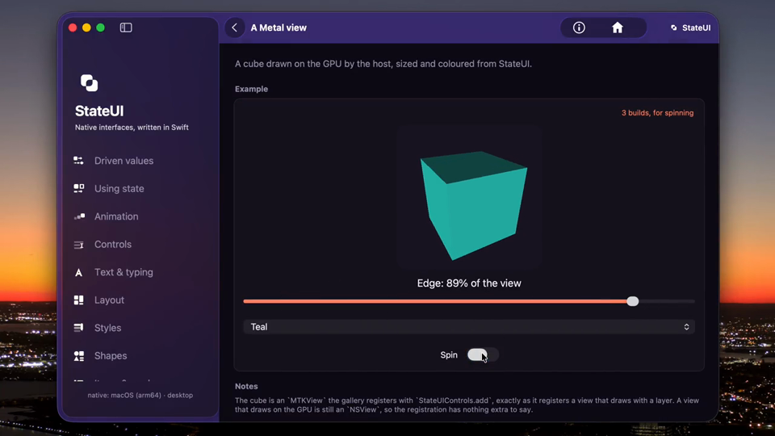

[](https://github.com/idexus/StateUI/actions/workflows/tests.yml?query=branch%3Amain)
[](https://github.com/idexus/StateUI/actions/workflows/build-windows.yml?query=branch%3Amain)
[](https://github.com/idexus/StateUI/actions/workflows/build-linux.yml?query=branch%3Amain)
# StateUI

 **Native interfaces, written in Swift.**
> StateUI describes an application's interface in Swift. Swift owns the UI tree,
identity, state, diffing, and motion; a thin host applies sparse patches to
controls from its platform toolkit.

Every host is Swift, in the application's own process. Two are active, AppKit
and Android Views; WinUI 3 is built control by control, and GTK 4 with
libadwaita has its first controls; UIKit follows, on the same host contract.
Web DOM/CSS comes after the native contract is settled.

| AppKit | UIKit | GTK 4 | Android Views | WinUI 3 | Web |
| :---: | :---: | :---: | :---: | :---: | :---: |
| ☑️ | — | — | ☑️ | — | — |

## In Action

One application, described once in Swift. The AppKit host draws it with macOS
controls, in the same process as the application module - here the Gallery's
Metal sample: the cube
is an `MTKView` the application registers with the host, and its size, colour
and spin are described from StateUI. The edge is handed over as a state, so
dragging the slider rebuilds nothing:

<video src="https://github.com/user-attachments/assets/05ef0718-b3b5-4f67-8c66-7a9c9b1d2ba2" controls muted loop width="960" height="540" poster="docs/assets/appkit-poster.png">
  <a href="https://github.com/idexus/StateUI/blob/main/docs/assets/appkit.mp4"></a>
</video>

## In Code

```swift
struct CounterPage: ContentView {
    @State private var count = 0

    var content: any View {
        VStack {
            Label("Tapped \(count) times")
            Button("Tap me").onClicked { count += 1 }
        }
    }
}
```

StateUI has one state declaration and two reactive paths:

- reading a state rebuilds only the body that read it;
- handing a binding to a control or property lets the host update it without
  rebuilding that body.

`Journey` belongs to the same state and carries its current value, destination,
velocity, and motion. A host with verified motion support animates compatible
property changes on the platform display clock; an unverified or unsupported
pair snaps to its destination.

StateUI is under active development. Until a 1.0 release, the public Swift API
and host contract may change together when native evidence reveals a clearer
cross-platform model. The handbook and platform matrix describe the contract
that is usable now.

## Documentation

- [StateUI handbook](docs/README.md) — the complete guide to applications,
  state, layout, controls, interaction, concurrency, and native hosts.
- [Architecture](docs/architecture.md) — state, reactivity, Journey, motion,
  and application sessions.
- [Host contract](docs/host-contract.md) — `HostPatch`, ownership, identity,
  lifetime, and native adapter rules.
- [Platform contract](docs/platform-contract.md) — the control, property, and
  event inventory with verified host coverage.
- [Control dictionary](docs/controls/README.md) — every control and part of an
  application's structure, member by member, with a mark per platform.
- [Host layer](docs/host-layer.md) — the Swift every host runs on, module by
  module, and what each host provides.
- [AppKit host](docs/appkit-host.md), [Android Views host](docs/android-host.md), [WinUI host](docs/winui-host.md) and [GTK host](docs/gtk-host.md)
  — each host's heads, builds, debugging, and registrations.
- [Project structure and development](docs/development.md) — packages, Gallery,
  build, F5, and test commands.
- [Contributing](CONTRIBUTING.md) — rules for changing the public contract.

Public API declarations provide the focused reference beside the code.

## Quick start

StateUI is developed and used in VS Code, through the StateUI extension in
`lib/StateUI.VSCode`. Build and install it from the checkout (Node.js 20 or
newer):

```bash
cd lib/StateUI.VSCode
npm ci
npm run package
code --install-extension stateui-*.vsix
```

The AppKit host needs only Xcode 27, on macOS 26 or newer. StateUI builds
with one Swift release everywhere, Swift 6.4: Xcode 27's on macOS and the
swift.org 6.4.0 toolchain on the other platforms.

Android asks for more, and builds on macOS only:

- the Android SDK with NDK 30, for Android 9 (API 28) or newer; an NDK
  outside the Android SDK is named by `ANDROID_NDK_HOME`;
- the Swift SDK for Android 6.4.0, installed with `swift sdk install`;
- the swift.org toolchain of that SDK's build, `swift-6.4.0-RELEASE`, beside
  Xcode. Xcode's own Swift 6.4 is a different build and cannot read the SDK's
  modules; the build picks the matching toolchain by itself and names the one
  to install when none is there.

Then open the repository in VS Code:

1. Choose the host in the status bar - **AppKit** or **Android** - and the
   application, **Gallery**.
2. Press **F5**. **StateUI: Debug** builds the Gallery for that host and starts
   it under the debugger; **StateUI: Release** runs the optimized build.
3. Run **StateUI: Run Tests** from the Command Palette for every suite of that
   host.

[Working in VS Code](docs/getting-started.md#working-in-vs-code) covers the
extension's hosts and commands, including **StateUI: New Application**.

From a terminal, the same builds are:

```bash
.scripts/AppKit/build-gallery-appkit.sh debug                  # the AppKit Gallery bundle
.scripts/Android/run-app.sh apps/Gallery debug emulator-5554   # the Android Gallery
.scripts/test-native.sh                                        # the Swift suites
```

## Continuous integration

Every workflow runs on pushes and pull requests to `main` and `dev`.

`Tests` runs the StateUI, StateUI.AppKit, and Gallery suites on macOS, and
the Windows and Linux workflows run the StateUI suite on those machines.

## License

StateUI is licensed under the Apache License 2.0. See [LICENSE](LICENSE) and
[NOTICE](NOTICE). Use of the StateUI name and mark is described in
[TRADEMARK.md](TRADEMARK.md).
