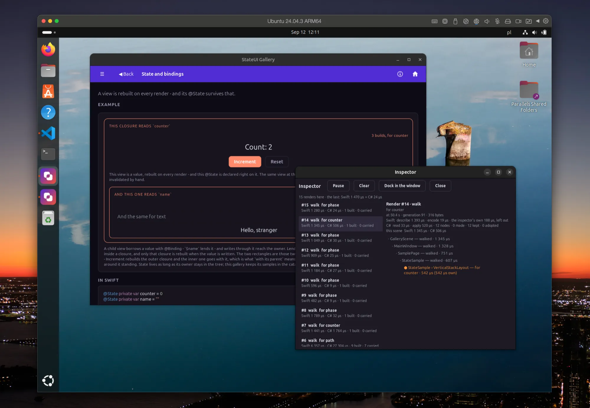

# StateUI

[](https://github.com/idexus/StateUI/actions/workflows/tests.yml?query=branch%3Amain)
[](https://github.com/idexus/StateUI/actions/workflows/build-apple.yml?query=branch%3Amain)
[](https://github.com/idexus/StateUI/actions/workflows/build-android.yml?query=branch%3Amain)
[](https://github.com/idexus/StateUI/actions/workflows/build-windows.yml?query=branch%3Amain)
[](https://github.com/idexus/StateUI/actions/workflows/build-linux.yml?query=branch%3Amain)

Write .NET MAUI user interfaces in Swift - on iOS, Android, macOS, Windows and
Linux, where MAUI's GTK4 backend is a preview and so is this platform's support.

```swift
struct CounterPage: ContentPage {
    @State private var count = 0

    var content: any View {
        VStack {
            Label("Tapped \(count) times")
            Button("Tap me").onClicked { count += 1 }
        }
    }
}
```
## Who reads, rebuilds - and motion beside it

This is the thing to know before anything else. There is one declaration for
a value, `@State`, and one rule about what a write to it does: **a get makes a
reader, a binding makes none.** A value read while a body or a container's
content is being built makes that closure a reader, and a write builds exactly
that closure again - the braces the read sits in, and nothing outside them. A
value handed on as `$x` - to a control, a modifier, a child, an engine - reads
nothing at build; a control or a modifier has the host carry it on its own
frames, an engine follows it, and a write renders nobody for it. Most of a page is a value the reader CHOOSES - a name typed, a
switch flipped, a tab picked - and reading it is the right price. Some of a
page MOVES - a slider under a finger, a fade, a reading counting up, a run of
cards under a hand - and for that, handing it on is. So there are two paths to
the screen, told apart by how a value is USED, and a third axis that runs
across both:

| | begins with | runs | reaches the screen through |
|---|---|---|---|
| **Layer one - description** | a `@State` somebody reads, written | the closures that read it, built again and compared | one message, applied by the host |
| **Layer two - the channel** | a `@State` an engine follows, written | an **engine**, on the display's own frame - yours, or one the differ writes for a conversion | states the host wears on its own frames - and a read state, if the engine chooses, which is a rebuild |
| **Motion, the third axis** | a property given a target, by either path | `.motion` - the law the screen follows to get there | the host, walking every frame in between |

### A value, or a channel

Every property takes both, and the two are one character apart:

```swift
@State private var fade = 1.0

Border { Label("Ready") }
    .opacity(0.5)          // a CONSTANT: the same at every build
    .opacity(fade)         // a VALUE, read here: this closure is a reader, and a write rebuilds it
    .opacity($fade)        // a CHANNEL: the host holds it, and a write rebuilds nobody
```

The first two lines are the SAME call - a constant and a value read from a
state are both a `Double`, and the difference between them is only where the
number came from. The third is a different call: it takes the STATE, not what
the state holds, and from then on the property is the host's to keep up to
date. `fade = 0.2` after that line moves the border and builds nothing.

**Which one to write is a choice, and it is about who has to see the value.**
A value is read at build, so everything in that closure sees it and the
closure is built again whenever it changes: the right price for a number the
page also PRINTS, or that decides which views there are. A channel is read by
nobody, so nothing is built again: the right price for a number that MOVES -
a fade, a drag, a size following a measurement - which would otherwise cost a
render per frame.

The same pair on any other property, the property's own name either way:

```swift
@State private var angle = 0.0
@State private var hint = "Type here"
@State private var shown = true

Label("Turn me").rotation(angle)      // read here: a write rebuilds this closure
Label("Turn me").rotation($angle)     // a channel: the host turns it

Entry().placeholder(hint)             // read here
Entry().placeholder($hint)            // a channel: the host writes the words

Label("Now you see me").isVisible(shown)     // read here
Label("Now you see me").isVisible($shown)    // a channel: the host shows and hides it
```

**A CHOICE takes both too**, which is what keeps the pair honest across the
whole surface - an alignment, a keyboard, a line break, a set of flags:

```swift
@State private var side = LayoutOptions.start

Label("Where am I?").horizontalOptions(.center)   // a constant
Label("Where am I?").horizontalOptions(side)      // read here
Label("Where am I?").horizontalOptions($side)     // a channel: the host sets the member

side = .end                                        // the label moves; nothing is rebuilt
```

A member crosses as its NUMBER - this library's own, the same one the tree
describes a member with - and the host resolves it back through the very table
a described property goes through. There is nothing to travel: a choice has no
half-way, so the host sets it as it stands.

**A channel carries the value it is declared with, and a converter adapts it.**
Where the control wants a different number than the state holds - a percentage
over a fraction, Fahrenheit over Celsius - `convert` makes a second channel
from the first and `convertBack` sends a report home in the source's own
terms:

```swift
@State private var volume = 0.2                                        // 0 to 1

Slider($volume.convert { $0 * 100 }.convertBack { $0 / 100 })          // a thumb in percent
    .maximum(100)
```

Several states are read as one with `.multi`, which takes two to ten of them -
each a value the host can carry, of mixed types - and hands the arithmetic
their values in the order they were named:

```swift
@State private var named = "panel"
@State private var width = 120.0
@State private var height = 80.0

Label().text(.multi($named, $width, $height)
    .convert { "\($0): \(Int($1)) × \(Int($2))" })
```

That, too, costs no render: the arithmetic runs on the host's own frames.
*Converters* has the whole of it.

```swift
struct DialPage: ContentPage {
    @State private var title = "Volume"              // read below: a write rebuilds what read it
    @State private var level = 0.2                   // handed on below: the host carries it, no render

    var content: any View {
        VStack {
            Label(title)
            Slider($level)                           // a drag moves the state; nothing is rebuilt
                .motion(.spring(response: 320))      // motion: HOW an assignment gets there
            BoxView(.cornflowerBlue).heightRequest(10).anchorX(0).scaleX($level)
                .motion(.spring(response: 320))      // the same law on every element that wears the value
            Label($level.convert { "\(Int($0 * 100))%" })   // a conversion: words the host writes

            Button("Full").onClicked { level = 1 }                        // travels there on the spring
            Button("Rename").onClicked { title = "Gain" }                // one render; one label changes
        }
    }
}
```

Drag the slider and the bar and the percentage follow, and nothing is built
again. Press *Rename* and the stack whose braces read `title` is built again -
one render, and one label is all its message changes. Press *Full* and the level
travels there on a spring - send it somewhere else half way through and the
journey bends from where it is and how fast it is going, rather
than starting over. The whole of it is **State, Binding and the engine** and
**Animation**, in the guide.
## One tree, five platforms

<p>
  
  
</p>
<p>
  
  
</p>

*The gallery - one Swift tree, rendered as real MAUI controls on Windows (with
a second window built from the same tree), Android, macOS and an iPhone. And
the same Swift code on Linux, where MAUI draws through GTK4.*

A whole application - a window, two tabs, a list, and the one export every
application declares - is the first thing in **The application, its window and
its pages**; the page `dotnet new` writes is read line by line in **Getting
started**.

<p align="center">
  
</p>
## Where this is, and what that means for you

**Version 0.3. The API is still moving, and using this in a project is at your
own risk.** Names, signatures and whole shapes change between versions while the
design is still being found - the `0.` in front says exactly that under SemVer.

Nothing here is unfinished for want of care: the suites are green in CI on
macOS, Windows and Linux, and all five platform builds are green in CI. What you do not get
yet is a promise that next month's version compiles against this month's code.
LINUX is newer than the other four and rests on preview packages of Microsoft's
own - see **Linux** below for what that means in practice.
Read it, build with it, tell the project what broke - but do not put it under
something you cannot afford to revisit.
## What is in this document

- **Getting started**
  - [Starting an application](#starting-an-application)
  - [Your first page, line by line](#your-first-page-line-by-line)
  - [The API is MAUI's](#the-api-is-mauis)
  - [Two Swift modules](#two-swift-modules)
  - [Adding Swift files](#adding-swift-files)
- **The guide**
  - [State, Binding and the engine](#state-binding-and-the-engine)
  - [Styles](#styles)
  - [The application, its window and its pages](#the-application-its-window-and-its-pages)
  - [Layout](#layout)
  - [Grid](#grid)
  - [AbsoluteLayout and FlexLayout](#absolutelayout-and-flexlayout)
  - [Text in more than one colour](#text-in-more-than-one-colour)
  - [Entries, the caret and the keyboard](#entries-the-caret-and-the-keyboard)
  - [Lists, galleries, selection and groups](#lists-galleries-selection-and-groups)
  - [Animation](#animation)
  - [A layout of your own](#a-layout-of-your-own)
  - [Gestures](#gestures)
  - [Asking the host to do something](#asking-the-host-to-do-something)
  - [Acts, and the control an act is about](#acts-and-the-control-an-act-is-about)
  - [Dates, times and Foundation](#dates-times-and-foundation)
  - [SwipeView and RefreshView](#swipeview-and-refreshview)
  - [WebView](#webview)
  - [Map](#map)
  - [TitleBar, and which device this is](#titlebar-and-which-device-this-is)
  - [Shapes, brushes and a canvas](#shapes-brushes-and-a-canvas)
  - [The toolbar and the menu bar](#the-toolbar-and-the-menu-bar)
  - [Composing views](#composing-views)
  - [Identity](#identity)
  - [What a view says about itself](#what-a-view-says-about-itself)
  - [Adding a control](#adding-a-control)
- **How it is made**
  - [How it works](#how-it-works)
  - [Design notes](#design-notes)
  - [Tests](#tests)
  - [The gallery](#the-gallery)
  - [Publishing](#publishing)
- **The platforms**
  - [Linux](#linux)
  - [Building and running](#building-and-running)
  - [Platform status](#platform-status)
  - [Debugging](#debugging)
  - [Troubleshooting](#troubleshooting)
- **The project**
  - [Roadmap](#roadmap)
  - [License and names](#license-and-names)
# Getting started

For somebody new to this: what has to be on the machine, one command to a running application, the page it starts with read line by line, and the one rule that makes the rest of the API familiar.
## Starting an application

```bash
dotnet new install StateUI.Template
dotnet new stateui -n MyApp
cd MyApp
dotnet build -f net10.0-maccatalyst -r maccatalyst-arm64
```

On Linux there is one head and nothing to name, so the last line is
`dotnet build` and the app starts with `dotnet run`. On a Mac,
`.scripts/run-app.sh maccatalyst` (or `ios`) builds the app and starts it,
`.scripts/run-app.ps1` does the same on Windows, and in VS Code **F5** starts
whatever the device picker says - see below.

That is a whole application: one page with a counter, the artwork for every
platform, and a `.scripts/` folder that compiles the Swift side as part of an
ordinary `dotnet build` - the same build this repository uses, not a cut-down
copy of it. In VS Code, **F5** launches whatever the device picker says.

The Swift half of StateUI arrives as a SwiftPM dependency, named in
`MyApp/Package.swift` beside the project file; the C# half is a
`PackageReference` in the `.csproj`. Both are visible and both are meant to be edited - to work against a
checkout on disk instead, point the manifest at it with `.package(path:)` and
set `<StateUIPackagePath>` in the project, which the generated files carry a
comment about.

### What has to be installed first

| | |
|---|---|
| **.NET 10 SDK** | <https://dotnet.microsoft.com/download> |
| **.NET MAUI workload** | `dotnet workload install maui` |
| **Swift 6.3 or newer** | macOS: Xcode ships it. Windows: <https://www.swift.org/install/windows/>, plus Visual Studio Build Tools - Swift links through the MSVC linker. Linux: <https://www.swift.org/install/linux/> |
| **GTK 4.12 or newer** | for Linux only - see **Linux** below |
| **Xcode** | for iOS and Mac Catalyst |
| **Android SDK, and a Swift SDK for Android** | for Android: [swift.org's guide](https://www.swift.org/documentation/articles/swift-sdk-for-android-getting-started.html). The toolchain must be the SDK's own BUILD - swift.org's, installed beside Xcode's, because a binary module is only readable by the compiler that wrote it. The build checks, uses a matching installed toolchain by itself, and names the one to install when none matches |

In VS Code, two extensions: **.NET MAUI** (Microsoft), which gives the device
picker and F5, and **Swift** (swiftlang), which gives completion and LLDB.

### The first build

A fresh clone's first build compiles the whole of the Swift library once and
keeps it under the app's `obj/`; every build after that compiles only the files
that changed. On a MacBook Pro with an M1 Max (ten cores), Mac Catalyst, Debug,
with the packages already downloaded:

| | a new app (`dotnet new stateui`) | the gallery |
|---|---|---|
| the first build | **13.9s** | **20.4s** |
| nothing changed | 1.7s | 2.9s |
| one file of the app changed | 2.7s | 7.3s |
| one file of the library changed | 6.1s | 11.0s |

On Windows 11 on arm64 - a Parallels virtual machine given four cores of an
Apple Silicon Mac - `net10.0-windows10.0.19041.0`, Debug, the packages already
downloaded, each time the median of three or four builds, because a virtual
machine shares its cores with its host:

| | a new app (`dotnet new stateui`) | the gallery |
|---|---|---|
| the first build | **53s** | **64s** |
| nothing changed | 7s | 9s |
| one file of the app changed | 12s | 17s |
| one file of the library changed | 21s | 26s |

Much of what Windows adds is not Swift: every build there also runs the WinUI
XAML compiler and indexes the app's resources - about four seconds of a build
where nothing changed, and about fifteen of a first one.

[Incremental builds](#incremental-builds) says how.

The one thing that makes you pay the first build again is the VS Code task
**"Clean app (everything)"**, which deliberately takes `obj/`, `bin/` and
`.build/` whole - it is the only clean that makes an edited `Info.plist` take
effect.
## Your first page, line by line

The application `dotnet new stateui -n MyApp` writes has one page, in
`Swift/MainPage.swift` - a picture, a heading and a button that counts its own
presses - and beside it, in `Swift/MyAppApp.swift`, the three declarations that
put the page on screen: the application, its window, and the one line that
names the application to the host. This is the whole of it; every word is
explained below, and everything in the guide is built out of these same few:

```swift
// Swift/MainPage.swift

import StateUI

struct MainPage: ContentPage {
    @Environment private var page: PageSession

    @State private var count = 0

    var content: any View {
        VStack {
            Image("stateui_tile.png")
                .heightRequest(120)
                .horizontalOptions(.center)

            Label("Hello, StateUI!")
                .fontSize(28)
                .fontAttributes(.bold)
                .horizontalOptions(.center)

            Button(count == 0 ? "Click me" : "Clicked \(count) time\(count == 1 ? "" : "s")")
                .onClicked { count += 1 }
                .horizontalOptions(.center)
                .margin(20)
        }
        .spacing(16)
        .verticalOptions(.center)
        .padding(30)
        .onCreated { page.title = "MyApp" }
    }
}
```

```swift quote
// Swift/MyAppApp.swift

import StateUI

struct MyAppApp: Application {
    @Environment private var application: ApplicationSession

    init() {
        application.styles = AppStyles.sheet      // Swift/Styles/AppStyles.swift
    }

    var scene: any Scene { MainWindow() }
}

struct MainWindow: Window {
    var page: any Page { MainPage() }
}

@_cdecl("stateui_app_register")
public func stateui_app_register() {
    stateUIUseApp(MyAppApp())
}
```

- **A page is a type you declare**, against the `ContentPage` protocol, and
  `content` is what is on it. A window is the same shape one level up:
  `MainWindow` answers `page` with a page, and the application answers
  `scene` with the window - a window alone is a scene of one window. The
  export at the end is the one thing an
  application says to the host - see **Two Swift modules** for why it cannot
  live in the library.
- **What a page says about itself is its SESSION's.** `page` is the page as
  it runs, read with `@Environment`, and `.onCreated { page.title = "MyApp" }`
  gives it its title as it comes into the tree - in the very message that
  brings it. The window and the application have sessions of their own - the
  application writes its styles into its own, in `init` - see
  [Sessions](#sessions).
- **A view is a value.** `VStack { … }` is a `VerticalStackLayout` holding an
  `Image`, a `Label` and a `Button`, and `content` is rebuilt as a value every
  time the page renders - which is what lets the next point work.
- **`@State` is what the page remembers between renders.** `count` survives
  the rebuild, and writing it - `count += 1` - is what asks for the next one:
  the page's `content` read `count`, so it is described again, and the one
  difference - the button's caption - is sent to the real MAUI `Button` on the
  screen. Nothing else on the page is touched.
- **A modifier is a MAUI property, camelCased.** `.fontSize(28)` is
  `Label.FontSize`, `.spacing(16)` is `StackBase.Spacing`, `.padding(30)` is
  `Layout.Padding`, `.horizontalOptions(.center)` is `View.HorizontalOptions`.
  The MAUI documentation for a control is the list of what its Swift view can
  be told; there is nothing to learn twice.
- **A handler is a closure, and it may `await`.** `.onClicked { count += 1 }`
  runs on the thread MAUI draws on, through the library's own `@MainThread`
  actor, when the reader taps; a handler that asks the host for something - a
  dialog, focus, a scroll - writes `try await` and reads the answer. The one
  thing never to do in one is to hop onto `@MainActor`: nothing drains it in a
  MAUI app on Android or Windows.

Change the caption, save, build again - a change to one Swift file is a few
seconds on Mac Catalyst - and the app shows it. From here the guide reads in
order: **State, Binding and the engine** is the chapter every other one leans on, and
each section after it stands on its own.
## The API is MAUI's

There is nothing to learn twice. Every property is the MAUI property, camelCased,
set by a modifier of the same name:

| MAUI (C#) | StateUI |
|---|---|
| `label.FontSize = 20` | `.fontSize(20)` |
| `label.HorizontalTextAlignment = TextAlignment.Center` | `.horizontalTextAlignment(.center)` |
| `view.HorizontalOptions = LayoutOptions.Center` | `.horizontalOptions(.center)` |
| `button.CornerRadius = 8` | `.cornerRadius(8)` |
| `stack.Padding = new Thickness(20, 12)` | `.padding(20, 12)` |
| `entry.TextChanged += …` | `.onTextChanged { … }` |

Three rules cover the whole surface:

- **Only the defining value goes in the initializer.** `Label("Total")`,
  `Button("Save")`, `Entry($name)` - the text is what the control is for.
  Everything else is a modifier, so nothing has to be guessed from argument
  order or invented as a Swift-flavoured name.
- **A modifier exists exactly where MAUI declares the property.** `.spacing()`
  on a stack, `.placeholder()` on any InputView - an Entry, an Editor, a
  SearchBar - `.opacity()` on everything, because
  the protocols mirror MAUI's own hierarchy - VisualElement, View, Layout,
  StackBase, and the interfaces MAUI shares between controls.
- **Two abbreviations, and no others.** `VStack` and `HStack` stand in for
  `VerticalStackLayout` and `HorizontalStackLayout`, which are long enough to
  crowd out the code they contain. Both full names work too.

  An `async` call drops MAUI's `Async` suffix - `evaluateJavaScript`, not
  `evaluateJavaScriptAsync`, `displayAlert`, not `displayAlertAsync` - because
  `await` at the call site already says it.

  The shortenings beyond those drop a word that says nothing:
  `AbsoluteLayout.LayoutBounds` is `.absoluteLayoutBounds` rather than
  `.absoluteLayoutLayoutBounds`, and `SemanticProperties.Description` is
  `.semanticDescription`, beside `.semanticHint` and `.semanticHeadingLevel`.
  Nothing else is dropped - see
  [AbsoluteLayout and FlexLayout](#absolutelayout-and-flexlayout).

So the reference for writing StateUI is the [.NET MAUI
documentation](https://learn.microsoft.com/dotnet/maui/user-interface/controls/):
the property list of a MAUI control is the modifier list of the Swift one. What
is this library's own is the shape around them: views nested in a builder,
rebuilt when state changes.

Every modifier, initializer and enum case carries a doc comment naming the MAUI
property behind it, so the mapping is in the editor as well as in that table:

```swift quote
/// How opaque the view is, from 0 to 1. MAUI: VisualElement.Opacity.
public func opacity(_ value: Double) -> Modified
```

That is a rule with a test behind it - `testEveryPublicApiIsDocumented` fails
naming the line, and on the C# side the compiler does, so an undocumented public
member does not build.
## Two Swift modules

The Swift side is compiled twice, into two modules:

| Module | Sources | Manifest | Purpose |
|---|---|---|---|
| `StateUI` | `src/StateUI/Sources/` | `Package.swift` (repository root) | the library |
| `$(MSBuildProjectName)UI` | `<app>/Swift/` | `<app>/Package.swift` | the app's own UI |

For the gallery that name resolves to **`GalleryUI`**, for `apps/HelloWorld` to
`HelloWorldUI` - derived from the project, never hardcoded. A second app gets its own module name for
free, and two apps in one solution cannot collide.

Both are SwiftPM packages. **The library's manifest is at the repository
ROOT** - SwiftPM reads a package's manifest from the root of its checkout and
nowhere else, so that is where it has to be for anybody to write
`.package(url: "https://github.com/idexus/StateUI.git", …)`. The code stays
under `src/StateUI/`, which the manifest's `path:` says. The app's sets
`path: "Swift"`, and the manifest itself sits BESIDE THE
`.csproj` rather than inside that folder. SwiftPM writes `.build/` and
`Package.resolved` next to whichever directory holds the manifest, so keeping it
at the project root puts those where `bin/` and `obj/` already are and leaves
`Swift/` as nothing but source. Everything under it is the app's code - the
application and its pages directly in it, `Styles/` for the look, and a folder
added beside them compiled without being named anywhere.

An application is laid out the same way whichever one it is, and `apps/HelloWorld`
is the worked example: the project file and the Swift manifest at the root,
`Host/` for the C# side (`App.cs` and `MauiProgram.cs`, which is all the C# an
app needs), `Platforms/` for the platform heads, `Resources/` for the artwork
MAUI rasterizes, and `Swift/` for everything the app actually says. `.scripts/new-app.sh` - the scaffolder
for an app inside this repository, see **Publishing** - produces exactly that, and `AppsTests` reads it back.

The app's manifest declares a dependency on the library - a version from GitHub in a generated app, a path in this repository's own apps. That is not only for the build - **SourceKit resolves
imports through manifests**, so without one the editor reports
*"No such module 'StateUI'"* and offers no completion, even while the build
succeeds. The build passes `-I` explicitly; the editor never sees those flags.

The module name therefore appears in two places - the manifest and MSBuild - and
the build **checks that they match**. A drift would otherwise be silent and late:
the native library built under one name, the generated P/Invoke looking for
another, and a missing-library error at runtime.

**The dependency runs app → library, never the reverse.** That is what allows
the library to be published on its own, and it is why the app has one export of
its own:

```swift
@_cdecl("stateui_app_register")
public func stateui_app_register() {
    stateUIUseApp(GalleryApp())
}
```

The library cannot declare that function. On Android and Windows the app's Swift
module is a separate native library, and code in it never runs until something
calls into it by name - and the library, compiled long before any application
existed, has no way to name one. So the app names itself, exactly as a MAUI app
does with `builder.UseMauiApp<App>()`. Everything else about starting up -
`Application`, `Scene`, `Window`, `Page` - is in the library.

Since `StateUI.Runtime` is published independently, it cannot name the app's
native library at compile time - the name follows the project. The build
therefore generates a small interop file whose `[ModuleInitializer]` assigns
`StateUIHost.RegisterApp`. Nothing has to be wired up in application code.
## Adding Swift files

Drop a `.swift` file anywhere under `<app>/Swift/` and it becomes part of the
app's UI module. Drop one under `src/StateUI/Sources/` and it becomes part of
the library. Either way it is compiled without listing it anywhere: SwiftPM globs
the tree, and the build scripts glob the same tree with `find` /
`Get-ChildItem`.

Folders too, and as deep as you like - every one of those globs recurses. The
gallery keeps the machinery in `Gallery/` and one file per sample under
`Samples/<Group>/`, one type per file, which is the same split the library makes
for itself.

Exports work the same way. On Windows a DLL only exports what a `.def` file
names - Swift has no `__declspec(dllexport)` for `@_cdecl` - so the build
**generates** that list by scanning the sources. A new export cannot be
forgotten, which would otherwise surface much later as
`EntryPointNotFoundException` from a DLL that built perfectly.
# The guide

How an interface is written: what the words mean, what the reader can do with each, and an example that compiles for every one of them. Read in order the first time, and by section after that.
## State, Binding and the engine

Everything on the screen is a function of state, and there is ONE declaration
for a value: `@State`. What happens when it is written is decided by WHO READS
IT, and the rule has two halves:

- **A get makes a reader.** A value read while a body or a container's content
  is being built makes THAT closure a reader, and a write to the state builds
  exactly that closure again - the `VStack` whose braces the read sits in, and
  nothing outside them.
- **A binding makes no reader.** `$x` handed to a control, a modifier, a child
  or an engine reads nothing at build. A control or a modifier has the host
  carry the value on its own frames, an engine follows it where it lives, and
  a write - this side's or the host's - renders nobody for it.

So a write always asks the state's readers for a render, only its readers, and
where there are none it asks for nothing at all. That is what lets one `@State`
be both a counter a label prints and a slider's value the host walks sixty
times a second, and it is why there is no second declaration for the host's
values: which of the two a state is, is decided where it is used, by a get or
by a `$`.

```swift
struct MixerPage: ContentPage {
    @State private var volume = 0.2                  // one declaration
    @State private var reading = "20%"               // a text an engine writes
    @State private var pulses = 0                    // read by no view, followed by an engine

    var content: any View {
        VStack {
            Slider($volume)                          // a binding: no reader, the host walks the thumb

            VStack {
                Label("volume · \(Int(volume * 100))%")   // a get: THIS stack is the reader
            }

            Label($reading)                   // a driven text: shown as it moves, no reader

            Meter(volume: $volume)                   // a child handed the binding
            Pulse(pulses: $pulses)                   // a child handed the binding to a state nobody reads

            Button("Louder").onClicked { volume = min(1, volume + 0.1) }   // a set: renders the readers
            Button("Pulse").onClicked { pulses += 1 }                       // a set nobody reads: wakes the engines that follow it
        }
        .engine(following: $volume) { _ in           // runs on the display's frames, renders nobody
            reading = "\(Int(volume * 100))%"
        }
    }
}

struct Meter: ContentView {
    @Binding var volume: Double                      // the same value, by binding

    var content: any View {
        ProgressBar().progress(volume)               // a get in the child: the child is the reader
    }
}

struct Pulse: ContentView {
    @Binding var pulses: Int                         // the owner's state, by binding
    @State private var said = "0"

    var content: any View {
        Label($said)
            .engine(following: $pulses) { _ in       // named here, so a write to it wakes this
                said = "\(pulses)"
            }
    }
}
```

Drag the slider: the inner `VStack` and `Meter` are built again on every
report, because they read `volume`; the page around them, the `Slider` and the
engine's text are not, because they were handed `$volume`. Press Louder: the
same two readers, once. Press Pulse: no render anywhere - nobody reads
`pulses`, so the write asks for none, and the engine that follows it writes a
text the host carries.

### The three words

| | what it is | a write does |
|---|---|---|
| `@State` | the one declaration of a value - the tree's where a body reads it, the host's where it is handed on, an engine's where the engine follows it | renders its readers, the closures that read it, and nobody else; wakes the engines that follow it; nothing at all where there are none of either |
| `@Binding` | a state lent to a child - `$x`, the same value, read and written through | the same: a child that READS it is a reader, one that FOLLOWS it wakes, one that only hands it on is neither |
| `.engine` | arithmetic on the display's own frames: following the states it is handed, writing states the host wears | - it is what runs, not what is written |

**A handler is not a reader.** `Button("Louder").onClicked { volume += 0.1 }`
reads `volume` when the button is pressed, not while the body is built, so a
button that writes a state is never rebuilt for it. Neither is an engine: what
it reads inside its run is recorded nowhere - it runs when a state it FOLLOWS
is written, once after a render that described its view, and again where it
answered `.again`, and never because of what it read.

**No control reads what it is handed.** `Entry($name)`, `Editor`, `SearchBar`,
`DatePicker` and `TimePicker` hand the state to the host as `Slider($volume)`
does: the field shows the state from the host's frames, what the reader types
or picks lands on the state as the host's own write, and the closure that wrote
the field is no reader of it - a body that prints `name` is, and is built again
per keystroke. A part of a state (`$settings.name`) or a `Binding(get:set:)`
has no storage for the host to carry, so a field handed one takes the described
road: the value read at build, every edit written back through the binding, and
the closure that wrote it a reader.

### The two layers of reactivity

Read by what HAPPENS when a value is written, the same words make two paths,
and everything in this section is one of them. One value, both spellings, one
character apart:

```swift
@State private var counter = 0

Label("Counter \(counter)")                          // LAYER ONE: a get, and this closure is its reader
Label($counter.convert { "Counter \($0)" })          // LAYER TWO: a channel, and nothing is built for it
```

**Layer one, description** - `@State` → the closures that read it → rebuilt,
compared, one message. A write asks for a render; every closure that read the
value - a body, or the content of the container the read sits in - is built
again, nothing around it is, and what differs goes across as one message the
host applies. Handing the value on as `$x` makes no reader. It is the path for
anything the reader chooses and for anything that decides WHICH views there
are, and its price is one render per write - the right price for a name typed
or a tab picked.

**Layer two, the channel** - `@State` handed on → an engine → `@State` → the
host's own frames. A write to a state an engine follows - a handler's, a
control's report, the host's own frame, another engine's - wakes it; it runs
on the display's frame, reads the states it was handed, and writes states the
host wears without a view being built for them. Its price is arithmetic per
frame and nothing else - the right price for a value that moves sixty times a
second.

**The two meet in one place, and meeting is a choice.** An engine may write a
`@State` somebody reads, and that write takes the described path: a render,
priced like any other. It is how something continuous decides something
discrete - a room the host measures on every frame deciding which rows a page
has - and the shape to write it in is a threshold, so the crossing happens only
where the answer FLIPS:

```swift
enum Room { case wide, narrow }

@State private var box = Rect(0, 0, 0, 0)        // handed on: the host writes it whenever the layout is sized
@State private var last = Room.wide            // the engine's own copy of what it last said - read by nobody
@State private var room = Room.wide            // WHICH views there are - read below, so a write renders

VStack {
    if room == .wide { Label("A caption that needs the width") }
    Label("Always here")
}
.frame($box)
.engine(following: $box) { _ in
    let answer: Room = box.width > 600 ? .wide : .narrow
    guard answer != last else { return }

    last = answer
    room = answer                              // the one write that crosses back: a render, then none
}
```

The room is handed on and costs nothing; the caption's presence is read and
costs a render - once, when the window is dragged past 600, and never on the
frames in between. A page ARRANGED from its own measurement wants an
`.onFrameChanged` beside the feed as well - a watched frame is what places its
rows at once, where a feed alone lets them travel through the very measurement
that decides them - and the gallery's home page is written that way: the height
of its run of cards is handed to the host and driven, and which rows stand
beside the run is written by its `.onFrameChanged`, where the answer flips.

**Motion is a third axis, across both.** Whichever path gave a property its
target, `.motion` says how the screen gets there: a described width and a
driven one travel under the same laws, and a target changed half way bends the
journey either way. It is its own section, **Animation**, because it is about
presentation and never about who owns a value.

### Which one, for what

| the value is… | declare it as | it reaches the screen through |
|---|---|---|
| chosen by the reader - a name typed, a switch flipped, a tab picked | `@State` | the closures that read it, rebuilt on every write |
| which views there ARE - a path, a list of sheets, an expanded flag | `@State` | the same - the tree is what decides |
| a control to CALL - focus it, move its map | `@Aim(Entry.self) private var field` | `.aim(field)`, then `try await field.focus()` |
| kept across launches | `@State(persistentKey: .key)` | the same as any state, and the store |
| kept with its scene, back when the system restores it | `@State(sceneKey: .key)` | the same as any state, and the scene's own record |
| where a walked value HAS GOT TO, shown as it travels | a second `@State` for the reading | `.samples($fade, into: $shown, .every(ms))` - or `$fade.journey.value` read in the body, a build a frame |
| a slider's or a stepper's value | `@State` holding a `Double`, handed as `$x` | the host walks the thumb; a body that prints it is a reader |
| shown AS IT MOVES - a fade, a size, a colour, a drag | `@State` holding the value, handed as `$x` | a driven modifier: `.opacity($fade)`, `.widthRequest($width)`; `$fade.journey` is the trip |
| a reading written every frame - a caption, a percentage | `@State` holding a `String` | `Label($caption)`, written by an engine |
| where the reader has scrolled to | `@State` holding a `Point`, handed as `$x` | `.scroll($offset)` - the host writes it, and a write moves the scroller |
| how far the reader has dragged | `@State` holding a `Double` | `.panX($dragged)` - the host writes it |
| the room a layout was given, or where its children go | `@State` holding a `Rect` or a `PlacedRun` | `.frame($room)`, `.placement($run)` |
| an engine's own step, counter or snapshot | `@State` that no view reads | nothing - a write renders nobody, and the engine that follows it wakes |
| a property whose value is decided elsewhere | `@State` of the property's own type, handed as `$x` | the value modifier's binding twin: `.fontSize($size)`, `.isVisible($shown)`, `.placeholder($hint)` |
| one state in two units, or two states in one | `$x.convert { … }.convertBack { … }`, `$a.convert(with: $b) { … }` | the control is handed the derived state; a report comes back converted |
| lent to a child view | `@Binding` | the child's memberwise initializer, handed `$x` |

The rule under the table: **a value the reader CHOOSES is read, a value that
MOVES is handed on.** A render is the right price for the first - a name is
typed a few times a second, and a tab is picked once. It is the wrong price for
the second, which moves sixty times a second and would cost a render nobody
asked for at every step.

### Seeing who reads

`debugInfo()` is the instrument. Written inside a closure, it answers which
view the closure belongs to, how many times that closure has been built, and
which state the last build was for - `"MixerPage: 41 builds, for volume"` - or
`with its parent` where the closure was only built because the one around it
was. Every gallery example that rebuilds writes one where its rebuild is - the
same place its listing shows it - and *Who is the reader* puts one on each of
seven rows over one state: a get in a row's own
braces, a binding alone, a driven text, a get in a nested container, a child
that reads, a child that only hands the binding on, and a state followed by a
child's engine.
Drag the slider and the counts say the rule out loud. *Every property by
binding* and *Converters* do the same for a property handed a plain state and
for a state converted on its way to a control, and *Two layers of reactivity*
puts a stopwatch on both paths: the same subtree described again for a get,
and not described at all for a channel, in microseconds.

### @State

```swift
struct CounterPage: ContentPage {
    @State private var counter = 0

    var content: any View {
        VStack {
            Label("Count: \(counter)")
            Button("Increment").onClicked { counter += 1 }
            ResetRow(counter: $counter)
        }
    }
}

struct ResetRow: ContentView {
    @Binding var counter: Int

    var content: any View {
        Button("Reset").onClicked { counter = 0 }
    }
}
```

Reading is plain reading and writing is plain writing, from any thread; a write
marks the tree dirty, which is what brings the next render. A handler writes it,
and so does a `Task.detached` that has worked something out or an `async let`
child - the value sits behind a lock, so a write from the cooperative pool is
whole, and a write that lands while a render is running is kept for the next
one. The one move that is NOT allowed is hopping onto `@MainActor` or
`DispatchQueue.main` to "reach the UI thread": nothing drains those in a MAUI
app on Android or Windows, so a handler that awaits `MainActor.run { … }` hangs
at that line. A handler already runs on the library's own `@MainThread`; there
is nowhere to move to. When two tasks change the SAME state at once, use
`update` - `count += 1` is a read then a write, and `_count.update { $0 + 1 }`
holds the lock across both.

**`@State` is declared where the value is used, and survives the view being
rebuilt.** A view is a value, rebuilt on every render - and the renderer carries
its state across the rebuild for as long as the element keeps its identity and
its view type, the same rule that keeps a control between renders. The fresh
view's boxes find their predecessors BY PATH - the stored property's name at
every level, plus the type of any view stored along the way - so a view that
keeps another view in a property can gain or lose one without moving anybody
else's state, and a path nobody answered last render starts at its initial
value. A child that
needs the value borrows it with `@Binding` - `$counter` lends it - and writes
through the binding reach the owner. Leaving the tree is what ends a view's
state; state that should live as long as the app goes on the `Application`,
which is built once and kept.

Swift allows no property wrapper on a file-scope variable at all ("property
wrappers are not yet supported in top-level code"), so state belonging to no
type is written the long way, and works the same:

```swift
private let counter = State(0)
counter.update { $0 + 1 }
```

#### Persistent state

`@State` under a **persistent key** outlives the process: the value the reader
left behind is there again on the next launch, and nothing about reading or
writing it changes. The label says which kind of state this is, so a line
declaring one reads as what it is:

```swift
enum Appearance: String, PersistentValue { case light, dark, system }

extension PersistentKey {
    static let lastGroup = PersistentKey("com.example.lastGroup", of: Int.self)
    static let appearance = PersistentKey("com.example.appearance", of: Appearance.self)
}

struct GroupPage: ContentPage {
    @State(persistentKey: .lastGroup) private var group = 0

    var content: any View { Label("Group \(group)") }
}
```

The value written beside the state - `= 0` - is what it holds when the store has
nothing under that name, so the default stays where it can be seen. There is
nothing to await on either side: the whole store is read into memory at startup,
before the first view is built, and a write reaches it by itself. A key written
several times before the next drain is saved once, holding the last value - so a
handler that writes the same key five times touches the store once. That is a
collapse per drain and not a delay: an event drains, so an `Entry` bound to kept
state does reach the store once a letter. A view that wants the store touched
when the typing stops keeps the text in ordinary state and writes the kept one
from `.onEvent(.completed)`.

The value and the note that it needs saving are settled under ONE hold of the
state's lock, so whichever write lands last is also the one the store hears
last. Two thread-safe halves would not be enough: two tasks writing the same
kept state at once could settle the value in one order and reach the store in
the other, and the next launch would read the older of the two.

**The application lists its keys** in its session, as it is made, and that is
what makes the read possible at all: a settings store is read one key at a time and offers no list of what it
holds, so naming them is the only way the host can have the values before
anything asks for one.

```swift
extension PersistentKey {
    static let lastGroup = PersistentKey("com.example.lastGroup", of: Int.self)
    static let appearance = PersistentKey("com.example.appearance", of: Appearance.self)
}

enum Appearance: String, PersistentValue { case light, dark, system }

struct MyApp: Application {
    @Environment private var application: ApplicationSession

    // Written as the application is made - read once, before the first view
    // is built.
    init() {
        application.persistentKeys = [.lastGroup, .appearance]
    }

    var scene: any Scene { MainWindow() }
}

struct MainWindow: Window {
    var page: any Page { GroupPage() }
}

struct GroupPage: ContentPage {
    @State(persistentKey: .lastGroup) private var group = 0

    var content: any View { Label("Group \(group)") }
}
```

A key holds what a platform's settings store holds - a whole number, a number,
true or false, or text - and an enum over one of those is one line:

```swift
enum Appearance: String, PersistentValue { case light, dark, system }
```

The kind comes from the Swift type named at the key, so `of: Int.self` and
`var group = 0` are the same word twice, and a mismatch between them stops the
app the first time that view is built, naming the key. Anything larger than those four belongs in a
model the application saves itself.

**One key is one piece of state, everywhere in the application.** Two views
declaring the same key share the storage rather than a copy of the value, so a
write in either rebuilds the readers in both. A NAME is that storage, so listing
one twice is one key - and listing it twice with two different KINDS is the one
way to be wrong about it: the first declaration is what the store is read and
written as, and the application is told which key disagreed with itself.

Where it is kept is MAUI's `Preferences` - `NSUserDefaults`,
`SharedPreferences`, `ApplicationDataContainer` - so these sit beside whatever
else the app keeps in the platform's own settings. An application that wants its
own store names one the host registered:

```swift
@Environment var application: ApplicationSession

application.persistentStorage = PersistentStorage("MyApp.Json")    // in the application's init
```

```csharp
// C#, in MauiProgram.CreateMauiApp - any IPreferences of the app's own:
StateUIStores.Add("MyApp.Json", new MyJsonPreferences(path));
```

A store is an `IPreferences`, MAUI's own interface - the one
`Preferences.Default` implements - so a store written against MAUI works here
unchanged.

#### State in a class

`@State` answers one question - a view is a value, rebuilt every render, so where
does its value live - and it answers it by owning the value. A **class** is the
case that answer does not cover: the box holds a reference, so `model.name = "…"`
never writes through the box, nothing asks for a render, and the interface goes
on showing the old name with nothing anywhere reporting a problem.

Its properties are `@State`, and that is what makes the write visible:

```swift
final class Basket {
    @State var items: [String] = []
    @State var note = ""

    var lastSaved = ""

    var isEmpty: Bool { items.isEmpty }
}

struct BasketPage: ContentPage {
    @State private var basket = Basket()

    var content: any View {
        VStack {
            Label("\(basket.items.count) item(s)")
            Button("Add").onClicked { basket.items.append("Something") }
        }
    }
}
```

The same word, the same storage and the same rule as in a view. A write to
`items` asks for another render of the closures that READ `items`, and a closure
reading `note` is left standing: two properties of one model are two pieces of
state to the renderer, exactly as two `@State`s on a view are. `debugInfo()`
names the property a rebuild was for, and a write to a property nothing on
screen reads asks for nothing.

**Both `@State`s are needed, and they say different things.** The one on the
property makes the *write* visible; the one on the view keeps the *instance*
across renders, since the view is rebuilt every time and `Basket()` runs again
with it. A `let basket = Basket()` on the view compiles, gets a new basket on
every render and says nothing. State that should live as long as the
application goes on the `Application`, or in a `let` at file scope - where
nothing is rebuilt, so a plain `let` is enough and the `@State` on the
properties is the whole story.

**A plain `var` is stored and nothing more** - a cache, a scratch value,
anything the interface does not draw - and writing it asks for nothing. A `let`
and a computed property need no wrapper either: a `let` is never written, and a
computed one follows whatever it is computed from.

**A model's property has its value beside its declaration.** An initializer may
then write over it - `init(note: String) { self.note = note }` - and that write
asks for nothing, nobody having read the state yet. Two things a property
wrapper cannot sit on are a `weak` or `unowned` reference and a `lazy` property,
so a back-reference to another model is a plain `weak var`.

**The model's own `$note` is the whole state** - what a field, a driven modifier
or an engine takes - and it works exactly as `$note` on a view's `@State` does:
handed to `Entry(basket.$note)`, the host carries the text and the field is no
reader of it; `.opacity(basket.$fade)` is walked by the host and
`basket.$fade.journey` is the trip; `following: basket.$step` is what wakes an
engine.

```swift
final class Basket {
    @State var note = ""
    @State var fade = 1.0
}

struct BasketPage: ContentPage {
    @State private var basket = Basket()

    var content: any View {
        VStack {
            Entry(basket.$note)                 // the note's own state, carried by the host
            BoxView().opacity(basket.$fade)     // walked by the host
        }
    }
}
```

**A model's property is kept the way a view's state is**, and the riders that
keep a value are the same either way: `@State(persistentKey:)` across launches
and `@State(sceneKey:)` with its scene. Each asks for a `PersistentValue`, so it
is the property that wears it and never the box holding the model.

A closure that writes `basket.$note` reads the `basket` *box* - the reference -
and not `note`: a write to `note` leaves it standing, and replacing the model
(`basket = Basket()`) rebuilds it, which is when the field has to be handed the
new model's state.

**One model, any number of views.** A model is one object, so its states are one
each: a page that reads `basket.note`, a row that reads it too and a field handed
`basket.$note` all meet the same state - a write reaches both readers and the
field stays where it is, whichever of them touched the model first. A model
shared by a whole branch is provided once with `.environment(basket)` and read
with `@Environment` below - see [Environment](#environment).

**A model is lent the way anything else is**, with `@Binding` - there is no
second wrapper for the class case, because there is no second case:

```swift
final class Basket {
    @State var note = ""
}

struct NoteRow: ContentView {
    @Binding var basket: Basket

    var content: any View {
        Entry(basket.$note)
    }
}

struct BasketPage: ContentPage {
    @State private var basket = Basket()

    var content: any View { NoteRow(basket: $basket) }
}
```

`$basket.note` reaches the same property THROUGH the model - a part of the
holding state, read where it is written, as `$room.width` is - and
`$app.basket.note` reaches through a model inside a model.

**Swift's own `@Observable` is a different report to a different listener.** It
notifies whoever armed an observation scope around the read, and nothing here
arms one - so a write to such a model reaches the object and the interface goes
on showing the old value. Holding one in a `@State` says so at the declaration,
in a warning naming the line. A model another package ships as `@Observable`,
whose properties cannot be given `@State` from outside that package, is bridged
by reading it inside `withObservationTracking` and calling
`Renderer.shared.setNeedsRender()` from the `onChange` - remembering that the
arming is one-shot and has to be renewed on every change.

**`$` says: I lend you this, do with it what you want.** A borrower may write
the whole value or one property of it, and a model lent this way may be edited
or *replaced*. That is the point rather than an oversight: what a parent hands
over is a capability, and the way to hand over less is to hand over less. Give
the child the value and it can only read; give it the object and it can edit
what the object holds; give it `$` and it can do everything the owner can.

#### Environment

A model a whole branch shares does not have to be passed by hand through every
initializer on the way down. `.environment(object)` provides it to a subtree,
and `@Environment` on any view below resolves the nearest object of that TYPE -
the annotation is the key, so there is no argument to pass and nothing to
spell:

```swift
final class Session {
    @State var name = "guest"
}

struct MainView: ContentView {
    @State private var session = Session()  // a class of @State properties, usually

    var content: any View {
        ChildView()
            .environment(session)           // provides, and reads nothing
    }
}

struct ChildView: ContentView {
    @Environment var session: Session       // the nearest Session above

    var content: any View {
        Label(session.name)                 // a read - so writes rebuild THIS view
    }
}
```

One way each: `.environment()` is the only way to provide, `@Environment` the
only way to consume, and a nearer `.environment()` of the same type overrides
for its own branch.

The rebuild rules are the ordinary ones, and they land exactly where wanted:
the provider passes a reference and reads no property, so a write IN the
object rebuilds the readers and never the provider; replacing the object -
writing the `@State` that holds it - rebuilds the branch, which then resolves
the new one. `$session.name` lends one property of the provided object to an
input, exactly as it does off a `@State` model. Reading an `@Environment`
nobody provided stops the program with a message naming the type - unless the
type is one of the STANDARD providers below, which are always there. Nothing
about any of this crosses the boundary - the C# side never hears of it.

#### The standard environment

What the HOST knows is provided to every tree without anyone writing
`.environment()`: seven objects, resolved like any other and kept current by
the platform's own change events, so exactly the views that read a changed one
are rebuilt.

```swift
struct SaveButton: ContentView {
    @Environment var connectivity: Connectivity

    var content: any View {
        Button("Save").isEnabled(connectivity.networkAccess == .internet)
    }
}
```

| Provider | What it answers | Changes |
| --- | --- | --- |
| `Battery` | `chargeLevel`, `state`, `powerSource`, `energySaverStatus` | on the platform's battery events |
| `Connectivity` | `networkAccess`, `connectionProfiles` | the moment the network moves |
| `DeviceDisplay` | `width`, `height`, `density`, `orientation`, `rotation`, `refreshRate` | on rotation |
| `LocaleInfo` | `language`, `region`, `name`, `timeZone` (IANA), `uses24HourClock`, `firstDayOfWeek`, `isMetric` | at startup, and again as a window resumes |
| `DeviceInfo` | `idiom`, `platform`, `model`, `manufacturer`, `name`, `versionString`, `deviceType` | pushed at startup |
| `AppInfo` | `name`, `packageName`, `versionString`, `buildString`, `requestedTheme` | the theme, live |
| `ApplicationSession` | `phase` - `.active / .inactive / .background`; `scenes`; `openScene()` | as the application's windows report, and as scenes open and close |

Every value arrives BEFORE the first render, so the first tree already knows
its idiom and its locale - which pages exist is decided while the tree is
built. The APPLICATION itself can declare a slot too - `@Environment var
device: DeviceInfo` on the `Application` is how the styles it writes in `init`
can answer the device they dress - and a test, or an app that wants to lie to one branch,
provides a fake with the ordinary modifier, which is nearer and wins:
`.environment(fakeBattery)`. Each scene, window and content page offers a
session of its own as well, nearer still - see [Sessions](#sessions).

`LocaleInfo` is the one provider no platform raises an event for, which is why
it is re-read when a window RESUMES: the reader had the whole time in the
background to cross a time zone or turn the clock over, and .NET holds the local
zone in a static from its first read. A LANGUAGE change is a restart on both
mobile platforms - Android recreates the activity, iOS terminates the app - so
what coming back really buys is the zone and the clock format.

`LocaleInfo` is also the standing answer to two measured holes: Swift's own
`Locale.current` is a fallback `en_001` on Android, and a Windows app's
Foundation links no zones at all - the host knows, and this is where it says.
Formatting still crosses the boundary invariant; the locale is for LOGIC.
Three platform notes, each measured: a Mac Catalyst battery reports its LEVEL
divided by 100 twice (a full MacBook answers `0.0099` - read `state` there),
a desktop on Ethernet may never fire a connectivity change, and headless
everything answers its defaults, `.unknown` included.

#### When a described state asks for a render

A `@State` asks for a render on every write - **if anything reads it**. Every
element counts itself as a reader of the state its build read, for as long as
it stands in the tree, and a write to a state no live element reads asks for
nothing: it costs the state's lock and one look at the readers, and no render,
no wake and no walk follow. So a parent that owns a state and only hands out
its `$binding` is never rebuilt for it; the child that reads it is.

**A write you make asks at once.** `counter += 1` rebuilds the views that read
`counter` and nothing waits: an author who writes a value means it now.

**A state is at its value the moment it is written**, and that is the rule a
walked value follows too: `fade = 0.1` - or `try await $fade.journey.move(to:
0.1, …)` - puts the *destination* on the state at once and the HOST walks the
control there. So reading `fade` answers where it is GOING, from the first
frame to the last - which is what lets the picture travel without a single
render.

Where it has GOT TO is the journey: `$fade.journey.value`, written by the host
every cycle the value moves, and a body that reads it is rebuilt on every one
of them. **`.samples` is how a view asks for some of them instead**, into a
state of its own:

```swift
@State private var fade = 1.0
@State private var shown = 1.0

VStack {
    Label("at \(Int(shown * 100))%")   // an ordinary get, on an ordinary state
}
.opacity($fade)
.samples($fade, into: $shown, .every(100))
```

The sample is an ordinary `@State`: writing it asks for a render and rebuilds
the views that read it, under the ordinary rules. The source goes on standing at
its destination and goes on costing nothing.

**It stops by itself.** A reading copies only what changed, and the host stops
sending the moment the value lands - so the last frame of a walk is read and
nothing is asked for after that.

Several views may read one value into several states at several rates: each
reading is its own, with its own window, and none of them is a fact about the
source.

A value that is only SHOWN wants handing on to a driven text
(`Label($fade.journey.convert { … })`), which the host works out on its own frames and
which costs no render at all; `.samples` is for one that decides which views
there ARE while it travels. The gallery's **A state on a cadence** shows the
destination and the reading side by side.

### @Binding

`$` on a `@State` is a `Binding<Value>`, and it says *I lend you this, do with
it what you want*. A child that needs the value declares a `@Binding` and is
handed `$counter` by its memberwise initializer; a write through the binding
reaches the owner, and the views that read the state - wherever they are - are
rebuilt for it. A write through a binding is a write to the owner's state: it
asks the owner's readers, and nobody where there are none:

```swift
struct SettingsPage: ContentPage {
    @State private var name = ""
    @State private var loud = false

    var content: any View {
        VStack {
            NameRow(name: $name)
            Switch($loud)                                // an input takes the binding directly
            Label(loud ? "Loud, \(name)" : "Quiet, \(name)")
        }
    }
}

struct NameRow: ContentView {
    @Binding var name: String

    var content: any View {
        Entry($name).placeholder("Your name")            // the same binding, one level down
    }
}
```

A binding need not come from a `@State` at all. `$basket.note` lends one
property of a model, `$room.width` lends one part of a value - through the
whole, on the described road - and `Binding(get:set:)` wraps anything else:

```swift
struct Settings {
    var name = ""
}

struct TrimmedName: ContentView {
    @State private var settings = Settings()

    var content: any View {
        VStack {
            Entry($settings.name)                                    // one property of the state
            Entry(Binding(get: { settings.name },
                          set: { settings.name = $0.trimmingCharacters(in: .whitespaces) }))
        }
    }
}
```

Whether a write through a hand-made binding asks for a render is then the
setter's business: writing a `@State` - a view's or a model's - does, and
writing anything else does not. Both fields above are READERS: a part and a hand-made
binding have no storage of their own for the host to carry, so the field shows
the value read at build and is built again with every edit - the one road a
whole `@State` handed to a field does not take.

#### Two-way inputs

An input given a binding shows the value and writes every change back:

```swift
@State private var name = ""
@State private var soundOn = false
@State private var volume = 50.0
@State private var agreed = false
@State private var medium = true
@State private var servings = 2.0
@State private var query = ""
@State private var alarm = ClockTime(hour: 7, minute: 30)

Entry($name)
    .placeholder("Type your name")

Switch($soundOn)

Slider($volume)
    .minimum(0)
    .maximum(100)

CheckBox($agreed)

RadioButton("Medium")
    .isChecked($medium)
    .groupName("size")

Stepper($servings)
    .minimum(1)
    .maximum(12)

SearchBar($query)

TimePicker($alarm)
```

Every one of them hands the state to the host: the control shows the state from
the host's own frames, what the reader types or picks lands on it as the host's
own write, and the closure that wrote the control is no reader of it. A write
the TREE makes - `alarm = ClockTime(hour: 7, minute: 30)` - moves the picker
and fires no event: the state's own write never comes back as one.

**Either spelling, always.** The value that gives a control its purpose can be
written in the initializer or as a modifier, and the two say the same thing:

```swift
@State private var volume = 0.5

Slider($volume)              // the short way
Slider().value($volume)      // the way every other property is written
```

**And what a report costs is decided by who READS the state** - never by the
call site:

```swift
@State private var volume = 0.2                         // handed to the slider: the host walks the thumb

Slider($volume)                                          // a drag report renders whoever reads `volume`
Label("volume · \(Int(volume * 100))%")                  // this closure reads it, so it is rebuilt per report
Label($volume.convert { "\(Int($0 * 100))%" })    // this one is handed it, so it is not
```

The slider is handed the state and is no reader of it; what a drag costs is
whoever reads `volume` elsewhere, and nothing where nobody does. See **@State**
above.

No handler anywhere - storing what was typed is what a binding does. A handler
is for what a binding cannot say, and it runs *beside* one rather than instead
of it:

```swift
@State private var name = ""

Entry($name)
    .onTextChanged { text in print("now \(text)") }   // the binding still writes
```

Given a plain value instead of a binding, an input shows it and reports changes
only through its handler.

#### What the control knows and this side does not

Some things are decided by MAUI, not by the tree: the size a layout settled on,
the focus the platform moved, how far a page has been scrolled. A binding on one
of those is kept in step with what the control reports - and the scroller's
offset goes the other way too, a write to it moving the scroller:

```swift
@State private var name = ""
@State private var editing = false
@State private var offset = Point.zero
@State private var measured = 0.0

Entry($name)
    .isFocused($editing)          // read-only in MAUI: this side is told

ScrollView { … }
    .scroll($offset)              // both ways: the reader writes it, a write moves it

Label("…")
    .width($measured)
```

**What a report costs is decided by who reads it.** Handing `$offset` over
makes nobody a reader, so an offset nothing prints moves for no render at all.
A body that prints it is built again on every report; one that wants fewer
reads it into a state of its own instead - `.samples($offset, into: $shown,
.every(100))` - and a reading that must keep up with every frame is a text an
engine writes from it, which costs no render.

**A throw can be SHORTENED**: `.momentum(0.5)` keeps half of what the platform
would carry a released scroll, so the same flick means half the distance. It
scales the platform's own prediction rather than replacing it, which keeps a hard
throw going further than a gentle one, and it is what a strip of cards wants:
so a hard flick carries a card or two rather than six, and an ordinary swipe
carries one. A long list usually wants the
platform's own, which is the default of 1, and a scroller asking for that and no
grid is left entirely alone.

**And a scroller can be made to rest on a GRID**: `.snapInterval(160)` says the
offsets it may stop on are the multiples of 160. A throw lands as far along as
its speed deserves and settles on the nearest point; a gentle release is brought
to the nearest point at a stated speed - one point of the grid every 0.3
seconds, plus a fifth of a second of landing that every movement ends with, so a
whole point takes half a second and a tenth of one a shade over two hundred
milliseconds. Starting further means starting faster and every settle arrives
the same way, and a short correction is a short movement. A write to
`scroll($:)` from code travels under the element's law - `.eased(200,
.cubicOut)` unless `.motion(_:)` or the state's own `motion:` says otherwise -
and `$offset.journey.snap(to:)` puts it there at once. `GalleryView` is the
grid over a run of cards.

**A SCROLLER KEEPS ITS PLACE THROUGH A CHANGE OF SHAPE.** Turn a phone, resize a
window, let a page grow under it, and the card, row or paragraph the reader was
on is still the one in front of them - platforms re-clamp an offset into the
range they have half-way through a relayout, and what that takes away is put
back once the layout is done. A content that really did get shorter still lands
where it now ends, and nothing is put back under a finger or during a movement.

**A DESK IS NOT A TOUCHSCREEN, so Windows reaches the grid its own way.** A
mouse steps one point a click. A touchpad follows the fingers, and the moment
they leave the pad the rest of the throw becomes one movement onto the grid -
shortened by `.momentum` and held by `.snapsAtMost`, exactly as a touchscreen's
throw is - so a deck told `.snapsAtMost(1)` sticks to the finger and still
moves one card a swipe, on a desk as anywhere. A touchscreen's or pen's gesture
keeps the platform's own inertia and is aimed where it begins.
`.snapItem`, `.onScrollStopped` and `.position($shown)` work as they do
anywhere.

**And a release can be held to one point of the grid**: `.snapsAtMost(1)` makes
every swipe move exactly one point however hard it was thrown - what a strip
somebody is STEPPING through wants, against one they are leafing through. It
counts from where the finger landed, so a drag most of the way to the next point
and a throw on the end of it cannot add up to two. Left out, a throw goes as far
as it carries.

**Which point of that grid it is nearest is the other half**: `.snapItem($tile)`
writes the number as it changes, and it changes at the HALFWAY mark - the same
rounding that chose where to land. So it names the point the scroller is going
to stop at while the movement is still under way, it cannot disagree with where
the movement ends, and a tile's worth of scrolling is one message and one
render.

**And the scroller says when it has STOPPED**: `.onScrollStopped { … }` runs
once a movement has ended - a drag let go of, a throw that ran out, a wheel, a
write to `scroll($:)` - and after the correction where one was needed, so where it says the
scroller is, it is. Nothing waits for the answer, which is what makes it worth
having: it is the one moment when work that would be seen as a hitch costs
nothing. A list builds the rows the next flick will need here rather than while
a finger is moving.

These go through `BindableObject.PropertyChanged` rather than an event, which is
what makes the mechanism general: any bindable property can report itself, even
one MAUI never gave an event to - `VisualElement.IsFocused`, `Width` and
`Height`, a WebView's `CanGoBack` among them - and no reflection is involved, because the
name comes from the `BindableProperty` and the value from a typed getter.

**Nothing is watched until it is asked for.** `PropertyChanged` fires on Width
and Height at every measure, so a subscription per control would be real work for
an answer nobody wanted. The host subscribes when the tree carries a handler for
that property and not before.

Where MAUI *does* have an event - `TextChanged`, `Toggled`, `ValueChanged`,
`Clicked` - the controls use it. An event hands over the new value already typed
and only fires for what it says it does, which is both cheaper and more precise
than filtering a property name.

### A state the host carries

A `@State` a body reads is a value the TREE shows: write it and the closures
that read it are built again, compared, and the difference sent across. That
is the right price for a value a reader chooses and a wrong one for a value
that moves sixty times a second - a fade, a slider being dragged, a reading
counting up - where every step would be a render nobody asked for.

**So a value that moves is HANDED ON.** `$x` given to a driven modifier or a
feed asks the host to carry the state: declared and kept exactly like any other
- found by the property's own name, the same value across every render - and
from then on the host writes it on its own frames, no view being built for it
unless a body reads it. Given to an engine it is followed where it lives, and
carried only if something else asks.

**What the value IS says what the host does with it.** A number, a colour, a
thickness or a point handed to a driven property is WALKED there under the
value's law; a flag, a count or a string is SET as it stands. And every state
over a value that can be walked has a JOURNEY - where the value is this frame,
where it is going, how fast, under which law - reached as `$fade.journey`, for
the places that steer it or read it back:

```swift
@State private var fade = 1.0

Border { Label("Ready") }.opacity($fade)

fade = 0.1                 // travels there
```

`.opacity($fade)` drives that property from the state, and from then on the
HOST carries it: the value crosses on the display's own frames and lands
straight on the control, with no tree walked and no message sent. Every value
modifier has a twin taking the state instead of the value - opacity, the
sizes, the margins and paddings, the transforms, the colours, a shape's
stroke, a font size, a flag, a count, a placeholder - and each wears the
property's MAUI name either way.

**What is driven is the WHOLE value, never a part of one.** `$room.width` off a
`@State var room = Rect(…)` reads and writes perfectly well, but the image the
host holds IS the whole rectangle and nothing on the wire can say that a
property rides one lane of it - so a driven modifier handed a part says so and
drives nothing: the part has no storage of its own to carry. Drive the whole
value, and let the arithmetic take the part it wants.

A carried state takes any shape the host can hold - a number, a point, a
rectangle, a thickness, a colour, text, a flag, a count, a run of placements.
A driven text (`Label($caption)`) is a plain one. **A journey is narrower**:
only what can be WALKED has one - `Double`, `Point`, `Rect`, `Thickness`,
`Color` - so `$caption.journey` over a `String` is refused where it is
written, rather than standing still at run time.

**The state is discrete, and its journey is a part of it.** `Slider($volume)`
hands the host the state, and the host walks the thumb as a journey of its
own; what the state ANSWERS is the destination - `volume` is where the value
is going, from the first frame - and `$volume.journey` answers the whole trip:
where the value is this frame and how fast, as well as where it is headed. A
report renders whoever reads the state.

#### Where a value is, and where it is going

`$fade.journey` holds four things at once:

```swift
@State private var fade = 1.0

fade = 0.1                              // where it is GOING - the host takes it there
$fade.journey.value                     // where it IS
$fade.journey.velocity                  // and how fast, per second
$fade.journey.motion = .spring()        // under which law
$fade.journey.snap(to: 0.4)             // there, going nowhere, standing still
```

Writing the state asks for a journey, under `motion` - the same `Motion` a
`.motion(_:)` modifier takes, and `.inherited` unless the value says otherwise,
either on the journey (`$fade.journey.motion`) or where the state is declared
(`@State(motion: .spring()) private var position = 0.0`, which is on the image
from the first frame). `.inherited` means the law of **the element the value
drives**, so a `Border` told `.motion(.spring())` carries its driven opacity
on the spring, exactly as it carries the opacity beside it the tree describes;
an element that states no law carries it the application's way, and a value no
element drives has nobody to walk it and lands where it is written. A law the VALUE
states beats the element's, and only for that property - so a colour can
travel the application's way while a coordinate beside it travels its own.
Writing `$fade.journey.value` puts it on the screen at once, and
`$fade.journey.snap(to:)` says all three - there, going nowhere, standing
still - which is what a value WORKED OUT rather than chosen wants: a size
taken from a measurement, a reading written per frame. The two together are
what makes a value handed over never cut: a reader's finger arrives on
something already moving, the speed is on the state, and the next journey
starts from it.

To wait for one, `await` it:

```swift
@State private var fade = 1.0

Button("Dim").onClicked {
    try await $fade.journey.move(to: 0.1, .eased(400, .cubicOut))
}
```

`move(to:)` gives the state its target and answers when the host gets there -
true if it arrived, false if something else took the value over on the way.
`$fade.journey.stop()` ends the journey where it stands.

**A journey is walked by the host, or by an engine of yours.** What closes
the gap between where the value is and where it is going is the host walking
it frame by frame - the tree has no frames to walk one on - so a body that
prints `fade` prints where it is GOING and is rebuilt once per destination,
while a body that prints `$fade.journey.value` asked to see every frame and is
rebuilt on every one of them. A state nothing wears has nobody to walk it, and
lands where it is written. And `@State(motion: .custom)` hands the walk to an
engine of your own: a write moves the destination alone, and an engine
following the state writes `$ball.journey.value` and `.velocity` frame by
frame - the physics is yours, and the host wears each frame as it comes:

```swift
@State(motion: .custom) private var ball = 0.0

BoxView()
    .translationY($ball)
    .engine(following: $ball) { cycle in
        let journey = $ball.journey
        let pull = (journey.destination - journey.value) * 0.2
        journey.velocity += pull
        journey.value += journey.velocity * cycle.elapsed / 1000
        return abs(pull) > 0.01 ? .again : .wait
    }
```

#### A control's own value

`Slider` and `Stepper` take one where their binding goes, and the two
spellings are ONE - the initializer delegates to the modifier, so there is one
body and the two cannot drift:

```swift
@State private var volume = 0.5

Slider($volume)                                    // the short way
Slider().value($volume)                            // the way every other property is written
```

A slider has one value: written twice, the later hand-over REPLACES the
earlier, and whichever state is named last is the one the thumb walks and
reports into.

#### Which way a value crosses

A value crosses one of three ways, and **what you attached decides which** -
there is no argument to pass:

| mode | what it means | what gets it |
|---|---|---|
| `.inOut` | this side writes it and the host reports it back | every walked property - `.opacity`, `.heightRequest`, a slider's or a stepper's `.value`, `.scroll` - and every control that reports: a switch, a check box, a radio button, a picker, a date or time picker, a refresh view, a field's `.text` |
| `.out` | this side writes it; nothing comes back | a flag, a count, a choice or words nothing types into - `.isVisible`, `.maximum`, `.horizontalOptions`, `.placeholder`, a label's `.text` - and `.placement` |
| `.in` | the host writes it; nothing this side writes reaches the control | `.frame` |

A walked property is `.inOut` because a journey's `value` means *where
the value is*: a property the host is carrying has to say where it got to, or
the value is untrue.

An application registering a control of its own does choose, on
`setValue(_:on:mode:kind:)` - only that application knows whether its property
is one the platform answers back.

#### Words the host writes

Text is handed on too, and has no journey - it is written or it is not:

```swift
@State private var caption = "Start"

Label($caption)
Button($caption)
```

The words reach the control only when the bytes actually CHANGE, which matters
because setting a label's text measures it again. So a reading worked out every
frame that rounds to the same number costs nothing at all.

#### The trade

**A moving value asks for a render only where a body reads it.** Handing
`$fade` to a driven modifier makes nobody a reader, so a value nothing prints
moves for no render at all. And a body that prints `fade` prints its
DESTINATION, which is where the state stands the whole way - to show where it
has GOT TO, read it into a state of its own with
`.samples($fade, into: $shown, .every(100))`, ten times a second.

To show one **as it moves** for nothing, drive the property instead of
describing it: `Label($caption)` is the letters written by the host on
its own frames, from an engine that follows the value, and it costs no render
at all. So a value the interface must keep up with is shown through a driven
text, and a value the reader chooses is read in the body.

The gallery's *A value the host moves* and *Engine* both take their build
reading with a `DebugInfoLabel()` written where the state is read, so the count
is on screen beside the values while they move.

### Handing a binding down

The same `$x` goes to a child: a view that does not own the state declares
`@Binding var x` and is handed `$x` by its memberwise initializer, which is
what every control, modifier and engine takes too:

```swift
struct Face: ContentView {
    @Binding var level: Double

    var content: any View { Slider($level) }
}

@State private var level = 0.2

Face(level: $level)
```

`level` is the value and `$level` is the binding again, in the owner and in
the child alike, so `Slider($level)`, `.opacity($level)`, `following: $level`
and `level = 1` are one spelling at every depth. Handing a binding on makes no
reader, in the owner or in the child; a child that READS the value in its body
is a reader of it, and is rebuilt when it moves. The compiler keeps the shapes
apart by type - `.opacity($counter)` over an `Int` does not compile - and a
part of a state, `$room.width`, has no storage of its own: a driven modifier
handed one says so and drives nothing, and a conversion of it is a value worked
out at build. The gallery's *A binding is no reader* is a knob and two meters on
one state, the meter that reads it counting its rebuilds and the one shown by
an engine standing at one.

### Every property by binding

Every value modifier has a twin taking `Binding<T>`, so a property whose value
is decided somewhere else is never a reason to build the view again:

```swift
@State private var size = 18.0
@State private var shown = true
@State private var hint = "Type here"
@State private var choice = 1

Label("The quick brown fox").fontSize($size)         // a number: walked there under the label's law
Label("Now you see me").isVisible($shown)             // a flag: set as it stands
Entry().placeholder($hint)                             // words: written by the host
Picker(["S", "M", "L"]).selectedIndex($choice)         // a choice: set from the state, and landed on it when the reader picks
```

A number, a colour or a thickness is walked there under the value's law -
`.motion(.none)` on the element lands it at once; a spacing is walked like any
other number. A flag, a count, or a number that never travels - a range's end
- is set as it stands. A string is written. And a control that
REPORTS its value - a slider, a stepper, a switch, a check box, a radio
button, a picker, a refresh view - lands the reader's move on the state as the
host's own write, so a body that reads the state renders and nobody else does.
The gallery's *Every property by binding* is one row of each, with a build
count on every row.

### Converters

A binding can be converted on its way to a control. `$volume.convert { $0 * 100 }`
is a second state the host carries, worked out from the first by an engine
the differ writes for you; `.convertBack { $0 / 100 }` is the engine the other
way, for a control that reports, so what the reader did lands on the source
in the source's own terms. Two states make one with `convert(with:)`:

```swift
@State private var volume = 0.2
@State private var celsius = 20.0
@State private var width = 120.0
@State private var height = 80.0

Slider($volume.convert { $0 * 100 }.convertBack { $0 / 100 }).maximum(100)     // the thumb in percent
Label($volume.convert { "\(Int($0 * 100))%" })                          // words from the same conversion
Stepper($celsius.convert { $0 * 9 / 5 + 32 }.convertBack { ($0 - 32) * 5 / 9 }) // one state, two scales
Label($width.convert(with: $height) { w, h in "\(Int(w)) × \(Int(h))" })   // two states into one
```

Handing a conversion on reads nothing at build, so it costs the arithmetic on
the display's frames and no render. A conversion written once is one state
across renders - kept on its source under the line that wrote it - so the tie
the host holds keeps its number. A body that READS a conversion reads its
sources: the value is worked out afresh, and the body is rebuilt when any
source moves. `convertBack` is meant to be the inverse of `convert`; where it
is not exactly, the source settles once on the value the round trip lands on.
The gallery's *Converters* is seven rows of it, every count at one.

### The engine

**An engine is the second kind of reactivity, and it is a first-class one.**
Where a render is what the tree does when a `@State` somebody reads is written,
an engine is what runs when a state it follows is written: arithmetic on the
display's own frame, reading the states it was handed, writing states the host
wears with no view built for them. Three things wake one - a write to a state
it follows, whoever made it; a render that described the view it is written
on; and, in the answering form below, its own answer:

```swift
@State private var offset = 0.0
@State private var reading = "0%"

VStack {
    BoxView().translationX($offset)
    Label($reading)
}
.engine(following: $offset) { _ in
    reading = "\(Int($offset.journey.value / 240 * 100))%"
}
```

It runs on the cycle after any state it follows was written, and once after
every render that described the view it is written on. It reads and writes
states, and what it writes is priced by who reads it: a state no view reads
costs nothing, which is where an engine keeps what it remembers between cycles
- a step, a running total, a snapshot of where something was - and a state
somebody reads renders, priced like any other, which is the one crossing
between the two paths and is written where an answer flips (*The two layers of
reactivity*, above). It may NOT await, ask the host for anything, or touch a
control: it runs inside the frame the platform is drawing, so everything it
needs has to be in a state already.

A second form answers whether it has more to do, which is what a motion of its
own needs - something moved by TIME rather than by anything being written:

```swift
@State private var running = false                 // followed below, read by no view
@State private var elapsed = 0.0                   // the engine's own count

VStack { … }
    .engine(following: $running) { cycle in
        guard running else { return .wait }

        elapsed += cycle.elapsed
        return .again
    }
```

`.again` holds the frame clock, `.wait` lets it go until a state it follows is
written, and `cycle.elapsed` is how many milliseconds since THIS engine last
ran. A handler writing `running` is what wakes this one; nothing reads
`running` or `elapsed` in a body, so neither write renders.

**A sequence is a state the engine follows and writes.** An enum names the
step; naming it in `following:` is what lets a handler move the sequence on;
and the engine's own write to it wakes nothing - where everything it follows
stands is written down after the run, so what it changed itself is what it has
already seen:

```swift
enum Step { case waiting, counting, done }

@State private var step = Step.waiting
@State private var counted = 0.0

VStack { … }
    .engine(following: $step) { cycle in
        switch step {
        case .waiting:
            return .wait                           // until a handler writes `step = .counting`
        case .counting where counted >= 400:
            step = .done                           // its own write: wakes nothing
            return .wait
        case .counting:
            counted += cycle.elapsed
            return .again
        case .done:
            return .wait
        }
    }
```

`following:` takes any `@State`, whatever it holds - a number, an enum, a
rectangle, a value the host is walking - and a part of a state or a `Binding(get:set:)` is
refused and said, having no storage of its own to be woken by. Every write
counts, equal bytes included: a finger holding a scroller still reports, and
an engine steering by it hears every report. In the answering form
`following:` may be left out altogether - `.engine { cycle in … }` is moved by
time alone - and in the plain form it may not, an engine that answers nothing
and follows nothing never running at all.

`cycle.elapsed` is capped at a tenth of a second, and the first cycle after a
longer silence runs no engine at all - an application that was asleep has a
pile of writes and no time anybody should act on - so a stopwatch written as
`elapsed += cycle.elapsed` counts running time, never wall time across a
sleep. Engines are paired with their predecessors by the order the modifiers
appear in, so an `.engine` under an `if` starts every engine on that view over.

Engines run in ascending `priority`, so one that reads what another wrote in
the same frame says a higher number - and a write made by one engine wakes
the engines that follow the state exactly as a handler's would, in the same
cycle where the follower runs later and on the next where it ran earlier. A
conversion's engines run ahead of every engine an author writes, so one
following a derived state sees the converted value in the same cycle. Where
two elements drive one state under different laws, the one described last says
how it travels, and the differ says so. Everything a cycle reads is taken in
before any of them runs and everything they write is published together at the
end, so no engine can see a value change under it.

### The rules, in one place

Each of these is said where it applies above; together they are the whole of
what an author has to keep in mind.

- **There is one declaration, and where a state is used says what it is.**
  `Slider($volume)` renders on every report where a body prints `volume`, and
  on none where nobody reads it. The line is the same.
- **A write to a state nobody reads asks for nothing.** A parent that owns a
  state and only hands out `$binding` is never rebuilt for it; the child that
  reads it is.
- **A write made on this side never comes back as an event.** `isOpen = true`
  raises no `onOpened`; a tap on the field does. A `Switch`'s write-back and its
  `.onToggled` are one event and one render.
- **A state is followed by naming it, and a read wakes nothing.**
  `following: $level` is why an engine runs, whoever writes the state - a
  handler, a control, the host, another engine; beside that it runs once after
  a render that described its view, and again where it answered `.again`. A
  state merely read inside the run is nobody's reason to run, and the engine's
  own write to a state it follows is no reason either.
- **What an engine reads, it follows or is handed.** A `@State` looked up
  inside an engine is a read nothing records: name it in `following:`, so a
  write to it wakes the engine, or read it in the body and hand it over as a
  local.
- **Never write a reading into the value that is moving.**
  `$width.journey.value` is where it IS; writing it is a snap that leaves the
  destination where it was. A reading goes on a state of its own,
  through a driven text - or through a conversion, which is that state made
  for you.
- **A part of a state has no storage of its own.** `$room.width` reads and
  writes through the whole; a driven modifier or `following:` handed it says
  so and does nothing, a two-way input handed it - `Entry($settings.name)` -
  takes the described road and makes the closure that wrote it a reader, and a
  conversion of it is a value worked out at build rather than a state.
- **An engine writing a `@State` is the one crossing between the two paths.**
  It takes the described road and costs a render, so it is written where an
  answer FLIPS - a threshold - and never on every frame.
- **The compiler refuses a shape a property is not.** `.opacity($counter)`
  over an `Int` does not compile, and one state has one shape: a state a
  feed carries as a number cannot also be walked by a slider, and the second
  hand-over is refused and said.
## Styles

A MAUI `Style` is a bag of property values applied to every control of a type,
and this library already writes property values one way - as modifiers. So a
style is written with the same modifiers, against the control it is for, and
they live in a sheet the application writes into its session as it is made:

```swift
struct HomePage: ContentPage { var content: any View { … } }
struct MainWindow: Window { var page: any Page { HomePage() } }

struct GalleryApp: Application {
    @Environment private var application: ApplicationSession

    init() {
        application.styles = StyleSheet {
            Style<Button>()
                .textColor(.white)
                .backgroundColor(Color("#512BD4"))
                .cornerRadius(8)
                .padding(14, 10)

            Style<Label>("Headline")
                .fontSize(32)
                .fontAttributes(.bold)
        }
    }

    var scene: any Scene { MainWindow() }
}
```

The style itself takes the modifiers, and it conforms to the PROPERTY half of
its target's tiers and to nothing else - so after the dot an author is offered
exactly what a style can carry, and only that. `Style<Label>().onColor(.red)`
does not compile, because a Label has no `OnColor`; `Style<Button>().onClicked
{ }` does not compile either, because an event is not a property and a style
cannot hold one - the compiler is the check, not the renderer. The target type
is never written twice - it comes from the target's own blank initializer.

**A style with no key applies to every control of its type**, which is what makes
it implicit; one with a key is asked for by name:

```swift
Label("Welcome").style("Headline")
```

**Nothing about a style crosses the boundary.** The differ resolves it - the
style's values first, the control's own written over them, one property at a
time - so what the host receives is a control carrying everything it needs.
There is no `ResourceDictionary` on the far side, no `Style` object, no
`StaticResource` and nothing there that has to know what a style is. That is
what keeps the renderer small enough to be written again for another platform,
and it is why the rules below are stated here rather than inherited from MAUI:

- A KEYED style REPLACES the implicit one for the type. It is asked for, so it
  says everything it needs; a key nothing was filed under falls through to the
  implicit one, which is what an unresolved `Style` does in MAUI too.
- A value written on the CONTROL beats both, per property - MAUI's own
  precedence, and this library's everywhere else.
- `.basedOn("Body")` starts from another style, and the chain is FLATTENED when
  the sheet is built - so it costs a control nothing, a style may name one
  written below it, and a chain that circles back stops where it began. There is
  no `applyToDerivedTypes`: every style target here is a concrete control, and a
  type hierarchy is the one thing the wire does not carry.

The sheet is read on every render, like everything else that describes the
interface, and it is a VALUE - two sheets saying the same thing are the same
sheet, so an application is free to build one on demand and answer a platform or
an idiom from it.

One consequence worth stating: an implicit style reaches only the controls this
library describes. In a `StateUIWindow` there are no others; in a
`StateUIHost`, the C# controls around the embedded tree keep whatever the app
project's own resources give them.

### Light and dark

A colour can be written twice, once per theme - MAUI's
`{AppThemeBinding Light=…, Dark=…}`:

```swift
enum AppColors {
    static let text = Color(light: Color("#1F1F1F"), dark: .white)
}
```

It is a `Color`, so it goes anywhere a `Color` goes: in a style, on a control,
into a page's session, in an arrangement - and it travels as BOTH halves until
the differ builds the element wearing it, which picks **the half in force**
against `AppInfo.requestedTheme`. One colour crosses the boundary, and the host
knows nothing about themes at all. A pair in a state the host CARRIES -
`.backgroundColor($tint)` - crosses as the half in force too, and the element
handing the state on is what reads the theme, so it follows a switch the same
way.

What makes that follow the system is the invalidation this library already has:
picking the half is a state read like any other, recorded against the element
being built. So a theme change builds again exactly the elements wearing a
themed colour - wherever it was written, a style sheet made once or a session
written from a handler long before - and nothing around them.

The cost is one render, where MAUI's own `AppThemeBinding` flips on the far
side; what it buys is that nothing there binds, resolves or rebuilds anything -
a `VisualState`'s setters hold one colour like every other value, and there is
no "build the states again" pass to get wrong.

**A picture can be drawn twice as well.** MAUI's only tint is the build-time one
on the asset - `<MauiImage TintColor="…" />` produces one recoloured file, which
cannot follow anything - so artwork that reads on a white page and disappears on
a dark one is two files:

```swift
Image(light: "nav_home.png", dark: "nav_home_dark.png")

struct ListPage: ContentPage {
    @Environment private var page: PageSession

    var content: any View {
        VStack { … }
            .onCreated {
                page.iconImageSource = ImageSource(light: "tab_list.png", dark: "tab_list_dark.png")
            }
    }
}
```

`ImageSource` is the type a picture is named by, and it is
`ExpressibleByStringLiteral` - so anywhere one is wanted, a bare file name will
do: `Image("tab_list.png")`, or `page.iconImageSource = "tab_list.png"`. A
pair is picked the way a colour pair is - by the element showing it, as it is
built - so one file name crosses, and the picture follows the system theme
whenever it was written.

### States

What a control looks like while it is disabled, focused or hovered is MAUI's
`VisualStateManager`. It can be said in a style, for every control of a type:

```swift
Style<Button>()
    .backgroundColor(Color("#512BD4"))
    .visualState(.disabled) { $0
        .textColor(.dimGray)
        .backgroundColor(.lightGray)
    }
```

or on one control, where only that one is meant:

```swift
Button("Save")
    .visualState(.pressed) { $0.backgroundColor(Color("#DFD8F7")) }
```

Inside the closure, `$0` is the same property surface a style has - minus
`visualState` itself, so a state cannot hold a state.

A state written on the control is written OVER the state of the same name in its
style, one setter at a time - so a control may change what one of its states
looks like and leave the rest of its style's states exactly as they were. MAUI
cannot do that, a group of states being one property and a control's list
therefore replacing its style's whole; this side can, because the style is
resolved here. It is also what lets a control HEAR a state without losing the
paint its style gave it - see below.

State names
are MAUI's, spelled exactly as MAUI matches them - `.disabled` is `"Disabled"`,
not camelCased like an enum member, because the state manager compares strings.

**The states offered after the dot are the ones that control actually enters.**
Every view has `.normal`, `.disabled`, `.focused`, `.unfocused`, `.pointerOver`
and `.selected`; a Button and an ImageButton add `.pressed`, a Switch `.on` and
`.off`, a CheckBox `.isChecked`, a RadioButton `.checked` and `.unchecked`. So
`Style<Button>().visualState(.on)` does not compile, because nothing would ever
move a Button into On and a style that silently does nothing is the failure this
library refuses everywhere else. Which control drives which is measured against
MAUI itself, in `MauiStatesTests`; `VisualState("…")` is the escape hatch for one
this library does not name yet.

**A group is left by entering another state**, so a group with no way back is a
trap: a control that enters Disabled once and declares no resting state stays
drawn that way for the rest of its life, with nothing reporting it. A group that
wrote none is therefore given its target's resting state - an empty one, first,
so there is somewhere to return to. Write it yourself when it should say
something.

**The resting state is the target's, not always `Normal`.** A RadioButton rests
in `.unchecked`, and that is MAUI's doing: `RadioButton.ChangeVisualState` enters
Checked or Unchecked FIRST and the ordinary Normal AFTER, so a Normal declared
beside the pair ends every transition and neither state is ever seen. It is the
only control this way round - a Switch and a CheckBox call the base first, so
their own states win over a Normal beside them. A control an application
registers itself can say where it rests, with `restingVisualState`.

### Hearing a state, which is how one becomes a transition

A setter changes instantly and MAUI offers nothing else. A handler can take as
long as it likes:

```swift
@State private var press = 1.0

Button("Save")
    .scale($press)
    .visualState(.pressed) { $0.backgroundColor(Color("#DFD8F7")) }
    .onVisualStateChanged { state in
        try await $press.journey.move(to: state == .pressed ? 0.94 : 1, .eased(90))
    }
```

The colour is a setter and is instant; the size is an ordinary journey on the
state the `.scale` is driven from. The state arrives typed, so
`state == .pressed` compiles and a state that control never enters does not.

**A control reports the states it DECLARES, and nothing else.** A
VisualStateGroup announces what it entered in no other way - MAUI gives
`CurrentState` no event - so the announcement is a setter the renderer adds to
every declared state, and a state nobody wrote down is nowhere to put one. States
named in the call are declared for you, without changing how they look:
`.onVisualStateChanged(.pointerOver, .normal) { … }`. A control whose states come
from a style declares none of its own, so name them here as well - which costs
nothing, an empty state being merged into its style's rather than replacing it.

Nothing is subscribed unless the tree carries the handler - the rule every
watched property follows. And the report waits one dispatcher turn: entering
Disabled usually happens because the renderer assigned `IsEnabled`, inside a
render, where a report would be both suppressed and dangerous.

### What the renderer needs that a control does not

The renderer assigns `label.TextColor` directly; a `Setter` has to name the
property as a `BindableProperty` object. So `SwiftStyles` carries a table from
property name to `BindableProperty`, per target type, written out by hand -
`{Name}Property` lookup is reflection, which is what MAUI's own
`BindablePropertyConverter` does and what does not survive trimming.

The table mirrors the `Reconcile…` methods one for one, and a test insists on it:
every property a control's fixture sets must resolve there, or styling it would
silently do nothing. Adding a property to a control means adding it in both
places, beside the same name.

The gallery's own styles are `dotnet new maui`'s `Styles.xaml`, transcribed -
see `apps/Gallery/Swift/Styles/`.
## The application, its window and its pages

The same types MAUI has, doing the same things, with one above the window: an
`Application` declares its `Scene`, a scene its windows, a `Window` shows a
page, and that page is either a screenful of content or an ARRANGEMENT of
other pages - a stack, a set of tabs, a menu beside a detail. A window alone
is a scene of one window, and a session that opens more windows than one is
written out in [More than one window](#more-than-one-window).

A complete application - a window, two tabs, the state that moves them, and
the one export every application declares:

```swift
import StateUI

enum Tab: Hashable, CaseIterable {
    case counter
    case list
}

struct GalleryApp: Application {
    var scene: any Scene { MainWindow() }
}

struct MainWindow: Window {
    @Environment private var window: WindowSession
    @State private var tab: Tab = .counter

    var page: any Page {
        TabbedPage(Tab.allCases) { which in
            switch which {
            case .counter: CounterPage(tab: $tab)
            case .list:    ListPage()
            }
        }
        .selection($tab)
        .onCreated { window.title = "StateUI" }
    }
}

struct CounterPage: ContentPage {
    @Binding var tab: Tab

    @State private var counter = 0

    @Environment private var page: PageSession

    var content: any View {
        VStack {
            Label("Count: \(counter)")
                .fontSize(20)
                .horizontalTextAlignment(.center)

            Button("Increment")
                .cornerRadius(8)
                .onClicked { counter += 1 }

            Button("Go to the list")
                .onClicked { tab = .list }
        }
        .spacing(20)
        .padding(24)
        .onCreated { page.title = "Counter" }     // the tab's caption
    }
}

struct ListPage: ContentPage {
    @Environment private var page: PageSession

    var content: any View {
        LazyList(1...100) { number in
            Label("Row \(number)")
                .fontSize(16)
                .padding(16, 12)
        }
        .itemSize(44)
        .onCreated { page.title = "List" }
    }
}

@_cdecl("stateui_app_register")
public func stateui_app_register() {
    stateUIUseApp(GalleryApp())
}
```

That renders as **real MAUI controls** - a real `TabbedPage` with real native
tabs, holding a `VerticalStackLayout` with a `Label` and two `Button`s - on iOS,
Android, macOS, Windows and Linux. Which tab is showing is a value of the application's
own type: moving is an assignment, and a reader tapping a tab writes the same
binding back. Only the rows of the second tab that are in view, and a few
either side, are ever described - which is what `LazyList` is for.

Beside the C# it replaces:

```csharp
public class App : Application
{
    protected override Window CreateWindow(IActivationState? state)
        => new Window(new AppTabs()) { Title = "StateUI" };
}
```

On the C# side that is the whole application:

```csharp
protected override Window CreateWindow(IActivationState? state)
    => new StateUIWindow();
```

**An application, a scene, a window and a page are all DECLARED** - types,
none of them constructed and configured, each answering what it is MADE of
and nothing else: an application its scene, a scene its windows, a window
its page, a page its content. What each one IS as it runs - the
application's styles, a window's title, size and title bar, a page's title
and buttons - is its SESSION's, below, written from `.onCreated` and, up to
its first `await`, there in the message that brings it. `scene` is asked again on every render, like everything else that describes the
interface, so the window and its pages see state changes with nothing to
invalidate by hand; a window may hold `@State` of its own, exactly as a page
does, which is why the arrangement above lives on `MainWindow` rather than on
the application.

An application whose sessions open SEVERAL windows says so in its scene - see
[More than one window](#more-than-one-window) - and everything below is the
same either way: a window shows a page, whichever window it is.

**There are three arrangements and they are ordinary pages**, described in
[A stack Swift owns](#a-stack-swift-owns), [Tabs Swift owns](#tabs-swift-owns)
and [A flyout Swift owns](#a-flyout-swift-owns) below. They nest like any other
node - a flyout over tabs over a stack is three pages inside one another - and
what each of them holds is STATE this side owns: an array, a selection, a bool.
There is no router, no route string and nothing to await: a move is an
assignment, and the next render is what moves the screen.

### Sessions

What the application, a scene, a window or a page IS as it runs, and what is
done to it - naming it, sizing it, giving it buttons, opening and closing
windows, knowing where it stands - is its SESSION's: an object in the
environment of everything under it, read with `@Environment` like any other,
its state read and written like any state.

```swift
struct HomePage: ContentPage {
    @Environment private var application: ApplicationSession
    @Environment private var scene: SceneSession
    @Environment private var window: WindowSession
    @Environment private var page: PageSession

    var content: any View {
        VStack {
            Label("\(application.scenes.count) open - this one \(scene.phase)")

            Button("Rename").onClicked { window.title = "Renamed" }
            Button("Close").onClicked { try await window.close() }
        }
        .onCreated {
            window.title = "Home"
            page.title = "Home"
        }
    }
}
```

| Session | What it says | What it does |
|---|---|---|
| `ApplicationSession` | `phase` - `.active`, `.inactive`, `.background`; `scenes`, the open scenes' sessions; `styles`, `motion`, `persistentKeys`, `persistentStorage` - written in the application's `init` | `openScene()` |
| `SceneSession` | `phase` - `.active`, `.inactive`, `.background`; `windows`, its windows' sessions, the main one first | `openWindow(_:)`, `openWindow(_:value:)`, `closeWindow(_:)`, `closeWindow(_:value:)`, `close()` |
| `WindowSession` | `phase` - `.created`, `.activated`, `.deactivated`, `.stopped`, `.resumed`, `.destroying`; `title`, `x`, `y`, `width`, `height`, the minimum and maximum sizes, `isMaximizable`, `isMinimizable`, `titleBar`, `modalStack` - written as well as read | `close()` |
| `PageSession` | `phase` - `.created`, `.appearing`, `.navigatedTo`, `.navigatingFrom`, `.disappearing`, `.navigatedFrom`; `title`, `iconImageSource`, `padding`, `backgroundColor`, `backgroundImageSource`, `hideSoftInputOnTapped`, `useSafeArea`, `modalPresentationStyle`, the `navigationPage…` requests, `navigationPageTitleView`, `toolbarItems`, `menuBarItems` - written as well as read | |

Every scene, window and content page offers its own, so a view acts on the one
it is in - from a handler, an engine or a task alike. `scenes` and `windows`
are made as they are read, from what is open: a view that shows one is built
again as a scene or a window opens or closes, and nothing but the application
holds a scene or a window.

**What `.onCreated` writes before its first `await` is in the message that
brings the element**, so a page arrives with its title and its buttons, a
window with its size and its title bar, a presented page with its style; what
it writes after an `await` comes in a render of its own. A VALUE written into a session is
put on the element as it is built - a colour pair follows the theme, whenever
it was written - and a VIEW written into one, a title view or a slot of the
title bar, is built where it is shown: a composed view there reads its own
state as it builds, and is built again when that moves. What a value says is
what was written, so one worked out from state is written again when the
state moves - `.onChanged(editing) { page.toolbarItems = … }`.

### How big the window opens

MAUI's window properties, as the window session's state - the same set, the
same names, written from any view in the window, and written again later the
window follows:

```swift
struct AppTabs: ContentPage {
    @Environment private var window: WindowSession

    var content: any View {
        VStack { … }
            .onCreated {
                window.title = "My Application"
                window.width = 1200
                window.height = 800
                window.minimumWidth = 600
                window.minimumHeight = 400
                window.x = 100
                window.y = 100
            }
    }
}

struct MainWindow: Window {
    var page: any Page { AppTabs() }
}
```

beside the C# it replaces:

```csharp
new Window(new AppTabs())
{
    Title = "My Application",
    Width = 1200, Height = 800,
    MinimumWidth = 600, MinimumHeight = 400,
    X = 100, Y = 100,
}
```

`maximumWidth` and `maximumHeight` are there too. A window that cannot be
resized is a maximum equal to the minimum:

```swift
@Environment private var window: WindowSession

VStack { … }
    .onCreated {
        window.minimumWidth = 1100
        window.maximumWidth = 1100
        window.minimumHeight = 800
        window.maximumHeight = 800
    }
```

Measured against MAUI 10 - the row worth reading is the Mac:

| | width, height | x, y | minimum, maximum |
|---|---|---|---|
| Windows | yes | yes | yes |
| Mac Catalyst | yes, through the host | **no** | yes |
| iOS, Android | no | no | no |

**MAUI does not implement `Window.Width` on Mac Catalyst.** Assigning it changes
nothing - in plain C# as much as here, from `CreateWindow` and from `Activated`
alike. What Catalyst does honour is the size restriction behind `MaximumWidth`,
so the host opens the window at the requested size through that and gives the
restriction back on the next turn of the run loop: the window opens where it was
told and the user can still resize it.

`x` and `y` have no such route and stay Windows properties; macOS places its
own windows.

One more Catalyst fact, also measured: a Catalyst window is UIKit content drawn
at 77%, so a width of 1100 measures 847 macOS points - the same scale MAUI's own
`MaximumWidth` already works in. The number is in MAUI's units, not the
screen's.

### The window's lifetime

A window's life is its session's `phase`, watched from anywhere in it:

```swift
struct HomePage: ContentPage {
    @Environment private var window: WindowSession
    @State private var log: [String] = []

    func note(_ event: String) { log.append(event) }
    func save() { note("saved") }
    func refresh() { note("refreshed") }

    var content: any View {
        VStack { … }
            .onCreated { note("created") }                  // the window's first render
            .onChanged(window.phase) {
                note("\(window.phase)")                     // activated, deactivated, stopped, resumed
                if window.phase == .stopped { save() }      // gone - OnSleep
                if window.phase == .resumed { refresh() }   // back - OnResume
            }
    }
}

struct MainWindow: Window {
    var page: any Page { HomePage() }
}
```

The phase is `.created`, `.activated`, `.deactivated`, `.stopped`, `.resumed`
or `.destroying` - MAUI's own `Window` events, as state. `Application.OnStart`,
`OnSleep` and `OnResume` are the same moments, declared as protected virtuals
on the app's own App subclass, which nothing outside it can hear. Where the
APPLICATION stands is `application.phase` on the `ApplicationSession`, moved by
whichever window reported last, and where a session stands is `scene.phase` -
see [More than one window](#more-than-one-window).

`.stopped` is the place to save - nothing promises the process comes back - and
the handler may await, like every handler. When the activated/deactivated pair
fires is the platform's, measured: Android says deactivated then stopped on
every trip through the home screen and resumed then activated on the way back,
while Mac Catalyst raises the same four around HIDING and SHOWING the app - a
mere switch of focus to another app says nothing there. The gallery's **Window
lifecycle** and **Phases** samples, under Windows, show both live.

**A page you WRITE is declared; an arrangement you fill is built.** A page is a
type that declares its content, and what it is as it runs - `title`, `padding`,
`backgroundColor` - is its session's state, written from its `.onCreated` and
written again when it changes. An arrangement is the other thing: a container
filled once, like a window, so it is a value - `NavigationPage($path) { … }
destination:` - told what it is by modifier, and the bindings it holds are what
an application steers it with. There is no `Navigator.current` anywhere, a
singleton being a second owner of the truth.

**A page whose top is a picture says `useSafeArea`.** A page insets its content
below the bars - the status bar, the notch, on Mac Catalyst the window's title
bar - and a banner that starts under that inset leaves a strip of the page's own
colour above it:

```swift
struct MenuPage: ContentPage {
    @Environment private var page: PageSession

    var content: any View {
        VStack { … }
            .onCreated { page.useSafeArea = false }   // the header runs to the top edge
    }
}
```

That is MAUI's `Page.UseSafeArea` platform-specific, so iOS and Mac Catalyst
alone; Android and Windows ignore it. It is not the same question
`.safeAreaEdges()` answers on a LAYOUT: a layout can only give away the room the
PAGE handed it, so a layout asking for `.none` still begins below the title bar
while the page keeps the inset. The page is where that decision lives.

### Icons

An icon is a file in the app's `Resources/Images`, asked for by the name MAUI
gives it:

```xml
<MauiImage Include="Resources/Images/*.svg" BaseSize="24,24" />
```

```swift
struct ListPage: ContentPage {
    @Environment private var page: PageSession

    var content: any View {
        VStack { … }
            .onCreated {
                page.title = "List"
                page.iconImageSource = "tab_list.png"   // a tab's picture
            }
    }
}
```

`tab_list.svg` in, `tab_list.png` out: the build rasterizes each vector into the
densities the platform wants, and the PNG name is what the code asks for -
exactly as it would in XAML. `apps/HelloWorld` ships two hand-written SVGs to copy from.

### A search box on the bar

MAUI hangs a view off a PAGE to put it in the navigation bar in place of the
title, so a page writes one into its session rather than placing it:

```swift
enum Route: Hashable { case item(String) }

struct SearchPage: ContentPage {
    @Binding var path: [Route]
    @State private var query = ""

    let items = ["Apple", "Apricot", "Pear"]
    var matches: [String] { items.filter { $0.hasPrefix(query) } }

    @Environment private var page: PageSession

    var content: any View {
        VStack {
            ForEach(matches, id: \.self) { item in
                Button(item).onClicked { path.append(.item(item)) }
            }
        }
        .onCreated {
            page.navigationPageTitleView = SearchBar($query)
                .placeholder("Search the list")
        }
    }
}
```

It is an ordinary `SearchBar` in an ordinary slot: the same control the Text
& typing group shows, handed the same `@State` the content reads, and built where
the bar is. The suggestions are rows the page draws, so they look like the
application rather than like the platform.

**A title view REPLACES the title**, which is MAUI's model and the reason to
write one only where the bar is doing a job.

### What a page asks of the stack it is on

```swift
struct DetailPage: ContentPage {
    @Environment private var page: PageSession

    var content: any View {
        VStack { … }
            .onCreated {
                page.navigationPageHasNavigationBar = true
                page.navigationPageHasBackButton = false
                page.navigationPageBackButtonTitle = "Back"
                page.navigationPageTitleIconImageSource = "mark.png"
            }
    }
}
```

MAUI's per-page requests are attached properties written on the page - here
into its session - `NavigationPage.HasNavigationBar`,
`NavigationPage.HasBackButton` and the rest.
They keep the declaring type in their name here, the way `Grid.Row` is
`.gridRow` on a view.

**What the BAR looks like is not among them.** Its colours belong to the
arrangement drawing it - `barBackgroundColor`, `barBackground` and
`barTextColor` on the `NavigationPage` or the `TabbedPage` - which is MAUI's own
model (`IBarElement`) and the reason a bar looks the same whichever page is on
top. A page that wants a different back ARROW writes
`navigationPageIconColor` into its session.

They are the page's session's rather than modifiers for the same reason
`title` and `padding` are: a page you write is a type that declares its
content, and what it is as it runs is state it writes.

### What a page hears about its own life

```swift
struct Item: Hashable { let title: String }

struct ItemPage: ContentPage {
    @Environment private var page: PageSession
    @State private var items: [Item] = []
    @State private var ticking = false

    func load() async throws -> [Item] { [] }

    var content: any View {
        VStack { … }
            .onChanged(page.phase) {
                switch page.phase {
                case .appearing: items = try await load()
                case .navigatingFrom: ticking = false
                default: break
                }
            }
    }
}
```

Five moments, and the page's session says the last of them: `page.phase` -
`.appearing`, `.navigatedTo`, `.navigatingFrom`, `.disappearing`,
`.navigatedFrom`, from `.created`. A page reacts with `.onChanged(page.phase)`,
the way anything reacts to a state it reads.

**Two of them answer the page being ON SCREEN**, whatever put it there.
`.appearing` comes on every arrival, the first one included, which is what
makes it the moment to refresh something that may have changed while the page
was covered; `.disappearing` is its mirror.

**Three of them answer a MOVE and nothing else.** `.navigatedTo` when one
arrives here, `.navigatingFrom` while this page is still showing and something
is about to leave it, `.navigatedFrom` once the destination is up. The
difference matters because a page appears again for reasons that were never
navigation - the application waking, a tab bar rebuilding - so "the reader came
here" and "this page is on screen" are two different questions.

Every content page carries the five, so its phase is always there to read;
a report of the phase the page is already in changes nothing.

A page has one more thing a view has not: `backgroundImageSource`, a backdrop
under the whole page. It takes no aspect and no placement, which is the
difference between it and an `Image` in the content.

Every element has a pair for its life in the TREE - a view, a control, a
layout, a composed view, and the pages the library builds:

```swift
@State private var playing = false
func run() async throws {}

VStack { … }
    .onCreated { playing = true; try await run() }
    .onDestroying { playing = false }
```

`.onCreated` runs once, as the render that first describes the element
finishes its walk, with its `@State` and `@Environment` there to use - and what
it writes before its first `await` is in that render's message, so the element
arrives with it; what it writes after that comes in a render of its own.
`.onDestroying` runs once, in the first render that no longer describes it,
while its `@State` still answers - the place to save what it holds. What leaves says so before what arrives in its
place, the innermost first, and neither crosses to the host. A page left by an
assignment - `path = []` - is destroyed by the render that follows; a page
covered by a push, or a tab not showing, is still described, and its phase is
what answers being on screen. A page of your own writes the pair on its
content. The gallery's **Element lifetime**
sample, under Fundamentals, shows it live.

### A stack Swift owns

The first arrangement, and the one that decides who owns the answer to *where is
this application*:

```swift
enum Route: Hashable {                     // the app's OWN type. No strings,
    case group(String)                     // no route syntax, and parameters
    case sample(String)                    // are associated values.
}

struct HomePage: ContentPage {
    @Binding var path: [Route]
    var content: any View { … }
}
struct GroupPage: ContentPage { let id: String; var content: any View { … } }
struct SamplePage: ContentPage { let id: String; var content: any View { … } }

struct MainWindow: Window {
    @State private var path: [Route] = []

    var page: any Page {
        NavigationPage($path) {
            HomePage(path: $path)          // the root: always there, since a
        } destination: { route in          // native stack is never empty
            switch route {                 // exhaustive - the COMPILER proves
            case .group(let id):  GroupPage(id: id)    // every route has a
            case .sample(let id): SamplePage(id: id)   // page
            }
        }
        .barBackgroundColor(Color("#512BD4"))
        .barTextColor(.white)
    }
}
```

Push is `path.append(.sample(id))`, pop is `path.removeLast()`, home is
`path = []`. There is no navigate call and no registry: **the stack IS the
state**, so the array can be read, tested, and serialized - a deep link is a
plain function `URL -> [Route]`, written and tested in Swift with no host line.

The way BACK is the platform's and stays the platform's. A back arrow, an iOS
swipe, Android's system gesture - each is drawn and animated natively, and when
one COMPLETES the host reports how deep the stack ended up and the bound path is
truncated to match. A swipe let go halfway commits nothing and says nothing.
Nothing has to be handled: the state and the screen cannot disagree, because the
report writes the state.

What a PAGE asks of the stack it sits on is an attached property, spelled with
the class that declares it, exactly as `NavigationPage.HasNavigationBar` is:

```swift
struct Logo: ContentView { var content: any View { Image("logo.png") } }

struct ReceiptPage: ContentPage {
    @Environment private var page: PageSession

    var content: any View {
        VStack { … }
            .onCreated {
                page.title = "Receipt"
                page.navigationPageHasBackButton = false
                page.navigationPageTitleView = Logo()
            }
    }
}
```

The bar's own colours are the STACK's - one bar, however many pages - which is
why `barBackgroundColor` is written on the `NavigationPage` and
`navigationPageHasBackButton` into the page's session.

### Tabs Swift owns

The second, and the same shape of answer: the tabs are an array of the author's
own type, and which one is showing is a binding of that type.

```swift
enum Tab: Hashable, CaseIterable { case home, browse, settings }
enum Route: Hashable { case item(String) }

struct HomePage: ContentPage {
    @Binding var path: [Route]
    var content: any View { … }
}
struct ItemPage: ContentPage { let route: Route; var content: any View { … } }
struct BrowsePage: ContentPage {
    @Environment private var page: PageSession
    var content: any View { VStack { … }.onCreated { page.title = "Browse" } }
}

struct SettingsPage: ContentPage {
    @Binding var tab: Tab
    @Environment private var page: PageSession
    var content: any View { VStack { … }.onCreated { page.title = "Settings" } }
}

@State private var tab: Tab = .home
@State private var homePath: [Route] = []

TabbedPage(Tab.allCases) { which in
    switch which {
    case .home:
        NavigationPage($homePath) {         // each tab keeps a stack of its
            HomePage(path: $homePath)       // own, so leaving a tab and coming
        } destination: { route in           // back finds it where it was
            ItemPage(route: route)
        }
        .title("Home")                      // the tab's caption
        .iconImageSource("house.png")       // and its picture

    case .browse:   BrowsePage()            // a page an author WRITES says
    case .settings: SettingsPage(tab: $tab) // `page.title` instead
    }
}
.selection($tab)                            // which one is showing
.selectedTabColor(.white)
.unselectedTabColor(.gray)
```

Moving between tabs from code is `tab = .settings`, from anywhere that can reach
the binding. A tab the READER chooses arrives the other way: the host reports
which page became current and the binding is written, so the state says what the
screen says with no line in the application. That holds however the choice is
made - a click on Mac Catalyst, a tap on iOS, or a SWIPE between tabs on
Android, which is a way of changing tab that only exists there.

Removing the tab that is showing is legal, and needs no rule: the platform picks
another, reports it, and the binding follows it there.

### A flyout Swift owns

The third: **the pane is an ordinary page, and a row in it is an ordinary view
with a tap on it.**

```swift
enum Section: Hashable, CaseIterable { case home, settings }
enum Route: Hashable { case item(String) }

struct MenuPage: ContentPage {                 // the pane - written out below
    @Binding var section: Section
    @Binding var menu: Bool
    @Environment private var page: PageSession
    var content: any View { VStack { … }.onCreated { page.title = "Sections" } }
}
struct HomePage: ContentPage { var content: any View { … } }
struct ItemPage: ContentPage { let route: Route; var content: any View { … } }

@State private var section: Section = .home
@State private var path: [Route] = []
@State private var menu = false

FlyoutPage($menu) {
    MenuPage(section: $section, menu: $menu)   // the pane - it needs a title
} detail: {
    NavigationPage($path) {
        HomePage()
    } destination: { route in
        ItemPage(route: route)
    }
}
```

```swift
enum Section: Hashable, CaseIterable { case home, settings, about }

struct MenuPage: ContentPage {
    @Binding var section: Section
    @Binding var menu: Bool
    @Environment private var page: PageSession

    var content: any View {
        VStack {
            ForEach(Section.allCases, id: \.self) { which in
                Button("\(which)").onClicked {
                    section = which            // choose
                    menu = false               // and close
                }
            }
        }
        .onCreated { page.title = "Sections" }     // MAUI refuses a pane without one
    }
}
```

No item type, no template, no header and footer slots, no selection rule -
choosing and closing are two ordinary writes, in the order the author wants
them. A pane that should stay open simply does not write the second.

The reader's own ways in and out - the edge swipe, the tap on the dimmed detail
page, the platform's own button - each write `isPresented`, so the state says
what the screen says. And where the layout keeps both halves showing
(`.flyoutLayoutBehavior(.split)` on a wide screen), MAUI keeps the flyout open
whatever anybody asks: that answer comes back through the same binding, which
is how an application learns there is nothing to open.

**All three arrangements run on every platform - Mac Catalyst, iOS, Android,
Windows and Linux -**, and the
gallery in `apps/` is written with them: a flyout whose pane is a page of
ordinary rows, a navigation stack per section over an array of the app's own
`Route`, and one section that is a `TabbedPage` instead.

### Presenting over everything

A modal page is on no stack and in no tab: it covers the WINDOW, bars included.
So it hangs off the window rather than off a page - its session's `modalStack`,
**a second array beside the navigation path**, with the same protocol.

```swift
enum Sheet: Hashable { case settings }

struct SettingsPage: ContentPage {
    @Binding var sheets: [Sheet]
    var content: any View { … }
}

struct HomePage: ContentPage {
    @Environment private var window: WindowSession
    @Binding var sheets: [Sheet]

    var content: any View {
        Button("Settings")
            .onClicked { sheets.append(.settings) }
            .onCreated {
                // Written once: the stack reads the array as the window builds.
                window.modalStack = ModalStack($sheets) { sheet in
                    switch sheet {
                    case .settings: SettingsPage(sheets: $sheets)
                    }
                }
            }
    }
}

struct MainWindow: Window {
    @State private var sheets: [Sheet] = []

    var page: any Page { HomePage(sheets: $sheets) }
}
```

Presenting is `sheets.append(.settings)`, closing is `sheets.removeLast()`, and
an empty array is a window with nothing over it. It is a stack because the
platforms make it one - a sheet may present a sheet - and one deep is the
ordinary case.

The page presented carries its own way out, because there is no bar left to put
one on. And the reader has ways of their own: an iOS sheet is dragged down,
Android's system back dismisses the top one. The host reports how many
SURVIVED, the array is truncated to it, and the next render finds the platform
already right - the pop protocol a navigation stack has, one level up.

**How it is drawn is the presented page's own**, written into its session, and
it is UIKit's list:

```swift
struct SettingsPage: ContentPage {
    @Environment private var page: PageSession

    var content: any View {
        VStack { … }
            .onCreated { page.modalPresentationStyle = .pageSheet }
    }
}
```

MAUI's `Page.ModalPresentationStyle` platform-specific, which is **iOS and Mac
Catalyst only** - measured: `.pageSheet` draws a real card with the page dimmed
around it on Catalyst, and Android and Windows present every modal page over
the whole window whatever is written. A page the library CONSTRUCTS says the
same thing by modifier, which is the usual shape of a sheet on iOS:

```swift
enum Route: Hashable { case item(String) }
struct SettingsPage: ContentPage { var content: any View { … } }
struct ItemPage: ContentPage { let route: Route; var content: any View { … } }

@State private var sheetPath: [Route] = []

NavigationPage($sheetPath) {
    SettingsPage()
} destination: { route in
    ItemPage(route: route)
}
.modalPresentationStyle(.pageSheet)          // a card with a bar of its own
```

**Or draw the sheet yourself, and it looks the same on every platform.**
Present it `.overFullScreen` - which leaves the page underneath in place - paint
it transparent, and put ordinary views in it:

```swift
struct CardSheetPage: ContentPage {
    @Environment private var page: PageSession

    @State private var lift = 420.0      // off the bottom

    var content: any View {
        let lift = $lift

        return Grid {
            VStack { … }
                .verticalOptions(.end)
                .translationY($lift)
        }
        .onCreated {
            page.modalPresentationStyle = .overFullScreen
            page.backgroundColor = .transparent
        }
        .onChanged(page.phase) {
            if page.phase == .appearing {
                _ = try? await lift.journey.move(to: 0, .eased(260))
            }
        }
    }
}
```

The page's phase turning `.appearing` is what starts it - MAUI's
`Page.Appearing`, raised once the platform has put the page up. The handler that PRESENTED the page ran before
any of these views existed, and the platform's own presentation runs before
the page can be seen, so the entrance belongs to the page rather than to
whoever asked for it. Closing runs the animation first and shortens the array
after: taking the page away first would leave nothing to slide. The gallery's
`Samples/Navigation/CardSheetPage.swift` is the whole of it.

### More than one window

An application's windows belong to its SCENES. A scene is one session of the
application - a workspace, a document, a gallery - made of a MAIN window and
the windows it opens beside it, and what a scene holds is its own: two sessions
open side by side are two copies of its state. A window alone is a scene of
one window, which is what `var scene: any Scene { MainWindow() }` says; an
application whose sessions open more writes its scene out.

```swift
extension WindowType {
    static let tools = WindowType("tools")
    static let document = WindowType("document")
}

extension SceneKey {
    static let section = SceneKey("section", of: Int.self)
}

final class Workspace {
    @State var hidesTools = true
}

struct EditorApp: Application {
    var scene: any Scene { EditorScene() }
}

struct EditorScene: Scene {
    @State private var workspace = Workspace()

    var windows: Windows {
        Windows {
            WindowGroup(.tools) { ToolsWindow() }                 // one window
                .autoHide(workspace.hidesTools)
            WindowGroup(.document, for: Int.self) { $number in     // one per value
                DocumentWindow(number: $number)
            }
        } main: {
            EditorWindow()
        }
        .environment(workspace)
    }
}

struct EditorWindow: Window {
    var page: any Page { EditorPage() }
}

struct EditorPage: ContentPage {
    @Environment private var application: ApplicationSession
    @Environment private var scene: SceneSession
    @State(sceneKey: .section) private var section = 0

    var content: any View {
        VStack {
            Label("Section \(section) - \(scene.phase)")
            Button("Tools").onClicked { try await scene.openWindow(.tools) }
            Button("Document 7").onClicked { try await scene.openWindow(.document, value: 7) }
            Button("New window").onClicked { try await application.openScene() }
        }
    }
}

struct ToolsWindow: Window {
    var page: any Page { ToolsPage() }
}

struct ToolsPage: ContentPage {
    @Environment private var window: WindowSession

    var content: any View {
        VStack { … }
            .onCreated { window.title = "Tools" }
    }
}

struct DocumentWindow: Window {
    @Binding var number: Int

    var page: any Page { DocumentPage(number: number) }
}

struct DocumentPage: ContentPage {
    @Environment private var window: WindowSession
    let number: Int

    var content: any View {
        Label("Document \(number)")
            .onCreated { window.title = "Document \(number)" }
            .onChanged(number) { window.title = "Document \(number)" }
    }
}
```

**A scene's `windows` is `Windows { groups } main: { window }`.** The main window is
the session: `main:` may be `if loading { LoadingWindow() } else { MainWindow() }`
like any builder, and closing it ENDS the session, which closes every window
of it. A `WindowGroup` without `for:` opens one window; with `for:` it opens a
window per value and hands the window the value as a binding, so a window that
writes it is the SAME window, now about another value. `.environment` on the
scene offers an object to every window of it, and the scene's own `@State` is
the session's - the gallery keeps its navigation there, as a class of `@State`
properties.

**Opening and closing are calls on a session, and each one answers.** The
scene's session opens the scene's window of a kind - `scene.openWindow(.tools)`
- or the one for a value - `scene.openWindow(.document, value: 7)` - and closes
one with `closeWindow`; `scene.close()` ends the session, and so does closing
its main window. A window's own session closes that window - `try await
window.close()` - and the application's opens a new session,
`application.openScene()`. What cannot be done throws a `WindowError` rather
than doing nothing: `.alreadyOpen`, `.notOpen`, `.undeclared` for a kind the
scene does not declare, `.wrongValue` for a value of another type, `.noScene`
for a session whose scene has ended, and `.unsupported` where the platform
opens no second window.

**`.autoHide` hides a group's windows while another scene is in front**, and
brings them back with their scene - a palette that belongs to one session and
not to the one beside it. **`.floatsOnTop` keeps them above the application's
other windows** - a tool that stays in sight over the main window it serves
rather than going under it - while the application is in front. Both are Mac
Catalyst's; elsewhere a window stands where the platform puts it. The Window
menu and the Dock list the scenes, by their main windows, and never a window
beside one.

**What a session keeps is `@State(sceneKey:)`** - the same state, written down
WITH ITS SCENE, so each session has its own value under the key and gets it
back when its window is restored. A value every session shares is
`@State(persistentKey:)` instead. `scene.phase` says where a session stands -
`.active`, `.inactive` or `.background` - `application.phase` where the
application does, and `window.phase` where one window is in its life. What is
open is state too: `application.scenes` and `scene.windows` are lists of
sessions, and a view that shows one is built again as it moves.

**The platform opens sessions too**: *File ▸ New Window* on a Mac, the window
controls on an iPad, and the dock icon on a Mac that kept the process alive
after its last window closed. On a Mac and an iPad the system RESTORES the
windows that were open - every session with its kept values, and the windows
each had open beside its main one - with nothing written for it; a window of a
kind its scene no longer declares is closed again. Windows starts with one
session and restores nothing, and a second one there is `application.openScene()`: MAUI's
WinUI backend calls `CreateWindow` once, and a launch reaching a process
already running is a second PROCESS, with a tree of its own.

**Where a second window exists**: iPad, Mac Catalyst and Windows. A phone has
one window and always will, and `scene.openWindow` throws `.unsupported` there. On
iOS and Mac Catalyst the app must also declare scenes - every piece below,
because each fails silently:

```xml
<!-- Platforms/iOS/Info.plist and Platforms/MacCatalyst/Info.plist -->
<key>UIApplicationSceneManifest</key>
<dict>
    <key>UIApplicationSupportsMultipleScenes</key>
    <true/>
    <key>UISceneConfigurations</key>
    <dict>
        <key>UIWindowSceneSessionRoleApplication</key>
        <array>
            <dict>
                <key>UISceneConfigurationName</key>
                <string>__MAUI_DEFAULT_SCENE_CONFIGURATION__</string>
                <key>UISceneDelegateClassName</key>
                <string>SceneDelegate</string>
            </dict>
        </array>
    </dict>
</dict>
```

```csharp
// Platforms/iOS/SceneDelegate.cs, and the same for MacCatalyst
[Register(nameof(SceneDelegate))]
public class SceneDelegate : MauiUISceneDelegate { }
```

The moment `UIApplicationSceneManifest` exists at all, MAUI hands the whole
launch to the scene - `MauiUIApplicationDelegate.FinishedLaunching` creates no
window - and its scene delegate builds one only for a configuration named
`__MAUI_DEFAULT_SCENE_CONFIGURATION__`. The delegate class has to be one the
APP declares, because a name in a plist is invisible to the linker and MAUI's
own type is trimmed out of the app. Miss any of the three and the FIRST window
opens blank.

On an iPad there is one more: `UISupportedInterfaceOrientations~ipad` must list
all four orientations, upside down included. Without it iPadOS refuses the
scene outright - *"the delegate of workspace FBSceneManager declined to create
a scene"* in the device log, and nothing at all on screen.

The gallery's **More than one window** sample (under Windows) opens the Fonts
and Colours windows beside the gallery - both read the session's own style, and
a switch makes them hide while another gallery is in front - and a button that
opens a second gallery with state of its own, as *File ▸ New Window* does.

**One renderer to a process, and scenes are how it shows several things at
once.** The Swift side is a single renderer over a single tree - one generation,
one handler registry, one queue of acts, one dictionary of names - so exactly
one thing on the C# side may render it. A `StateUIWindow` is not that thing: any
number of them share the one renderer, which is what makes a second window cost
a node in the tree rather than a second render loop. What cannot be doubled is
the RENDERER, so a second `StateUIHost` shows a sentence saying so where its
tree would have been, rather than reading name numbers nobody announced to it.
Three things are that second renderer and all three are `StateUIHost`, whose
constructor is what makes one: two hosts at once, a host beside a
`StateUIWindow`, and a host built AGAIN after an earlier one went away - the
Swift side keeps its tree and its names for the life of the process, so a fresh
reader is as lost the third time as the second. An interface split across places
is one application with several windows; an embedded tree is one host, kept and
put back where it is needed.
## Layout

```
StateUI/
├── Package.swift                   THE LIBRARY'S MANIFEST - at the root, which
│                                   is the only place SwiftPM reads one from
├── .scripts/                       all build logic, nothing else
│   ├── StateUI.targets             MSBuild integration (one Import to consume)
│   ├── build-apple.sh              iOS + Mac Catalyst        (macOS)
│   ├── build-android.sh            Android .so per ABI       (macOS/Linux)
│   ├── build-linux.sh              Linux .so + the runtime   (Linux)
│   ├── build-windows.ps1           Windows DLL               (Windows)
│   ├── build-windows.cmd           wrapper past ExecutionPolicy
│   ├── run-app.sh / run-app.ps1    build and launch without a debugger
│   ├── new-app.sh / new-app.ps1    scaffold a new app into apps/
│   └── new-app-template/           the files a new app starts with
├── apps/                           THE APPLICATIONS - each one a consumer
│   ├── HelloWorld/                 WHAT A NEW APP LOOKS LIKE - one page,
│   │                               a counter, and nothing else
│   └── Gallery/                    THE SAMPLE APP - one page per sample
│       ├── Package.swift           the Swift module, beside the project file
│       ├── Swift/                  THE APP'S OWN SWIFT UI  ← edit this
│       │   ├── GalleryApp.swift    the application: its styles, its scene, export
│       │   ├── Gallery/            what a sample is, the catalog, the pages
│       │   ├── Styles/             the palette and the styles
│       │   └── Samples/            one file per sample, in its group's folder
│       ├── Host/                   the C# side, and the controls it registers
│       ├── Resources/Images/       its pictures, as SVG
│       ├── Platforms/
│       └── Gallery.csproj
├── src/
│   ├── StateUI/                    THE SWIFT LIBRARY - a standalone package
│   │   └── Sources/
│   │       ├── Core/               tree, diff, wire, state, commands, loop
│   │       ├── Types/              Color, Thickness, LayoutOptions, …
│   │       ├── Views/              one file per control, plus Elements.swift
│   │       │                       (the MAUI property hierarchy),
│   │       │                       Application.swift and the arrangements
│   │       └── Bridge/             every @_cdecl export, in one file
│   ├── StateUI.Runtime/            THE C# LIBRARY - a standalone package
│   │   ├── Interop/                P/Invoke declarations
│   │   ├── Hosting/                UseStateUIApp, compiled out of the plain net10.0 build
│   │   ├── Protocol/               the tree and the commands, as C# sees them
│   │   └── Rendering/              the loop, the window, the host, the renderer
│   ├── StateUI.Runtime.Linux/      THE LINUX PLATFORM - a package of its own,
│   │                               hosting over GTK4 and the gaps it answers
│   ├── StateUI.Template/           THE `dotnet new` TEMPLATE - a NuGet package
│   │   └── templates/              a whole app, kept as one; the build scripts
│   │                               are taken from .scripts/ as it packs
│   └── Tests/                      BOTH suites, side by side
│       ├── Package.swift           manifest for the Swift tests alone
│       ├── StateUITests/           Swift: the differ, the wire format, the carry,
│       │                           state, commands, the pages
│       ├── GalleryTests/           Swift: the gallery's catalog of samples
│       ├── StateUIWireProbe/       Swift: the tests' reader of the wire
│       ├── StateUIRuntime.Tests/   C#: the renderer, value conversion, fixtures
│       └── fixtures/               the messages both sides are checked against
│           └── controls/           one per control, with every modifier it has
├── .github/                        the CLA check, and one workflow per platform
├── docs/assets/                    the pictures this README shows
└── .vscode/
```

Four packages, published separately:

| Package | Distribution | Contains |
|---|---|---|
| **StateUI** | Swift package (SwiftPM) | the view tree, state, and the C bridge |
| **StateUI** | NuGet | the renderer that turns that tree into MAUI controls |
| **StateUI.Linux** | NuGet | the Linux platform: hosting over GTK4, and this library's answers to what that backend leaves undone. Referenced on Linux and nowhere else |
| **StateUI.Template** | NuGet (`dotnet new`) | a whole application to start from |

An application then supplies its UI in a module of its own, beside the
library's two halves. Those two carry the SAME name deliberately - they are the
two halves of one library, so `.package(url:)` and `dotnet add package` ask for
it by one word - and they are versioned together with `StateUI.Linux`. The
template names all three, so all four packages move at once, which
`TemplateTests.testEveryVersionAgrees` is there to insist on.

Three rules the layout is built around:

- **Swift and C# never share a directory.** `src/StateUI/` is Swift,
  `src/StateUI.Runtime/` is C#, and the app keeps its Swift in a `Swift/`
  folder alongside `Platforms/` and `Resources/`. Which side a file belongs to
  is never a question.

- **No build products among the sources.** Native output goes to the app's
  `obj/stateui/`, so it stays out of the tree and `dotnet clean` removes it
  like any other intermediate.
- **No dots in the app project name.** It is `Gallery`, not
  `StateUI.App`: on macOS, Finder treats a directory whose name ends in `.App`
  as an application bundle and refuses to open it normally.

  The project name also decides the process name, which is what the debugger
  attaches to.
## Grid

```swift
Grid {
    Label("Column 0, Row 0")

    Label("Column 1, Row 0")
        .gridColumn(1)

    Label("Row 1, spanning both columns")
        .gridRow(1)
        .gridColumnSpan(2)
}
.rowDefinitions(.absolute(70), .auto)
.columnDefinitions(.star, .star(2))
.rowSpacing(12)
.columnSpacing(12)
```

Where a view sits is written **on the view**, as in XAML: `Grid.Row="1"` is
`.gridRow(1)`. MAUI calls those attached properties - declared by Grid, written
on the child - so in Swift they live on `View`, where anything that might find
itself in a grid can reach them, and they keep the name they are written under
rather than being shortened to `.row()`.

A definition travels as the two parts it is - which kind, then the number that
kind takes - and a list of them as a list of those, so the list's own length is
how many rows there are:

```
rowDefinitions: values [values [enum 0, number 70], values [enum 2, number 1]]
columnDefinitions: values [values [enum 1, number 1], values [enum 1, number 2]]
```

The kind is this library's own number, mirrored on the far side onto MAUI's
`GridUnitType`, so reading one is `new GridLength(value, kind)` with nothing
parsed. In XAML's spelling those are
`70,Auto` and `*,2*`: `.star` is `*`, `.star(2)` is `2*`, `.auto` is `Auto` and
`.absolute(70)` is `70`.

A cell can be a view you composed yourself - see below.
## AbsoluteLayout and FlexLayout

The other two layouts that ask a child where it goes, and they ask with attached
properties like the Grid does.

```swift
AbsoluteLayout {
    BoxView(.cornflowerBlue)
        .absoluteLayoutBounds(Rect(0, 0, 1, 1))
        .absoluteLayoutFlags(.all)

    Label("Bottom right")
        .absoluteLayoutBounds(
            Rect(1, 1, AbsoluteLayout.autoSize, AbsoluteLayout.autoSize))
        .absoluteLayoutFlags(.positionProportional)
}
```

The flags decide how those four numbers are read: a fraction of the layout, or
device units. A proportional `1` is the far edge and the layout keeps the child
inside itself; the same `1` in device units is one point from the left.
`AbsoluteLayout.autoSize` is MAUI's `AutoSize` - the child measures itself, and
only its position is dictated.

**This is where the prefix rule gives ground.** `AbsoluteLayout.LayoutBounds`
written out would be `.absoluteLayoutLayoutBounds`, and the stutter is MAUI's own
- the property really is `LayoutBounds` on a class really called
`AbsoluteLayout`. Repeating the word buys nothing here: there is no second
`Bounds` to tell it apart from, and it costs an author a name nobody types right
first time. So the doubled word goes and nothing else does -
`.absoluteLayoutBounds` and `.absoluteLayoutFlags` keep the prefix that says
which layout is asking, and the MAUI name is in the doc comment above each, where
it is for every other modifier. The wire says the same, so there is one name from
the modifier to the renderer's table.

```swift
let tags = ["Swift", "MAUI", "Android"]

FlexLayout {
    ForEach(tags) { tag in
        Label(tag)
    }
}
.wrap(.wrap)
.justifyContent(.spaceEvenly)
.alignItems(.center)
```

CSS flexbox, which is what MAUI's is. What the LAYOUT decides -
`direction`, `wrap`, `justifyContent`, `alignItems`, `alignContent`, `position` -
is a modifier on it; what one CHILD asks for is written on the child:

```swift
Label("Takes what is spare")
    .flexLayoutGrow(1)
    .flexLayoutBasis(.percent(0.5))
    .flexLayoutAlignSelf(.center)
```

A basis travels as the two parts it is - which kind, then the length where there
is one - because MAUI's `FlexBasis` is a struct of a length and a flag rather
than a member anything can name, and its own `FlexBasisTypeConverter` is
internal. A relative length is the SHARE, so `.percent(0.5)` is XAML's `50%` and
nothing divides by a hundred on the far side.
## Text in more than one colour

A MAUI Label has ONE `TextColor`. Text in six colours is six **Spans**, and
`formattedText` is what holds them:

```swift
Label()
    .formattedText {
        TextSpan("let ").textColor(.purple)
        TextSpan("counter").textColor(.steelBlue)
        TextSpan(" = 0")
    }
```

A `ForEach` builds them where the runs come from somewhere - syntax
highlighting is what this is usually for, and the gallery's `CodeBlock`
colours every snippet that way, identified by OFFSET because two runs may be
the same words in the same colour:

```swift
let code = "let counter = 0"

Label().formattedText {
    ForEach(Array(CodeHighlight.runs(in: code).enumerated()), id: \.offset) { run in
        TextSpan(run.element.text)
            .textColor(run.element.colour)
            .fontSize(13)
    }
}
```

A `TextSpan` carries text and font properties and nothing else - no opacity, no
margin, no size of its own - because MAUI's `Span` is a `BindableObject` rather
than a `VisualElement`. It is the reason the `TextStyleElement`, `TextElement`
and `FontElement` mixins sit on a `BindableObject` tier here: they stand for
MAUI's `ITextElement` and `IFontElement`, which a Span really does implement.

**`TextSpan` rather than `Span`, and the reason is not taste.** Swift's own
standard library has a `Span<Element>` - a view over contiguous memory - in
scope in every file without an import. An application writing `Span("…")` gets
*"no exact matches in call to initializer"*, and `[Span]` gets *"reference to
generic type 'Span' requires arguments"*. The node on the wire is still
`Span`, which is MAUI's class name and what a sidecar reads as.

**`text` and `formattedText` are mutually exclusive**, and that is MAUI's rule:
assigning `FormattedText` puts `Text` back to null. A Label given both shows
the runs.
## Entries, the caret and the keyboard

A field the reader types in is an `Entry`, an `Editor` or a `SearchBar`, bound
two ways like any input - `Entry($name)` shows the text and writes every
keystroke back (see **Two-way inputs**). Two things about typing are the
platform's to do and the author's to steer: where the caret stands, and when
the keyboard goes away.

### The caret, and what the platform guesses

A field the reader is typing in moves its own caret, so writing one is for
putting it somewhere the reader did not:

```swift
@State private var code = "ABC-123"

Entry($code)
    .isSpellCheckEnabled(false)
    .isTextPredictionEnabled(false)
    .cursorPosition(0)
    .selectionLength(code.count)
```

`cursorPosition` counts characters from the start and `selectionLength` counts
them from the caret, so the pair above selects the lot - which is what a field
filled in for the reader to replace wants. MAUI CLAMPS both to the text the
field is holding, so they are written after it and a position past the end
lands at the end.

The other two turn off what the platform adds: the underline under what it
thinks is misspelt, and the next word it offers as the reader types. Worth
turning off together for anything that is not prose - a code, a serial number,
a part reference - where both only get in the way.

All four are `InputView`'s, so they are the same modifiers on an `Entry`, an
`Editor` and a `SearchBar`.

### The keyboard

A keyboard comes up when a field takes the focus, and the reader needs a way to
send it back. There are three, and MAUI wrote two of them.

**A tap beside the field** is the page's to give, through its session:

```swift
struct FormPage: ContentPage {
    @Environment private var page: PageSession

    var content: any View {
        VStack { … }
            .onCreated { page.hideSoftInputOnTapped = true }
    }
}
```

That is MAUI's own `ContentPage.HideSoftInputOnTapped`, which is why this library
lays no touch-catching view over the content: MAUI recognizes the tap *alongside*
whatever else is listening, so scrolling, buttons and gestures on the same page
all go on working. A view placed over them to catch touches could not promise
that.

**A button that knows the field** holds an aim at it:

```swift
@State private var address = ""
@Aim(Entry.self) private var email

Entry($address).aim(email)

Button("Done").onClicked { try await email.unfocus() }
Button("Edit").onClicked { try await email.focus() }
```

Those are `VisualElement.Focus` and `VisualElement.Unfocus`, and `focus()`
answers whether the view took the focus - a disabled one says no, exactly as in
MAUI.

**A button that does not know** asks instead:

```swift
Button("Done").onClicked { try await SoftInput.hide() }
```

`SoftInput.hide()` names no view, because which control the reader touched last
is not something this side knows. The host asks the page that is showing which of
its views has the focus - a search box on the navigation bar included, a title
view being an ordinary view in the page's own tree. It answers whether anything
was focused; false means the keyboard was already down, which is an answer rather
than a failure. The name is this library's own, MAUI having no method for the
question, and the word is MAUI's - the "soft input" of `HideSoftInputOnTapped`.
## Lists, galleries, selection and groups

**`LazyList` is the list here, and the name says what it is**: only the rows
that can be seen are described, `lazy` being Swift's own word for a thing
worked out when it is needed. It is written in Swift out of controls that
already exist, because MAUI's own `CollectionView` is unstable under a
described row template - it stutters and scrolls itself back - so that control
is not used anywhere in this library. What you get instead is the same
behaviour on every platform.

```swift
struct File { let path: String; let name: String }
struct FileRow: ContentView { let file: File; var content: any View { Label(file.name) } }
let files = [File(path: "/notes/todo.txt", name: "todo.txt"), File(path: "/notes/read.md", name: "read.md")]

LazyList(files, id: \.path) { file in
    FileRow(file: file)
}
.heightRequest(320)
```

The initializer IS the row template, run here - one row per item, the item its
identity, exactly as `ForEach` reads a collection. What is different from a
full list is how many rows are described: **the ones in view, and a few either
side, whatever the list's length.**

**Every row is the same height**, taken from the first one - which is what lets
a list of any length know how tall it is before a row has been described. State
the number with `.itemSize(44)` where measuring one row would mislead, or where
the list is scrolled to a row by number - a write to `scroll($:)`, below. That is `.measureFirstItem`, the
default and the fast path; rows of unequal height are
`.itemSizingStrategy(.measureAllItems)`, below.

**It runs DOWN, or across.** `.orientation(.horizontal)` is the same arithmetic
on the other axis: an item takes the whole HEIGHT of the list, and `.itemSize()`
is its width. `.snapToItem(true)` then makes a throw come to rest with an item
at the edge - the scroller's own `.snapInterval`, so it settles the way anything
on a grid does. A GROUPED list is left alone by it, a heading not being the size
of a row.

```swift
struct Card: Hashable { let title: String }
struct CardFace: ContentView { let card: Card; var content: any View { Border { Label(card.title) } } }
let cards = [Card(title: "Ace"), Card(title: "King"), Card(title: "Queen")]

LazyList(cards) { card in
    CardFace(card: card)
}
.orientation(.horizontal)
.itemSize(120)
.snapToItem(true)
.heightRequest(90)
```

What that buys, and what it costs:

| | MAUI's CollectionView | `LazyList` |
| --- | --- | --- |
| Rows described | every one, every render | the ones in view |
| Row height | each row's own | one for all of them, or each row's own |
| Recycling | the platform's cells | automatic, by what a row looks like |
| Where it runs | four platform handlers | one Swift view, everywhere |

**How much of the list is measured is the one thing that decides what a long
one costs**, and the choice is spelled the way MAUI spells the same idea. The default
measures ONE item and gives every other one the same size, so where a row sits
is one multiplication and a list of a hundred thousand rows costs what a list
of ten does. `.itemSizingStrategy(.measureAllItems)` lets each row be as tall
as what is in it - a feed, a chat, a list of cards - at the price of walking
every item to work out where the next one goes, so it is for a list of tens or
hundreds:

```swift
struct Post { let id: Int; let from: String; let said: String }
let posts = [Post(id: 1, from: "Ann", said: "Landed."), Post(id: 2, from: "Bo", said: "See you at the gate.")]

LazyList(posts, id: \.id) { post in
    VStack {
        Label(post.from).fontAttributes(.bold)
        Label(post.said)
    }
}
.itemSizingStrategy(.measureAllItems)
```

A row that has never been on screen has never been measured, so the length of
the run is an estimate until it has; the rows the reader has already passed
ARE measured, which is why nothing above them ever shifts.

**Scrolling reuses the rows' controls, and there is nothing to switch on.** A
row that leaves the view keeps its place and the row arriving is handed its
control, so a scroll builds nothing and moves nothing in or out of the visual
tree.

Rows are reused when they LOOK alike - the same controls naming the same
properties and hearing the same events, values aside. A template that writes a
modifier only sometimes, a colour on the chosen row say, therefore has two kinds
of row, and the two are never confused with one another.

Some rows are never reused, and they are the ones holding a control whose state
is not written in the view: an `Entry` (its caret, and what the platform is
typing into), a `ScrollView` (its own offset), a `SwipeView` (open or closed), a
`WebView`, a `Map`, and any control an application registered. A list of those
rows works exactly as it otherwise would; it simply builds a control per row
arriving.

**A row's own `@State` lives as long as the ROW**, and the row lives as long as
the window holds it - so what must outlive the window belongs in the page,
keyed by the item, which is the rule a recycled list has anyway:

```swift
let rows = [1, 2, 3]
@State private var notes: [Int: String] = [:]

LazyList(rows) { row in
    Entry(notes[row] ?? "").onTextChanged { notes[row] = $0 }
}
```

The list's own furniture is three more views: `.header(_:)` and `.footer(_:)`
scroll with the rows, and `.emptyView(_:)` stands in while there are no rows at
all - on every platform, rather than on some of them. A long list can load
itself incrementally, the reader's arrival being what asks:

```swift
@State private var items = ["Row 1", "Row 2", "Row 3"]
func nextBatch() -> [String] { ["Row 4", "Row 5"] }

LazyList(items) { Label($0) }
    .remainingItemsThreshold(20)
    .onRemainingItemsThresholdReached { items += nextBatch() }
```

The handler is asked once per row the window moves by - far calmer than a
platform engine asking on every scroll tick, but still more than once, so it
guards on what it has already loaded. An appended batch moves nothing the
reader is looking at: the list's height is arithmetic, so a longer list is a
taller scroller and nothing else.

**A row arrives, it does not travel.** The list writes `.motion(.none)` on each
row's root, because a list hands its controls round: the row scrolling into
view is very often the one that just left the other end, wearing another item's
words and another item's widths, and under any other law that would walk across
the screen while the reader scrolls. Say `.motion(_:)` on the row's root and
the list leaves it alone; a law is per node and never inherited, so anything
inside a row travels as its author says.

**Like any scroller it needs a bounded height** - a `.heightRequest`, or a star
row of a Grid. In a bare VStack it is measured at the height of all its rows
and has nothing left to scroll. Write the list's own modifiers before the ones
every view has, since `.heightRequest` and its kind give back the wrapper every
composed view's modifiers give back.

It is moved the way a `ScrollView` is, by a write to `scroll($:)` - both ways,
the reader's scrolling coming back into the same state - because that is what
it IS from the outside:

```swift
let items = ["Ann", "Bo", "Cy"]
@State private var offset = Point.zero

LazyList(items) { Label($0) }.itemSize(44).scroll($offset)
Button("Top").onClicked { try await $offset.journey.move(to: .zero, .eased(300, .cubicOut)) }
```

A row's offset is its number times the row height, which is the other reason a
list that means to be scrolled about states one; an offset past the end is held
to the end, wherever that turns out to be. The law is stated because the list's
own numbers do not travel: a write with no law of its own is a jump.

### Selection

```swift
let names = ["Ann", "Bo", "Cy"]
@State private var chosen: String? = nil    // one row at a time
@State private var many: Set<String> = []   // as many as are tapped

LazyList(names) { name in
    Label(name)
        .backgroundColor(chosen == name ? Color("#D6E4FF") : .transparent)
}
.selection($chosen)
```

**The binding's TYPE is the mode** - an optional identity for one row, a `Set`
for as many as are tapped - so there is no `selectionMode` beside it and
nothing for the two to disagree about. A list nobody lends a binding to is not
selectable at all: no tap is subscribed on its rows.

A selection is made of ITEMS rather than positions, so a chosen row keeps its
choice when the list is sorted, filtered or added to. Tapping the chosen row
again clears it, in either mode. And what a chosen row LOOKS like is the
template's business: it reads the same state the binding writes, which is one
line and can look like anything at all.

### Grouping

```swift
struct Shelf { let name: String; let items: [String] }
let shelves = [Shelf(name: "Fiction", items: ["Dune", "Emma"]), Shelf(name: "Science", items: ["Cosmos"])]

LazyList(groups: shelves.map { shelf in
    LazyGroup(shelf.items) { item in
        Label(item)
    }
    .id(shelf.name)
    .header(Label(shelf.name))
    .footer(Label("\(shelf.items.count) items"))
})
```

A group is DATA the list lays out: its items, its row template, and the two
views that stand above and below them. `LazyGroup` is this library's own
name because MAUI has no class for a group either - a grouped items source
there is a list of lists, and whatever type those lists are is the group.

A heading and a footing are SLOTS in the same run as the rows, so the
arithmetic is the flat list's one level up: **each KIND is measured once** - a
heading, a row, a footing - and where any slot sits is a sum over the groups
above it, computed once per render over the GROUPS rather than the rows. A
hundred groups of a thousand rows costs a hundred additions. A group given no
footing has no footing slot at all, so leaving one out takes the rows up rather
than leaving a gap.

A row is identified UNDER its group, so two groups may hold equal items and
still keep their own rows - a group that says nothing is identified by where it
sits, so this holds whether or not the groups were named. Give each group an
`.id()` where the groups themselves can be reordered, since a group identified
by its place moves when the places do. A list of ONE group prefixes nothing:
its rows are the only ones there are, and a row is named by its item alone.

### Swiping a row

There is no swipe API on the list, and there does not need to be: a row is a
view, and a row that acts on a swipe is a `SwipeView` around what it would have
shown - MAUI's own control, with MAUI's own items on it.

```swift
struct Row: ContentView { let number: Int; var content: any View { Label("Row \(number)").padding(16) } }
@State private var items = [1, 2, 3]

LazyList(items) { number in
    SwipeView {
        Row(number: number).backgroundColor(.white)
    }
    .rightItems {
        SwipeItem("Delete")
            .isDestructive(true)
            .onInvoked { items.removeAll { $0 == number } }
    }
}
```

Two things to know. A SwipeView reveals its items BEHIND the content, so
content that does not paint itself shows them through - give the row a
background. And the swipe is sideways where the list scrolls down, which is
what keeps the two gestures out of each other's way.

### Galleries and their dots

**`GalleryView` is a run of cards the reader swipes through, and one word says
which shape they stand in.** This library's own: a `PlacedLayout` for the cards,
a `ScrollReader` for the hand and a `@State` between them, so the run follows
a finger, a trackpad and a wheel frame by frame with nothing described as it
moves.

```swift
struct Card { let id: Int; let title: String }
struct CardFace: ContentView { let card: Card; var content: any View { Border { Label(card.title) } } }
let cards = [Card(id: 1, title: "Dune"), Card(id: 2, title: "Emma"), Card(id: 3, title: "Cosmos")]
func open(_ card: Card) {}
@State private var shown = 0

GalleryView(cards, id: \.id) { card in
    CardFace(card: card)
}
.galleryStyle(.default)
.position($shown)
.onItemTapped { card in open(card) }
.heightRequest(320)

Label(cards[shown].title)

IndicatorView()
    .count(cards.count)
    .position(shown)
```

`.onItemTapped` is answered ON THE CARD IN FRONT and nowhere else: the box a
finger has to hit is the middle card as it is DRAWN, taken through the shape's
own transform, and the run keeps it under that card as it moves. A tap on the
empty run beside it is not a tap on a card. The card answers the press itself,
dipping and coming back - what the reader touches is the scroller lying over
every card, so the card cannot say it was pressed without the gallery saying it
for it.

The initializer IS the card's face - one card per item, the item its identity -
and it says nothing about where the card goes or which way it faces. That is the
SHAPE's, and keeping the two apart is what lets one run wear three arrangements
and travel between them:

| `.galleryStyle` | what it is |
|---|---|
| `.default` | a wheel: the middle card faces the reader, the rest turn away, shrink and fade behind it |
| `.fan` | a hand of cards: the middle one stands tallest, its neighbours lean out and sink |
| `.row` | a strip, side by side, the middle card largest |

Changing the word carries the whole run across, because a placement is a value
like any other.

**A far card DARKENS rather than fading, if you give it something to darken
with.** Fading is what a run does on its own, and on a wheel it is the wrong
picture: a card faded to a half shows whatever is behind it, which there is the
next card rather than the page. `.shade(_:amount:)` takes a view to draw over
each card instead, worn at nothing on the card in front and further the more of
the run stands between:

```swift
struct Card { let id: Int; let title: String }
struct CardFace: ContentView { let card: Card; var content: any View { Border { Label(card.title) } } }
let cards = [Card(id: 1, title: "Dune"), Card(id: 2, title: "Emma"), Card(id: 3, title: "Cosmos")]

GalleryView(cards, id: \.id) { card in
    CardFace(card: card)
}
.shade(BoxView(Color("#000000")).cornerRadius(16))
.fading(0.25)
```

It is a VIEW and not a colour because it has to match the card's own shape -
a square shade over a rounded card shows its corners - and only the application
knows what shape that is. Told this, the gallery drops its fade to a quarter,
because a card that only darkens reads as lit differently rather than as further
away; `.fading(_:)` says otherwise either way, and `.shade(view, amount:)` says
how dark the furthest card goes. Both take a strength from 0 to 1, both are
optional, and a number outside that range is held to it - the gallery says so
once and carries on.

**The run is FITTED to the room it is given**, by both sides at once: a card
takes at most half the width and stands within the height, so a taller box draws
taller cards and a narrow window draws the same gallery smaller rather than
three slivers of a large one. Smaller is a SCALE and not a smaller card: the
face is laid out at the size it was told wherever the run stands, so what is
written on it comes down with it - a caption reads at the size the card is drawn
at rather than staying its own size in a card too narrow to hold it. `.itemSize(width:height:)` states the proportions
that fitting keeps and the size a card is drawn at in a box exactly right for
it; the cards grow past it by about a third again and no further, and in a box
larger than that the run simply stands in the middle. Resizing a window carries
the cards with it frame by frame, and the card the reader was on is still the
one in front of them when it settles.

**A swipe SETTLES on a card**, and `.position($shown)` is which one: written back
as the reader moves and glided to when it is assigned, so a button, a tap and a
swipe all say the same thing. Anything written from that binding - a caption
under the cards, a summary, a count - follows the hand, and it is the ONE render
a swipe costs. `.onPositionChanged` is beside it for what has to happen rather
than be shown.

**`.snapsAtMost(1)`** holds a swipe to a single card however hard it was thrown,
which is what a deck being STEPPED through wants against one being leafed
through. **`.isSwipeEnabled(false)`** stops the reader's hand and leaves the
buttons moving the run. **`.onItemTapped`** is handed the card in the MIDDLE: a
gallery is swiped to choose and tapped to open, and the middle card is the
choice. **`.emptyView`** stands in while there is nothing to show.

**The gallery and the dots are joined by a shared binding, not by naming each
other.** MAUI's `CarouselView.IndicatorView` points at the other control, and a
property that names a control needs a registry this side does not have. Both
take a `position`, so one `@State` does the same work - and it is two-way on the
gallery, so swiping writes it and setting it moves the cards.

The dots themselves can be described: `IndicatorView(items) { item in … }` is
MAUI's `IndicatorTemplate`, run in Swift - each dot a view, the current one
the author's to draw, since the template reads the same state the gallery
writes. Android draws the described dots and still paints the
two dot colours behind them (the current one wears the selected colour as its
background); iOS and Mac Catalyst draw MAUI's own dots only - the template
never reaches the screen there. Two more traps on iOS and Mac Catalyst: a SQUARE `indicatorsShape` draws round (MAUI's square pass takes a
pre-iOS-14 branch the modern control ignores; Android draws squares), and an
`indicatorSize` other than MAUI's default 6 is a scale transform the layout
does not account for - the look shifts between passes and can clip, so keep
the default where those platforms matter.
## Animation

**A value that changes TRAVELS to its new setting.** That is the default and
there is nothing to write for it:

```swift
@State private var wide = false

BoxView()
    .widthRequest(wide ? 300 : 120)
    .cornerRadius(wide ? 28 : 8)

Button("Size").onClicked { wide.toggle() }
```

The tree describes where the interface is GOING; the host's engine is how the
screen catches up. Every value with a half-way in it travels - a number, a
colour, a set of edges, a corner - and so does the place a layout puts a
child, so an inserted row slides its neighbours down and a grid whose columns
change width carries everything in them across.

**Motion is the third axis, and it runs across both layers.**
Which path gave a property its target says nothing about how the screen gets
there: a width the tree described and a width the host walks travel under the
same laws, bend the same way when their target changes half way, and stop the
same way. What `.motion` decides is presentation - never who owns the value,
and never whether anything is rebuilt.

**How it travels is a `Motion`, and it is said in one of three places.**
The application's session - `application.motion` - sets a whole application,
`.motion(_:)` sets one view, and
a value the host walks states its own - `@State(motion:)` where it is
declared, `$fade.journey.motion` while it lives, or
`$fade.journey.move(to: x, .spring())` at the write:

```swift
@State private var reading = "0.0"

VStack { … }.motion(.spring(response: 260))

Label(reading).motion(.none)        // a value written on every frame
```

There are two laws. `.eased(400, .cubicOut)` takes as long as it is told.
`.spring(response: 260)` has no length at all - it answers as quickly as its
response says and settles when it is done, which is what makes an interrupted
one carry on rather than start over. And `.none` is a value that simply
arrives, which is the escape from both. This library's own vocabulary, since
MAUI has no equivalent.

Two, because both of them ARRIVE at what the tree said. A law with no
destination - a throw, bled off, resting wherever its speed runs out - would
leave the screen showing a value nothing ever described, and an absent field
means unchanged, so nothing could put it right. A throw's physics lives where
a throw is: in the scroller.

**A TARGET CHANGED HALFWAY BENDS THE MOTION.** The engine carries position
AND speed, so a value sent somewhere else while it is still moving starts
again from where it is and how fast it is going - it never stops, jumps, or
starts the curve over. That is the whole difference between a positioner and
an animation being restarted, and it is true of every moving value here: a
property, a scroll settling, a child crossing a layout.

Every frame is the display's own - a display link on Apple, the choreographer
on Android, the composition on Windows, the frame clock on Linux - and the
clock stops when nothing is moving. A reader who asked their system for less
movement gets none: values are written, and a journey that was awaited answers
that it arrived.

**A motion may name WHICH values it is about**, and the rest keep whatever
they had:

```swift
VStack { … }
    .motion(.spring(response: 240))
    .motion(.none, .size)
```

That stack's children cross to their new places on a spring and take their new
SIZE at once - which is what a panel whose content changes shape wants, since a
view growing out of nothing is the one movement a reader reads as a fault. The
names are groups - `.opacity`, `.colour`, `.size`, `.width`, `.height`,
`.place`, `.transform`, `.spacing`, `.text` - and each one's documentation says
exactly which MAUI properties it covers. Written as many times as there are
answers to give; the last rule that names a value is the one that answers for
it.

What a rule steers is the properties the tree describes. The few things the
HOST decides for itself - where a layout puts its children, what a visual state
changes, and whether showing and hiding crosses - follow the plain
`.motion(_:)`, there being no property of theirs to name.

**Showing and hiding CROSSES.** MAUI's `IsVisible` is a flag and nothing else;
here it is a motion:

```swift
struct Panel: ContentView {
    let part: String
    var content: any View { Label(part) }
}

let parts = ["Notes", "Code"]
@State private var showing = "Notes"

ForEach(parts, id: \.self) { part in
    Panel(part: part).isVisible(part == showing)
}
```

The view being hidden fades to nothing FIRST and goes when it gets there, and
the one being shown appears at nothing and comes up - so two views in one slot
change over rather than blink. The leaving view stays in the tree the whole
time and answers no touch while it goes; a view described for the first time is
simply there or not.

**One write can say something else.** On a value the host walks,
`$fade.journey.snap(to: 0.4)` lands at once, which is what a value
following a finger, a frame report or a scroll wants, since a reading filtered
through a fifth of a second lags visibly behind what the reader is doing. It is
one WRITE and not a setting; the next assignment travels again. A described
value written per report is told `.motion(.none)` on the view instead.

### Waiting for a journey

**A journey belongs to a `@State`**, and awaiting one is what lets an author
write what happens next:

```swift
@State private var fade = 1.0

Border { Label("Animate me") }
    .opacity($fade)

Button("Blink").onClicked {
    try await $fade.journey.move(to: 0.1, .eased(400, .cubicOut))
    try await $fade.journey.move(to: 1, .eased(400, .cubicOut))
}
```

`fade = 0.1` sends it under whatever law resolves for it.
`$fade.journey.move(to: 0.1, …)` says a law of its own AND can be awaited,
which is the difference between the two and the whole of it.

**The state is given the target AT ONCE.** Reading `fade` on the line
after the call answers 0.1, not what is on the screen - which is deliberate, and the
whole reason this shape is worth having. The tree always describes where the
value is GOING, so a render in the middle of a journey re-reads the target,
finds it unchanged, and says nothing at all: the movement is never interrupted
by an unrelated rebuild, and nothing has to put the tree back afterwards. What
is on the screen is `$fade.journey.value`; writing it snaps what is on the
screen and leaves the destination where it was, so the host walks straight back
to it - `$fade.journey.snap(to:)` is the write that lands the value there.

`await` says the journey is over, so one follows another with no callback. It
answers `true` when it ran to the end and `false` when it did not - something
else took the value over, or it was stopped.

**Stopping is `$fade.journey.stop()`**, which leaves the value where it had got to:

```swift
@State private var fade = 1.0

Button("Stop").onClicked { $fade.journey.stop() }
```

**Assigning a value the host is walking sends it somewhere new** rather than
starting over: the engine carries speed as well as position, so it bends toward
the new target from where it is and how fast it is going.

**What travels** is anything with a half-way in it: a number - including a
length MAUI happens to type as a whole one, like a Button's corner radius - a
colour, a thickness, a set of corners, and a GRADIENT, which crosses stop by
stop whenever it is the same kind with the same number of stops. That last one
is what keeps a theme change uniform: a gradient header crosses with the flat
colours beside it.

**What a JOURNEY can hold is narrower than what a state can be handed as**,
and it is refused where it is written: `Double`, `Point`, `Rect`, `Thickness`
and `Color` - the values with a half-way. Text, a whole number and a truth
value are set as they stand, and offer no journey. Every value modifier has
a twin taking `Binding<T>` (*Every property by binding*), and the value decides
what the host does with it: a colour, a thickness or a number that travels -
`opacity`, `backgroundColor`, the size requests, `rotation`, `scale`,
`translationX`, `margin`, `padding`, `spacing`, `fontSize`, `textColor`, a
Switch's `onColor`, a ProgressBar's `progress`, a Slider's and a Stepper's
`value` among them - is walked there; a number that never travels - a range's
ends, a row or column spacing, a corner radius, a line height - is set as it
stands; and a Label's or a Button's `text` takes plain letters. `.frame($room)`,
`.panX($x)` and `.panY($y)` run the other way, the host writing them, and
`.scroll($offset)` runs both. A property becomes walkable at the moment it
becomes styleable, because the host resolves its target through the table a
`Style` reads - which is also how an application's own registered control joins
in: declare the property, write a one-line driven modifier over it, and
`$stars.journey.move(to: 5, …)` moves it exactly as it moves a Label's opacity.

An easing is MAUI's, camelCased like every other enum: `.linear`, `.sinIn`,
`.cubicOut`, `.bounceOut`, `.springOut` and the rest.

**A VISUAL STATE TRAVELS TOO.** MAUI applies a state by assigning - a button
pressed, a field focused, a control disabled - so the values with a half-way
in them are taken out of the state and carried by the engine instead, at
whatever the control's own motion says. A card pressed crosses to its pressed
colour rather than appearing in it, and one pressed twice in quick succession
makes one movement rather than two halves.

**A turn is arithmetic and a diagonal is two states.** There is no relative
form - `angle += 360` says it in the author's own arithmetic - and
`translationX`/`translationY` are two properties, so a diagonal is two journeys
started together with `async let`, landing together.

**On the wire** a described motion is a transition FIELD beside the property it
is about: the target rides as the ordinary value it always was, and the field
says the law and its numbers - a length and a curve, or a spring's two - and
nothing else, because nobody is waiting for it. A value somebody DOES await is
a driven one, which crosses as a registration and is walked off its own image
by the host, with no value on any message afterwards.

Nothing continuous ever crosses. The frames are the host's: how a layout
places its children is one number said once for a whole application, a view
that travels differently says so once, and every position in between is the
engine's to produce.

### Watching a journey as it goes

A journey stands at its target from the first millisecond, so a reading
that must SWEEP comes from the journey - `$width.journey.value` is where the
control has got to, and an engine following the state is what turns that into
something the interface shows:

```swift
@State private var width = 60.0            // where it is going
@State private var caption = "60"          // what the reading says

Border { … }
    .widthRequest($width)
    .engine(following: $width) { _ in
        caption = "\(Int($width.journey.value))"
    }

Label($caption)
```

The engine runs on the host's own frames whenever the value it follows has
moved, and a driven text is written only when the letters actually change - so
a reading that rounds to the same number costs nothing, and the whole sweep
costs no render at all. Never write the reading into the state that is moving:
that is an assignment, and it sends the journey somewhere new.

A REGISTERED control needs none of this to be watchable - it already reports
what it is showing, through the event it raises on every value a frame writes
(`.onRatingChanged` in the gallery's interop samples), which is the same
answer arriving on the control's own cadence.
## A layout of your own

**Where a child sits is a value like any other**, so a layout that re-places
its children carries each of them there: insert a row and the ones under it
slide down, change a grid's column widths and everything in them crosses,
swap what a stack holds and it settles into place. Nothing is written for
that - the layout works out where things belong exactly as it always did, and
`.motion(_:)` on the layout is what changes how they get there.

A layout's own SIZE changing is different, and deliberately: drag the window
and the children track it exactly, because a resize is something a reader is
doing rather than something the interface decided.

**`PlacedLayout` is a layout you write yourself.** An engine is the whole of it:
it answers one `Placement` per view - where that view goes, and how it is
turned, scaled, faded and stacked - and writes them as a `PlacedRun` on the state
the layout is placed by. The room comes in on a state of its own.

```swift
struct Planet { let name: String; let colour: Color }
let planets = [Planet(name: "Mercury", colour: .gray), Planet(name: "Venus", colour: .gold), Planet(name: "Earth", colour: .dodgerBlue)]

@State private var ring = PlacedRun()
@State private var room = Rect(0, 0, 0, 0)

PlacedLayout(planets, id: \.name) { planet in
    Ellipse().fill(planet.colour)
}
.placement($ring)
.frame($room)
.engine(following: $room) { _ in
    let radius = min(room.width, room.height) / 2 - 40
    let centre = Rect(room.width / 2 - 24, room.height / 2 - 24, 48, 48)

    ring = PlacedRun(planets.indices.map { index in
        // Every planet is drawn at the centre, and its transform swings it
        // out onto the ring - the move first, then the turn that carries it round.
        let angle = Double(index) / Double(planets.count) * 360

        return Placement(centre, transform: .translate(0, -radius).rotate(angle))
    })
}
```

The arithmetic runs on the display's own frames, so a value the reader is
moving - a scroll offset, a drag - turns the whole ring without the interface
being described again for any of it. What such an engine reads it must FOLLOW
or be HANDED: a `@State` looked up inside one and named nowhere is a read
nothing records, so writing it wakes nothing and the picture stays as the last
run left it.

That is a ring. A fan, a spiral, a stack of receipts, a masonry of tiles and a
timeline are the same shape with different arithmetic - none of them a layout
any toolkit ships, all of them a few lines here. And because a placement is a
value, changing the arithmetic FLIES every view to its new place: the same
children handed a different plan is a layout morphing into another one, which
costs nothing to write because it is not a feature.

A `Placement` is a rectangle, how opaque the view is, how dark its shade is,
which views it is drawn over - and ONE TRANSFORM, about the view's own centre:

```swift
let x = 120.0

Placement(
    Rect(x, 0, 176, 248),
    transform: .turn(40).scale(0.86).rotate(6),
    opacity: 0.7,
    zIndex: 2)
```

That is what a gallery is made of: the card in the middle stands square and full
size while the ones on either side turn away, shrink, fade and slide behind it.

**THE ONE RULE THE ARITHMETIC OWES: on a side nothing constrains it, keep the
placements inside a ceiling of your own.** A placed layout is free to put a
view outside the room, which is what makes a fan and a coverflow one line each
- so where a parent gives the layout no limit on an axis (inside a scroller,
say) the layout asks for whatever its children reach, is given that much room,
and the arithmetic reaches further still. Bound the answer on that axis - the
library's own `GalleryView` caps a card at 1.375 times its natural size for
exactly this reason - or give the layout a size and let it fill it.
They travel like every other value, so turning the run carries each card to
its new place AND its new angle.

### A value that moves too fast to describe

A scroller's offset changes with every touch report. Held as `@State` that is a
write, a render and a message each time, and every view that read it is built
again - which for a run of cards placed by arithmetic is the whole example,
dozens of times per movement of a finger.

**A state handed on is the answer** - the value both sides hold, described by nothing,
which **@State** in *State, Binding and the engine* introduces. A layout is then placed by a state
of its own, and an engine is what writes it:

```swift
struct Card { let name: String }
struct CardFace: ContentView { let card: Card; var content: any View { Border { Label(card.name) } } }
let cards = [Card(name: "Ace"), Card(name: "King"), Card(name: "Queen")]

@State private var scrolled = Point.zero
@State private var dragged = 0.0

// Where every card goes, and the room they go in - both held by the HOST.
@State private var ring = PlacedRun()
@State private var room = Rect(0, 0, 0, 0)

ScrollReader(across: Double(cards.count - 1) * 90) {
    PlacedLayout(cards, id: \.name) { card in
        CardFace(card: card)
    }
    .placement($ring)
    .frame($room)
    .engine(following: $scrolled, $dragged, $room) { _ in
        ring = PlacedRun(cards.indices.map { index in
            let step = Double(index) - ($scrolled.journey.value.x - dragged) / 90

            return Placement(Rect(room.width / 2 + step * 92 - 88, 0, 176, 248),
                             transform: .scale(1.1 - min(abs(step), 1.6) * 0.2))
        })
    }
}
.scroll($scrolled)
.snapInterval(90)
```

**Nothing about where a card goes is ever described.** The engine runs on the
display's own frames, whenever one of the values it follows has moved; the run
it writes crosses as numbers and the host wears them straight onto the cards -
no view built, nothing compared, no message sent. `following:` does not hand
the values over: it says WHY the engine runs, and the arithmetic READS whatever
it needs by name, because reading one records nothing - so a second and a third
value join without the signature changing.

`.frame($room)` is what gives the arithmetic a room to work in - the size the
platform gave the layout, written onto a state whenever it changes, which is the
one thing about the layout the author cannot know in advance.

Every part of a placement is on that run - where a view goes, how it is turned,
how opaque it is, which is drawn over which - and `PlacedRun` carries the LAW
its own write travels under. Written with none, the cards land where it says at
once, which is what arithmetic re-answered on every report of a finger wants; a
run written with a law travels there, and a run written DURING a travel bends it
rather than starting it again, so a hand can go on moving cards that are
crossing to a new shape.

**What can move one**: `ScrollReader`, which lays an empty scroller over its
content and writes its offset there - a finger drag, a two-finger trackpad
swipe and a mouse wheel are one thing to a scroller and three different things
to anything else - and `.panX($value)` / `.panY($value)` on any view, which
write how far it has been DRAGGED, moving the value on from where it stood so
a second drag carries on rather than starting over.

A reader also comes to rest on a GRID (`.snapInterval(_:from:)`), says which
point of it the run is nearest (`.snapItem($card)`), holds one release to a
stated number of points (`.snapsAtMost(_:)`), answers a tap on the run
(`.onTapped`), and hands its scroller to an aim for an act to reach
(`.aim(_:)`). `GalleryView` is those five over a run of cards.

The same trade applies here as everywhere: moving one asks for no render, so a
view that reads it is described again only for some other reason. The
gallery's **PlacedLayout**, under Layout, has a handed-on state and a read one beside it, and a
switch that swaps the scroller for a drag.

A `@State` holds anything at all; what the HOST can carry is any `StateValue` -
`Double`, `Int`, `Bool`, `String`, `Point`, `Rect`, `Thickness`, a `Color`, a
`CalendarDate`, a `ClockTime`, an enum of the library's own such as
`LineBreakMode`, a `Placement`, a `PlacedRun` - and what has a JOURNEY is any of those that can
be WALKED, which is `Double`, `Point`, `Rect`, `Thickness` and `Color`. A
signature that takes whichever of them
somebody wrote takes a `Binding` of it - which is what `$state` is on a
`@State` and on a `@Binding` - and a part of a state, `$room.width`, is not a
whole value and is refused.

**`.transform(_:)` is on every view**, not only inside this layout:

```swift
Border { Label("Ace") }.transform(.rotate(14).scale(0.9).translate(100, 200))
```

A transform is a VALUE, so it can be worked out in a function of its own, held
in `@State` and handed to a view - and one written for a card is one thing to
pass around rather than a chain to repeat.

The parts happen in the ORDER they are written, each to what the parts before
it made: `.rotate(45).translate(100, 0)` moves the turned card a hundred to the
right, while `.translate(100, 0).rotate(45)` swings that move round with the
turn. The parts compose as a matrix, the arithmetic is done on the Swift side,
and what reaches the view is MAUI's own five transform properties - so a
changed transform ANIMATES like any other value, and it is the same picture on
iOS, Android, Mac Catalyst, Windows and Linux. The one thing the five cannot
carry is a shear - a one-axis sizing of a view turned earlier, which would
slant it into a parallelogram no platform has a property to draw; such a chain
keeps its turn, move and sizes, and the slant alone is left out.

`turn` and `tilt` are a turn about the vertical or horizontal axis drawn FLAT: a
rectangle turned by an angle is a rectangle `cos(angle)` as wide. MAUI's own
`RotationX` and `RotationY` are the other reading - a real three-dimensional
turn - and every platform projects one through a camera it chooses for itself,
so the same number is not the same picture everywhere.

Where the arithmetic reads something the reader is DRAGGING, tell the layout
`.motion(.none)` while the finger is down: it is re-answered on every report,
and a card a fifth of a second behind the hand is a card that lags. Let go, put
the motion back, and the settle onto the nearest card is a flight. The gallery's
*PlacedLayout* sample is exactly that, as a ring of cards.

This library's own, over an `AbsoluteLayout` and a measurement - which is what
the list is made of too. It is one frame late on its first showing, because
the room has to be measured before anything can be put in it, and never again
after that.
## Gestures

MAUI declares `GestureRecognizers` on `View`, so anything can carry one - which
is what a list row IS in MAUI: not a button, but a view with a
`TapGestureRecognizer` on it.

```swift
enum Route: Hashable { case details(Int) }
@State private var path: [Route] = []
let id = 7

Border {
    HStack { … }
}
.onTapped { path.append(.details(id)) }
```

All seven of MAUI's recognizers are here:

| | |
|---|---|
| `.onTapped { }` | `.onTapped(numberOfTapsRequired: 2)` for a double tap |
| `.onSwiped(direction:threshold:) { direction in }` | which way it went |
| `.onPanUpdated(touchCount:) { update in }` | status, and how far from where it began |
| `.onPinchUpdated { update in }` | a relative scale, and where the pinch is centred |
| `.onPointerEntered/Exited/Moved/Pressed/Released` | mouse, trackpad or pen |
| `.draggable(text:)`, `.onDropCompleted { }` | what a drag carries |
| `.onDrop { text in }`, `.onDragOver/DragLeave` | what a view accepts |

A recognizer's own properties ride with the handler rather than becoming
modifiers of their own - `.onSwiped(direction: .left)` says what it listens for
in the same breath as what it does, and there is no half-configured recognizer to
leave lying about.

One recognizer per KIND per view, added when the tree first carries a handler for
it and kept from then on. The five pointer events share one
`PointerGestureRecognizer`, as they do in MAUI. The handler id is read off the
view when the gesture arrives, never captured while wiring, so a re-render can
change what a gesture does without anything being rebuilt - and a view that
STOPS handling a gesture leaves the recognizer in place but inert: the message
carries the emptied event set, so the id the recognizer would have raised is no
longer on the view and nothing runs. Only a swipe is reconciled away, because it
is one recognizer per direction and narrowing the directions has to take the
others off.

**What a gesture reports arrives typed.** MAUI hands each one an EventArgs
with two or three values on it, and the payload carries one typed value per
property, in the order MAUI declares them - a number as its own bits, a
status or a direction as this library's own number for the case - declaration
order from 0, and `1 << 0` upwards for a direction - which the host translates
onto MAUI's member by name, a point as one pair:

```
swiped          the direction, as this side's bit for it (Right 1, Left 2, Up 4, Down 8)
panUpdated      status, totalX, totalY
pinchUpdated    status, scale, then the origin as one pair
pointerMoved    the position as one pair
```

`Types/Gestures.swift` is the one place those shapes are read, and the
renderer's `ApplyGestures` the one place they are written. A payload that
cannot be read leaves the handler alone rather than inventing a value - which
is right for an author and useless for anyone asking why nothing happens, so
there is `.onEvent`:

```swift
@State private var scale = 1.0
@State private var log: [Double] = []

BoxView()
    .onPinchUpdated { update in scale *= update.scale }
    .onEvent(.pinchUpdated) { payload in
        log.append(payload.value(1)?.number ?? 0)   // the scale
    }
```

The other half of the `setValue` escape hatch: exactly what the host sent,
unread - one typed value per property, `payload.value(0)?.number` and its kin
the way in - beside the typed handler rather than instead of it. A gesture
that has stopped reporting and a payload this side cannot read look identical
from the outside, and this is what tells them apart. Every typed event
modifier composes the same way, so two handlers for one gesture both run.

**Drag and drop carries a string**, decided before the drag starts:
`draggable(text: item)`. MAUI wants the data package filled the moment the drag
begins and this side could not be asked in time, so it is said up front. Reading
what was dropped is asynchronous - it may be coming from another application - so
the `await` happens on the C# side and the Swift handler runs when there is
something to tell it, exactly as every act does.

**The four statuses are not a promise.** `GestureStatus` has Started, Running,
Completed and Canceled, and which of them arrive is the platform's business.
Measured on Mac Catalyst, a trackpad magnification sends:

```
running,1.020477294921875,0.5045694127206481,0.45732733175914986
completed,1,0,0
```

Each step of the gesture is its own short cycle, `.started` never comes at all,
and the closing report carries neutral values - MAUI builds it that way. So a
handler that captures something on `.started` and applies it later works on a
phone and does nothing on a laptop.

Write the arithmetic so it needs no such thing. MAUI's own pinch sample does
`scale += (e.Scale - 1) * startScale` with `startScale` captured on `.started`;
multiplying is the same formula with the start taken as the scale right now,
which is always available:

```swift
@State private var scale = 1.0

BoxView(.steelBlue)
    .scale(scale)
    .onPinchUpdated { update in
        if update.status == .running {
            scale = max(0.5, min(3, scale * update.scale))
        }
    }
```

A render during a gesture is not the problem, incidentally - pan writes state and
renders on every single report and goes on reporting.

**A pan's totals are measured from where the pan began**, which is what makes
moving a view a matter of assigning them to its translation:

```swift
@State private var from = Point(0, 0)   // where the view stood when the pan began
@State private var live = Point(0, 0)

BoxView(.steelBlue)
    .translationX(live.x)
    .translationY(live.y)
    .onPanUpdated { update in
        if update.status == .running {
            live = Point(x: from.x + update.totalX, y: from.y + update.totalY)
        }
        if update.status == .completed { from = live }
    }
```

On Android that is true only while the view holds still, and the reason is a
difference of one word. iOS asks UIKit for `TranslationInView`, which is a
VECTOR: moving the view cannot change it, because a vector has no origin to
move. Android subtracts two POINTS, `e2.RawX - e1.RawX`, where `e1` is the touch
that began the gesture - and each was measured in the receiving view's own frame
at the moment it was delivered. Translate the view and the second point's frame
has moved, so the report comes back short by exactly the translation. The
handler feeds its own answer into the next report and the view sits between two
positions, which is what it looks like on screen.

`PanFrame` puts it back, on Android and for the running reports only:
started, completed and canceled arrive without totals on every platform, so
there is nothing there to correct.

Most of a gesture the tests cannot cover: MAUI raises one from the platform
handler, and there is no way to send a tap to a control that has none. They
check that each recognizer is there, that it is there once, that its properties
arrive, and that a view nobody wants to touch carries nothing. A pan is the
exception - `IPanGestureController` is public, so a test can raise one and check
what came out the other side, correction included.
## Asking the host to do something

The tree says what the interface **is**. Some things are not a shape but an act -
show an alert, put the keyboard on a field, copy to the clipboard - and Swift can no more perform
those than it can create a `Label`: they are MAUI methods on MAUI objects.

So the same split applies. Swift describes the act and waits for it:

```swift
try await Dialogs.displayAlert("Saved", message: "the draft is safe")
```

which puts one act in a queue - `displayAlertAsync`, three string arguments, and
the completion id of the continuation waiting for it:

```
displayAlertAsync completion=-1
  string "Saved"
  string "the draft is safe"
  string "OK"
```

that the host drains after the handler suspends and performs against the real
page. The name is the MAUI method, as everywhere else here - on the wire it
travels as its number from the session's dictionary, announced by the first
batch that uses it, in the binary format `Core/Wire.swift` writes and the host
reads in place off the native buffer. `stateUICall` is the same call for
anything the library does not wrap - an `Act` token names it, a literal
spelling works too - and `stateUISend` is the fire-and-forget form.

**A batch is a batch and not a transaction.** The host takes the queue in order
and starts each act in that order, but an act that waits - a dialog waiting for
the reader, a script a WebView is running - does not hold up the one behind it, so
the answers arrive in whatever order the MAUI methods finish. What puts one act
after another is `await`: a handler that awaits the first queues the second only
once the answer is in, which is what reading these top to bottom already
suggests.

An application can register its OWN C# functions and call them the same way:
`StateUIActs.Add("Gallery.BatteryLevel", …)` in `MauiProgram.CreateMauiApp`,
an `extension Act` declaring the same name as a token, and any handler may
`try await stateUICall(.batteryLevel)` - typed arguments in, typed values
back, a thrown `StateUIError` when it fails. The gallery's **Calling C#**
sample is the demonstration, its last button included: a name nothing
registered throws too, never a silence.

And the host can speak FIRST: `StateUIEvents.Raise("Gallery.BatteryChanged",
…)` pushes a named event with no control behind it - a connectivity callback,
a battery broadcast, wired once at startup and safe from any thread - and the
Swift side hears it by the same name with `HostEvents.on(.batteryChanged)
{ payload in … }`, the handler running on the library's executor like any
control's. `on` returns a subscription the listener `cancel()`s when it leaves -
from `.onDestroying`, where `.onCreated` subscribed - since one nobody cancels
hears raises for as long as the process lives. A raise
nobody subscribed to is an ordinary answer, which is what lets the wiring be
unconditional. The gallery's **Hearing from C#** sample is the demonstration.

An application's own CONTROL registers the same way:
`StateUIControls.Add("Gallery.TrafficLight", create: …, apply: …)` - the
factory runs once per element and is where the control's events are wired
through the `raise` it receives, the applier runs on every message that
touches it and reads only what arrived. It reads by NAME, since the names are
the application's own: `node.GetString("caption")` and its eight companions
answer the shapes the wire carries - text, a number, a member of a closed
vocabulary - and `node.GetColor("tint")`, `.GetThickness`, `.GetRect`,
`.GetImageSource`, `.GetBrush`, `.GetDate`, `.GetTime` and `.GetInt` answer the
MAUI types those shapes stand for. Every one of them is null when the property
did not arrive, which is what lets an applier ask for everything it understands
and assign only what came. The renderer keeps a registered
control between renders, applies the shared tier - margins, opacity,
gestures, focus and size reports - around the registration's own applier, and consults the
registry before drawing the unknown-control marker. On the Swift side the
control is a `View` wrapping a node of the registered type, its property
written with `setValue`, its event heard with `onEvent` - the two primitives
every built-in modifier is made of. A property backed by a
`BindableProperty` can be DECLARED in the registration instead of applied by
hand - and a declared property is WALKABLE, so the app writes a one-line
driven modifier over it, `setValue(.rating, on: state, mode:kind:)`, and
`$stars.journey.move(to: 5, …)` then moves it exactly as `$fade.journey.move(to:)` moves a
Label's opacity. The binding pattern is the library's own written by hand: an init
that sets the value and registers the write-back through `onEvent`, so
`RatingBar($stars)` reads like any two-way control. A registration can hold
Swift-described CONTENT - `content:` names the control's one slot, and the
renderer reconciles the node's child into it, a Border's shape - and a
registered type can be a STYLE's target: the registration knows the C# class,
so `Style<RatingBar>("FourStars")` resolves like `Style<Label>` once the app
conforms its struct to `StyleTarget`. The gallery's **C# interop** group is
the whole road - acts, host events, control, container, binding, style and
animation, both halves shown in each.

The completion id is the token. It is negative - event handler ids are positive
and belong to elements, so the two can never be confused on a boundary that
carries nothing but a number - and it is what the host quotes back, which is how
the continuation waiting for the act is found again. The reply is typed values:
what the method returned - a bool for `focus()`, four numbers for the clock,
none for a method that returns nothing - or a failure carrying the reason,
which the awaiting handler throws. Nothing is rendered or parsed between the
two: `Wire.decodeReply` reads the same value encoding every channel shares,
and an answer that can be NOTHING - a dismissed action sheet - is told from an
empty one by its COUNT, no values against one empty string.

A number that is not finite crosses as its own bits - a double is a double on
a binary wire, nothing is formatted and nothing substituted - and the host's
accessor answers "not a number" for it, so the act that carried it is refused
rather than performed with a zero nobody asked for: the damage stays with the
value that earned it, and everything else still arrives. `fixtures/commands/`
holds one batch per shape - the `.bin` written by the Swift tests with the
real typed calls and read by the C# tests with the exact reader the session
uses, a `.txt` rendering beside it for the reviewer - so the two sides of this
channel are checked against each other rather than each against itself.

```
Swift            try await Dialogs.displayAlert(…)       ─┐  suspends here
C#               await page.DisplayAlert(…)               │
C#               dispatch_wire(completion id, reply)      │
Swift            resume - on the thread MAUI draws on    ─┘
```

`displayAlert`, not MAUI's `DisplayAlertAsync` - the rule every async act
follows: `await` already says the call is asynchronous and a Swift API that says
it twice reads wrong. Properties and synchronous methods keep MAUI's name
exactly.

### Dialogs

Asking the reader is an act too - MAUI's own shape, `await DisplayAlertAsync` -
so the handler suspends while the dialog is up and resumes with the answer,
which keeps ask, wait and branch in one place:

```swift
struct Draft: Hashable { let name: String }
@State private var drafts: Set<Draft> = []
let draft = Draft(name: "Letter")

Button("Delete")
    .onClicked {
        let ok = try await Dialogs.displayAlert(
            "Delete draft?", message: "This cannot be undone",
            accept: "Delete", cancel: "Keep")
        if ok { drafts.remove(draft) }
    }
```

All three of MAUI's are here, the alert and the sheet with parameters in MAUI's
order; the prompt puts the initial value beside its placeholder. The one-button form
tells and has nothing to answer; the action sheet answers with the pressed
**caption**, `cancel` and `destruction` included, so a `switch` over the same
strings is the whole handling; the prompt answers what was typed, or `nil`
when it was cancelled - an accepted prompt with nothing typed is `""`, which
is an answer:

```swift
struct Draft { let name: String }
let draft = Draft(name: "Letter")

try await Dialogs.displayAlert("Saved", message: "The draft is safe")

let choice = try await Dialogs.displayActionSheet(
    "Share via", cancel: "Cancel", destruction: "Delete",
    buttons: ["Mail", "Message"])

let name = try await Dialogs.displayPrompt(
    "Rename", message: "A new name for the draft",
    placeholder: "Name", initialValue: draft.name,
    maxLength: 40, keyboard: .text)
```

`Dialogs` is this library's own name, the `SoftInput` reasoning: a MAUI page
calls `DisplayAlertAsync` on itself, while a handler here holds a description -
so the host shows the dialog on the page the reader is looking at, the modal
top included, which only the host can know.

### Where a handler resumes

This is the part whose failure would be silent.

`continuation.resume()` does **not** continue a handler where it stands. It
schedules the rest of it, and Swift's scheduler hands that to a thread from its
cooperative pool - so the state writes after an `await` would land beside a C#
render that assumes it is alone. Nothing would crash reliably.

So the executor is this library's own. Every handler runs on `@MainThread`, a
global actor whose executor does not run anything itself: it queues, and the host
empties the queue by calling `stateui_run_jobs` from the thread MAUI draws on.
Swift's own `@MainActor` would not do - it is libdispatch's main queue, and
nothing drains that in a MAUI app on Android or Windows, where the main thread is
turning the Looper or the WinUI message pump instead.

The host **asks**; Swift never calls out, and the direction matters: a job
handed out through a C# function pointer enters managed code from a
cooperative-pool thread .NET has never seen, a resume arriving on one. Mono
attaches such a thread on the way in, and with a debugger attached that attach
deadlocks the UI thread - the app freezes on the first `await` in a handler,
Android stops delivering touches, and there is no exception to see. Without a
debugger the identical build is fine.

Two things follow, both deliberate:

- **A handler that never awaits still finishes inside the call that raised it.**
  The host is already on its own thread when the job arrives, so it runs it there
  and then.
- **A handler that does await costs one turn of the UI thread per suspension.**
  Unavoidable: the job a resume produces does not exist yet when `resume()`
  returns, so it cannot be caught in the call that reported the result.

Which leaves the host with a question it cannot answer from `stateui_run_jobs`
alone: nothing ran, but is anything coming? `stateui_resumes_pending` answers
it - how many handlers have been told their act is over and have not run a line
since, raised as the continuation is resumed and lowered by the handler itself on
the far side of its `await`. So the host waits on a condition rather than
counting turns and hoping.

The thread itself is checked too, and this is the one check with nothing to show
for it when it passes. Everything on the Swift side assumes it is entered from
the thread MAUI draws on; if that stopped being true the result would not be a
crash but an occasional lost state write. So each crossing asks MAUI's own
`IDispatcher.IsDispatchRequired`: a report from MAUI, a host event or an
environment push that arrives on another thread is dispatched to the right one
first, and a crossing that cannot be moved is said out loud, once.

A handler may throw, so that `try await` reads without a `do` around it. What
escapes is reported to the host rather than lost.

Every async function in the library is declared `nonisolated(nonsending)`, which
means "run on the caller's executor". Without it a nonisolated async function
runs on the cooperative pool whoever calls it - which is exactly the trap above,
one level down. An act written without it does not crash: what shows is a
command queue that fills up a moment late, and
`testEveryAsyncFunctionRunsOnItsCallersExecutor` names any function that
forgets.

That marker is a spelling, though, so it only ever covers the library's own
functions. **An `async func` you write in your own module needs the same thing**,
and no annotation here can give it to you: a handler is safe either way,
because its type comes from the library, while a helper of your own awaited
from a handler resumes off the thread MAUI draws on, silently.
So every place Swift is compiled here turns on
`NonisolatedNonsendingByDefault` (SE-0461, and the default in Swift 7): the
`swiftSettings` of every `Package.swift` in the repository - the library's, the
tests', both apps' and the template's - and the swiftc lines in
`.scripts/build-apple.sh`, `build-windows.ps1` and `build-linux.sh`. If you copy the sample app
as a starting point, keep that setting in its `Package.swift`.
## Acts, and the control an act is about

A few things are not a property and never will be: putting the keyboard on a
field, a WebView's history, a map's region. MAUI declares each of them a
METHOD, and so does this - `try await field.focus()`.
That is the whole rule, and it is not this library's taste: **a settable
BindableProperty is a property here, a method is a method here.** MAUI made
that split per member, and copying it is what keeps "the API is MAUI's" true
of the SHAPE of the surface and not only of the names.

What such a call can be made *on* is the question. This side has a
description that is rebuilt on every render and thrown away; what survives is
the element's **identity**, and an **aim** is that identity, declared on the
view with `@Aim` the way a value is declared with `@State`:

```swift
@State private var address = ""
@Aim(Entry.self) private var field

Entry($address).aim(field)

Button("Edit").onClicked { try await field.focus() }
```

So what an author holds is declared, one way for each kind: a **value** with
`@State`, which the modifier that shows it also animates through its `$`
binding, and a **control** with `@Aim`, which `.aim(_:)` puts on a view. On a
value you write; on a control you call. An aim is not a state - it holds
nothing of the control's own - which is why it has a declaration of its own.

There is no name anywhere, because none is needed: the differ already gives
every element an identity - allocated once, never reused, stable for as long
as the element stays in the tree - and `.aim(_:)` is how a view hands it over.
The differ fills the aim as it walks, the act sends it, and the host resolves
it against the controls it tracks anyway. Two instances of one composed view
each aim at their own, and a view HANDED its parent's aim - a plain stored
property, `let field: Aim<Entry>` - aims at the parent's control.

It is **typed by the control it names**, so it offers exactly what that
control can do: `focus()`/`unfocus()` everywhere, `goBack` on an
`Aim<WebView>`, `moveToRegion` on an `Aim<Map>`. The type is a promise for the
compiler; the host still verifies at run time, because a view can leave the
tree after the act was written. An act on an aim that never reached a view
throws before anything is sent, and one put on two views at once reports the
conflict.

What it deliberately is **not** is an identity: a view carrying only an aim is
still matched by where it was written, so a collection's rows keep wanting
`.id()` - and the two compose, `.id("row-7").aim(row)` being a named row an act
can also reach.
## Dates, times and Foundation

The library imports no Foundation, and an application may import all of it. That
split rests on a measurement rather than a habit: what Foundation costs is not a
crash but an UNEVENNESS, and the four platforms were measured to find out how
much:

| Question | iOS / Mac Catalyst | Android | Windows |
|---|---|---|---|
| `Date`, calendar arithmetic, ISO8601, `JSONEncoder` | yes | yes | yes |
| `TimeZone(identifier:)` | yes | yes | **nil** |
| `TimeZone.current` | yes | GMT until `TZ` is set | **GMT** |
| `Locale.current` | `en_PL` | `en_001` | `en_001` |

Android detects no zone because its tz database is packed in a format Foundation
does not read and there is no `/etc/localtime`; naming one works, out of the ICU
that swift-foundation carries itself, so `setenv("TZ", zone, 1)` before the first
`TimeZone` use fixes every row at once. Windows fails one step earlier: only
`FoundationEssentials.dll` is ever linked - the app's import table names it and
not `Foundation.dll`, so the vendored `_FoundationICU.dll` sits beside the
executable and is never opened - and there is therefore no zone database for `TZ`
to name. An explicit `import FoundationInternationalization` does not change
it.

The gallery's **Foundation probe** sample asks all of these live, so it answers
for whatever platform it is opened on rather than for the day this was written.

### What stays on this side, and why

None of them is a patch waiting for Foundation to catch up:

| What | Verdict | Why |
|---|---|---|
| `CalendarDate`, `ClockTime` | stay | Not patches but the wire's contract - and semantically better than a `Date`: an alarm is not a moment in UTC, which is why MAUI holds a `TimeSpan`. |
| `ClockTime.now()` | stays | On Windows Foundation cannot give the local time at all (its calendar answers in GMT - measured: 14:32 against the host's 16:32). The act is the only correct answer on two platforms of four. |
| `TimeZoneInfo.local()` | stays | On Android it is what unlocks Foundation's own zones; on Windows it is the only answer about a zone there is. |
| `TimeZoneInfo.getUtcOffset()` | stays | Same reason, for the arithmetic: minutes from the host's own database, so `+05:30` and a summer-time day are ordinary rather than special. |
| `Core/Wire.swift` | stays | `JSONEncoder` works on all four platforms, so an encoder could have written the messages - but the bytes are the contract both halves are checked against, and an encoder would buy no feature while pulling Foundation into the library. |
| Invariant numbers on the wire | stays | `Locale` is a fallback on half the platforms; the wire's own contract would require this regardless. |
| Timers as `Task.sleep` + the waker | stays, no argument | `Timer` and `RunLoop` hang off a loop nobody turns on Android or Windows. That trap has nothing to do with ICU and did not move. |

So the rule to write down is short: **the library speaks in three-integer dates
and asks the host for a clock; an application may use Foundation for everything
except zones, locales and timers.**

### Ticker, the timer this library owns

Foundation's `Timer` is the one type on that list with nothing behind it -
`RunLoop`, which nobody turns on Android or Windows. What every platform does
have is Swift's own concurrency, so a timer here is a loop that sleeps, and
`Ticker` is that loop with the three things worth not writing twice:

```swift
@State private var ticker = Ticker(every: .seconds(1), limit: 30)

Label("\((ticker.limit ?? 0) - ticker.ticks)")

Button(ticker.isRunning ? "Stop" : "Start")
    .onClicked { ticker.isRunning ? ticker.stop() : ticker.start() }
```

A tick writes what the interface reads and asks for the next render, so nothing
is subscribed and nothing needs unsubscribing. Each run takes a token, so
`start()` called while a previous loop is mid-sleep retires that loop instead of
counting alongside it. And it sleeps to a **deadline** rather than for a
length, so the cost of a resume is not accumulated lap over lap.

A tick is not the only thing that asks for a render: writing `interval`,
`isRepeating` or `limit` does too, so a view showing what the ticker is set to
follows the setting as closely as it follows the count.

What no interval can beat is the platform's own sleep floor: `Task.sleep` cannot
be paced finer than about 12ms on Windows, against about 2ms on an M-series Mac.
An interval below that is not honoured anywhere, and a countdown asking for one
counts slow rather than counting wrong. **A millisecond is the floor `Ticker`
keeps for itself**: zero is not a very fast ticker and a negative one - arrived
at by arithmetic, usually - is not a ticker at all, the deadline never reaching
ahead of the clock, so the loop would tick as fast as the thread MAUI draws on
could carry it and take the interface with it. Anything shorter is a millisecond
instead, which is under every platform's own resolution, so nothing anybody
could have measured is clamped away.

A tick can also DO something, and that is where the second half comes in:

```swift
@State private var status = ""
@State private var poll = Ticker(every: .seconds(30), isRepeating: false)
func check() async -> String { "reachable" }

// A poll that cannot overlap itself, however long the work takes.
poll.onTick = {
    let answer = await Task.detached { await check() }.value
    status = answer
    poll.start()                    // the next round, measured from here
}
```

`isRepeating: false` makes it a delay rather than a metronome: one tick, and
whatever the tick decides next. A repeating timer would fire again while the
last round's work was still running and two checks would overlap; this one
cannot, because the gap is measured from where the work **ended**.

Two things make that work, and both are decisions rather than details. The last
tick of a run clears `isRunning` **before** running its closure - `start()` on a
ticker that is still running is a no-op, so a round asked for from inside the
tick would otherwise be lost in silence. And the state lives behind a lock: the
work often ends on another task, so `start`, `stop` and `reset` are safe to call
from any thread. That is also why `Ticker`'s properties are not `@State`s of
their own - each of those is one value behind its own lock, where a ticker's
count, its running flag and its run are one thing that changes together and
is read as one thing. `onTick` is isolated
to `@MainThread` all the same, so inside it, reading and writing `@State` is as
ordinary as it is in any handler.

**A timer is not an element of the tree**, and every event here belongs to
one, found by a handler id the differ issued - so there is no element a
host-side timer's tick could aim at. `Ticker` counts on this side instead,
sleeping to a deadline. The gallery shows both routes so the difference is
visible rather than argued: **Ticker** and **Task.sleep** count the same 30
seconds down, and **Host time** and **Analog clock** show the other answer,
which is to ask the host what time it is rather than to count at all.
## SwipeView and RefreshView

The two containers that carry a gesture of their own.

```swift
@State private var items = ["Milk", "Eggs", "Bread"]
let item = "Eggs"

SwipeView {
    Border {
        Label(item).padding(16)
    }
}
.rightItems(mode: .execute) {
    SwipeItem("Delete")
        .backgroundColor(.firebrick)
        .isDestructive(true)
        .onInvoked { items.removeAll { $0 == item } }
}
```

Four collections, one per side, exactly as MAUI has them - and `Mode` and
`SwipeBehaviorOnInvoked` belong to the COLLECTION, so they are parameters rather
than modifiers of their own, the same way a gesture's properties are.

**A `SwipeItem` is not a view.** MAUI's is a `MenuItem`: a caption, a picture, a
colour behind it and something to run, with no layout at all. So it takes none of
the modifiers a view has, it cannot be styled, and it belongs inside one of those
four collections and nowhere else.

**Three reports are about the SWIPE rather than about an item.**
`.onSwipeStarted` gives the direction, `.onSwipeChanging` gives it again with
how far the view has travelled, and `.onSwipeEnded` says whether the items were
left showing or sprang back. They are what a row listens to when it has to
answer while the finger is still moving; an item's `.onInvoked` answers a
choice already made.

```swift
@State private var refreshing = false
func reload() {}

RefreshView($refreshing) {
    ScrollView {
        VStack { … }
    }
}
.onRefreshing {
    reload()
    refreshing = false
}
```

It goes AROUND the scroller, not inside one: MAUI's RefreshView holds a single
scrollable view, and a pull is a drag that scroller would otherwise claim.

`isRefreshing` is a property written from both sides - the pull sets
it and **nothing but the handler clears it**, which is MAUI's contract. MAUI gives
it no event, so the binding follows it through `PropertyChanged`, the way
`isFocused` is followed.
## WebView

A page of the web in the tree - fetched by URL, or HTML written in place:

```swift
WebView("https://example.com")

WebView().source(html: "<h1>Offline</h1>", baseUrl: nil)
```

Both are MAUI's `WebView.Source`, and they travel under the one name as a typed
value list opening with WHICH of the two it is - the rule a Brush follows,
because nothing about a string says whether it is an address or a document.

Going back, forward, fetching again and running JavaScript are **acts on the
control's aim** - history verbs, which no value can say, and the description
here has no control to call a method on:

```swift
@Aim(WebView.self) private var browser
@State private var hasBack = false

WebView("https://example.com")
    .aim(browser)
    .canGoBack($hasBack)

Button("Back").isEnabled(hasBack)
    .onClicked { try await browser.goBack() }

let title = try await browser.evaluateJavaScript("document.title")
```

An act on an aim that was put on some other kind of view **fails
rather than does nothing** - going nowhere looks exactly like a page with no
history, which is the kind of silence the command channel promises not to
produce.

`canGoBack` and `canGoForward` are read-only and set by the platform after
every navigation, so each writes INTO a binding through the property watch -
MAUI gives neither an event, the `isRefreshing` story again. `onNavigating`
and `onNavigated` are MAUI's events; the payload carries the values in the
order MAUI declares them, the url last, and `onNavigating` OBSERVES only - MAUI's `Cancel`
must be set before the event returns, and a handler here runs a boundary away,
after it has.

Two placement rules, both the platform's: the web content scrolls ITSELF, so a
WebView wants room of its own - a grid row, a page that holds still - rather
than a seat inside a ScrollView, where the two scrollers fight over every
drag. And on Android the `INTERNET` permission must be in the manifest: a
DEBUG build gets it injected by the .NET Android SDK for the debugger's sake,
so leaving it out survives every test and fails only in Release, as a blank
page with nothing reported anywhere. Every manifest in this repository states
it.

And the web still has plain http in it, which BOTH platforms block by
default - Android out loud (`ERR_CLEARTEXT_NOT_PERMITTED`, measured after
following an `http://` link from a page that arrived over https), iOS as a
silent blank view. An app whose WebView may leave https states it twice:
`android:usesCleartextTraffic="true"` on the manifest's `<application>`, and
`NSAllowsArbitraryLoadsInWebContent` in the Info.plist - the iOS key is
scoped to WEB CONTENT, so the app's own connections keep App Transport
Security. The gallery says both, being a browser demo; an app that never
leaves https needs neither. A blank WebView on a real device is a NETWORK
question before it is a permission one - measured on an iPhone whose Wi-Fi
was simply off, with `URLSession` beside the view answering "No network
route" while the simulator sailed.
## Map

The platform's own map - MapKit on iOS and Mac Catalyst, Google Maps on
Android - with pins on it:

```swift
@Aim(Map.self) private var map
@State private var chosen = ""

Map(latitude: 52.2479, longitude: 21.0155, radiusMeters: 1500)
    .aim(map)
    .pins {
        Pin("Royal Castle")
            .address("Plac Zamkowy 4")
            .location(latitude: 52.2479, longitude: 21.0155)
            .onMarkerClicked { chosen = "castle" }
    }
    .onMapClicked { location in chosen = "\(location.latitude), \(location.longitude)" }

Button("Old Town")
    .onClicked {
        try await map.moveToRegion(
            latitude: 52.2479, longitude: 21.0155, radiusMeters: 1500)
    }
```

**Where it opens is the INITIALIZER's; where it goes later is an ACT.** Both
are MAUI's own split - `Map(MapSpan)` and the `MoveToRegion` method - and the
line between them: a region written in the
initializer is kept by MAUI until the platform's map has connected and lands
exactly once, while the same act performed from a handler as the view appears
arrives an instant too early and is overwritten by the map's own opening
view. The radius is in METERS, which is what MAUI's `Distance` is at bottom.
A `Pin` is not a view - MAUI's is a BindableObject - so it has no fixture and
no style, and its two events observe: MAUI's `HideInfoWindow` must be set
before the event returns, a boundary away from any handler here.

Being a platform package, it costs three honest lines nothing else on this
list does:

- **The application registers the handlers itself** - `builder.UseMauiMaps()`
  in MauiProgram, MAUI's own opt-in - so an app that shows no map carries
  none of it; and only where a map can be, since on Windows the call throws
  from handler registration and the app dies before its first render - the
  gallery writes it under `#if !WINDOWS && !LINUX`.
- **Android needs a Google Maps API key** in its manifest
  (`com.google.android.geo.API_KEY`). Measured on a device: with the
  meta-data present and empty the map is a grey grid with working controls
  and no tiles - and without the meta-data at all the page would crash on
  arrival, which is why the gallery ships the entry empty rather than not at
  all.
- **Windows and Linux have no Map handler**; a Map there renders as the
  unknown-control marker.
## TitleBar, and which device this is

A desktop window has a strip of chrome the system usually fills with a title.
MAUI's `TitleBar` replaces it with views of your own, and this library writes
one into the WINDOW's session - not a page's, because the window is what it
belongs to:

```swift
struct MainPage: ContentPage {
    @Environment private var window: WindowSession
    @Environment private var device: DeviceInfo

    private let subtitle = "Every control, in Swift"

    var content: any View {
        VStack { … }
            .onCreated {
                window.title = "StateUI Gallery"

                // Desktop only: a phone has no title bar to dress.
                if device.idiom == .desktop {
                    window.titleBar = TitleBar()
                        .backgroundColor(Color("#512BD4"))
                        .leadingContent { Image("stateui_mark.png") }
                        .trailingContent {
                            HStack {
                                Label("StateUI Gallery")
                                Label(subtitle)
                            }
                        }
                }
            }
    }
}

struct MainWindow: Window {
    var page: any Page { MainPage() }
}
```

`title`, `subtitle`, `icon` and `foregroundColor` are MAUI's own properties and
draw at the system's size; the three SLOTS - `leadingContent`, `content`,
`trailingContent` - take ordinary views, so an application that wants its own
size, colour or a search box in the middle puts it there. They are the first
properties that are views rather than values, and they travel
the way a page's TitleView does: one wrapper node each, read by TYPE.

**A view in a slot takes the click; the rest of the bar drags the window.** The
renderer registers every slot view as one of MAUI's `PassthroughElements`,
because a button that moves the window instead of running its handler reads as
broken rather than as configured.

**Desktop only**: `WindowHandler.MapTitleBar` has a body on Mac
Catalyst and Windows and nowhere else, so a phone and a tablet ignore a title
bar entirely - in MAUI as here.

And one measured trap about what goes IN a slot: a `Border` there paints its
background and **not its content** - a chip built that way came out an empty
pill. A `Button` is what belongs in chrome anyway, and it carries a picture
beside its caption, which is MAUI's own:

```swift
Button("Surprise me")
    .imageSource("nav_surprise.png")
    .contentLayout(.left, spacing: 7)
```

`contentLayout` travels as the two parts it is - which side, then the gap - and
the host builds the `ButtonContentLayout` from them, the rule a row definition
and a stroke shape already follow.

Which is why the library also answers **which kind of device this is** -
through the standard environment's `DeviceInfo` provider:

```swift
@Environment var device: DeviceInfo

if device.idiom == .desktop { … }   // .phone, .tablet, .tv, .watch
```

MAUI's `DeviceInfo.Idiom`, told to Swift by the host BEFORE the first render -
not asked for as an act, because what a tree contains is decided while it is
built, and an act can only answer a handler. `stateUIPlatform()` cannot
stand in for it: that is compiled in, and iOS is a phone and a tablet both.
Headless - a test, or a host too old to say - it answers `.unknown`.

The gallery uses both: its window wears a title bar on a desktop only, and its
catalog lists the sample about one only where it can be seen (`.unknown` lists
everything, so a test still sees the whole catalog).

One layout consequence worth knowing on Mac Catalyst: with a title bar present
a page insets itself below it, so a page whose top is a picture shows its own
background in a strip above it. The gallery's menu page answers it on the page -
`page.useSafeArea = false` from its `.onCreated`, and `.safeAreaEdges(.none)`
on the layouts inside - rather than in the library, since what should fill that
space is the application's business.
## Shapes, brushes and a canvas

MAUI's seven shapes are controls like any other, and what they share - fill,
stroke and how the stroke is drawn - is a protocol tier, the way `Layout` and
`FontElement` are.

```swift
Ellipse()
    .fill(.solidColor(.tomato))
    .widthRequest(48)
    .heightRequest(48)

Polyline([Point(0, 30), Point(20, 5), Point(40, 25), Point(60, 0)])
    .stroke(.cornflowerBlue)
    .strokeThickness(2)
    .strokeLineJoin(.round)

Path("M 0,40 L 20,0 L 40,40 Z")
    .fill(.gold)
    .aspect(.uniform)
```

A `Path`'s data travels in MAUI's own spelling - `M 0,40 L 20,0 Z` - straight
into `PathGeometryConverter`, SVG path syntax being a language of its own and
nobody else's. A `Polygon`'s points are numbers, x and y in turn, since a point
is two of them and nothing else.

Every shape also takes a `renderTransform` - the same `ViewTransform` chain
every view takes, and a different thing from `.transform(_:)`:

```swift
Path("M 28,0 L 56,56 L 0,56 Z")
    .renderTransform(.rotate(15).skew(20, 0))

Polyline([Point(0, 44), Point(14, 12), Point(30, 34)])
    .renderTransform(.skew(20, 0))
```

`.transform(_:)` moves what was DRAWN, about the view's centre; this one
changes the GEOMETRY the shape is drawn from, about its own origin - so the
stroke follows the shape it makes, and the whole matrix draws, a lean (`skew`)
included, which is the one part the view properties cannot carry. MAUI
declares `RenderTransform` on `Path` alone; here the host answers it for
every shape by running the path the shape makes through the matrix, so one
modifier means one thing on all seven.

A **brush** is what a shape's fill is, what a Border's stroke is, and what
`VisualElement.Background` is:

```swift
RoundRectangle()
    .cornerRadius(12)
    .fill(.linearGradient([
        GradientStop(.cornflowerBlue, 0),
        GradientStop(.indigo, 1),
    ], startPoint: Point(0, 0), endPoint: Point(1, 1)))

VStack { … }
    .background(.radialGradient([
        GradientStop(Color(light: .white, dark: .black), 0),
        GradientStop(.steelBlue, 1),
    ]))
```

A stop's colour may be a `Color(light:dark:)`, and its half is picked the way
every other colour's is - by the element wearing the brush, as it is built -
so one gradient crosses, and that element is built again when the system theme
changes.

**A brush does not travel in the string syntax MAUI has for one, and this is
why.** MAUI's `BrushTypeConverter` reads the CSS spelling and reads it
partially - measured against 10.0.20:

| Written | What comes back |
|---|---|
| `linear-gradient(to right, red, blue)` | a brush with **no stops** |
| `linear-gradient(to right, #FF0000, #0000FF)` | stops at offset **-1** |
| `linear-gradient(to bottom right, …)` | the points of `to right` |

Each of those draws nothing or draws the wrong thing, and none of them says a
word. So a brush travels as what it is - a list of typed values, the kind first
as a number both sides spell, then its geometry and its stops - and
`SwiftValues.GetBrush` builds the MAUI object. `FlexBasis` takes the same route
for a different reason: there MAUI's converter is internal, here it is lossy.

### GraphicsView

MAUI's GraphicsView takes an `IDrawable` - an object with a `Draw` method - and
an object is the one thing this boundary cannot carry. So the drawing travels as
the calls that method would have made:

```swift
let bars = [0.3, 0.8, 0.5, 0.9]
@State private var trail: [Point] = []

GraphicsView {
    for (index, value) in bars.enumerated() {
        Draw.fillColor(.cornflowerBlue)
        Draw.fillRoundedRectangle(
            x: Double(index) * 44, y: 100 - value * 90,
            width: 32, height: value * 90, cornerRadius: 4)
    }
}
.heightRequest(120)
.onStartInteraction { trail = [$0] }
.onDragInteraction { trail.append($0) }
```

Every name under `Draw` is a member of MAUI's own `ICanvas`, and the order is the
canvas's: a `fillColor` holds until the next one. Each instruction is one record
on the wire - the canvas member as its number, then its arguments as the things
they are, so `fillRoundedRectangle(x: 0, y: 10, …)` is `[13, 0, 10, 32, 90, 4]`
and a colour in one is its four bytes - and `SwiftDrawable` replays them against
the real canvas.

The instructions are read again on every render, which is what makes a drawing
follow state: the sample above redraws itself for every point of a drag.

**Text goes in a box, not at a point.** `Draw.drawString` takes `x`, `y`, a width
and a height, because MAUI's shorter `DrawString(value, x, y, alignment)` draws
nothing at all on Mac Catalyst - measured, with a chart's bars appearing and
their captions not.
## The toolbar and the menu bar

Both belong to a PAGE rather than to its content, so a page writes them into its
session - the rule `navigationPageTitleView` already follows:

```swift
struct NotesPage: ContentPage {
    @State private var recent = ["Plan.md", "Notes.md"]

    func save() {}
    func create() {}
    func open(_ file: String) {}

    @Environment private var page: PageSession

    var menus: [MenuBarItem] {
        [
            MenuBarItem("File") {
                MenuFlyoutItem("New").id("new").onClicked { create() }
                MenuFlyoutSeparator().id("line")
                MenuFlyoutSubItem("Recent") {
                    ForEach(recent) { file in
                        MenuFlyoutItem(file).onClicked { open(file) }
                    }
                }
                .id("recent")
            }
            .id("file"),
        ]
    }

    var content: any View {
        VStack { … }
            .onCreated {
                page.title = "Notes"
                page.toolbarItems = [
                    ToolbarItem("Save").id("save").onClicked { save() },
                    ToolbarItem("Delete").id("delete").order(.secondary).isDestructive(true),
                ]
                page.menuBarItems = menus
            }
            // What the menu lists follows the state, so it is written again
            // when that moves.
            .onChanged(recent) { page.menuBarItems = menus }
    }
}
```

None of them is a view: MAUI's `ToolbarItem`, `MenuFlyoutItem` and their
relatives are MenuItems - a caption, a picture and something to run - so they
take none of a view's modifiers, and they are named in `Fixtures.notViews` and
`StyleTests.NotControls` beside the SwipeItem, for the same reason.

`.order(.secondary)` puts an item behind the overflow rather than on the bar.
The menu bar is a DESKTOP thing: it appears at the top of the screen on a Mac and
under the title bar on Windows, and a phone has nowhere to put one and shows none
of it - which is what MAUI does too.

The lists are matched by identity, so give each entry an `.id()`: a menu is
rebuilt on every render, and a patch carrying only what changed would otherwise
find nothing to attach the handler ids to.

### A menu on a view

The same three entries go on a VIEW as a context menu - right-clicked on a
desktop, held down on a phone. MAUI: `FlyoutBase.ContextFlyout`.

```swift
struct Item { let name: String }
let item = Item(name: "Plan.md")
func rename(_ item: Item) {}
func remove(_ item: Item) {}

Label(item.name)
    .contextFlyout {
        MenuFlyoutItem("Rename").id("rename").onClicked { rename(item) }
        MenuFlyoutSeparator().id("line")
        MenuFlyoutItem("Delete").id("delete").isDestructive(true).onClicked { remove(item) }
    }
```

A View-tier modifier, so a Label, a stack and a Border all take one - and a
modifier that writes a CHILD rather than a property. It travels as a slot appended
after the view's own children, which the host reads by type and leaves out of
every arrangement, so a stack that carries a menu still lays out exactly the
children it was given.

**Not every platform shows one.** MAUI implements the menu on Mac Catalyst and
Windows; on iOS and Android its handler is an empty method, so nothing opens
there and nothing complains. Say so where a reader would otherwise think the
view is broken, and never put the only way to do something behind it. The
gallery lists its **Context menu** sample on a desktop only, for that reason.
## Composing views

A piece of interface is factored out the way MAUI does it, as a `ContentView`:

```swift
struct Header: ContentView {
    private let title: String

    init(_ title: String) {
        self.title = title
    }

    var content: any View {
        Label(title)
            .fontSize(28)
            .fontAttributes(.bold)
            .horizontalTextAlignment(.center)
    }
}

VStack {
    Header("Settings")
    Label("…")
}
```

`content` is built when the view first appears, and again when what it was
built with or a state it read changes - otherwise the view is carried as it
stands (see *What a render carries*) - so a composed view sees state changes
exactly as an inline one does.

**It is configured the way every control is: by modifiers.** What the view IS
goes in the initializer and has no default, so leaving it out is not a thing
that can happen; everything a caller may leave out is a modifier returning
`Self`, which is one copy and one assignment. The field behind it is `private`,
which is what keeps the memberwise initializer from being a second way in:

```swift
struct Header: ContentView {
    private let title: String
    private var quiet = false

    init(_ title: String) {
        self.title = title
    }

    /// Draw it as a heading inside a card rather than over a page.
    func subdued(_ value: Bool) -> Self {
        var copy = self
        copy.quiet = value
        return copy
    }

    var content: any View {
        Label(title)
            .fontSize(quiet ? 17 : 28)
            .fontAttributes(.bold)
    }
}

Header("Settings").subdued(true)
```

An optional value is a SECOND initializer delegating to the first - the shape
`LazyList(items, content:)` and `LazyList(items, id:, content:)` have - rather
than a defaulted parameter. The library's own composed views are written this
way, and so is every view in the gallery.

A composed view is a View, so the modifiers every view has can be written on one:

```swift
struct Cell: ContentView {
    private let text: String
    private var tint = Color.black

    init(_ text: String) {
        self.text = text
    }

    /// The cell's colour, as a hex string.
    func color(_ hex: String) -> Self {
        var copy = self
        copy.tint = Color(hex)
        return copy
    }

    var content: any View {
        Label(text).backgroundColor(tint)
    }
}

Grid {
    Cell("Column 1, Row 0").color("#1E88E5")
        .gridColumn(1)

    Cell("Spanning both").color("#F4511E")
        .gridRow(2)
        .gridColumnSpan(2)
        .margin(0, 4)
}
```

Its own modifiers come FIRST, as `.color` does above: the shared ones give back
a `ModifiedContent`, which is a view and no longer a `Cell`.

Nothing is wrapped around it to make that work: the modifier lands on the node
the view produced, so a `Cell` is still exactly the `Label` it is made of, with
`Grid.Column` and a margin on it. What a modifier returns is the one thing that
differs - a control returns itself, so `Label("Hi").margin(8).lineBreakMode(…)`
keeps offering Label's own modifiers, while a composed view returns a
`ModifiedContent`, which offers what every view has and nothing that only some
do. Its content might be a stack, and `.fontSize()` on that would be a promise
this library cannot keep.

A `ContentView` is a piece of a page and a `ContentPage` is the page - the same
distinction MAUI makes, and the same two names.
## Identity

The author's closure runs in full on every render - that is what makes state
updates work without invalidating anything by hand. What is *sent* is another
matter: Swift keeps the tree C# is showing and sends the difference.

Every element has an identity, and it keeps it for as long as it stays in the
tree. Same identity, same control - which is what keeps focus, caret position,
scroll offset and running animations across a render: they live in the control,
not in the tree.

Identities come from the renderer unless the author supplies one - and a
loop's rows are identified by their ITEMS, which is what `ForEach` is for:

```swift
struct Item { let id: Int; let title: String }
@State private var items = [Item(id: 1, title: "Milk"), Item(id: 2, title: "Bread")]
func remove(_ item: Item) { items.removeAll { $0.id == item.id } }

VStack {
    ForEach(items, id: \.id) { item in
        HStack {
            Label(item.title)
            Button("Remove").onClicked { remove(item) }
        }
    }
}
```

The plain form - `ForEach(names) { Label($0) }` - takes any collection of
`Hashable` items and uses the item itself; `id:` names the identifying part
when the items are not `Hashable` whole, or repeat. A row may still write
`.id()` of its own, and the author's wins. Known by position instead, a row
inserted at the top would make every row below it into the row that used to be
above - correct on screen, but every control rewritten, and the text, caret
and focus in them left one row off. Identified, the surviving rows are *moved*
and only the new one is built.

A plain `for` deliberately does not compile in a builder: a turn has no
identity but its number, which IS the position - the assumption `ForEach`
exists to retire.

An identity is DESCRIBED into text, whatever `Hashable` it was given, so that
one value means one thing wherever identity is written - a row, a navigation
path's element, a modal's, the value a window is opened for. The trap is a type that describes itself
with less than it holds: a `description` written by hand that prints one field
of a compound key gives two different values ONE identity, and those rows are
then told apart by where they stand rather than by what they are. A synthesized
description carries every field and is safe; one written by hand has to stay as
distinct as the value.

### `if` and `ForEach` inside a builder

A view written under a condition is known by WHERE IT WAS WRITTEN, not by the
index it happens to land on - which statement of the closure, which branch of
the `if`. The builder records that path and the differ matches on it, so all
of this is safe to write:

```swift
@State private var signedIn = false
@State private var editing = false
@State private var search = ""
@State private var name = ""
@State private var nickname = ""
@State private var chosen = 0

VStack {
    if signedIn {
        Label("Welcome")
    }

    Entry($search)             // ← the same control either way

    if editing {
        Entry($name)
    } else {
        Entry($nickname)       // ← a DIFFERENT control from the one above
    }

    ForEach(0..<5) { turn -> Element in
        if turn == chosen {
            return Label("turn \(turn)")
        } else {
            return Button("turn \(turn)").onClicked { chosen = turn }
        }
    }
}
```

Three things follow, and none of them holds where position is all there is:

- **A conditional does not move what comes after it.** The Entry is child 0 in
  one state and child 1 in the other, and it is the same control both times -
  so what has been typed in it, the caret and the focus survive the toggle.
- **Two branches are two elements**, even when both build an Entry with the
  same properties. Switching replaces the control rather than editing it, which
  is what the two branches say.
- **A `ForEach` row keeps its identity whatever it builds.** Moving the choice
  above sends two changes, not five - each a replacement in its own place.

None of this crosses the boundary: the path is how Swift decides which element a
view continues, and the message carries the element's identity as it always did.

### What is in a message

Typing one character into an `Entry` in the sample app sends this, and nothing
else - the bytes as a fixture's sidecar renders them, each element's identity
after its type:

```
generation 12
Application 1
  Scene "1"
    Window "main"
      ContentPage 2
        ScrollView 3
          VerticalStackLayout 4
            Label 11
              text: string "Hello, Pawel!"
```

The rule the whole format reads by: **a field that is not here did not change.**
The application, its scene, the window and everything between them are carrying the path
down to the one Label that did, and each child on the way is found by its
identity - never by its position.

| | |
|---|---|
| `id` | who the element is. A **number** when the renderer assigned it, a **string** when the author did - or the library, for a scene and its windows - two namespaces that cannot collide |
| `props` | only the properties that changed |
| `events` | the handler ids, sent only when the set of handled events changes |
| `children` | only the children with something to say, each found by its identity |
| `arranged` | when the ARRANGEMENT changed - something added, removed or moved - `children` is instead the COMPLETE list, in order: its order is the order, its length the count, and absence from it the removal. A child that merely stands where it stood rides along as a stub, its identity and type and nothing else |
| `cleared` | the properties this element described last render and no longer does |
| `replace` | the control cannot be updated into this and is built again |

The envelope carries one more field when it applies: `complete`, saying the root
describes the whole tree rather than a change to it - see below on losing
track.

`cleared` is there because the renderer assigns only what arrives: a property
that has *gone away* has nothing to overwrite it, and would linger on the
control. Naming it lets the host clear it - `ClearValue` on the
`BindableProperty` the same table answers for a style - so the value goes back
to MAUI's own default and the control, its handlers and the `@State` of every
view under it stay exactly where they are.

`replace` is Swift saying the control has to go, and it means two things only:
its MAUI type changed, or the property that went away is one nothing can put
back. Those are named on the Swift side, in `Prop.notCleared` - a gesture's
settings, which belong to the recognizer rather than the view; a list's items,
which are data; a toolbar item's order and priority, which are plain properties
on MAUI's own class; a swipe item's side, and a map's opening region, which
belongs to the initializer; a window's kind and the value it was opened for,
and its `autoHide` and `floatsOnTop`, which say what the window IS; and a CHOICE, which must not move the reader back to
the first tab because it stopped being described. Swift sends a complete node with
`replace`, so what is built has everything.

### What a render carries

A render runs the author's closures and the differ walks the result. A closure
that ran constructs every view written in it afresh, so for a long list that
would be a subtree built and compared per row so that one of them can be sent.
It is not, because **a composed view is built again in two cases and no
other**: when what it was built with changed, or when a state it read changed.
Otherwise it is *carried* - not built, not compared, not sent - with its state,
its handlers and everything under it kept as they stand:

```swift
struct Item: Hashable { let id: Int; let title: String }
struct ItemRow: ContentView {
    let item: Item
    var content: any View { Label(item.title) }
}
let items = [Item(id: 1, title: "Milk"), Item(id: 2, title: "Bread")]

ForEach(items, id: \.id) { item in
    ItemRow(item: item)
}
```

While `item` is equal to what it was, the row is carried, however often the
loop around it runs. Nothing is declared for it: what a view was built with is
its stored properties, and the walk that already finds a view's `@State` boxes
compares them, each by what it is:

- a **value** is the same when it is equal;
- a **state lent to the view** - a `@Binding` - is the same when it lends the
  same state, whatever the value in it. A body that reads through the binding
  is that state's reader, and is built again by the rule below when the state
  moves; a view that only hands the binding on, `Entry($text)`, is built for
  nothing at all;
- a **state the view owns** - its `@State` - is the same state it was;
- an **object** is the same when it is the same instance. What it holds that a
  body should see is `@State` on it, with readers of its own;
- a **closure**, a built node, or anything else nothing can compare is never
  the same: a view handed one is built with its parent.

Beside its inputs the differ compares what the parent WROTE on the view - its
modifiers, and the values an `.onChanged` written there watches - the objects
its `@Environment` resolves to, and the style sheet; a change to any of them
builds the view. A handler the parent wrote on a carried view is taken fresh,
being the parent's closure, which ran again. The gallery's *Same inputs* puts
`debugInfo()` in three views under one button and shows each half of the rule
moving on its own.

A bare container - a `VStack`, a `Grid` - has no inputs to compare: what its
closure captured is not something the differ can see, so it runs with its
parent. The cascade stops at the first composed view under it, which is where
to put anything worth not building twice.

### Rebuilding only what read the change

The other half is what a build **reads**. While a composed view's body is
built, every piece of state it reads is recorded against that element - the
STORAGE, not the box, because boxes are rebuilt with their view on every render
and adopt their predecessor's storage, so the storage is the one object that
means "this state" across renders. Every write names the storage it wrote. A
render whose causes all named their state then walks the tree C# is already
showing instead of building a fresh one: an element none of whose recorded
reads changed is carried over - not built, not compared, not sent - and one
whose reads moved is built again from the placeholder its element kept, whose
closure still holds the inputs the parent last computed.

Two rules keep that sound:

- **A rebuilt parent constructs its children afresh, and each composed child
  answers for itself.** The parent's closure writes fresh placeholders with
  freshly computed inputs; a composed child compares those against the ones it
  stands on and is carried when they are the same, and a bare container runs
  its closure with its parent.
- **Not knowing what moved never means guessing that nothing did.** Anything
  that asks for a render without naming state - a plain `setNeedsRender()` -
  and any change to what the application's root
  build read - its `scene`, which scenes are open - takes the full path: every closure
  runs, everything is diffed. A composed view whose inputs, reads, environment
  and styles all stand is carried there too, those being all the inputs it
  has.

The wire cannot tell the two paths apart - they produce the same patch, and a
test holds them to the same bytes. What changes is the work: in the gallery,
typing into a sample builds that sample's view alone - the arrangement, the home
page and the other pages are not even walked, where the full path would build
every page's body so that one label could change. A `Ticker` names itself the
same way, so a clock ticking once a second rebuilds the view that reads it and
leaves the rest of the tree alone.

The promise is one: everything a body shows comes from what the view was built
with and from state it reads - `@State`, `@Binding`, a model's `@State`, a
`Ticker`. A body reading a plain global that is not state is refreshed only
when the view is built for some other reason, which is why what a body shows is
state or an input, and never such a global.

### Asking a view why it rebuilt

Every view can say why it is being described. `debugInfo()` - this library's
own, there being no MAUI property that answers it - reads back the view's own
name, how many times it has been described, and which piece of state THIS
description is for, named by the property the author declared it as:

```swift
struct Panel: ContentView {
    @Binding var value: Int

    var content: any View {
        VStack {
            Label("value is \(value)")
            Label(debugInfo())          // Panel: 47 builds, for offset
        }
    }
}
```

A view described because an ancestor was says `with its parent` instead of
naming a state it never read, which is what tells a view that reads a value
from one that merely sits under a view that does: the rebuild starts at the
outermost view naming a state, and everything below it goes along. So a screen
that feels heavy is read from the outside in - find the highest view whose
count climbs when it should not, and that is the body reading something it
does not need.

It is a reading rather than a report, so put it where a reading goes: a `Label`
on the screen being worked on, or a value handed to whatever prints. Reading it
causes no render of its own, and outside a body - where nothing is being
described - it says so.

The gallery's **Why a view rebuilds** sample has two values and two panels, so
the one that stands still is on the screen beside the one that answers.

### Watching every render - the inspector

What `debugInfo()` says about one view, the inspector says about every render:
what caused it, how long describing it took in Swift and applying it took in
C#, in microseconds, and which composed views it built - each with the reason
it could not be carried - and which it carried whole. It is this library's
own, and an application offers it with one toolbar item - and, for a desktop,
the window it shows in:

```swift
struct ReaderScene: Scene {
    var windows: Windows {
        Windows {
            WindowGroup(.debugInspector) { DebugInspector() }
        } main: {
            ReaderWindow()
        }
    }
}

struct ReaderWindow: Window {
    var page: any Page { ReaderPage() }
}

struct ReaderPage: ContentPage {
    @Environment private var scene: SceneSession
    @Environment private var page: PageSession

    var content: any View {
        VStack { … }
            .onCreated { page.toolbarItems = [.inspector(scene)] }
    }
}
```

The ⓘ shows the inspector of the SCENE it is handed - the page's own - and
hides it again: each scene has its own, showing the renders that reached it. It
docks in the scene's main window - along its bottom on a phone, down its side
on a tablet (`Inspector.open(.side, in: scene)`,
`Inspector.open(.bottom, in: scene)`) - and the page goes on
answering every touch it does not cover. On a desktop it opens in the scene's
`DebugInspector` window where the scene declares one: a window of the scene
like any other, closed with it and restored with it. `InspectorButton()` is the
same button for a title bar or a page's own content. Docked along the bottom,
it folds to one line - the last render that reached the scene - and opens out
again, which leaves the page almost wholly in view while it is watched.

Every render is a line: its cause, the road it took - `walk` builds only the
views that read what changed, `build` builds the scenes again and compares,
`complete` describes everything for a host that lost track - Swift and C# in
microseconds, and how many views it built and carried. Choose one and its tree
opens: every composed view it reached, indented as they nest, with its time -
with what is under it, and its own.

```text
· HomePage — walked · 51 µs
  ● Caption — for position · 38 µs (12 own)
  ○ GroupFace — carried
```

A view is built for a state it read (`for position`), the first time it
appears, because its parent handed it a new value (`built with a new title`) or
wrote it differently, or because an environment it sees or the styles moved;
`with its parent` is the rest. The C# half is how long reading and applying the
message took, window by window, and how many controls were made, kept, and
taken from a list's pool.

Nothing is recorded while it is closed or paused, so an application may ship
with the button. It is a tree like any other, so it leaves its own views and
the renders only it caused out of what it shows, and it is drawn again a few
times a second at most, however fast the application renders.

### Reacting to a change

The same comparison, offered to the author:

```swift
@State private var query = ""
@State private var step = 0
@State private var direction = ""
func search() async throws {}

VStack { … }
    .onChanged(query) { try await search() }
    .onChanged(step) { old, new in direction = new > old ? "forward" : "back" }
```

`.onChanged(value)` runs its handler when the value is not what THIS view
carried last render. The differ already visits every element holding the
element it continues, so the previous value is right there - nothing about it
crosses the boundary, no property is sent, and it works for values MAUI has no
property for. The closure decides the form: no arguments, or the old value and
the new one, in that order.

The rules it compares by, each of them a decision (`Core/Changes.swift` says
why): the first render never fires - a view arriving is not a value changing,
and `.onCreated` is for that; the values pair up by the order the modifiers were
written, which is the one pairing here that is positional; and a slot that
changed hands - a different count of watches, a different value type - starts
over rather than firing, because "these are different watches" is the only safe
reading of either.

The handler is a handler like any other: it may write `@State`, ask the host to
do something, and `await` either. It runs once the render that noticed the
change has walked the tree and before that render's message leaves, so what it
writes before its first `await` is walked too and sent in the same message.
Watch a DERIVED value to control how often it fires: the gallery's sample
watches `Int(celsius)`, so dragging the slider fires once per whole degree
rather than once per pixel.

### Measuring a frame

`.onFrameChanged` reports the frame layout gave a view - any view, so a stack
curious about itself needs nothing wrapped around it. MAUI has no event for
it, so the name is the library's own: a FRAME is where a view sits in its
parent's coordinates, where "bounds" would say the view's own.

```swift
@State private var height = 0.0
@State private var anchor = Rect(0, 0, 0, 0)

VStack { … }
    .onFrameChanged { frame in height = frame.height }
    .onFrameChanged(in: .global) { frame in anchor = frame }
```

`FrameReader` builds on it, for content that cannot be described until its
space is known - the content closure is handed the measured `Rect`:

```swift
struct Chart: ContentView {
    let points: [Point]
    let frame: Rect

    init(points: [Point], in frame: Rect) {
        self.points = points
        self.frame = frame
    }

    var content: any View { … }
}
let points = [Point(0, 0), Point(20, 40), Point(40, 10)]

FrameReader { frame in
    Chart(points: points, in: frame)
}
```

The reader is pure Swift - a composed view over `.onFrameChanged`, nothing of
it on the C# side - and it holds the measurement in a `@State` of its OWN,
which is the reason to reach for it over the modifier: a settled frame
rebuilds the reader's content and nothing else, where the same value in the
page's state would rebuild the page. A test pins exactly that.

Nothing is measured unless something asks: a view without a handler is not
even subscribed, the same rule `.width($w)` and `.height($h)` follow - a frame
moves at every measure, and a standing subscription per control would cost
real work for an answer nobody wanted.

Three coordinate spaces, picked at the call site: `.parent` (the default - the
frame as the parent placed it), `.global` (the origin converted to the window,
ancestor offsets and scroll positions accounted for) and `.safeArea` (measured
from the origin of the page's own content, so a view at the top of its page
reads nought whatever the notch, the status bar or the toolbar above it are
charging; every platform answers it, and only a headless test - which has no
platform to be safe from - collapses it onto `.global`).
One report carries every space - eight numbers on the wire - so the choice
never crosses the boundary.

A report comes when the view's own frame settles somewhere new - the first
layout included - when an ANCESTOR's does, and when a scroll among the
ancestors moves the view against the window: a view that asked about its
frame is listening to the whole chain above it, attached while it is on
screen, because scrolling changes the `.global` and `.safeArea` answers
without the view's own frame moving an inch. Each handler then answers only
for its OWN space, so a `.parent` listener hears nothing of a scroll. What
never reports: MAUI keeps transforms off `Frame` entirely, so an animated
translation says nothing while an animated `widthRequest` reports every step
of the layout it causes - which closes a loop worth knowing: an animation
writes the control and never the tree, and a frame handler under it is
exactly how the measurement finds its way back into `@State`.

### When the two sides lose track of each other

A patch means nothing against a tree it was not computed from. Every message
carries a `generation`, C# quotes back the last one it applied **successfully**,
and Swift replies with a patch only if that is still the current one. Anything
else - a first render, a host that threw halfway through applying a message, a
second host that has been showing something else - is sent the whole tree.
Nothing has to detect the drift; it cannot be applied in the first place.

The one case that has to be detected is a patch naming a child this side does
not have. A new child always arrives in an ARRANGED list, so a SPARSE message
about an identity nobody here holds means the baseline was lost - and taking
the control in anyway would leave a tree permanently unlike the one the next
patch is computed against. The renderer refuses it, and the refusal is the
ordinary one: applying answers false, the generation is already zero, and the
next message is the whole tree. That is deliberately NOT the path a malformed
message takes - bad bytes are a dead end and say so, while drift is a correct
message read against the wrong baseline, which is the very thing this
handshake exists to recover from.

A resync changes what the message **carries**, not who anything is. The
complete tree is still reconciled against the one this side is showing, so
element ids, handler ids and every `@State` survive it exactly as they survive
an ordinary render - the controls on screen are reused rather than replaced,
and a composed view that would have been carried is built this once, because a
complete message must carry what the carry would have left out. The envelope says `complete`, so the
reader does not have to infer that from the baseline it asked with - an
inference that is right for a first render and wrong for every other resync.
## What a view says about itself

Everything above decides what is DRAWN. Four modifiers decide what a view is to
somebody who is not looking at it - a reader using a screen reader, and a test,
a script or an agent driving the application from outside. They are two jobs and
they do not stand in for one another.

```swift
@State var lit = false

VStack {
    Label("Lighting")
        .fontSize(24)
        .semanticHeadingLevel(.level1)

    ImageButton("bin.png")
        .automationId("item.delete")
        .semanticDescription("Delete")

    Switch($lit)
        .automationId("lighting.ceiling")
        .semanticDescription("Ceiling light")
        .semanticHint("Turns the light on and off")
}
```

`.semanticDescription` is what a screen reader says the view IS, and
`.semanticHint` what using it will DO. A control that shows its own words is
already read from those, so the ones worth writing are on the controls that have
none: a picture button, a switch whose caption is a Label beside it, a row that
is a Border with a tap on it. A description written on a control that does have
words REPLACES them rather than adding to them.

`.semanticHeadingLevel` says a view is a heading and how deep. A reader who
cannot see the page moves through it by its headings, which is what makes a long
page navigable at all - and drawing a Label big says nothing about that.

`.automationId` is a handle nobody hears. It is what a UI test, a script or an
agent asks the platform's own automation for, where the alternative is a
coordinate read off a screenshot. Keep it stable between renders and unique on
the page: an id that moves with the state is an id nothing can wait for.

It is not `.id()`, which they are easy to confuse. `.id()` is the DIFFER's
identity and never leaves this side - it says which row of a loop this is, so a
list can be reordered without every row being rebuilt. `.automationId` is
MAUI's, crosses the wire, and is what the platform outside the process sees.
One is about keeping a control between two renders; the other is about finding
it from another program.

Three of the four are a view's. `.automationId` is on the tier every property
container wears, because MAUI declares it on `Element` - so a `ToolbarItem` and a
menu entry carry one too, and the button in a page's bar can be named:

```swift
ToolbarItem("Home")
    .automationId("chrome.home")
    .onClicked { }
```

Two more decide what a reader is NOT shown. A screen reader moves through a
page one thing at a time, so a view that says nothing is a stop that wastes
their time - a rule, a shadow, a picture repeating the words beside it:

```swift
BoxView(.silver)
    .heightRequest(1)
    .automationIsInAccessibleTree(false)

VStack {
    Label("Decoration")
}
.automationExcludedWithChildren(true)
```

`.automationIsInAccessibleTree` takes out the one view;
`.automationExcludedWithChildren` takes out the view AND everything inside it,
which is one word on a container instead of one word per view in it. Left
unsaid, the platform decides - and that is the right answer nearly always, so
these are for where it has got it wrong. Never on something the reader has to
be able to act on.

Last, something that CHANGED while the reader was somewhere else. Nothing on
screen announces itself, so the application says it:

```swift
try await SemanticScreenReader.announce("Row deleted")
```

An act rather than a property, because it happens at a moment and no value on a
tree can say "again". A screen reader has one voice and this takes it, cutting
off whatever was being said - so it is for a search that finished or a row that
went, never for what the reader's own tap already told them. Where no screen
reader is running it does nothing.

The gallery is written this way throughout - every card, menu row, tab and
switch in it carries what it is - and the Semantics sample under Controls is
where to see the four working.

## Adding a control

Two edits, no changes to anything in between:

1. **Swift** - a struct in `Views/`, conforming to the protocols that match
   where MAUI declares the properties it has. The control's OWN properties go
   on a `<Name>Properties` protocol beside it - that protocol is what the
   control and its `Style` share, so the same modifier compiles on both -
   while its events stay on the struct, where only a control can carry them:

   ```swift quote
   /// Switch's own properties - the half a `Style<Switch>` shares with the
   /// control, beside what its tiers already carry.
   public protocol SwitchProperties: PropertyContainer {}

   extension SwitchProperties {
       /// Which way it is thrown - true for on. MAUI: Switch.IsToggled.
       public func isToggled(_ value: Bool) -> Modified {
           setValue(.isToggled, .bool(value))
       }
   }

   /// An on/off toggle. MAUI: Switch.
   public struct Switch: View, SwitchProperties {
       /// The node this control describes.
       public var node: Node

       /// An empty one - what a `Style<Switch>` is written against.
       public init() {
           node = Node(type: .`switch`)
       }

       /// Two-way: shows what the binding holds, and writes back what is flipped.
       public init(_ isToggled: Binding<Bool>) {
           self = Switch().isToggled(isToggled)
       }

       /// Fires when it is flipped, with the way it was flipped TO. MAUI: Switch.Toggled.
       public func onToggled(_ handler: @escaping ValueEventHandler<Bool>) -> Self {
           addHandler(.toggled) {
               if let toggled = EventBuffer.current.value()?.bool {
                   try await handler(toggled)
               }
           }
       }
   }
   ```

   And one line in Style.swift hands the surface to the style:
   `extension StyleBag: SwitchProperties where Target == Switch {}` - a test
   names the control if you forget.

   The node type is the MAUI class name and each property key is the MAUI
   property name camelCased - each a TOKEN whose one spelling lives in
   `Core/Tokens.swift`, where a new control adds its members. The member IS
   the registration: the wire numbers names per session, so there is no
   table to extend and no id to reserve. A guard test names any source that
   spells a name out instead of writing the token.

   A typed event modifier goes through `addHandler`: a handler runs BESIDE
   whatever is already there, in writing order - a two-way binding leaves a
   write-back handler behind, and one that replaced it would kill the binding
   without a word. Nothing public replaces a handler; `onEvent` is the by-name
   escape hatch, and it composes too.

   The doc comments are not decoration here: they are what an author sees while
   typing, and a test fails on a public declaration without one.

2. **C#** - a case in `StateUIRenderer.Reconcile` reading those same keys.
   Properties every view has - opacity, margin, layout options - come from
   `ApplyView`; the value conversions live in `SwiftValues`.

   The shape is the same for every control: ask `Reuse` for the control from the
   last render, make one if it gives nothing back, assign the properties that
   arrived, and finish with `Track`. A property that did not change does not
   arrive, so there is nothing extra to write for that. Events are subscribed
   where the control is created, once, and report through `Raise`. A control with
   children ends with `ApplyChildren`, which is where identity, order and
   removals are dealt with.

An unknown node type renders as a visible red marker rather than throwing, so a
renderer lagging behind the Swift side is obvious without hiding the rest of the
interface. An unknown *property* is ignored, which is what makes `setValue` a
usable escape hatch: a property the renderer already understands can be set from
Swift before a typed modifier for it exists.
# How it is made

What crosses the boundary, why the design is the shape it is, and how the whole of it is held by tests.
## How it works

Swift cannot create MAUI objects. The P/Invoke boundary only carries types
representable in C, while `Label` and `Button` are managed objects living in the
.NET heap. So the work is split:

```
   Swift                        │  C boundary  │            C#
   ─────────────────────────────┼──────────────┼──────────────────────────
   describes the UI as a tree   │              │  materializes MAUI controls
   holds state                  │  bytes  →    │  builds the visual tree
   owns event handlers          │   ← event id │  forwards events back
```

Swift **describes**, C# **materializes**. That split is what makes a
declarative Swift API possible over a UI framework that knows nothing about
Swift.

A render cycle:

1. C# calls `stateui_render_wire(generation)`, quoting what it currently holds.
2. Swift builds the whole tree, compares it with the one C# is showing, and
   returns **only the difference**, in the binary wire format - numbers as
   their own bits, strings as length-prefixed UTF-8, and every NAME - a node
   type, a property key, an event - as a number from the session's dictionary:
   the first message to use a name announces the pair in its head, and both
   sides speak the number from then on. There is no static table, so an
   application's own names ride numbers exactly as the library's do.
   `stateui_wire_version` is checked at startup, so mismatched halves fail
   with a sentence rather than misread bytes.
3. C# applies it: controls it does not have are created, the rest are updated
   where the message says so and left alone where it does not.
4. A control fires; C# calls `stateui_dispatch_wire(id, payload, length)` -
   the payload one typed value per property of the MAUI EventArgs, or nothing
   at all for an event with nothing to say.
5. Swift runs the closure that id refers to. If it changed state, the tree is
   marked dirty.
6. C# asks `stateui_needs_render()` and renders again if needed.
7. C# takes whatever the handler asked for with `stateui_take_commands_wire()`
   and performs it.

That is DESCRIPTION reactivity, and every step of it is a message. RUNTIME
reactivity never enters this cycle: a state handed on is an image both sides hold, the host
walks it on its own frames, an engine runs on the host's frame with numbers as
the only thing that crosses - and that is what makes a slider under a finger
cost no message at all.
## Design notes

**Modifiers, not initializer arguments.** A control could take its properties as
parameters - `Label("Hi", fontSize: 20, centered: true)`. Modifiers earn their
place for three reasons: an initializer has to invent a name for a combination
MAUI expresses as one property (`centered` for `HorizontalTextAlignment`), a
control with thirty properties turns into an unreadable signature, and
inherited properties would have to be repeated in every initializer that wants
them. A modifier chain adds properties
one at a time, in the reader's order, and each one keeps its MAUI name.

**The protocol hierarchy is MAUI's class hierarchy.** `Opacity` is on
VisualElement, `Margin` on View, `Padding` on Layout, `Spacing` on StackBase -
so those are the protocols, and a control conforms to the ones that describe it:

```
Element                      anything that can describe itself as a tree
└── VisualElement            opacity, isVisible, backgroundColor, size…
    └── View                 margin, horizontalOptions, verticalOptions
        └── Layout           padding
            └── StackBase    spacing
```

The mixins MAUI declares as interfaces - `IFontElement`, `ITextElement`,
`ITextAlignmentElement`, `IPaddingElement` - are protocols too, and the text
one is two tiers: `TextStyleElement` is ITextElement itself (TextColor,
CharacterSpacing), `TextElement` adds the text on top, because MAUI colours
text on controls that have no Text property - a Picker shows the chosen item,
a DatePicker formats a value - and `.text()` on one of those would compile and
do nothing. The effect is that completion offers exactly the properties the
MAUI control has: `.spacing()` appears on a stack and nowhere else,
`.placeholder()` only on the input views - an Entry, an Editor, a SearchBar.

**Nothing is renamed on the wire.** A node's type is the MAUI class name and
every property key is the MAUI property name camelCased - each carried as its
number from the session's dictionary, announced by the first message that uses
it and resolved back to the same spelling on arrival, so the renderer is a
direct assignment rather than a lookup table and a fixture's sidecar reads
like the object it becomes:

```
Label 4
  fontSize: number 32
  horizontalTextAlignment: enum center(1)
  text: string "StateUI"
```

A string on this wire is always TEXT - something an author or a reader wrote.
Everything vocabulary-shaped travels as a number, and a value with parts travels
as those parts: a colour is **four bytes**, one per channel, so what a colour may
be is defined on this side rather than by MAUI's `Color.TryParse`. A brush is a
list of typed values, and so is every record of a `GraphicsView`'s drawing.

**The renderer assigns only what arrived.** Every property is read as an
optional and skipped when absent, rather than written back with its current
value. Writing a property sets it locally, which beats any `Style` the app
defines - so a control that never asked for a font size has to be left alone for
the style to reach it.

**A property that goes away is cleared.** The rule above has a consequence once
controls are kept between renders: a property present last time and absent now
has nothing to overwrite it, and the control would go on showing it. So Swift
names it - it knows which properties went away - and the host clears it, through
the very table a visual state and an animation already resolve a property name
through. The cost is one property. Rebuilding the control instead would cost
every descendant its identity, its handlers and its `@State`, and this is not
the rare case it reads as: every optional value of a page's and a window's
session is written `title.map { … }`, so without the clear a page whose title
stops answering would take its whole content down with it. What still rebuilds is the handful of keys nothing
can put back, listed in `Prop.notCleared` and held against the host's table by a
test that reads both.

**The diff is on the Swift side.** It could have gone either way: C# holds the
controls, so it could compare each node against the one it rendered last. Swift
holds the *tree*, which is smaller, needs no MAUI types to walk, and is the same
code on every platform - and doing it there means the difference is what crosses
the boundary, rather than a full tree crossing it to be mostly discarded. The
price is that Swift has to keep a copy of what C# is showing, and that the two
can drift apart; the generation handshake is the answer to the second.

**Identity lives in ONE place on the C# side: the attached element.** The
renderer hangs everything it knows about a control - the identity, the MAUI
type it was built for, the handler ids, what it is observing - off one attached
property, and the child walk, the styles and the acts all read that. MAUI's own
`StyleId` is left alone: two places carrying one fact is exactly the drift this
design refuses.

**No Foundation in the core.** The wire is written by hand in `Core/Wire.swift`
rather than with `JSONEncoder`, and a date on the wire is three integers rather
than a `Date`. The rule stands on what the library is for: it is the layer that
answers the same on four platforms, and Foundation does not - zones, locales and
timers each differ, measured in [Dates, times and
Foundation](#dates-times-and-foundation). An application may import it; this
side asks the host.

**Memory crosses the boundary once, in one direction.** Swift allocates strings
with `UnsafeMutablePointer.allocate` and frees them with `deallocate`, both on
the Swift side. Mixing allocators across a boundary is a classic source of
crashes that only appear under load, and `strdup`/`free` is unreliable on Windows
where multiple C runtime copies can coexist. On the C# side the return type is
`IntPtr`, never `string`: an automatic conversion would copy the data and lose
the pointer, leaking on every render.

**A handler id belongs to the element, not to the render.** It is issued when an
element first handles an event and kept for as long as it does, which is what
lets a message leave most of the tree unmentioned: a Button nobody said anything
about goes on reporting the id C# already has. The closures themselves are
rewritten for every element a render visits and dropped when an element leaves
the tree - a button whose caption did not change can still have captured a
different value this time - and a carried subtree keeps the handlers it had,
which is what lets it go on answering, while a handler written ON the carried
view by its parent is taken fresh, under the id the host already quotes.
An id whose element has left the tree resolves to nothing and the event is
ignored, which is the right answer and not an error.

**Swift 6 concurrency: `@unchecked Sendable` for the renderer, `@MainThread` for
handlers.** Swift 6 rejects shared mutable state that does not declare its
isolation, and this library has plenty of it - `Renderer.shared`, every `State`,
the handler registry. The guarantee that makes it safe is real: the renderer's
command registry and every `State` box hold a lock, so a write from a task on
the cooperative pool is safe beside the render the host drives, and the wake a
write makes reaches the host from wherever the write happened. A journey
started with `async let` writes its target before its first suspension, on the
caller's executor, so two started from one handler are booked in the order they
are written.

Handlers are the exception, because a handler can suspend and therefore could
come back anywhere. Those are isolated to `@MainThread`, this library's own
global actor, whose executor asks the host for that thread - see [Where a handler
resumes](#where-a-handler-resumes). Not Swift's `@MainActor`, which is
libdispatch's main queue and is drained by nobody in a MAUI app on Android or
Windows.

The renderer itself stays a promise rather than an actor: it is only ever entered
from a `@_cdecl`, synchronously, so isolating it would buy a guarantee the
compiler cannot check across the boundary anyway and would cost every entry point
an `assumeIsolated`.

The practical effect is that declaring state stays plain:

```swift
@State private var counter = 0     // no annotations needed
```

**Every `@_cdecl` in the library lives in one file.** It is an underscored, compiler-private
attribute, so keeping all uses together makes a future migration to the official
`@cdecl` a local change. It also makes the entire surface reachable from .NET
easy to audit.
## Tests

```bash
swift test --package-path src/Tests      # the Swift half
dotnet test src/Tests/StateUIRuntime.Tests    # the C# half
```

In VS Code: **Test: all (Swift + C#)** in the Run panel, or the *Test (all)*
task - `⇧⌘P → Tasks: Run Test Task`.

What is covered, and where - each row a different place this can break:

| | |
|---|---|
| `src/Tests/StateUITests/` | the differ - what a render says and, mostly, what it leaves out - plus the wire format, what a render carries, `State`/`Binding` in views and in classes, the command queue and the page arrangements |
| `src/Tests/GalleryTests/` | the sample app's catalog: every sample complete, reachable and unique |
| `AppsTests` / `TemplateTests` | how an application is WIRED: every path an app under `apps/` states resolves, the scaffolder is run for real into a temporary directory, and the `dotnet new` template is a whole app that reaches for nothing above itself |
| `src/Tests/StateUIRuntime.Tests/` | the renderer: identity and reuse, child arrangement, value conversion, events, and the guard that stops the renderer reporting its own writes - plus the window, which builds the pages an arrangement holds from a message |
| `src/Tests/fixtures/*.bin` | **the contract between them** - a readable `.txt` beside each |
| `src/Tests/fixtures/controls/*.bin` | **one file per control** - see below |

MAUI's controls are ordinary managed objects, so the renderer tests build real
`Label`s, `Grid`s and whole page arrangements and inspect them - no device, no simulator,
`dotnet test` like any other project. That is why `StateUI.Runtime` also
targets plain `net10.0`.

A `StateUIWindow` can be built there too: its constructor renders once, finds
no Swift module registered, and fails into a diagnostic page without touching the
native library - so a test then applies its own messages through
`IStateUITarget`, which is exactly what the render loop does. That seam is
internal rather than public, and the test assembly is named in an
`InternalsVisibleTo` rather than the seam being widened for its sake.

A few MAUI types ask for a dispatcher the moment they are used, so the test
project installs an inline one from a module initializer.

### The fixtures are the contract

`src/Tests/fixtures/*.bin` are messages the **Swift** tests produce and the **C#**
tests apply. One file, checked from both ends: change what Swift sends and the
Swift test fails; change how C# reads it and the C# test fails. Neither side can
drift quietly.

When the format changes on purpose:

```bash
STATEUI_UPDATE_FIXTURES=1 swift test --package-path src/Tests --filter WireTests
dotnet test src/Tests/StateUIRuntime.Tests
```

The first rewrites the fixtures from what Swift now produces; the second checks
the other side against the new shape. Read the diff before committing it - it is
the protocol.

### Every control is checked end to end

The tests above are about the MECHANISM. A control needs something else, because
its failure mode is silent: **an unrecognized property is ignored**, so a
modifier the renderer has not caught up with does nothing, says nothing, and
looks exactly like one that works.

So `src/Tests/fixtures/controls/` holds one message per control, built in Swift
with every modifier that control declares. The C# tests apply each one and read
the real MAUI properties back - `.strokeShape(.roundRectangle(12))` has to reach
`Border.StrokeShape`, or the test says so. Events go the same way: the fixture
carries the handler ids Swift issued, the test raises the MAUI event, and the id
that comes back has to be the one Swift wrote.

Eleven tests keep the set from rotting, so it is not a rule anyone has to
remember - the last three about the template rather than about a control:

| | |
|---|---|
| `testEveryModifierIsExercised` | a modifier no case uses fails, by name |
| `testEveryControlHasACase` | a new control in `Views/` with no case fails |
| `EveryControlTheRendererKnowsHasAFixture` | a new `Reconcile…` with no fixture fails |
| `testEveryControlIsAStyleTarget` | a control that cannot be styled fails |
| `EveryPropertyAControlAcceptsCanBeSetInAState` | a property with no `BindableProperty` fails |
| `testEveryPublicApiIsDocumented` | a public declaration with no `///` fails, by line |
| `testEveryAsyncFunctionRunsOnItsCallersExecutor` | an `async` function with no `nonisolated(nonsending)` fails, by line |
| `testEverywhereSwiftIsCompiledInheritsTheCallersExecutor` | a manifest or build script without the upcoming feature fails, by path - and the manifests are FOUND, so a new app under `apps/` is covered the moment it exists |
| `testTheTokenCollidesWithNothingInTheBuild` | a `dotnet new` token that appears in a build script fails, by file |
| `testTheBuildScriptsAreCopiedRatherThanProcessed` | the template no longer marking `.scripts/**` `copyOnly` fails |
| `testEveryVersionAgrees` | the runtime and Linux packages, the template's references to both and the template's own version disagreeing fails |

The two that read every node type under `Views/` skip the node types that are
not VIEWS, named in `Fixtures.notViews` on the Swift side and in
`StyleTests.NotControls` on the C#: `SwipeItem` and `SwipeItems`, the menu and
toolbar items, `Span` and its `FormattedString`, a Map's `Pin` - the furniture a
control carries rather than a control. A SwipeItem is a MenuItem in MAUI: it has no fixture of its own because
it cannot be built alone, and no style target because a style target is a
VisualElement. Its modifiers are covered by the SwipeView case, which builds
both.

The ones that read the library's own sources are the one place a regex over
source code earns its keep, since a test can only ever under-report and never
break anything at run time. `EveryControlTheRendererKnowsHasAFixture` uses
reflection over the renderer's methods, and
`EveryPropertyAControlAcceptsCanBeSetInAState` reads the fixtures themselves: every
property in one has to resolve to a `BindableProperty`, or that property could be
put in a style and quietly not set.

The C# half of the documentation rule needs no test: `StateUI.Runtime` sets
`GenerateDocumentationFile` and promotes **CS1591** and **CS1573** to errors, so
a public member with no doc - or one whose parameters are half documented - does
not compile. It also means the package ships an XML file, which is where an
application's IntelliSense gets its text.

**A control is not finished until it has one.** Add the control, add its case,
regenerate, then make the C# side pass:

```bash
STATEUI_UPDATE_FIXTURES=1 swift test --package-path src/Tests --filter ControlTests
dotnet test src/Tests/StateUIRuntime.Tests
```

What these do NOT cover is deliberate: the tier properties - `padding`, `margin`,
`fontSize`, `horizontalOptions` - are checked once, from the Elements fixture, on a
stack holding a label. They live on protocols and one `ApplyView` assigns them
for every control, so one copy of that assertion per control would prove one
method two dozen times. That is what the protocol tiers are for.

And what nothing here can cover: the tests run headless on managed objects, so
they prove a value reaches the MAUI property - not that a platform handler
honours it.

### What runs on a push

Five of the six workflows in `.github/workflows/` carry a badge at the top of
this file - the sixth is the CLA check:

| Workflow | Runner | What it proves |
|---|---|---|
| **Tests** | macOS | both suites |
| **iOS / Mac Catalyst** | macOS | the gallery links, Release, for both Apple targets |
| **Android** | macOS | the gallery builds for both ABIs with the Swift runtime packaged |
| **Windows** | Windows | the Windows head builds, and both suites pass on the second host |
| **Linux** | Ubuntu | the gallery builds for GTK4, and both suites pass on a third host |

A badge shows a WORKFLOW's latest run, never a single job, which is why the
platforms are five files rather than five jobs in one. Each URL carries
`?branch=main`, so what the README shows is what `main` does - a red run on any
other branch stays where it belongs. That also decides the triggers: a pull request's run belongs
to the CONTRIBUTOR's branch, so `?branch=main` would read "no status" for ever
without the `push` trigger beside it. **A badge on a private repository renders
only for a reader signed in with access to it** - anonymously, and anywhere
outside github.com, it is a broken image.

Neither Apple nor Android runs the app: there is no UI-test harness to drive in
a simulator, and an Android emulator does not run usefully on a hosted arm64
macOS runner. Those two compile and link and stop there. Windows carries the
suites because it is the second HOST - and the cross-language guards, which read
source files, are exactly what a second machine's separators and line endings
can break.

Nothing is cached: the Android job downloads a toolchain and a 318 MB SDK
bundle every run - minutes, in exchange for a green that cannot be standing on a
stale artifact. Every build and test job states a `timeout-minutes`, because the only ceiling
GitHub imposes is six hours, and a macOS minute counts as ten.
## The gallery

The sample app is a gallery: a home page whose groups are a run of cards you
swipe through and tap to open, a page per group listing what is in it, and a
page per sample showing the control, what it is for and the Swift that produced
it. That home page is also where the library's own carried states are doing the
most work in one place - the run is sized from the page's own measurement, on
the host's frames, without a render.

```
Swift/
├── GalleryApp.swift        the application: what every gallery shares, its scene, the export
├── Gallery/                the machinery, among them
│   ├── GalleryScene.swift  one gallery: its navigation, its look, the windows it opens
│   ├── MainWindow.swift    the window, and the arrangement in it
│   ├── Navigation.swift    where the app is: the section, the path, the moves
│   ├── Sample.swift        what a sample IS
│   ├── SampleGroup.swift   a category
│   ├── Catalog.swift       THE LIST - the only file a new sample touches
│   ├── HomePage.swift      every group, as cards
│   ├── GroupPage.swift     one group, as cards - one type for all of them
│   ├── SamplePage.swift    the frame every sample is shown in
│   └── Views/              Card, CodeBlock, MenuRow, Tabs and their kin
├── Styles/                 what the app looks like
│   ├── AppColors.swift     the StateUI ramp - what a colour IS
│   ├── Palette.swift       what a colour is FOR, one name per job
│   └── AppStyles.swift  the styles: what every control of a type looks like
└── Samples/
    ├── Fundamentals/       state, the reader rule, the two layers, converters,
    │                       conditions and loops, identity, what is carried
    ├── Driven/             the second layer: values the host carries, every
    │                       property by binding, engines, a driven reading
    ├── State/              aiming an act, a class, kept state, a cadence,
    │                       .onChanged, writes from many tasks
    ├── Animation/          journeys: laws, animated properties, a clock
    ├── BasicInput/         Button, Switch, CheckBox, RadioButton, Slider,
    │                       Stepper, Picker, the spinner and the bar
    ├── Text/               Label and its spans, Entry, Editor, SearchBar,
    │                       the keyboard
    ├── Layout/             stacks, Grid, ScrollView, Border, BoxView, sizing,
    │                       transforms, flow direction, measuring a frame,
    │                       a layout of your own
    ├── Styles/             styles, visual states, the theme
    ├── Shapes/             the shapes, brushes, GraphicsView
    ├── Collections/        LazyList, GalleryView, RefreshView, SwipeView
    ├── Gestures/           tap, swipe, pan, pinch, pointer, drag and drop,
    │                       touching through a view
    ├── Media/              Image, Map, WebView
    ├── Navigation/         the stack, the tabs, the menu, modals, dialogs
    ├── Windows/            the window, its title bar, more than one of them,
    │                       and its lifecycle
    ├── Environment/        the standard providers: device, locale, battery
    ├── DateTime/           DatePicker, TimePicker, the Ticker, the clock
    └── Interop/            registered controls, acts and events, from C#
```

The FIRST group is the card in front on the home page - what a reader taps
before they have read anything - so it holds what this library is: one
declaration, the rule that whoever reads a value is rebuilt when it changes,
the two layers of reactivity with a stopwatch on both, and what shapes a view.
The second is the layer that has no counterpart elsewhere, values the host
carries. Everything after that is named for what a reader would be looking for -
"Controls" for the things you tap, "Lists & cards" for the things that show
many items - and where two groups could both claim a sample the summary says
which one has it. A group's name also has to FIT the card that carries it on
the home page, which is why they are one word, or two short ones. What goes in each is MAUI's business: a `Picker` is a control
here because MAUI treats it as one.

### Replacing the artwork

The gallery's own look is in `Styles/` and `Resources/`, and an app made from
the template carries five SVGs of the same shape to paint over. Three things
about doing that belong to the platforms rather than to this project, and each
of them fails quietly:

- **Renaming the file a `MauiIcon` includes renames what MAUI generates from
  it**, and three files name that by hand: `android:icon="@mipmap/<name>"` in
  AndroidManifest.xml, and `Assets.xcassets/<name>.appiconset` in the iOS and
  the Mac Catalyst `Info.plist`. Miss one and the icon is silently absent
  rather than wrong.
- **Android shows only the middle of an icon.** An adaptive icon is a 108dp
  canvas of which a launcher crops 72dp, so identical artwork reads half again
  too big there - the real cause of "bigger on one device, smaller on another".
  `ForegroundScale="0.667"` on a `MauiIcon Update` conditioned on Android puts
  it back.
- **A launch screen has no dark variant to give.** Resizetizer honours one
  `Color` on a `MauiSplashScreen` and there is no `DarkColor`. Android has the
  mechanism - `Platforms/Android/Resources/values-night/maui_colors.xml` names
  the same resource MAUI generated, and the platform prefers it while the system
  is dark - while iOS shows the light one either way, its launch screen being a
  generated storyboard with the value written into it. Artwork that reads in
  both themes is what makes one file serve both.

And one that is nobody's platform: **keep the mark the same fraction of its box
in every file it appears in.** Four files drawn to four different proportions is
what makes an icon look a different size in every place it shows up.

### Adding a sample

Two steps, and the second is one line.

**1. Write it** under `Samples/<Group>/`, as a `SampleContent`:

```swift
struct SwitchSample: SampleContent {
    @State private var soundOn = true

    static let id = "switch"
    static let title = "Switch"
    static let summary = "An on/off toggle, reported as the value it now has."

    static let code = """
        VStack {
            DebugInfoLabel()

            Switch($soundOn)
                .onColor(Color.fromArgb("#512BD4"))
        }
        """

    var content: any View {
        VStack {
            // Where the state is READ is where the build count belongs: the
            // gallery's own one-liner over `debugInfo()`, shown in `code` too.
            DebugInfoLabel()

            Switch($soundOn).onColor(Palette.accent)
        }
    }
}
```

A `SampleContent` is a `ContentView` with a name: the metadata is static because
a card has to say what a sample is called without building the example behind
it. A sample that needs a search box in the navigation bar writes one into its
page's session - `page.navigationPageTitleView` - from its own `.onCreated`.

A sample about a GESTURE adds one more line:

```swift
struct PinchSample: SampleContent {
    static let id = "pinch"
    static let title = "Pinch"
    static let summary = "Two fingers on a view."
    static let code = ""
    static let scrolls = false          // the page holds the example still

    var content: any View { Label("…") }
}
```

The page then holds the example still and shows the code on a tab of its own -
IN SWIFT, after a NOTES tab where the sample has notes. A
ScrollView claims a drag before the view under it hears about it - a pan inside
one reports nothing vertically, a swipe up or down never arrives at all - and
that is the platform's own behaviour, the same in a MAUI application written by
hand. `testAGestureSampleIsNotShownInsideAScroller` walks each of those pages and
names any recognizer that ended up under a scroller anyway.

**2. Name it** in `Gallery/Catalog.swift`:

```swift
let samples = [
    Sample(SwitchSample()),
]
```

That is all. The home page counts it, its group lists it, and appending
`.sample("switch")` to the path pushes its page - all three read the same
list. A new GROUP is a `SampleGroup(…)` in the same file plus an icon in
`Resources/Images`.

Each sample owns its `@State`, declared right on it. The catalog each gallery
holds carries the samples - and with them their state - so a sample keeps its
state for as long as its gallery is open, pushes and pops included, and a second
gallery keeps its own. The one exception is whether the menu is open, which
belongs to the arrangement and so to the gallery's `Navigation`; the flyout
sample borrows it.

`src/Tests/GalleryTests/` keeps the list honest: every sample reachable
by an id of its own, every group complete, a flyout row for each, and the sample
route pushing the page it names. A half-written sample - no summary, no code -
fails there rather than looking finished on screen.
## Publishing

The layout is built so the four packages can be released independently.

### StateUI (Swift package)

The repository IS the package: `Package.swift` at the root, the code under
`src/StateUI/`, and no knowledge of any application in it. Publishing means
tagging a version; a consumer writes

```swift quote
.package(url: "https://github.com/idexus/StateUI.git", exact: "0.3.0")
```

The manifest is at the root because SwiftPM reads one from nowhere else - which
is also why it names its paths rather than sitting beside the sources.

It has no dependencies: what a consumer's build compiles is this library's own
sources and nothing else, and there is nothing to fetch.

Multiplatform support is the part worth understanding, because a Swift package
does not carry binaries - it carries sources, and each consumer compiles them:

| Platform | How it compiles | What ships alongside |
|---|---|---|
| iOS / Mac Catalyst | `swiftc -target … -sdk …`, static archive | nothing - the runtime is in the OS |
| Windows | `swiftc` + MSVC linker, DLL | the Swift runtime DLLs |
| Android | SwiftPM with a Swift SDK, `.so` per ABI | the Swift runtime `.so` files |
| Linux | SwiftPM with the host toolchain, `.so` | the Swift runtime `.so` files, beside the executable |

The library uses **no Foundation types on the boundary and no ICU-backed APIs**,
which is what keeps that table simple - it links the Swift runtime and nothing
else, so a consumer's platform support is the runtime's. An application built on
it is free to import Foundation, with the per-platform differences measured in
[Dates, times and Foundation](#dates-times-and-foundation).

### StateUI (NuGet)

The C# side, and nothing else - the renderer, the bridge and the protocol. It
carries no build logic: an app gets that from `.scripts/`, which the template
below ships.

### StateUI.Linux (NuGet)

The Linux platform, from `src/StateUI.Runtime.Linux/`. It is a package of its
own because plain `net10.0` means two different things - the tests' headless
build and this platform - and one assembly cannot be both, so **it has to be
packed ON Linux**: a pack from a Mac would put a `net10.0` library with no GTK4
in it into the box, and a Linux application consuming that would silently have
no answers at all.

```bash
dotnet pack src/StateUI.Runtime.Linux -c Release -o artifacts
```

A head references it on Linux and nowhere else, which is what lets the base
package and this one declare the same `UseStateUIApp` extension method without
an application ever seeing two.

### StateUI.Template (NuGet, `dotnet new`)

`src/StateUI.Template/` packs `templates/StateUIStarter/` - a whole
application, kept as one so it can be read and edited like any other - plus the
build scripts, which are **taken from `.scripts/` as it packs** rather than kept
as a second copy. The copy that also lands on disk is gitignored, so it cannot
go stale against the original; that is what makes `dotnet new install` against
the folder work as well as against the `.nupkg`.

```bash
dotnet pack src/StateUI.Template -c Release -o artifacts
dotnet new install artifacts/StateUI.Template.0.3.0.nupkg
dotnet new stateui -n MyApp
```

A generated application asks for `StateUI` as a **PackageReference**,
so `artifacts/` has to be a source NuGet knows about - once per machine:

```bash
dotnet nuget add source "$PWD/artifacts" -n stateui-local
```

And the version in that directory never changes, so **every pack ends by
throwing the cached copy away** - otherwise a restore keeps answering with
whatever was packed first and the new build is never tested:

```bash
rm -rf ~/.nuget/packages/stateui ~/.nuget/packages/stateui.linux \
       ~/.nuget/packages/stateui.template
dotnet pack src/StateUI.Runtime -c Release -o artifacts
dotnet pack src/StateUI.Template -c Release -o artifacts
```

`StateUIStarter` is the token replaced with the name given to `-n`, in file
names as well as contents. It is deliberately not `StateUIApp`:
`StateUI.targets` is full of `$(StateUIApp…)` properties, which belong to the
BUILD rather than to any application, and a token that collided with them would
rename those too - leaving a project that compiles no Swift and says nothing
about why. `TemplateTests.testTheTokenCollidesWithNothingInTheBuild` is what
keeps that true.

**The build scripts are copied out byte for byte** - `copyOnly` in
`template.json` - because the templating engine EVALUATES MSBuild `Condition`
attributes in what it writes: the engine reads `Condition="'@(x)' == ''"` as
false and drops the element, and `'@(x)' != ''` as true and strips the
attribute - which would take the two `<Error>` guards out of `StateUI.targets`
and let a generated app package with no Swift in it, while the `.csproj` beside
them comes through untouched.

### Adding a second app IN THIS REPOSITORY

`dotnet new` is for an app that lives somewhere else. An app INSIDE this
repository - another sample beside the gallery - wants the scaffolder instead,
which wires it to the repo by relative path rather than to published packages.

Run the **"New app (in apps/)"** task in VS Code (Terminal → Run Task…) and type
a name - letters and digits, starting with a letter - or run the script it
wraps:

```bash
.scripts/new-app.sh MyApp        # macOS / Linux
.scripts\new-app.ps1 -Name MyApp # Windows
```

That creates `apps/MyApp/` in the layout `apps/HelloWorld` shows - the gallery's
project file, `Host/`, platform heads and artwork renamed throughout, plus
`Swift/MyAppApp.swift`, `Swift/MainPage.swift` and `Swift/Styles/AppStyles.swift`
from `.scripts/new-app-template/` - and registers it in `StateUI.slnx`. The
title is set to the new name rather than renamed, so an app never inherits what
the gallery calls itself. It builds and runs as it stands:

```bash
cd apps/MyApp
dotnet build -c Debug -f net10.0-maccatalyst
```

Everything else follows automatically: the module name comes from the project
name (`MyAppUI` - the build checks the manifest agrees and says exactly what to
change if not), the interop file is generated for it, and no build script or
targets file needs a change. `AppsTests` in `src/Tests` checks every project
under `apps/` states paths that resolve, so a moved or half-renamed app fails a
fast test rather than a slow build.
# The platforms

What each platform needs, how a build is run and debugged, and what to do when one misbehaves.
## Linux

**Linux is drawn by `Microsoft.Maui.Platforms.Linux.Gtk4`, Microsoft's own GTK4
backend from [dotnet/maui-labs](https://github.com/dotnet/maui-labs) - and it is
a PREVIEW package.** Every control becomes a real GTK4 widget through GirCore,
which is what makes this platform work at all; it is also why the version this
library pins is `0.1.0-preview.*` and why a release of it can move under an
application. What this library adds is a package of its own,
**`StateUI.Linux`**, which hosts an app over that backend and answers the gaps
it still leaves - the styling a widget wears, the gestures nothing attaches, a
scroller's measure and axis, a border's and a picture's size, the re-layout
nothing runs, a dispatch that must be a turn, a popped page's teardown, a
transformed view's double free, the window icon, and which theme the desktop
asked for.

An application says one line for all of it:

```csharp
builder.UseStateUIApp<App>();
```

and carries no platform files beyond the entry point `dotnet new stateui`
writes for it.

### What a machine needs

| | |
|---|---|
| **GTK 4.12 or newer** | `libgtk-4-1` and the gobject-introspection typelibs (`gir1.2-gtk-4.0`); `libgtk-4-dev` and `libgraphene-1.0-dev` to build |
| **Swift 6.3 or newer** | <https://www.swift.org/install/linux/> - the Swift half compiles through SwiftPM with the host toolchain |
| **.NET 10 SDK** | no MAUI workload: there are no Linux packs, and every project here builds without it |

Developed and measured on Ubuntu 24.04 (arm64), and built in CI on Ubuntu 24.04
with swift.org's own 6.3.3 image.

### What is different here

- **No workload, so the head is a plain `net10.0` executable** rather than a
  MAUI single project: the target framework, the packages and the entry point
  are chosen by the HOST OS, and nothing about the other four platforms changes.
  It is the ONE framework a Linux host builds, so `dotnet build` and
  `dotnet run` need nothing named after them.
- **F5 has three entries of its own**: "Debug app (Linux)" for C#, "Launch app
  (Release, Linux)" for the Release build and "Debug app (Swift, Linux)" for
  Swift. The MAUI extension's launch type wants a workload
  and a device picker, neither of which exists here; and the Swift one LAUNCHES
  the app rather than attaching, because Ubuntu and Debian allow a debugger to
  trace only its own children.
- **The Swift runtime ships beside the executable** - a Linux desktop has none -
  and every `.so` is verified, library by library, before the build finishes.
- **The artwork is the vector under the rasterized name**: nothing rasterizes
  here, so `nav_home.svg` is copied to the output as `nav_home.png` and GTK reads
  it by CONTENT; the app icon alone keeps its `.svg`, under the sizes an icon
  theme keeps. That works only while `<svg>` is inside the first hundred bytes of
  the file, so a documentation comment goes INSIDE the element - a guard test
  holds every SVG under `apps/` and the template to it.
- **The theme follows the desktop's own setting** - its `color-scheme`, and
  failing that a theme named `…-dark` - so `Color(light:dark:)` picks the half
  the screen is drawing and follows a switch made while the app is running.
- **A code listing in the gallery WRAPS rather than scrolling sideways.** A
  scroller inside the page's own takes the drag here, so the wrong one moves
  under the reader; the snippets are drawn a quarter smaller for the same
  reason, which is what keeps a wrapped listing readable.
- **What that platform does not draw yet**: there is no map.
## Building and running

```bash
cd apps/Gallery
dotnet build -c Debug -f net10.0-maccatalyst -r maccatalyst-arm64
```

The Swift library is compiled automatically as part of the build - the right
variant for the target, in the right debug format for the platform's debugger.
It is incremental: the native build only reruns when a `.swift` file changes.

**The first build in a fresh clone compiles the whole library**, and every
build after it only what changed; see [The first build](#the-first-build).

| What | How |
|---|---|
| Skip the Swift build | `-p:SkipSwiftBuild=true` |
| Force a configuration | `-p:SwiftConfig=release` |
| Force a debug format | `-p:SwiftDebugFormat=dwarf` |
| Build Swift by hand | `.scripts/build-apple.sh maccatalyst /tmp/stateui-test StateUI src/StateUI/Sources/` |
## Platform status

| Platform | Swift | Runtime | Notes |
|---|---|---|---|
| iOS / Mac Catalyst | native, first-class | in the OS (ABI-stable since Swift 5) | static library, linked into the app |
| Windows | official toolchain | must be shipped alongside | DLL; the build copies the runtime |
| Android | official SDK since Swift 6.3 | must be shipped in the APK | `.so` per ABI; needs the Swift SDK for Android |
| Linux | official toolchain | must be shipped alongside | `.so` beside the executable; MAUI draws with GTK4 |

**A library that was not produced stops the build, on every platform**, with a
sentence naming the script to run by hand - rather than letting the linker
produce a wall of "Undefined symbols for architecture arm64" on Apple, where
the library is a static archive linked into the app binary. Only a build told
`-p:SkipSwiftBuild=true`, or the Android head built on Windows, goes on without
it; Android, Windows and Linux load their libraries dynamically, so such an app
starts and shows a diagnostic in place of the Swift UI.

Not every platform builds everywhere: Apple targets need macOS with Xcode, the
Windows DLL needs Windows, the Linux libraries need Linux, and Android
cross-compiles from macOS or Linux - which is what lets platforms be added one
at a time.

### Android setup

Needs Swift 6.3+ **from swift.org**, not the Xcode toolchain: Swift modules are
not compatible across compiler versions, so `swift --version` must match the SDK
version exactly. The build script checks this and, if they differ, looks for a
matching toolchain on disk before giving up.

```bash
swift sdk list          # must show an android entry
.scripts/build-android.sh apps/Gallery/obj/stateui/android apps/Gallery GalleryUI
```

The NDK also has to be configured inside the SDK (the Swift SDK's own
`setup-android-sdk.sh`) - a step that is easy to miss and produces confusing
errors when skipped.

### Linux setup

MAUI there is **`Microsoft.Maui.Platforms.Linux.Gtk4`**, where every control is a
real GTK4 widget. There is no workload, so the head is a plain `net10.0`
executable rather than a MAUI single project, and the packages, the target
framework and the entry point are all chosen by the host OS - nothing about the
other four platforms changes.

```bash
swift --version              # 6.3 or newer, from swift.org
.scripts/build-linux.sh apps/Gallery/obj/stateui/linux/aarch64 apps/Gallery GalleryUI .
dotnet build apps/Gallery/Gallery.csproj -c Debug
.scripts/run-app.sh linux
```

An ordinary `dotnet build` does all of it: the Swift side compiles through
SwiftPM with the host toolchain, and the Swift runtime - which a Linux desktop
does not have - is copied beside the executable and checked, library by library,
against what the modules actually ask for.

In VS Code, **F5** takes **"Debug app (Linux)"** for the C# side,
**"Launch app (Release, Linux)"** for the Release build, and **"Debug app
(Swift, Linux)"** for the Swift one. Each builds first and then starts the app;
the two debug entries give breakpoints in their own language, and neither
reaches the other's.

Three entries of its own, because the ones above them do not reach this platform.
"Debug app (C#)" and "Launch app (Release)" are the MAUI extension's, and it
wants a workload, a device picker and a platform head - none of which exists
here. And the Swift entry LAUNCHES where every other platform attaches: Ubuntu
and Debian ship `kernel.yama.ptrace_scope = 1`, which lets a debugger trace only
its own descendants, so a debugger VS Code spawned cannot attach to an app a
task started. Launching makes it the parent, which needs no `sudo sysctl`.

What an application writes for it is a `Platforms/Linux/Program.cs` whose
`Program` derives from `StateUIApplication` and calls `Start<Program>(args)` -
that is the whole file, and `dotnet new stateui` writes it - plus the one
hosting line every platform shares, `builder.UseStateUIApp<App>()`. The GLib
main loop's synchronization context goes in under `Start`, because without one
an `await` continuation resumes on the thread pool and whatever it calls next
enters GTK off the thread that owns it. A head references `StateUI.Linux` only
on Linux, so the same sources still build for the other four.

**Its artwork is the vector under the rasterized name.** Nothing rasterizes
there and a file source resolves by exact name, so `nav_home.svg` is copied to
the output as `nav_home.png` and GTK reads it by content. That works only while `<svg`
falls inside the first hundred bytes of the file - a leading comment pushes it
out of reach and the picture silently does not appear - so a documentation
comment goes INSIDE the `<svg>` element.

**Eleven gaps in that backend are answered by `StateUI.Linux`**, which
installs all eleven for an application that says nothing: `LinuxStyling`
gives each widget a style provider of its own, so a font size, a text colour
and a gradient can be worn at once, and paints the navigation bar's flyout
button in the bar's own text colour; `LinuxGestures` hands a view's
recognizers to the widget drawing it and raises `Tapped`; `LinuxScrolling`
lets a scroller ask for the room its content needs, so a code listing is as
tall as the code and a page can scroll at all, and makes a scroller run the
way its orientation says - a listing across, the page under it down;
`LinuxMeasures` lays a page out again when a
view's measure goes stale - showing a hidden view is what that covers - gives
a `BoxView`, a `Border` and a letter-spaced `Label` the size they actually ask
for, and
takes a page's layout subscriptions down when the page goes, without which the
first window resize after leaving a page ends the process;
`LinuxDispatching` makes a dispatch a turn rather than a plain call, which
is what every deferred report - a tab the platform chose as the tabs were
described, above all - needs to land after the message that caused it; `LinuxEssentials` gives `Battery`,
`Connectivity`, `DeviceDisplay`, `DeviceInfo` and `AppInfo` their Linux
answers; `LinuxNavigation` takes a popped page's signal closures down on the
thread GTK owns, which is what lets a session navigate without corrupting the
heap, and gives each toolbar button the picture its item asked for; and
`LinuxTransforms`, with the small `graphene-shim.c` built beside
the app, keeps a view wearing a `Scale` or `Rotation` from freeing its
transform point twice. Three more answer what a desktop, rather than a widget,
asks about: `LinuxFrames` gives the motion engine the surface's own frame clock
and reads the desktop's reduce-motion setting; `LinuxArtwork` publishes the
app's ready-made tile where an icon theme keeps one and makes it every window's
default, nothing there composing a `MauiIcon`; and `LinuxTheme` reads the
reader's light-or-dark choice from the desktop's own settings and reports a
change live, the backend's own answer being one no desktop sets.

Without the package an application draws flat, hears no tap,
cuts a sideways scroller off at one line and lets it fight the page under it,
draws nothing where a `Border` has only a size, shows a toolbar item's caption
where its picture belongs, animates nothing, wears the
wrong half of every `Color(light:dark:)`, opens a window with no icon, stops
at the first battery reading, and dies within a few navigations, at the first
pressed card, or on the first resize after a page is left.

**What that platform does not draw yet**: there is no map.

### Incremental builds

Every platform recompiles the FILE that changed rather than the module holding
it; the times are under [The first build](#the-first-build). A first build
compiles every file, a batch of them on each core. After it, compiling and
linking are two passes over the module rather than the single `-emit-library`
that does both, which is what lets an edit recompile one file.

On Apple and Windows, where the scripts call swiftc directly, that split is the
whole mechanism. `-incremental` needs somewhere to record what it learned -
which source produced which `.o`, and which `.swiftdeps` holds what that file
depended on - and without an **output file map** it silently compiles
everything, every time. The map is written per module into
`obj/stateui/.../<Module>.objs`, and an object is named after its source's
path rather than its file name: two `Button.swift` in different folders would
otherwise share one `Button.o` and the second would quietly overwrite the first.

A stamp beside the objects records the configuration they were built with,
because `-incremental` tracks SOURCES and not flags - Debug to Release, one
variant's triple to another's, or on Windows DWARF to CodeView, leaves objects
that are wrong in a way it cannot see. The link step reads the object list from
the map rather than by globbing the directory, so a source file that has been
deleted stops being linked instead of living on as a stale `.o`.

Android needs none of that, going through SwiftPM, which is incremental
already. What it needs is the other half. The Swift runtime is around 100 MB per
ABI, and the .NET Android SDK repackages every native library whose timestamp
moved - so each library is copied only when it is missing or newer, and
anything the build no longer names is removed afterwards.

That makes the dependency check matter. `readelf` is what verifies every
`DT_NEEDED` entry is packaged, and macOS has none: Xcode ships no readelf, and
neither does the Swift SDK for Android. `llvm-objdump -p` answers the same
question and Xcode does ship it, so it is the third candidate - and the check
says so out loud when it finds nothing to ask.
## Debugging

| Platform | Debugger | Source breakpoints | Swift values | C# and Swift at once |
|---|---|---|---|---|
| macOS | VS Code + lldb-dap | yes | yes | yes |
| Windows | VS Code + lldb-dap | yes | yes | no |
| Windows | Visual Studio | yes | shown as `{...}` | yes |

Windows needs the right linker for a DWARF debugger: `link.exe` keeps the
`.debug_*` sections but truncates their names to the eight characters a PE image
allows, so `.debug_info` arrives as `.debug_i` and no DWARF reader finds it -
the library looks fully symbolised while LLDB reports *no source filenames
matched*. Debug builds are linked with `lld-link` and `/DEBUG:DWARF` instead,
which writes the names in full, and breakpoints in `.swift` files bind with
column accuracy.

The two formats are not additive - a library carries one or the other:

| You debug in | Format | How |
|---|---|---|
| VS Code (lldb-dap) | DWARF | the default, nothing to set |
| Visual Studio | CodeView + `.pdb` | `-p:SwiftDebugFormat=codeview`, or the switch in the `.csproj` |

**Only Visual Studio can debug C# and Swift in the same session on Windows.**
Not a gap in the configuration here - Windows gives a process one native
debugger, and VS Code runs the two languages as two independent adapters, so the
second is refused with `ERROR_INVALID_PARAMETER` and the session reports *process
exited during attach*. Visual Studio is one engine covering both layers, which
is why `"nativeDebugging": true` in `Properties/launchSettings.json` works there;
that same setting has no effect from VS Code. See the compound in
`.vscode/launch.json` for the full account.

On Windows in VS Code, debug the Swift side with **Debug app (Swift)** and C# in
its own session.

### Which configuration to use

| Goal | Configuration |
|---|---|
| Any platform but Linux, C# only | **Debug app (C#)** |
| Any platform but Linux, the Release build | **Launch app (Release)** |
| Mac Catalyst, C# and Swift | **Debug app (C# + Swift, Mac Catalyst)** |
| iOS Simulator, Swift | **Debug app (Swift)** |
| Windows, Swift | **Debug app (Swift)** |
| Linux, C# | **Debug app (Linux)** |
| Linux, the Release build | **Launch app (Release, Linux)** |
| Linux, Swift | **Debug app (Swift, Linux)** |
| Windows, C# and Swift at once | Visual Studio, not VS Code |
| Physical device or Android, Swift | not supported |

The two "any platform" rows are the MAUI extension's, and Linux is where that
extension has nothing to work with - no workload, no device picker, no platform
head - so it gets three entries of its own instead.

**"Debug app (C#)" respects the device picker.** It goes through the MAUI
extension, deploys to whichever simulator, emulator or device is selected, and
the Swift library is compiled for that platform automatically by
`.scripts/StateUI.targets`. Nothing needs to be told which target to build.

**"Launch app (Release)" is the same launch against the optimized build.** The
pickers still choose the app and the device, and the Swift side is compiled with
`-O` by the same targets. It is for seeing what would ship: trimming, release
timings, behaviour a debug build can mask - not for breakpoints, which optimized
code binds few of, and which an Android Release APK refuses outright by carrying
no `DEBUGGABLE` flag at all.

One trap, measured on extension 1.16.88: the `configuration` field is read only
while `maui.configuration.useLaunchJsonConfigurations` is on - it defaults to
off, and then the extension replaces the field with its own active configuration
and quietly builds Debug, saying so nowhere but the `-p:Configuration=Debug` in
the task terminal. `.vscode/settings.json` sets it, here and in the template.

Without the pickers there is the *Run app (Release, no debugger)* task, which
goes through `run-app.sh` / `run-app.ps1` - both take the configuration as an
argument. It launches and attaches nothing, and it reaches what those scripts
know: the two Apple platforms, Windows and Linux, Android being the launch
configuration's alone.

**"Debug app (C# + Swift, Mac Catalyst)" runs both debuggers against one
process.** C# starts the app, then the Swift debugger attaches. That order
matters: macOS grants execution control to one debugger at a time, since Mach
exception ports are exclusive, so the second to arrive can attach successfully
and still never stop at a breakpoint. Windows refuses the second debugger
outright - see above.

Attaching stops the app - that is how process attachment works. Press `F5` in
the Swift session to carry on. Do **not** try to avoid that pause by adding
`--continue` to the attach command: `lldb-dap` completes its handshake while the
process is stopped, so resuming early means breakpoints are never registered and
the session may not finish connecting.

**On the iOS Simulator, use "Debug app (Swift)".** One click: it builds the app,
launches it in the simulator **without** a debugger, waits for the process, and
attaches the Swift session to it.

That order is what makes it work. Attaching stops the app, iOS treats a stopped
app as unresponsive, and the watchdog kills it with `signal 9` - having the C#
debugger start at the same moment widens that window enough to make it
near-certain. With the app already running and settled, the attach is brief
enough to survive.

Press `F5` when it connects, and breakpoints in `.swift` files work from there.

The trade-off is no C# breakpoints. On Mac Catalyst, where there is no watchdog,
the compound gives you both.

The underlying script is `.scripts/run-app.sh`, which also handles Mac Catalyst
(`./run-app.sh maccatalyst`) if you want the same launch-first flow there.

A physical device or an Android emulator will not work at all: the Swift half
attaches locally, and reaching a remote process would need `lldb-server`
deployed there plus a port forward, which this project does not set up.

The build tasks (`Ctrl+Shift+P` → *Tasks: Run Task*) **prompt for a target
framework** rather than assuming one - a hardcoded framework quietly builds the
wrong thing whenever another device is selected.
## Troubleshooting

**A model changes and the screen does not**
Two `@State`s are involved, and each answers a different half. The one on the
model's *property* is what makes the write visible - a plain `var` is stored and
nothing more, and writing it asks for nothing. The one on the *view* is what
keeps the instance across a render: a view is a value rebuilt every time, so

```swift
final class Basket {
    @State var items: [String] = []   // a write asks the readers for a render
    var lastSaved = ""                // a write says nothing
}

struct Lost: ContentView {
    var basket = Basket()          // a new basket on every render
    var content: any View { … }
}

struct Kept: ContentView {
    @State var basket = Basket()   // the one from last render, handed back
    var content: any View { … }
}
```

`Lost` compiles, loses everything on the next render and reports nothing.

**A real iOS device: `NETSDK1047 ... doesn't have a target for 'net10.0-ios/ios-arm64'`**
Handled in the app project, and worth knowing if you write another one. iOS is the
one platform whose default runtime identifier is not what you end up running on -
a plain `dotnet build -f net10.0-ios` targets the **simulator**. So every
ordinary restore writes a simulator target and no `ios-arm64` one, and the first
build for a device fails in the SDK before compiling anything.

The cure is to name the RIDs for restore, and only for restore: the iOS SDK reads
`RuntimeIdentifiers` as "build all of these at once" and refuses a list that
mixes device and simulator. Hence the `$(MSBuildRestoreSessionId)` condition in
`Gallery.csproj`. A one-off `dotnet restore -r ios-arm64` does the same
thing by hand.

**The build targets the wrong platform for the device that is selected**
The build tasks prompt for a target framework, so answer the prompt with the one
the device needs - a task cannot read the MAUI extension's picker.

For deploying, use **"Debug app (C#)"**, which goes through the MAUI extension
and follows the picker.

**iOS Simulator: `Terminated due to signal 9` after the Swift debugger attaches**
The app was killed by the system watchdog, not by a crash - signal 9 is SIGKILL,
sent from outside. Attaching stops the target, and on iOS a stopped app counts as
unresponsive.

Use **"Debug app (Swift)"**, which launches the app without a debugger first and
attaches afterwards - the window in which the app looks hung is then too short
for the watchdog. Mac Catalyst has no such watchdog and the compound works
there.

**Breakpoints stop working, or the Swift session will not connect**
Check whether `--continue` has been added to the attach command. It looks like
the obvious cure for the app being stopped, but `lldb-dap` completes its DAP
handshake while the process is stopped - emitting the stopped event, receiving
`setBreakpoints`, then `configurationDone`. Resuming in the middle of that means
breakpoints are never registered and the session may not finish connecting.

**iOS Simulator: the Swift session attaches but no breakpoint is hit**
Check that the simulator variant of the library was actually built. The variant
follows the RuntimeIdentifier, so a build without `-r` may have produced
`maccatalyst` instead:

```bash
cd apps/Gallery
dotnet build -t:StateUIDiagnose -f net10.0-ios
```

`Apple variant` should read `ios-simulator` and the expected library should
exist.

**Android: `dlopen failed: library "libswiftSwiftOnoneSupport.so" not found`**
The Swift runtime is missing from the APK. Android ships none, so
`libswiftCore.so` and its companions have to travel with the app.

The trap that caused this: `--static-swift-stdlib` is accepted for a `.dynamic`
library product and then **silently ignored**. The build succeeds, the output
looks lean, and the `.so` still carries `DT_NEEDED` entries for the runtime -
the failure surfaces only on device. `build-android.sh` therefore always ships
the runtime and verifies every dependency before finishing - with `readelf`
where there is one, and with `llvm-objdump -p` on macOS, which has none.

After updating a build script, clear the artifacts so the build actually reruns -
the targets compare timestamps against `.swift` sources, so a script change alone
leaves the previous library in place:

```bash
rm -rf apps/Gallery/obj/stateui
```

There is a **"Clean native artifacts"** task for this.

**Diagnosing "native library not found"**
Run the diagnostic target - it prints every resolved path and what actually
exists, which turns guesswork into an answer:

```bash
cd apps/Gallery
dotnet build -t:StateUIDiagnose -f net10.0-android
```

Look at `Artifacts` and its `exists` line, and the per-platform counts. Zero files there
means the build never produced them where the app looks.

On Android the libraries go **inside the APK**, not into `bin/` as loose files -
an empty-looking `bin/Debug/net10.0-android/` is normal. Check the APK itself:

```bash
unzip -l bin/Debug/net10.0-android/*-Signed.apk | grep '\.so'
```

Expect `lib/arm64-v8a/libStateUI.so`. If the APK has no `lib/` entries, the
libraries were not packaged; if they are there for the wrong ABI, the device
architecture does not match what was built.

**`build-apple.sh ... exited with code 1` with no output from the script**
Two things to check. First, MSBuild hides `Exec` output at normal verbosity - the
targets pass `StandardOutputImportance="high"`, so the script's own error should
be visible. Second, run it by hand to see the raw compiler message:

```bash
./.scripts/build-apple.sh maccatalyst /tmp/stateui-test StateUI src/StateUI/Sources/
```

**The editor reports "No such module 'StateUI'" but the build works**
SourceKit only understands code that belongs to a SwiftPM package. An app has a
`Package.swift` beside its project file for exactly this reason - if it is
missing or its dependency is wrong, the build still succeeds (it passes `-I`
explicitly) while the editor shows the import as unresolved.

Check that `Package.swift` exists beside the `.csproj` and that its dependency
resolves. Reloading the window helps after editing a manifest, since SourceKit
caches the resolved package graph.

**`IMPORT_FLAGS[@]: unbound variable` (or any array under `set -u`)**
A macOS-only trap. Bash 3.2 - the version macOS ships, unchanged for licensing
reasons - treats a plain `"${arr[@]}"` on an **empty** array as an unbound
variable and aborts. Newer bash does not, so a script that works on Linux fails
here, and only in the case where the array happens to be empty - which made it
look unrelated to arrays at all.

The portable form is:

```bash
${arr[@]+"${arr[@]}"}
```

which expands to nothing when the array is empty and to its elements otherwise.
Worth reaching for whenever a script builds optional flag lists.

**`build-apple.sh ... exited with code 127`**
Exit code 127 is "command not found". The usual cause on macOS is a bash 4
construct: macOS ships **bash 3.2** and has not moved since, for licensing
reasons, so `mapfile`, `readarray` and associative arrays all fail this way -
before the script does anything. Everything under `.scripts/` stays bash 3.2
compatible.

**`Undefined symbols for architecture arm64: _stateui_render_wire, ...`**
The native library was not built, so nothing provides those symbols. On Apple
they are required at link time, since the library is linked into the app binary.
The build stops earlier with a clear message; if you see linker output instead,
look further up for the `build-apple.sh` failure that caused it.

**`is not concurrency-safe because non-'Sendable' type ... may have shared
mutable state`**
Swift 6 strict concurrency. Every piece of shared mutable state has to say how it
is isolated. Here that is `@unchecked Sendable` on the types holding state, plus
`nonisolated(unsafe)` on the handful of static `var`s, each with a comment on what protects it - see the design notes for why not
`@MainActor`.

Adding state of your own: a global `let` of a Sendable type needs nothing; a
global `var` needs `nonisolated(unsafe)` and a note on what actually protects it.

**Paths built but never found**
Paths in `StateUI.targets` use forward slashes throughout, and
`StateUIArtifacts` resolves to an absolute path. MSBuild accepts forward
slashes on Windows, but a backslash on macOS or Linux is an ordinary character -
`obj/stateui\android` becomes a single directory literally named
`stateui\android`, and nothing is ever where it is expected.

**Swift builds, but the app shows an unknown node type in red**
The Swift side is producing a control the renderer does not handle yet. Add a
case for it in `StateUIRenderer.Reconcile`.

**A modifier compiles but nothing changes on screen**
The property reached the tree and the renderer ignored it - unrecognized keys are
skipped rather than reported, which is what keeps a lagging renderer from
throwing. Check that `StateUIRenderer` reads that key for that control, spelled
exactly as the Swift side writes it: the MAUI property name, camelCased.

The tree itself is worth looking at when in doubt: every fixture's `.txt`
sidecar is the probe's readable rendering of the same bytes, and a breakpoint
after `SwiftWire.ReadMessage` shows precisely what Swift sent, values already
apart.
# The project
## Roadmap

Where this would go next, in order of value - the top three being what a
production application reaches for first:

- **A secure place for a token.** `SecureStorage` as acts - the keychain on
  Apple, the keystore on Android, DPAPI on Windows. Persistent state covers a setting;
  a credential wants a store that encrypts it, and MAUI's is asynchronous, which
  suits an act awaited from a handler rather than the synchronous read a
  `@State` is.
- **Reaching out of the application.** `Launcher`/`Browser.OpenAsync` for a
  link, a `mailto:` or a `tel:`; `Clipboard`; `Share.RequestAsync` - each one
  act and one case, the pattern `Dialogs` follows.
- **What a drag carries, beyond text.** MAUI's `DataPackage` holds an image and a
  property bag as well, and a drop can come from another application. Text is the
  one part that means the same everywhere, and it is what `draggable(text:)`
  sends today.
- **A grid of columns in the list.** `LazyList` runs one item across,
  down or sideways; a grid of two or three columns is the shape it does not
  have. Rows of unequal height it does:
  `.itemSizingStrategy(.measureAllItems)`.

### The controls

Everything MAUI 10 draws, and where each sits. **Nothing is waiting**: every
control MAUI has that this library intends to have, it has - what is left is
listed as not planned, each with the reason. A control costs a struct in
`Views/` and a case in the renderer, so a MAUI release that adds one is a small
piece of work rather than a plan.

| | Controls | Why here |
|---|---|---|
| **Done** | Label, Button, ImageButton, Entry, Editor, SearchBar, Picker, DatePicker, TimePicker, Switch, CheckBox, RadioButton, Slider, Stepper, ActivityIndicator, ProgressBar, Image, BoxView, Border, RefreshView, SwipeView, Grid, VerticalStackLayout, HorizontalStackLayout, AbsoluteLayout, FlexLayout, ScrollView, WebView, Map, TitleBar, IndicatorView, Rectangle, RoundRectangle, Ellipse, Line, Path, Polygon, Polyline, GraphicsView, ContentView, ContentPage, NavigationPage, TabbedPage, FlyoutPage | And `LazyList`, `GalleryView`, `PlacedLayout`, `ScrollReader` and `FrameReader`, which are this library's own throughout - name and code |
| **Not planned** | BlazorWebView | A second way to WRITE the interface, where WebView and Map host content. See below |
| **Not planned** | ListView, TableView, TextCell, ImageCell, SwitchCell, EntryCell, ViewCell, Frame | MAUI's own documentation points at its CollectionView and Border instead of the cells, and adding those would be adding what Microsoft is retiring. MAUI's CollectionView and CarouselView are not here either, their recycler asking of a template what a described row cannot promise - the list under that name is this library's own, and a run of cards is `GalleryView` |

#### The properties, and the families deliberately left out

A control's modifiers are its MAUI properties, so what is NOT there is worth
saying outright rather than leaving a reader to discover it by typing a dot.
Four families are absent by design, and none of them is an oversight:

- **`Command` and `CommandParameter`,** on every control that has a pair. They
  are the MVVM half of MAUI, and this library has handlers instead:
  `.onClicked { }` is the same button press with the state in Swift.
- **`BindingContext`, `Style` as an object, `ControlTemplate` and the
  `*Template` family.** Binding and templating are how MAUI gets data into a
  tree that C# built; here Swift builds the tree, so a row is a view written in
  a loop and a style is resolved before anything crosses.
- **`ClassId`, `Visual`, and the plumbing events** - `PropertyChanged`,
  `ChildAdded`, `DescendantRemoved`, `HandlerChanging`, `BatchCommitted`. They
  describe MAUI's own bookkeeping about a tree this side already owns.
- **`WebView.Cookies`,** which is a `CookieContainer`: a live .NET object the
  host owns and mutates, not a value a tree can describe. Everything else on
  this wire is something an author WROTE, and a jar of cookies is not.

Everything else MAUI 10 declares and a control can be TOLD is a modifier -
down to the one-control ones: a Label's `textType`, a Switch's `offColor`, an
Image's `isAnimationPlaying`, a WebView's `userAgent`, a map Pin's `type`, a
Path's `renderTransform` - and a window's `isMaximizable` and `isMinimizable`
are its `WindowSession`'s state, written like any other. Including the ones that reach every view: `inputTransparent`, `flowDirection`,
the maximum size pair, `rotationX` and `rotationY`, and a layout's
`isClippedToBounds` and `cascadeInputTransparent`.

**An event MAUI raises is a modifier here too**, with one rule about which
shape it takes: a report that is really a PROPERTY changing arrives through the
watch that every read-only property uses - a ScrollView's offset is
`.scroll($offset)` rather than a `Scrolled` event, and that is the same
information under this library's own rule rather than a second channel for it.
Everything that is not a property change is an event of its own: a SwipeView's
three, a list's `.onRemainingItemsThresholdReached`, and a picker's
`.onOpened` and `.onClosed`. A page's five moments are the other case: they
land as its session's `phase`, a state like any other.

#### Why there is one way to arrange an application

**The cost of a second way is that somebody has to choose**, and nothing here is
worth that. So there is one arrangement, and it is the composition of three
primitives, with the navigation state owned by Swift as ordinary typed state:

- **NavigationPage** - `NavigationPage($path) { root } destination:`, where
  `path` is an array of the application's own `Hashable` type. See [A stack Swift
  owns](#a-stack-swift-owns).
- **TabbedPage** - `TabbedPage(tabs) { tab in }.selection($tab)`, the selected
  tab a binding of the author's own type - the rule `LazyList.selection` already
  follows. See [Tabs Swift owns](#tabs-swift-owns).
- **FlyoutPage** - `FlyoutPage($isPresented) { pane } detail:`, the pane an
  ordinary PAGE whose rows are ordinary views. See [A flyout Swift
  owns](#a-flyout-swift-owns).

**Why these three, and why an array.** The answer is OWNERSHIP. Everywhere in
this library Swift owns the tree and its identity while the host renders what it
is told, and navigation is no exception: where the application is IS state on
this side, so it can be read, written, tested and serialized like any other
state, and it behaves the same on four platforms. A move is an assignment -
nothing is asked of MAUI and nothing has to be awaited - and the platform's own
back gesture writes the array too, so the array is still the answer after a
swipe nobody asked the application about.

It also keeps the boundary shallow. A stack of pages with a back, a row of tabs
and a pane that slides in are things a platform already has, whatever it calls
them, so a host written against a different one has something to map each of
them onto.

They compose as plain nodes: a flyout over tabs over a stack is three nodes
nested, and a tab may hold a stack of its own, because all three are pages and
pages nest. What the array does away with is the route STRINGS, the path syntax,
and the several different ways to move that each leave something different
behind.

**The gallery in `apps/` is written with them**: a `FlyoutPage` whose pane is a
page of ordinary rows, a `NavigationPage` per section over an array of the app's
own `Route`, and one section that is a `TabbedPage` instead. Its whole
navigation model is one file, `Gallery/Navigation.swift` - most of it doc
comments explaining the pattern - because the library ships no router: an
application that wants app-wide navigation writes its own moves with its own
names.

**Nothing here describes MAUI's `Shell`.** It exists, of course, and an
application that wants one can write it in C#; an application embedded through
`StateUIHost` is unaffected either way, the Swift tree being a view inside
somebody else's page and keeping whatever navigation that C# host already has.

**Two things are not here, and both are worth knowing before you start:** a
search box drawn by the platform with its own suggestion list - MAUI's
`SearchHandler` belongs to `Shell` alone, and what stands in for it is a
`SearchBar` as a page's title view, with the suggestions drawn as rows the app
writes - and per-PAGE bar colours, the bar here belonging to the arrangement
that draws it. Modal
presentation is `ModalStack` on the window, above - a second array beside the
navigation path, which is what a one-way `PresentationMode` cannot be.

The same rule reaches one control: **BlazorWebView is not planned.** WebView
and Map host CONTENT - a page of the web, the world - and content is data this
boundary can carry: a URL, pins, a region. BlazorWebView hosts a
second way of WRITING the application: Razor components from the app's own C#
assemblies, configured entirely on the C# side - root component types, a
`wwwroot` host page, services out of dependency injection - none of which
Swift could so much as name. A node for it would be an empty box saying "the
C# side does the rest", inside a tree whose whole point is to describe the
interface, and it would bring `Microsoft.AspNetCore.Components.WebView.Maui`
and its static assets into every consumer's build for the privilege. Somebody
whose interface is Blazor components has MAUI's Blazor Hybrid and should take
it; somebody who chose StateUI chose the language the interface is written
in, and one interface written in two is the split this table exists to refuse.

**A property the user can change gets a `Binding` overload.** That is the rule
for anything added: `Entry($text)`, `Switch($on)`, `CheckBox($ticked)`,
`Slider($value)`, `Stepper($count)`, `Picker(...).selectedIndex($index)`,
`DatePicker($date)`, `TimePicker($time)`, `RefreshView($refreshing)` - and for a
property only MAUI changes, the binding is written into rather than read from, as
`isFocused` is.
## License and names

StateUI is **Apache 2.0** - see `LICENSE`, and `NOTICE` beside it, which a copy
carries too. Two things follow that a reader may need: it carries an explicit
patent grant, and it cannot go into a GPLv2-only project. It is built on .NET
MAUI, which is MIT and belongs to the .NET Foundation and Microsoft.

**The NAME is not covered by that licence, and no open source licence covers
one** - Apache 2.0 says so outright, in section 6. `TRADEMARK.md` says what you
may do with it: use it to talk about this project, and give a fork a name of its
own. The short answer is that almost everything is allowed and the one thing
asked is that nobody has to wonder whose work they downloaded.

**The source needs no third-party notice.** Nothing third-party is checked in
here: .NET MAUI arrives as a NuGet package, the Swift toolchain is installed
rather than vendored, and every icon in the sample is hand-written SVG. A
BUILT application is a different thing - the `.app`, `.apk` or `.msix` packages
the .NET runtime, the MAUI assemblies and, on Android and Windows, the Swift
standard library - and that is a redistribution their licenses ask to be
acknowledged. `THIRD-PARTY-NOTICES` is that acknowledgement, and it says
which of them applies where.

Publishing the runtime as a NuGet package needs nothing further: MAUI
stays a package reference rather than being copied into it.

**A contribution is Apache 2.0 as well.** Unless the contribution itself says
otherwise, anything submitted for inclusion here - a pull request, a patch, a
fix carried in from an issue - is licensed under the same terms as the rest of
the repository, which is what section 5 of the licence says in as many words,
and `NOTICE`'s "and Contributors" is who else it covers. Whoever writes
something keeps the copyright in it - nothing is assigned - and grants everybody
the same licence the project already gives.

**There is one thing to sign, once.** A first pull request is asked to accept
`CLA.md`, which a bot handles in a comment. It grants this project a broad
licence to the contribution, including the right to release it under other terms
later. The patent grant in it mirrors the licence's own, so the two say the same
thing from both directions; what the CLA adds is the RELICENSING right, which is
what makes a future change of terms possible without tracking down every past
contributor. It takes nothing away from the person who wrote the code.

`CONTRIBUTING.md` is the practical half of that: which changes start as a
proposal rather than a pull request, how to run both suites, and the rules a
change is measured against - most of which a test states better than a reviewer
could.

**This project is not a Microsoft or an Apple project, and neither of them
endorses it.** Swift is a trademark of Apple Inc.; .NET and .NET MAUI are
trademarks of Microsoft, and this library is named after neither: StateUI says
what it does - a user interface that is a function of state. A license grants no
rights to a trademark; Apache 2.0 is one of the few that bothers to say so.
