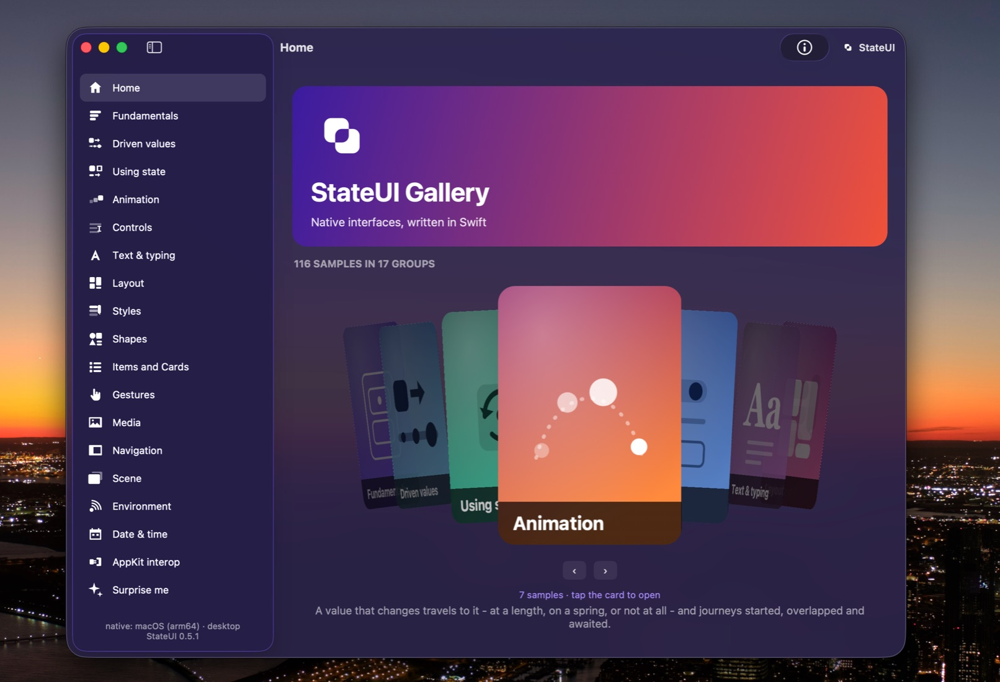
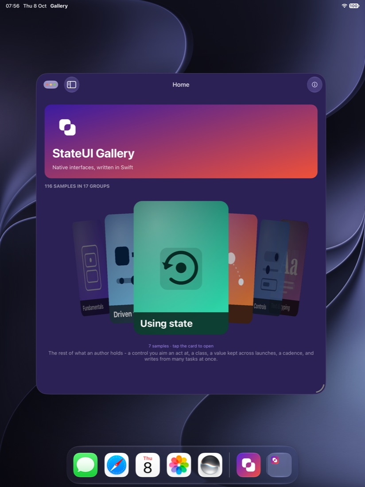
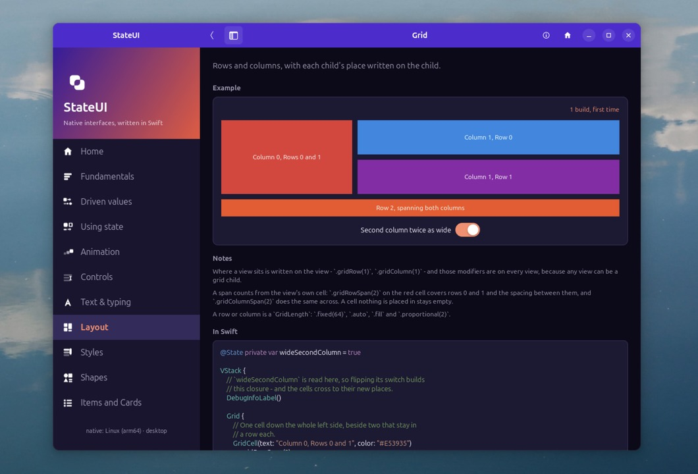
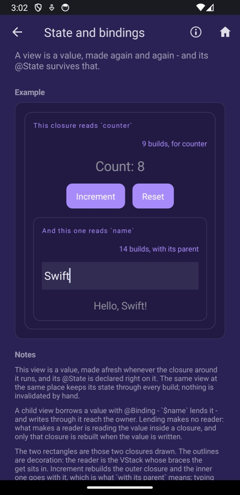
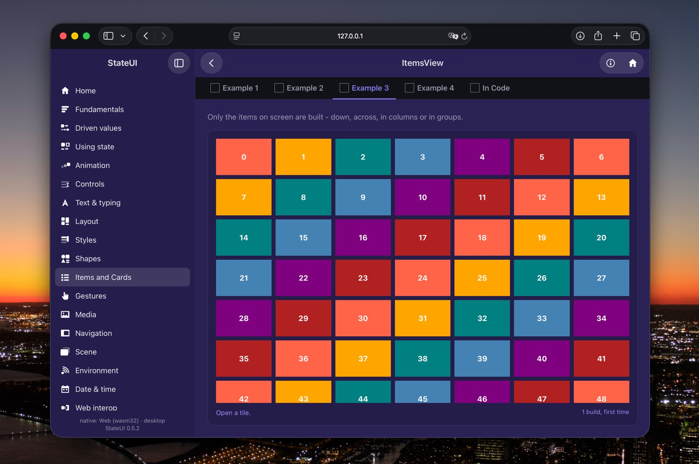
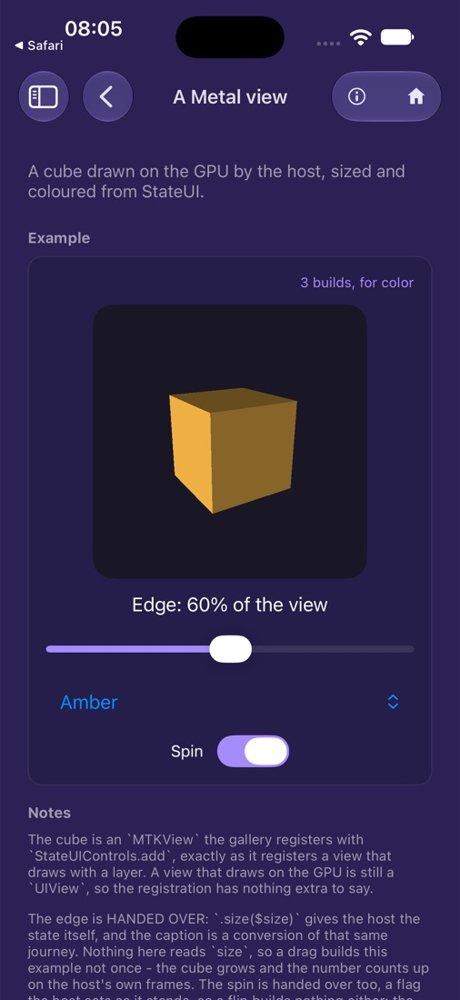
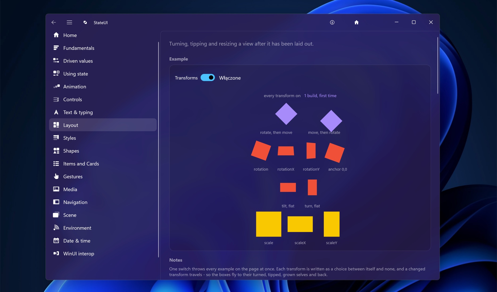

[](https://github.com/idexus/StateUI/actions/workflows/build-mac.yml?query=branch%3Amain)
[](https://github.com/idexus/StateUI/actions/workflows/build-linux.yml?query=branch%3Amain)
[](https://github.com/idexus/StateUI/actions/workflows/build-windows.yml?query=branch%3Amain)\
[](https://github.com/idexus/StateUI/actions/workflows/appkit.yml?query=branch%3Amain)
[](https://github.com/idexus/StateUI/actions/workflows/uikit.yml?query=branch%3Amain)
[](https://github.com/idexus/StateUI/actions/workflows/android.yml?query=branch%3Amain)
[](https://github.com/idexus/StateUI/actions/workflows/winui.yml?query=branch%3Amain)
[](https://github.com/idexus/StateUI/actions/workflows/gtk.yml?query=branch%3Amain)
[](https://github.com/idexus/StateUI/actions/workflows/web.yml?query=branch%3Amain)
# StateUI

 **Native interfaces, written in Swift.**
> StateUI describes an application's interface in Swift. Swift owns the UI tree,
identity, state, diffing, and motion; a thin host applies sparse patches to
controls from its platform toolkit.

Every host is Swift, in the application's own process, and all six hosts are
active on the same host contract: AppKit, UIKit, Android Views, WinUI 3, GTK 4
with libadwaita, and the Web - StateUI compiled to WebAssembly, drawing the
browser's own elements under a small JavaScript relay. What each realizes,
element by element and member by member, is the
[platform contract](docs/platform-contract.md), rendered from each host's own
test run.

| AppKit | UIKit | Android Views | WinUI 3 | GTK 4 | Web |
| :---: | :---: | :---: | :---: | :---: | :---: |
| ☑️ | ☑️ | ☑️ | ☑️ | ☑️ | ☑️ |

**Try it in a browser:** the Gallery runs on the Web host at
[stateui.dev](https://stateui.dev).

## In Action

<p>
  
</p>
<p>
  
</p>
<p>
  
</p>
<p>
  
</p>

The same Gallery - one Swift module - on AppKit and on UIKit on an iPad, on
GTK 4 and on Android Views, on the Web in Safari and on UIKit on an iPhone,
and on WinUI 3: each host draws it with its own toolkit's controls, its window
chrome and its navigation, while the pages, the state and the samples are the
application's, written once.

The cubes are each platform's own GPU view, which the application registers
with its host - a `GtkGLArea` drawing with OpenGL on GTK, an `MTKView`
drawing with Metal on UIKit - their size, colour and spin described from
StateUI. The edge is handed over as a state, so dragging the slider rebuilds
nothing. On the Web the same module, compiled to WebAssembly, runs in the page
and draws it with the browser's own elements - here a list of 120 tiles in
as many columns as the width holds, of which only those on screen are built.
The same Gallery runs at [stateui.dev](https://stateui.dev).

## In Code

```swift
struct CounterPage: View {
    @State private var count = 0

    var body: some View {
        VStack {
            Text("Tapped \(count) times")
            Button("Tap me").onClicked { count += 1 }
        }
    }
}
```

StateUI has one state declaration and two reactive paths:

- reading a state rebuilds only the body that read it;
- handing a binding to a control or property lets the host update it without
  rebuilding that body.

State belongs to the UI thread: a handler writes it on `MainActor`, a task
elsewhere posts to it (`$count.post { $0 + 1 }`), and a handler that awaits
says what its event does when it comes again
([Concurrency](docs/interface/concurrency.md)).

`Journey` belongs to the same state and carries its current value, destination,
velocity, and motion. A host with verified motion support animates compatible
property changes on the platform display clock; an unverified or unsupported
pair snaps to its destination.

StateUI is under active development. Until a 1.0 release, the public Swift API
and host contract may change together when native evidence reveals a clearer
cross-platform model. The handbook and platform matrix describe the contract
that is usable now.

## Documentation

- [StateUI handbook](docs/README.md) — the complete guide to applications,
  state, layout, controls, interaction, concurrency, and native hosts.
- [Architecture](docs/concepts/architecture.md) — state, reactivity, Journey, motion,
  and application sessions.
- [Why StateUI is shaped this way](docs/concepts/why.md) — the decisions every API
  follows, and the shapes deliberately rejected. Read it before contributing.
- [Host contract](docs/internals/host-contract.md) — `HostPatch`, ownership, identity,
  lifetime, and native adapter rules.
- [Platform contract](docs/platform-contract.md) — the control, property, and
  event inventory with verified host coverage.
- [Control dictionary](docs/controls/README.md) — every control and part of an
  application's structure, member by member, with a mark per platform.
- [StateUI core](docs/internals/core.md) — the library every application and host
  links, folder by folder, and the typed boundary a host reads.
- [Host layer](docs/internals/host-layer.md) — the Swift every host runs on, module by
  module, and what each host provides.
- [AppKit host](docs/hosts/appkit.md), [UIKit host](docs/hosts/uikit.md), [Android Views host](docs/hosts/android.md), [WinUI host](docs/hosts/winui.md), [GTK host](docs/hosts/gtk.md) and [Web host](docs/hosts/web.md)
  — each host's heads, builds, debugging, and registrations.
- [Project structure and development](docs/development.md) — packages, Gallery,
  build, F5, and test commands.
- [Tested setups](docs/tested-setups.md) — the systems, toolchains and devices each
  host's suite passes on.
- [Design notes](docs/design/README.md) — the rule, the reason and the trap behind
  each part of the code.
- [Contributing](CONTRIBUTING.md) — rules for changing the public contract.

Public API declarations provide the focused reference beside the code.

## Quick start

StateUI is developed and used in VS Code, through the StateUI extension in
`lib/StateUI.VSCode`. Clone the repository, then build and install the
extension from the checkout (Node.js 20 or newer):

```bash
git clone https://github.com/idexus/StateUI.git
cd StateUI/lib/StateUI.VSCode
npm ci
npm run package
code --install-extension ../../artifacts/stateui-*.vsix
```

The AppKit host needs only Xcode 27, on macOS 26 or newer, and the UIKit host
adds Xcode's iOS 26 or newer simulator runtime. StateUI builds with one Swift
release everywhere, Swift 6.4: Xcode 27's for AppKit and UIKit; swift.org's
6.4.0 toolchain for Android and the Web on macOS, and on the other platforms.
WinUI builds on Windows, GTK on Linux, and the Web on macOS and Linux; their
pages say what each needs:
[WinUI host](docs/hosts/winui.md#requirements), [GTK host](docs/hosts/gtk.md#requirements),
[Web host](docs/hosts/web.md#requirements).

Android asks for more, and builds on macOS only:

- the Android SDK with NDK 30, for Android 9 (API 28) or newer; an NDK
  outside the Android SDK is named by `ANDROID_NDK_HOME`;
- JDK 21 for Gradle, and the Android SDK's platform 36 with its build tools;
- the Swift SDK for Android 6.4.0, installed with `swift sdk install`;
- the swift.org toolchain of that SDK's build, `swift-6.4.0-RELEASE`, beside
  Xcode. Xcode's own Swift 6.4 is a different build and cannot read the SDK's
  modules; the build picks the matching toolchain by itself and names the one
  to install when none is there.

Then open the repository in VS Code:

1. Run **StateUI: Check Toolchain** from the Command Palette. It lists what
   this machine has of the above, and what to install for the rest.
2. Choose the host in the status bar - **AppKit**, **UIKit** or **Android**
   on macOS, **WinUI** on Windows, **GTK** on Linux, **Web** on macOS and
   Linux - and the application, **Gallery**. For UIKit and Android the third
   item picks the simulator or the device, for the Web the browser.
3. Press **F5**. **StateUI: Debug** builds the Gallery for that host and starts
   it under the debugger; **StateUI: Release** runs the optimized build.
4. Run **StateUI: Run Tests** from the Command Palette for every suite of that
   host.

[Working in VS Code](docs/getting-started.md#working-in-vs-code) covers the
extension's hosts and commands, including **StateUI: New Application in apps/**.

From a terminal, the same builds and suites are:

```bash
.scripts/AppKit/build-gallery-appkit.sh debug                  # the AppKit Gallery bundle
.scripts/UIKit/run-app.sh apps/Gallery debug "iPhone 18 Pro"   # the UIKit Gallery, on a simulator
.scripts/Android/run-app.sh apps/Gallery debug emulator-5554   # the Android Gallery
.scripts/test-native.sh                                        # the Swift suites, the AppKit host's among them
.scripts/UIKit/test-uikit.sh "iPhone 18 Pro"                   # the UIKit host's suite
.scripts/Android/test-android.sh emulator-5554                 # the Android host's suite, on a device
```

On macOS or Linux, the Web:

```bash
.scripts/Web/run-app.sh apps/Gallery                           # the Web Gallery, served and opened in a browser
.scripts/Web/test-web.sh                                       # the Web host's suite, in Node
.scripts/Web/test-web.sh --browser                             # its conformance run, in a headless browser
```

On Linux and on Windows:

```bash
.scripts/GTK/run-app.sh apps/Gallery                           # the GTK Gallery
.scripts/GTK/test-gtk.sh                                       # the GTK host's suite
```

```powershell
.scripts\WinUI\run-app.ps1 -App apps\Gallery                   # the WinUI Gallery
.scripts\WinUI\test-winui.ps1                                  # the WinUI host's suite
```

[Project structure and development](docs/development.md#test) gives every
suite's arguments and the conformance run that writes each host's marks, and
[Deploy](docs/development.md#deploy) the release builds: **StateUI: Deploy**
lays one in `artifacts/<application>/<platform>` - on the Web the page, a
folder any web server serves as it is.

## Continuous integration

Every workflow runs on pushes and pull requests to `main`, which every pull
request targets. Each badge above is one workflow.

**Core macOS**, **Core Linux** and **Core Windows** run the core's suites on
each machine - StateUI, the host layer and the conformance runner, and the
Gallery's and HelloWorld's too; Core macOS runs the core's own once more
under Thread Sanitizer. Each host has a workflow of its own
that runs its suite with every verdict held: **AppKit**, **UIKit** on an
iPhone and an iPad simulator, **Android** built on macOS and run on an
emulator, **WinUI** on Windows and **GTK** on Linux. **Web** runs the host's
own suite on macOS, in Node and in a headless browser; its conformance
families join it once the Web's verdicts hold no failure.

## License

StateUI is licensed under the Apache License 2.0. See [LICENSE](LICENSE) and
[NOTICE](NOTICE). Use of the StateUI name and mark is described in
[TRADEMARK.md](TRADEMARK.md).
